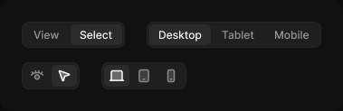

# Segmented control

> Figma « Kuartz — Carte système » (`wvr98llwHnMufQ88qUp4Ih`) › 🎨 Design System › Components — Navigation — nœud `332:522` (COMPONENT_SET, 4 variantes, cadre 379×123)

## Rôle

Groupe de segments. content=label (texte) ou icon (icônes seules : prévoir une infobulle sur chacune). Segments exposés : état, libellé ou icône depuis le panneau.

## Propriétés

| Propriété | Type | Défaut | Valeurs / préférences |
|---|---|---|---|
| `count` | VARIANT | `2` | `2`, `3` |
| `content` | VARIANT | `label` | `label`, `icon` |

## Variantes et états

- `count` : 2, 3 (défaut : 2)
- `content` : label, icon (défaut : label)

Variantes présentes (4) : `count=2, content=label` · `count=3, content=label` · `count=2, content=icon` · `count=3, content=icon`

## Anatomie — variante par défaut `count=2, content=label`

- **COMPONENT** `count=2, content=label` — taille: 114×29 · dim: W hug / H hug · layout: H gap 2{space/2} pad 2{space/2} align min/center strokes-in-layout · rayon: 8{radius/md} · fond: #1f1f1f {bg/input} · contour: #252525 {border/default} · 1px inside · clip: oui
  - **INSTANCE** `segment 1` — taille: 49×23 · dim: W hug / H hug · layout: H gap 6{space/6} pad 4{space/4} 10{space/10} align center/center strokes-in-layout · rayon: 5{radius/sm} · clip: oui · instance: Segment {type=label, state=default} · props: Icon="Icon/desktop", Label="View" · textes: "View" · modes: Icon color=default
  - **INSTANCE** `segment 2` — taille: 57×23 · dim: W hug / H hug · layout: H gap 6{space/6} pad 4{space/4} 10{space/10} align center/center strokes-in-layout · rayon: 5{radius/sm} · fond: #2b2b2b {bg/input-hover} · clip: oui · instance: Segment {type=label, state=selected} · props: Icon="Icon/desktop", Label="Select" · textes: "Select" · modes: Icon color=active

## Différences des autres variantes

Chaque variante est comparée à une variante de référence (la variante par défaut, ou la même combinaison avec une seule propriété ramenée à sa valeur par défaut — de préférence l'état). Clé = chemin du calque depuis la racine ; seules les propriétés qui changent sont listées (`+` calque ajouté, `−` calque absent).

### `count=3, content=label`

- ~ `(racine)` — taille: 193×29
- ~ `/segment 1` — taille: 68×23 · instance: Segment {type=label, state=selected} · props: Icon="Icon/desktop", Label="Desktop" · textes: "Desktop" · modes: Icon color=active · fond: #2b2b2b {bg/input-hover}
- ~ `/segment 2` — taille: 56×23 · fond: (aucun) · instance: Segment {type=label, state=default} · props: Icon="Icon/desktop", Label="Tablet" · textes: "Tablet" · modes: Icon color=default
- + `/segment 3` (**INSTANCE**) — taille: 59×23 · dim: W hug / H hug · layout: H gap 6{space/6} pad 4{space/4} 10{space/10} align center/center strokes-in-layout · rayon: 5{radius/sm} · clip: oui · instance: Segment {type=label, state=default} · props: Icon="Icon/desktop", Label="Mobile" · textes: "Mobile" · modes: Icon color=default

### `count=2, content=icon`

- ~ `(racine)` — taille: 64×30
- ~ `/segment 1` — taille: 28×24 · layout: H gap 6{space/6} pad 4{space/4} 6{space/6} align center/center strokes-in-layout · instance: Segment {type=icon, state=default} · props: Label="Desktop", Icon="Icon/eye" · textes: (aucun)
- ~ `/segment 2` — taille: 28×24 · layout: H gap 6{space/6} pad 4{space/4} 6{space/6} align center/center strokes-in-layout · instance: Segment {type=icon, state=selected} · props: Label="Desktop", Icon="Icon/select" · textes: (aucun)

### `count=3, content=icon` — réf. `count=2, content=icon`

- ~ `(racine)` — taille: 94×30
- ~ `/segment 1` — instance: Segment {type=icon, state=selected} · props: Label="Desktop", Icon="Icon/desktop" · modes: Icon color=active · fond: #2b2b2b {bg/input-hover}
- ~ `/segment 2` — fond: (aucun) · instance: Segment {type=icon, state=default} · props: Label="Desktop", Icon="Icon/tablet" · modes: Icon color=default
- + `/segment 3` (**INSTANCE**) — taille: 28×24 · dim: W hug / H hug · layout: H gap 6{space/6} pad 4{space/4} 6{space/6} align center/center strokes-in-layout · rayon: 5{radius/sm} · clip: oui · instance: Segment {type=icon, state=default} · props: Label="Desktop", Icon="Icon/mobile" · modes: Icon color=default

## Tokens et ressources utilisés

- Variables : `bg/input`, `bg/input-hover`, `border/default`, `radius/md`, `radius/sm`, `space/10`, `space/2`, `space/4`, `space/6`
- Styles de texte : —
- Effets : —
- Icônes : Icon/desktop, Icon/eye, Icon/mobile, Icon/select, Icon/tablet
- Composants imbriqués : Segment

## Capture

