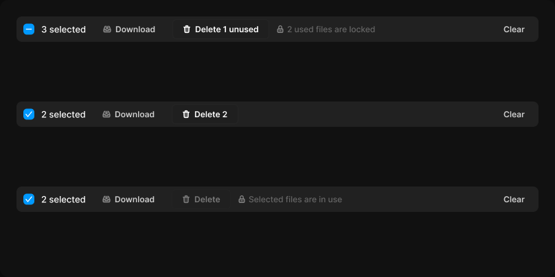

# Selection bar

> Figma « Kuartz — Carte système » (`wvr98llwHnMufQ88qUp4Ih`) › 🎨 Design System › Components — Overlays — nœud `336:1218` (COMPONENT_SET, 3 variantes, cadre 808×404)

## Rôle

Barre de sélection. delete : partial (une partie verrouillée), allowed, blocked (tout est utilisé).

## Propriétés

| Propriété | Type | Défaut | Valeurs / préférences |
|---|---|---|---|
| `delete` | VARIANT | `partial` | `partial`, `allowed`, `blocked` |

## Variantes et états

- `delete` : partial, allowed, blocked (défaut : partial)

Variantes présentes (3) : `delete=partial` · `delete=allowed` · `delete=blocked`

## Anatomie — variante par défaut `delete=partial`

- **COMPONENT** `delete=partial` — taille: 760×37 · dim: W fixed / H hug · layout: H gap 10{space/10} pad 4{space/4} 6{space/6} 4{space/4} 10{space/10} align min/center strokes-in-layout · rayon: 8{radius/md} · fond: #212121 {bg/subtle} · clip: oui · modes: Icon color=default
  - **INSTANCE** `Checkbox` — taille: 16×16 · dim: W hug / H hug · layout: H gap 8{space/8} pad 0 align min/center strokes-in-layout · clip: oui · instance: Checkbox {state=indeterminate} · props: Show label=false, Label="Checkbox label"
  - **TEXT** `count` — taille: 66×16 · dim: W hug / H hug · fond: #ffffff {text/primary} · texte: "3 selected" · style: Body · textopt: resize width_and_height
  - **INSTANCE** `download` — taille: 105×27 · dim: W hug / H hug · layout: H gap 6{space/6} pad 6{space/6} 14 align center/center strokes-in-layout · rayon: 6 · instance: Button {variant=ghost, state=default, size=small} · props: Show icon right=false, Icon left="Icon/download", Icon right="Icon/chevron-down", Show icon left=true, Label="Download" · textes: "Download" · modes: Icon color=default
  - **INSTANCE** `delete` — taille: 141×29 · dim: W hug / H hug · layout: H gap 6{space/6} pad 6{space/6} 14 align center/center strokes-in-layout · rayon: 6 · fond: #1f1f1f {bg/input} · contour: #252525 {border/default} · 1px inside · instance: Button {variant=secondary, state=default, size=small} · props: Icon left="Icon/trash", Show icon left=true, Icon right="Icon/chevron-down", Show icon right=false, Label="Delete 1 unused" · textes: "Delete 1 unused" · modes: Icon color=active
  - **FRAME** `lock-note` — taille: 145×15 · dim: W hug / H hug · layout: H gap 4{space/4} pad 0 align min/center strokes-in-layout · clip: oui
    - **INSTANCE** `icon` — taille: 12×12 · dim: W fixed / H fixed · instance: Icon/lock {size=12}
    - **TEXT** `note` — taille: 129×15 · dim: W hug / H hug · fond: #666666 {text/muted} · texte: "2 used files are locked" · style: Body Small · textopt: resize width_and_height
  - **FRAME** `spacer` — taille: 152×1 · dim: W fill / H fixed · layout: H gap 0 pad 0 align min/center strokes-in-layout · clip: oui
  - **INSTANCE** `clear` — taille: 59×27 · dim: W hug / H hug · layout: H gap 6{space/6} pad 6{space/6} 14 align center/center strokes-in-layout · rayon: 6 · instance: Button {variant=ghost, state=default, size=small} · props: Icon left="Icon/plus", Show icon right=false, Icon right="Icon/chevron-down", Show icon left=false, Label="Clear" · textes: "Clear" · modes: Icon color=default

## Différences des autres variantes

Chaque variante est comparée à une variante de référence (la variante par défaut, ou la même combinaison avec une seule propriété ramenée à sa valeur par défaut — de préférence l'état). Clé = chemin du calque depuis la racine ; seules les propriétés qui changent sont listées (`+` calque ajouté, `−` calque absent).

### `delete=allowed`

- ~ `/Checkbox` — instance: Checkbox {state=checked}
- ~ `/count` — taille: 65×16 · texte: "2 selected"
- ~ `/delete` — taille: 97×29 · props: Icon left="Icon/trash", Show icon left=true, Icon right="Icon/chevron-down", Show icon right=false, Label="Delete 2" · textes: "Delete 2"
- ~ `/lock-note` — taille: 16×15 · visible: masqué
- ~ `/lock-note/note` — taille: 0×15 · texte: ""
- ~ `/spacer` — taille: 352×1

### `delete=blocked`

- ~ `/Checkbox` — instance: Checkbox {state=checked}
- ~ `/count` — taille: 65×16 · texte: "2 selected"
- ~ `/delete` — taille: 86×29 · instance: Button {variant=secondary, state=disabled, size=small} · props: Icon right="Icon/chevron-down", Show icon right=false, Icon left="Icon/trash", Show icon left=true, Label="Delete" · textes: "Delete" · opacite: 0.4
- ~ `/lock-note` — taille: 153×15
- ~ `/lock-note/note` — taille: 137×15 · texte: "Selected files are in use"
- ~ `/spacer` — taille: 200×1

## Tokens et ressources utilisés

- Variables : `bg/input`, `bg/subtle`, `border/default`, `radius/md`, `space/10`, `space/4`, `space/6`, `space/8`, `text/muted`, `text/primary`
- Styles de texte : Body, Body Small
- Effets : —
- Icônes : Icon/chevron-down, Icon/download, Icon/lock, Icon/plus, Icon/trash
- Composants imbriqués : Button, Checkbox

## Capture

