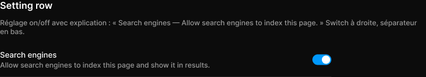

# Setting row

> Figma « Kuartz — Carte système » (`wvr98llwHnMufQ88qUp4Ih`) › 🎨 Design System › Components — Forms — nœud `330:341` (COMPONENT, cadre 560×58)

## Rôle

Réglage avec Switch (instance exposée : changer son état depuis le panneau). Propriétés : Title, Description, Show description.

## Propriétés

| Propriété | Type | Défaut | Valeurs / préférences |
|---|---|---|---|
| `Title` | TEXT | `Search engines` |  |
| `Description` | TEXT | `Allow search engines to index this page and show it in results.` |  |
| `Show description` | BOOLEAN | `true` |  |

## Anatomie — composant

- **COMPONENT** `Setting row` — taille: 560×58 · dim: W fixed / H hug · layout: H gap 24{space/24} pad 12{space/12} 0 align min/center strokes-in-layout · contour: #212121 {border/subtle} · 0/0/1/0px inside · clip: oui
  - **FRAME** `text` — taille: 504×33 · dim: W fill / H hug · layout: V gap 2{space/2} pad 0 align min/min strokes-in-layout · clip: oui
    - **TEXT** `title` — taille: 504×16 · dim: W fill / H hug · fond: #ffffff {text/primary} · texte: "Search engines" · style: Body · textopt: resize height · refs: characters←Title
    - **TEXT** `description` — taille: 504×15 · dim: W fill / H hug · fond: #999999 {text/tertiary} · texte: "Allow search engines to index this page and show it in results." · style: Body Small · textopt: resize height · refs: visible←Show description, characters←Description
  - **INSTANCE** `switch` — taille: 32×18 · dim: W hug / H hug · layout: H gap 8{space/8} pad 0 align min/center strokes-in-layout · clip: oui · instance: Switch {state=on} · props: Show label=false, Label="Switch label"

## Tokens et ressources utilisés

- Variables : `border/subtle`, `space/12`, `space/2`, `space/24`, `space/8`, `text/primary`, `text/tertiary`
- Styles de texte : Body, Body Small
- Effets : —
- Icônes : —
- Composants imbriqués : Switch

## Capture

_Capture du cadre de documentation `group/Setting row` (`330:330`, 720×131 px : titre, description et composant entier). La capture du composant seul (560×58 px) pesait 4928 octets (< 5 Ko), rendu 1× identique._
