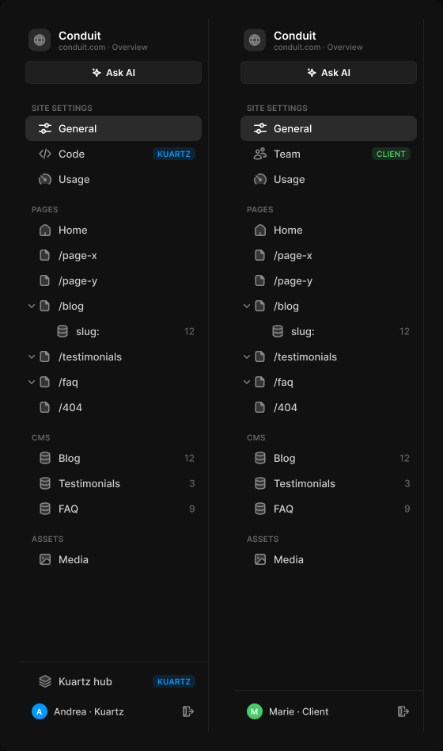

# Sidebar

> Figma « Kuartz — Carte système » (`wvr98llwHnMufQ88qUp4Ih`) › 🎨 Design System › Components — Navigation — nœud `333:1247` (COMPONENT_SET, 2 variantes, cadre 560×948)

## Rôle

Sidebar de l'admin d'un site (240 × 900). Sections : SITE SETTINGS, PAGES, CMS (toutes les collections ont l'icône database, leur nom vient de Sanity), ASSETS (Media, partagé par les pages, le CMS et les réglages). role=kuartz : Code et lien vers le hub ; role=client : Team. PAGES : une page listing CMS (/blog) se déplie avec un chevron et montre sa page article (icône database + nombre d'articles), qui ouvre les réglages de la page article.

## Propriétés

| Propriété | Type | Défaut | Valeurs / préférences |
|---|---|---|---|
| `role` | VARIANT | `kuartz` | `kuartz`, `client` |

## Variantes et états

- `role` : kuartz, client (défaut : kuartz)

Variantes présentes (2) : `role=kuartz` · `role=client`

## Anatomie — variante par défaut `role=kuartz`

- **COMPONENT** `role=kuartz` — taille: 240×900 · dim: W fixed / H fixed · layout: V gap 0 pad 0 align min/min strokes-in-layout · fond: #111111 {bg/primary} · contour: #212121 {border/subtle} · 0/1/0/0px inside · clip: oui
  - **FRAME** `header` — taille: 239×90 · dim: W fill / H hug · layout: V gap 12{space/12} pad 12{space/12} 8{space/8} 8{space/8} 8{space/8} align min/min strokes-in-layout · clip: oui
    - **FRAME** `site` — taille: 223×29 · dim: W fill / H hug · layout: H gap 10{space/10} pad 0 4{space/4} align min/center strokes-in-layout · clip: oui
      - **FRAME** `logo` — taille: 28×28 · dim: W fixed / H fixed · layout: H gap 0 pad 0 align center/center strokes-in-layout · rayon: 8{radius/md} · fond: #2b2b2b {bg/input-hover} · clip: oui
        - **INSTANCE** `icon` — taille: 16×16 · dim: W fixed / H fixed · instance: Icon/globe {size=18}
      - **FRAME** `site-text` — taille: 177×29 · dim: W fill / H hug · layout: V gap 0 pad 0 align min/min strokes-in-layout · clip: oui
        - **TEXT** `site-name` — taille: 54×17 · dim: W hug / H hug · fond: #ffffff {text/primary} · texte: "Conduit" · style: Label Large · textopt: resize width_and_height
        - **TEXT** `site-url` — taille: 113×12 · dim: W hug / H hug · fond: #666666 {text/muted} · texte: "conduit.com · Overview" · style: Caption · textopt: resize width_and_height
    - **INSTANCE** `ask-ai` — taille: 223×29 · dim: W fill / H hug · layout: H gap 6{space/6} pad 6{space/6} 14 align center/center strokes-in-layout · rayon: 6 · fond: #1f1f1f {bg/input} · contour: #252525 {border/default} · 1px inside · instance: Button {variant=secondary, state=default, size=small} · props: Icon left="Icon/ai", Show icon left=true, Icon right="Icon/chevron-down", Show icon right=false, Label="Ask AI" · textes: "Ask AI" · modes: Icon color=active
  - **FRAME** `nav` — taille: 239×616 · dim: W fill / H hug · layout: V gap 0 pad 0 8{space/8} 8{space/8} 8{space/8} align min/min strokes-in-layout
    - **INSTANCE** `section/SITE SETTINGS` — taille: 223×32 · dim: W fill / H hug · layout: H gap 8{space/8} pad 16{space/16} 8{space/8} 4{space/4} 8{space/8} align min/center strokes-in-layout · clip: oui · instance: Nav section · props: Show action=false, Label="SITE SETTINGS" · textes: "SITE SETTINGS" · modes: Icon color=default
    - **INSTANCE** `nav/General` — taille: 223×32 · dim: W fill / H fixed · layout: H gap 8{space/8} pad 0 8{space/8} 0 16 align min/center strokes-in-layout · rayon: 8{radius/md} · fond: #2b2b2b {bg/input-hover} · instance: Nav item {state=active} · props: Show tag=false, Show chevron=false, Show count=false, Label="General", Icon="Icon/sliders", Count="12", Show icon=true · textes: "General" · modes: Icon color=active
    - **INSTANCE** `nav/Code` — taille: 223×32 · dim: W fill / H fixed · layout: H gap 8{space/8} pad 0 8{space/8} 0 16 align min/center strokes-in-layout · rayon: 8{radius/md} · instance: Nav item {state=default} · props: Show tag=true, Show count=false, Count="12", Show chevron=false, Icon="Icon/code", Show icon=true, Label="Code" · textes: "Code" "KUARTZ" · modes: Icon color=default
    - **INSTANCE** `nav/Usage` — taille: 223×32 · dim: W fill / H fixed · layout: H gap 8{space/8} pad 0 8{space/8} 0 16 align min/center strokes-in-layout · rayon: 8{radius/md} · instance: Nav item {state=default} · props: Show tag=false, Show count=false, Count="12", Show chevron=false, Icon="Icon/usage", Show icon=true, Label="Usage" · textes: "Usage" · modes: Icon color=default
    - **INSTANCE** `section/PAGES` — taille: 223×32 · dim: W fill / H hug · layout: H gap 8{space/8} pad 16{space/16} 8{space/8} 4{space/4} 8{space/8} align min/center strokes-in-layout · clip: oui · instance: Nav section · props: Show action=false, Label="PAGES" · textes: "PAGES" · modes: Icon color=default
    - **INSTANCE** `nav/Home` — taille: 223×32 · dim: W fill / H fixed · layout: H gap 8{space/8} pad 0 8{space/8} 0 16 align min/center strokes-in-layout · rayon: 8{radius/md} · instance: Nav item {state=default} · props: Show tag=false, Show count=false, Count="12", Show chevron=false, Icon="Icon/house", Show icon=true, Label="Home" · textes: "Home" · modes: Icon color=default
    - **INSTANCE** `nav//page-x` — taille: 223×32 · dim: W fill / H fixed · layout: H gap 8{space/8} pad 0 8{space/8} 0 16 align min/center strokes-in-layout · rayon: 8{radius/md} · instance: Nav item {state=default} · props: Show tag=false, Show count=false, Count="12", Show chevron=false, Icon="Icon/page", Show icon=true, Label="/page-x" · textes: "/page-x" · modes: Icon color=default
    - **INSTANCE** `nav//page-y` — taille: 223×32 · dim: W fill / H fixed · layout: H gap 8{space/8} pad 0 8{space/8} 0 16 align min/center strokes-in-layout · rayon: 8{radius/md} · instance: Nav item {state=default} · props: Show tag=false, Show count=false, Count="12", Show chevron=false, Icon="Icon/page", Show icon=true, Label="/page-y" · textes: "/page-y" · modes: Icon color=default
    - **INSTANCE** `nav//blog` — taille: 223×32 · dim: W fill / H fixed · layout: H gap 8{space/8} pad 0 8{space/8} 0 16 align min/center strokes-in-layout · rayon: 8{radius/md} · instance: Nav item {state=default} · props: Show tag=false, Show count=false, Count="12", Show chevron=true, Icon="Icon/page", Show icon=true, Label="/blog" · textes: "/blog" · modes: Icon color=default
    - **INSTANCE** `nav//blog/:slug` — taille: 223×32 · dim: W fill / H fixed · layout: H gap 8{space/8} pad 0 8{space/8} 0 38 align min/center strokes-in-layout · rayon: 8{radius/md} · instance: Nav item {state=default} · props: Show tag=false, Show count=true, Count="12", Show chevron=false, Icon="Icon/database", Show icon=true, Label="slug:" · textes: "slug:" "12" · modes: Icon color=default
    - **INSTANCE** `nav//testimonials` — taille: 223×32 · dim: W fill / H fixed · layout: H gap 8{space/8} pad 0 8{space/8} 0 16 align min/center strokes-in-layout · rayon: 8{radius/md} · instance: Nav item {state=default} · props: Show tag=false, Show count=false, Count="12", Show chevron=true, Icon="Icon/page", Show icon=true, Label="/testimonials" · textes: "/testimonials" · modes: Icon color=default
    - **INSTANCE** `nav//faq` — taille: 223×32 · dim: W fill / H fixed · layout: H gap 8{space/8} pad 0 8{space/8} 0 16 align min/center strokes-in-layout · rayon: 8{radius/md} · instance: Nav item {state=default} · props: Show tag=false, Show count=false, Count="12", Show chevron=true, Icon="Icon/page", Show icon=true, Label="/faq" · textes: "/faq" · modes: Icon color=default
    - **INSTANCE** `nav//404` — taille: 223×32 · dim: W fill / H fixed · layout: H gap 8{space/8} pad 0 8{space/8} 0 16 align min/center strokes-in-layout · rayon: 8{radius/md} · instance: Nav item {state=default} · props: Show tag=false, Show count=false, Count="12", Show chevron=false, Icon="Icon/page", Show icon=true, Label="/404" · textes: "/404" · modes: Icon color=default
    - **INSTANCE** `section/CMS` — taille: 223×32 · dim: W fill / H hug · layout: H gap 8{space/8} pad 16{space/16} 8{space/8} 4{space/4} 8{space/8} align min/center strokes-in-layout · clip: oui · instance: Nav section · props: Show action=false, Label="CMS" · textes: "CMS" · modes: Icon color=default
    - **INSTANCE** `nav/Blog` — taille: 223×32 · dim: W fill / H fixed · layout: H gap 8{space/8} pad 0 8{space/8} 0 16 align min/center strokes-in-layout · rayon: 8{radius/md} · instance: Nav item {state=default} · props: Show tag=false, Show count=true, Count="12", Show chevron=false, Icon="Icon/database", Show icon=true, Label="Blog" · textes: "Blog" "12" · modes: Icon color=default
    - **INSTANCE** `nav/Testimonials` — taille: 223×32 · dim: W fill / H fixed · layout: H gap 8{space/8} pad 0 8{space/8} 0 16 align min/center strokes-in-layout · rayon: 8{radius/md} · instance: Nav item {state=default} · props: Show tag=false, Show count=true, Count="3", Show chevron=false, Icon="Icon/database", Show icon=true, Label="Testimonials" · textes: "Testimonials" "3" · modes: Icon color=default
    - **INSTANCE** `nav/FAQ` — taille: 223×32 · dim: W fill / H fixed · layout: H gap 8{space/8} pad 0 8{space/8} 0 16 align min/center strokes-in-layout · rayon: 8{radius/md} · instance: Nav item {state=default} · props: Show tag=false, Show count=true, Count="9", Show chevron=false, Icon="Icon/database", Show icon=true, Label="FAQ" · textes: "FAQ" "9" · modes: Icon color=default
    - **INSTANCE** `section/ASSETS` — taille: 223×32 · dim: W fill / H hug · layout: H gap 8{space/8} pad 16{space/16} 8{space/8} 4{space/4} 8{space/8} align min/center strokes-in-layout · clip: oui · instance: Nav section · props: Show action=false, Label="ASSETS" · textes: "ASSETS" · modes: Icon color=default
    - **INSTANCE** `nav/Media` — taille: 223×32 · dim: W fill / H fixed · layout: H gap 8{space/8} pad 0 8{space/8} 0 16 align min/center strokes-in-layout · rayon: 8{radius/md} · instance: Nav item {state=default} · props: Show tag=false, Show count=false, Count="12", Show chevron=false, Icon="Icon/image", Show icon=true, Label="Media" · textes: "Media" · modes: Icon color=default
  - **FRAME** `spacer` — taille: 239×105 · dim: W fill / H fill · layout: V gap 0 pad 0 align min/center strokes-in-layout · clip: oui
  - **FRAME** `footer` — taille: 239×89 · dim: W fill / H hug · layout: V gap 4{space/4} pad 8{space/8} align min/min strokes-in-layout · contour: #212121 {border/subtle} · 1/0/0/0px inside · clip: oui
    - **INSTANCE** `nav/Kuartz hub` — taille: 223×32 · dim: W fill / H fixed · layout: H gap 8{space/8} pad 0 8{space/8} 0 16 align min/center strokes-in-layout · rayon: 8{radius/md} · instance: Nav item {state=default} · props: Show tag=true, Show count=false, Count="12", Show chevron=false, Icon="Icon/hub", Show icon=true, Label="Kuartz hub" · textes: "Kuartz hub" "KUARTZ" · modes: Icon color=default
    - **FRAME** `user` — taille: 223×36 · dim: W fill / H hug · layout: H gap 8{space/8} pad 4{space/4} 4{space/4} 4{space/4} 8{space/8} align min/center strokes-in-layout · clip: oui
      - **INSTANCE** `avatar` — taille: 20×20 · dim: W fixed / H fixed · layout: H gap 0 pad 0 align center/center strokes-in-layout · rayon: 999{radius/full} · fond: #0099ff {interactive/primary} · clip: oui · instance: Avatar {size=20, tone=blue} · props: Initials="A" · textes: "A"
      - **TEXT** `user-name` — taille: 147×15 · dim: W fill / H hug · fond: #cccccc {text/secondary} · texte: "Andrea · Kuartz" · style: Body Small · textopt: resize height
      - **INSTANCE** `logout` — taille: 28×28 · dim: W fixed / H fixed · layout: H gap 0 pad 0 align center/center strokes-in-layout · rayon: 8{radius/md} · clip: oui · instance: Icon button {style=ghost, state=default, size=small} · props: Icon="Icon/logout" · modes: Icon color=default

## Différences des autres variantes

Chaque variante est comparée à une variante de référence (la variante par défaut, ou la même combinaison avec une seule propriété ramenée à sa valeur par défaut — de préférence l'état). Clé = chemin du calque depuis la racine ; seules les propriétés qui changent sont listées (`+` calque ajouté, `−` calque absent).

### `role=client`

- + `/nav/nav/Team` (**INSTANCE**) — taille: 223×32 · dim: W fill / H fixed · layout: H gap 8{space/8} pad 0 8{space/8} 0 16 align min/center strokes-in-layout · rayon: 8{radius/md} · instance: Nav item {state=default} · props: Show tag=true, Show count=false, Count="12", Show chevron=false, Icon="Icon/team", Show icon=true, Label="Team" · textes: "Team" "CLIENT" · modes: Icon color=default
- ~ `/spacer` — taille: 239×141
- ~ `/footer` — taille: 239×53
- ~ `/footer/user/avatar` — fond: #44cc66 {interactive/success} · instance: Avatar {size=20, tone=green} · props: Initials="M" · textes: "M"
- ~ `/footer/user/user-name` — texte: "Marie · Client"
- − `/nav/nav/Code` absent
- − `/footer/nav/Kuartz hub` absent

## Tokens et ressources utilisés

- Variables : `bg/input`, `bg/input-hover`, `bg/primary`, `border/default`, `border/subtle`, `interactive/primary`, `interactive/success`, `radius/full`, `radius/md`, `space/10`, `space/12`, `space/16`, `space/4`, `space/6`, `space/8`, `text/muted`, `text/primary`, `text/secondary`
- Styles de texte : Label Large, Caption, Body Small
- Effets : —
- Icônes : Icon/ai, Icon/chevron-down, Icon/code, Icon/database, Icon/globe, Icon/house, Icon/hub, Icon/image, Icon/logout, Icon/page, Icon/sliders, Icon/team, Icon/usage
- Composants imbriqués : Avatar, Button, Icon button, Nav item, Nav section

## Capture

