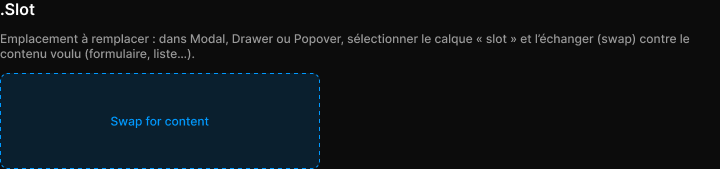

# .Slot

> Figma « Kuartz — Carte système » (`wvr98llwHnMufQ88qUp4Ih`) › 🎨 Design System › Components — Overlays — nœud `336:749` (COMPONENT, cadre 320×96)

## Rôle

Contenu à échanger (instance swap). Redimensionnable.

## Propriétés

_Aucune propriété._

## Anatomie — composant

- **COMPONENT** `.Slot` — taille: 320×96 · dim: W fixed / H fixed · layout: V gap 0 pad 0 align center/center strokes-in-layout · rayon: 8{radius/md} · fond: #0099ff 14% {bg/tint/info} · contour: #0099ff {border/focus} · 1px inside dash 4,4 · clip: oui
  - **TEXT** `label` — taille: 99×15 · dim: W hug / H hug · fond: #0099ff {text/link} · texte: "Swap for content" · style: Body Small · textopt: resize width_and_height

## Tokens et ressources utilisés

- Variables : `bg/tint/info`, `border/focus`, `radius/md`, `text/link`
- Styles de texte : Body Small
- Effets : —
- Icônes : —
- Composants imbriqués : —

## Capture

_Capture du cadre de documentation `group/.Slot` (`336:744`, 720×169 px : titre, description et composant entier). La capture du composant seul (320×96 px) pesait 2416 octets (< 5 Ko), rendu 1× identique._
