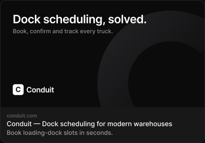

# Social preview

> Figma « Kuartz — Carte système » (`wvr98llwHnMufQ88qUp4Ih`) › 🎨 Design System › Components — Data display — nœud `338:1245` (COMPONENT, cadre 400×280)

## Rôle

Aperçu réseaux sociaux. Remplir le calque « image » avec l'image OG. Propriétés : Domain, Title, Description.

## Propriétés

| Propriété | Type | Défaut | Valeurs / préférences |
|---|---|---|---|
| `Domain` | TEXT | `conduit.com` |  |
| `Title` | TEXT | `Conduit — Dock scheduling for modern warehouses` |  |
| `Description` | TEXT | `Book loading-dock slots in seconds.` |  |

## Anatomie — composant

- **COMPONENT** `Social preview` — taille: 400×280 · dim: W fixed / H hug · layout: V gap 0 pad 0 align min/min strokes-in-layout · rayon: 12{radius/lg} · fond: #181818 {bg/elevated} · contour: #252525 {border/default} · 1px inside · clip: oui · modes: Icon color=default
  - **FRAME** `image` — taille: 398×209 · dim: W fill / H fixed · layout: V gap 0 pad 0 align center/center strokes-in-layout · fond: #212121 {bg/subtle} + IMAGE FILL · clip: oui
    - **INSTANCE** `icon` — taille: 18×18 · visible: masqué · dim: W fixed / H fixed · instance: Icon/image {size=18}
  - **FRAME** `text` — taille: 398×69 · dim: W fill / H hug · layout: V gap 2{space/2} pad 10{space/10} 12{space/12} 12{space/12} 12{space/12} align min/min strokes-in-layout · clip: oui
    - **TEXT** `domain` — taille: 60×12 · dim: W hug / H hug · fond: #666666 {text/muted} · texte: "conduit.com" · style: Caption · textopt: resize width_and_height · refs: characters←Domain
    - **TEXT** `title` — taille: 374×16 · dim: W fill / H hug · fond: #ffffff {text/primary} · texte: "Conduit — Dock scheduling for modern warehouses" · style: Body · textopt: resize height · refs: characters←Title
    - **TEXT** `description` — taille: 374×15 · dim: W fill / H hug · fond: #999999 {text/tertiary} · texte: "Book loading-dock slots in seconds." · style: Body Small · textopt: resize height · refs: characters←Description

## Tokens et ressources utilisés

- Variables : `bg/elevated`, `bg/subtle`, `border/default`, `radius/lg`, `space/10`, `space/12`, `space/2`, `text/muted`, `text/primary`, `text/tertiary`
- Styles de texte : Caption, Body, Body Small
- Effets : —
- Icônes : Icon/image
- Composants imbriqués : —

## Capture

