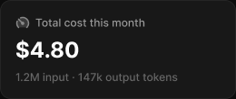

# Stat card

> Figma « Kuartz — Carte système » (`wvr98llwHnMufQ88qUp4Ih`) › 🎨 Design System › Components — Data display — nœud `338:1177` (COMPONENT, cadre 260×110)

## Rôle

Chiffre clé (260 px, étirable). Propriétés : Label, Value, Hint, Show hint, Show icon, Icon.

## Propriétés

| Propriété | Type | Défaut | Valeurs / préférences |
|---|---|---|---|
| `Label` | TEXT | `Total cost this month` |  |
| `Value` | TEXT | `$4.80` |  |
| `Hint` | TEXT | `1.2M input · 147k output tokens` |  |
| `Show hint` | BOOLEAN | `true` |  |
| `Show icon` | BOOLEAN | `true` |  |
| `Icon` | INSTANCE_SWAP | `Icon/usage` | préférées : toutes les icônes Icon/* (73/75) sauf Icon/open, Icon/claude |

## Anatomie — composant

- **COMPONENT** `Stat card` — taille: 260×110 · dim: W fixed / H hug · layout: V gap 8{space/8} pad 16{space/16} align min/min strokes-in-layout · rayon: 12{radius/lg} · fond: #181818 {bg/elevated} · contour: #252525 {border/default} · 1px inside · clip: oui · modes: Icon color=default
  - **FRAME** `label-row` — taille: 143×16 · dim: W hug / H hug · layout: H gap 6{space/6} pad 0 align min/center strokes-in-layout · clip: oui
    - **INSTANCE** `icon` — taille: 16×16 · dim: W fixed / H fixed · instance: Icon/usage {size=18} · refs: visible←Show icon, mainComponent←Icon
    - **TEXT** `label` — taille: 121×15 · dim: W hug / H hug · fond: #999999 {text/tertiary} · texte: "Total cost this month" · style: Body Small · textopt: resize width_and_height · refs: characters←Label
  - **TEXT** `value` — taille: 71×29 · dim: W hug / H hug · fond: #ffffff {text/primary} · texte: "$4.80" · style: Heading 2 · textopt: resize width_and_height · refs: characters←Value
  - **TEXT** `hint` — taille: 226×15 · dim: W fill / H hug · fond: #666666 {text/muted} · texte: "1.2M input · 147k output tokens" · style: Body Small · textopt: resize height · refs: visible←Show hint, characters←Hint

## Tokens et ressources utilisés

- Variables : `bg/elevated`, `border/default`, `radius/lg`, `space/16`, `space/6`, `space/8`, `text/muted`, `text/primary`, `text/tertiary`
- Styles de texte : Body Small, Heading 2
- Effets : —
- Icônes : Icon/usage
- Composants imbriqués : —

## Capture

