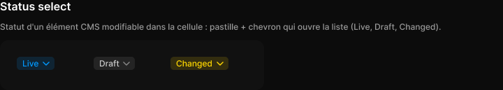

# Status select

> Figma « Kuartz — Carte système » (`wvr98llwHnMufQ88qUp4Ih`) › 🎨 Design System › Components — Data display — nœud `468:1971` (COMPONENT_SET, 3 variantes, cadre 378×72)

## Rôle

Statut d'un élément CMS (Live, Draft, Changed) modifiable directement dans le tableau : pastille teintée + chevron.

## Propriétés

| Propriété | Type | Défaut | Valeurs / préférences |
|---|---|---|---|
| `tone` | VARIANT | `live` | `live`, `draft`, `changed` |

## Variantes et états

- `tone` : live, draft, changed (défaut : live)

Variantes présentes (3) : `tone=live` · `tone=draft` · `tone=changed`

## Anatomie — variante par défaut `tone=live`

- **COMPONENT** `tone=live` — taille: 54×19 · dim: W hug / H hug · layout: H gap 4 pad 2 6 2 8 align min/center strokes-in-layout · rayon: 5 · fond: #0099ff 14% {bg/tint/info} · modes: Icon color=primary
  - **TEXT** `label` — taille: 24×15 · dim: W hug / H hug · fond: #0099ff {text/link} · texte: "Live" · style: Body Small · textopt: resize width_and_height
  - **INSTANCE** `chevron` — taille: 12×12 · dim: W fixed / H fixed · instance: Icon/chevron-down {size=12}

## Différences des autres variantes

Chaque variante est comparée à une variante de référence (la variante par défaut, ou la même combinaison avec une seule propriété ramenée à sa valeur par défaut — de préférence l'état). Clé = chemin du calque depuis la racine ; seules les propriétés qui changent sont listées (`+` calque ajouté, `−` calque absent).

### `tone=draft`

- ~ `(racine)` — taille: 59×19 · fond: #ffffff 8% {bg/tint/neutral} · modes: Icon color=default
- ~ `/label` — taille: 29×15 · fond: #cccccc {text/secondary} · texte: "Draft"

### `tone=changed`

- ~ `(racine)` — taille: 83×19 · fond: #ffd700 14% {bg/tint/warning} · modes: Icon color=warning
- ~ `/label` — taille: 53×15 · fond: #ffd700 {interactive/warning} · texte: "Changed"

## Tokens et ressources utilisés

- Variables : `bg/tint/info`, `bg/tint/neutral`, `bg/tint/warning`, `interactive/warning`, `text/link`, `text/secondary`
- Styles de texte : Body Small
- Effets : —
- Icônes : Icon/chevron-down
- Composants imbriqués : —

## Capture

_Capture du cadre de documentation `group/Status select` (`468:1953`, 720×130 px : titre, description et composant entier). La capture du composant seul (378×72 px) pesait 3044 octets (< 5 Ko), rendu 1× identique._
