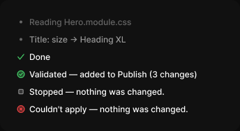

# Step

> Figma « Kuartz — Carte système » (`wvr98llwHnMufQ88qUp4Ih`) › 🎨 Design System › Components — AI editor — nœud `339:1376` (COMPONENT_SET, 6 variantes, cadre 344×188)

## Rôle

Étape du fil. Modifier le texte directement.

## Propriétés

| Propriété | Type | Défaut | Valeurs / préférences |
|---|---|---|---|
| `kind` | VARIANT | `log` | `log`, `change`, `done`, `validated`, `stopped`, `error` |

## Variantes et états

- `kind` : log, change, done, validated, stopped, error (défaut : log)

Variantes présentes (6) : `kind=log` · `kind=change` · `kind=done` · `kind=validated` · `kind=stopped` · `kind=error`

## Anatomie — variante par défaut `kind=log`

- **COMPONENT** `kind=log` — taille: 296×15 · dim: W fixed / H hug · layout: H gap 6{space/6} pad 0 align min/center strokes-in-layout · clip: oui · modes: Icon color=default
  - **FRAME** `bullet-wrap` — taille: 12×12 · dim: W fixed / H fixed · layout: H gap 0 pad 0 align center/center strokes-in-layout · clip: oui
    - **ELLIPSE** `bullet` — taille: 4×4 · dim: W fixed / H fixed · fond: #666666 {text/muted}
  - **TEXT** `text` — taille: 278×15 · dim: W fill / H hug · fond: #666666 {text/muted} · texte: "Reading Hero.module.css" · style: Body Small · textopt: resize height

## Différences des autres variantes

Chaque variante est comparée à une variante de référence (la variante par défaut, ou la même combinaison avec une seule propriété ramenée à sa valeur par défaut — de préférence l'état). Clé = chemin du calque depuis la racine ; seules les propriétés qui changent sont listées (`+` calque ajouté, `−` calque absent).

### `kind=change`

- ~ `/text` — fond: #999999 {text/tertiary} · texte: "Title: size → Heading XL"

### `kind=done`

- ~ `(racine)` — modes: Icon color=success
- + `/icon` (**INSTANCE**) — taille: 12×12 · dim: W fixed / H fixed · instance: Icon/check {size=12}
- ~ `/text` — fond: #ffffff {text/primary} · texte: "Done"
- − `/bullet-wrap` absent
- − `/bullet-wrap/bullet` absent

### `kind=validated`

- ~ `(racine)` — modes: Icon color=success
- + `/icon` (**INSTANCE**) — taille: 12×12 · dim: W fixed / H fixed · instance: Icon/success {size=12}
- ~ `/text` — fond: #ffffff {text/primary} · texte: "Validated — added to Publish (3 changes)"
- − `/bullet-wrap` absent
- − `/bullet-wrap/bullet` absent

### `kind=stopped`

- + `/icon` (**INSTANCE**) — taille: 12×12 · dim: W fixed / H fixed · instance: Icon/stop {size=12}
- ~ `/text` — fond: #ffffff {text/primary} · texte: "Stopped — nothing was changed."
- − `/bullet-wrap` absent
- − `/bullet-wrap/bullet` absent

### `kind=error`

- ~ `(racine)` — modes: Icon color=danger
- + `/icon` (**INSTANCE**) — taille: 12×12 · dim: W fixed / H fixed · instance: Icon/error {size=12}
- ~ `/text` — fond: #ffffff {text/primary} · texte: "Couldn't apply — nothing was changed."
- − `/bullet-wrap` absent
- − `/bullet-wrap/bullet` absent

## Tokens et ressources utilisés

- Variables : `space/6`, `text/muted`, `text/primary`, `text/tertiary`
- Styles de texte : Body Small
- Effets : —
- Icônes : Icon/check, Icon/error, Icon/stop, Icon/success
- Composants imbriqués : —

## Capture

