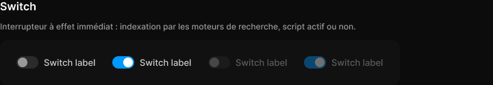

# Switch

> Figma « Kuartz — Carte système » (`wvr98llwHnMufQ88qUp4Ih`) › 🎨 Design System › Components — Forms — nœud `330:329` (COMPONENT_SET, 4 variantes, cadre 584×66)

## Rôle

Interrupteur 32 × 18. Propriétés : Label, Show label.

## Propriétés

| Propriété | Type | Défaut | Valeurs / préférences |
|---|---|---|---|
| `Label` | TEXT | `Switch label` |  |
| `Show label` | BOOLEAN | `true` |  |
| `state` | VARIANT | `off` | `off`, `on`, `disabled-off`, `disabled-on` |

## Variantes et états

- `state` : off, on, disabled-off, disabled-on (défaut : off)

Variantes présentes (4) : `state=off` · `state=on` · `state=disabled-off` · `state=disabled-on`

## Anatomie — variante par défaut `state=off`

- **COMPONENT** `state=off` — taille: 116×18 · dim: W hug / H hug · layout: H gap 8{space/8} pad 0 align min/center strokes-in-layout · clip: oui
  - **FRAME** `track` — taille: 32×18 · dim: W fixed / H fixed · layout: H gap 0 pad 2{space/2} align min/center strokes-in-layout · rayon: 999{radius/full} · fond: #2b2b2b {bg/input-hover} · clip: oui
    - **ELLIPSE** `thumb` — taille: 14×14 · dim: W fixed / H fixed · fond: #999999 {text/tertiary}
  - **TEXT** `label` — taille: 76×16 · dim: W hug / H hug · fond: #cccccc {text/secondary} · texte: "Switch label" · style: Body · textopt: resize width_and_height · refs: visible←Show label, characters←Label

## Différences des autres variantes

Chaque variante est comparée à une variante de référence (la variante par défaut, ou la même combinaison avec une seule propriété ramenée à sa valeur par défaut — de préférence l'état). Clé = chemin du calque depuis la racine ; seules les propriétés qui changent sont listées (`+` calque ajouté, `−` calque absent).

### `state=on`

- ~ `/track` — layout: H gap 0 pad 2{space/2} align max/center strokes-in-layout · fond: #0099ff {interactive/primary}
- ~ `/track/thumb` — fond: #ffffff {text/on-accent}

### `state=disabled-off`

- ~ `(racine)` — opacite: 0.4

### `state=disabled-on`

- ~ `(racine)` — opacite: 0.4
- ~ `/track` — layout: H gap 0 pad 2{space/2} align max/center strokes-in-layout · fond: #0099ff {interactive/primary}
- ~ `/track/thumb` — fond: #ffffff {text/on-accent}

## Tokens et ressources utilisés

- Variables : `bg/input-hover`, `interactive/primary`, `radius/full`, `space/2`, `space/8`, `text/on-accent`, `text/secondary`, `text/tertiary`
- Styles de texte : Body
- Effets : —
- Icônes : —
- Composants imbriqués : —

## Capture

_Capture du cadre de documentation `group/Switch` (`330:306`, 720×124 px : titre, description et composant entier). La capture du composant seul (584×66 px) pesait 4470 octets (< 5 Ko), rendu 1× identique._
