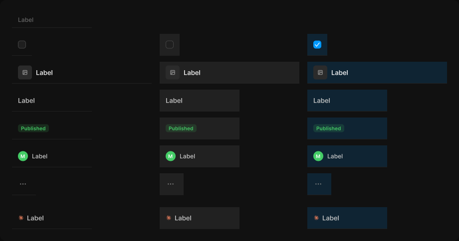

# Table cell

> Figma « Kuartz — Carte système » (`wvr98llwHnMufQ88qUp4Ih`) › 🎨 Design System › Components — Data display — nœud `337:1191` (COMPONENT_SET, 22 variantes, cadre 920×484)

## Rôle

Cellule (largeur libre). Propriétés : Label, Show sort (en-tête). Le tag et l'avatar sont exposés. Aligner les cellules en colonnes de largeur fixe.

## Propriétés

| Propriété | Type | Défaut | Valeurs / préférences |
|---|---|---|---|
| `Label` | TEXT | `Label` |  |
| `Show sort` | BOOLEAN | `false` |  |
| `type` | VARIANT | `header` | `header`, `checkbox`, `title`, `text`, `tag`, `user`, `actions`, `model` |
| `state` | VARIANT | `default` | `default`, `hover`, `selected` |

## Variantes et états

- `type` : header, checkbox, title, text, tag, user, actions, model (défaut : header)
- `state` : default, hover, selected (défaut : default)

Variantes présentes (22) : `type=header, state=default` · `type=checkbox, state=default` · `type=checkbox, state=hover` · `type=checkbox, state=selected` · `type=title, state=default` · `type=title, state=hover` · `type=title, state=selected` · `type=text, state=default` · `type=text, state=hover` · `type=text, state=selected` · `type=tag, state=default` · `type=tag, state=hover` · `type=tag, state=selected` · `type=user, state=default` · `type=user, state=hover` · `type=user, state=selected` · `type=actions, state=default` · `type=actions, state=hover` · `type=actions, state=selected` · `type=model, state=default` · `type=model, state=hover` · `type=model, state=selected`

## Anatomie — variante par défaut `type=header, state=default`

- **COMPONENT** `type=header, state=default` — taille: 160×32 · dim: W fixed / H fixed · layout: H gap 8{space/8} pad 0 12{space/12} align min/center strokes-in-layout · contour: #212121 {border/subtle} · 0/0/1/0px inside · clip: oui · modes: Icon color=default
  - **TEXT** `label` — taille: 32×15 · dim: W hug / H hug · fond: #666666 {text/muted} · texte: "Label" · style: Body Small · textopt: resize width_and_height · refs: characters←Label
  - **INSTANCE** `sort` — taille: 12×12 · visible: masqué · dim: W fixed / H fixed · instance: Icon/chevron-down {size=12} · refs: visible←Show sort

## Différences des autres variantes

Chaque variante est comparée à une variante de référence (la variante par défaut, ou la même combinaison avec une seule propriété ramenée à sa valeur par défaut — de préférence l'état). Clé = chemin du calque depuis la racine ; seules les propriétés qui changent sont listées (`+` calque ajouté, `−` calque absent).

### `type=checkbox, state=default`

- ~ `(racine)` — taille: 40×44
- + `/Checkbox` (**INSTANCE**) — taille: 16×16 · dim: W hug / H hug · layout: H gap 8{space/8} pad 0 align min/center strokes-in-layout · clip: oui · instance: Checkbox {state=unchecked} · props: Show label=false, Label="Checkbox label"
- − `/label` absent
- − `/sort` absent

### `type=checkbox, state=hover` — réf. `type=checkbox, state=default`

- ~ `(racine)` — fond: #212121 {bg/subtle}

### `type=checkbox, state=selected` — réf. `type=checkbox, state=default`

- ~ `(racine)` — fond: #0099ff 14% {bg/tint/info}
- ~ `/Checkbox` — instance: Checkbox {state=checked}

### `type=title, state=default`

- ~ `(racine)` — taille: 280×44
- + `/thumbnail` (**FRAME**) — taille: 28×28 · dim: W fixed / H fixed · layout: H gap 0 pad 0 align center/center strokes-in-layout · rayon: 5{radius/sm} · fond: #2b2b2b {bg/input-hover} · clip: oui
- + `/thumbnail/icon` (**INSTANCE**) — taille: 12×12 · dim: W fixed / H fixed · instance: Icon/image {size=12}
- ~ `/label` — taille: 220×16 · dim: W fill / H hug · fond: #ffffff {text/primary} · style: Body · textopt: resize height, ellipsis max 1 lignes
- − `/sort` absent

### `type=title, state=hover` — réf. `type=title, state=default`

- ~ `(racine)` — fond: #212121 {bg/subtle}

### `type=title, state=selected` — réf. `type=title, state=default`

- ~ `(racine)` — fond: #0099ff 14% {bg/tint/info}

### `type=text, state=default`

- ~ `(racine)` — taille: 160×44
- ~ `/label` — taille: 136×16 · dim: W fill / H hug · fond: #cccccc {text/secondary} · style: Body · textopt: resize height, ellipsis max 1 lignes
- − `/sort` absent

### `type=text, state=hover` — réf. `type=text, state=default`

- ~ `(racine)` — fond: #212121 {bg/subtle}

### `type=text, state=selected` — réf. `type=text, state=default`

- ~ `(racine)` — fond: #0099ff 14% {bg/tint/info}

### `type=tag, state=default`

- ~ `(racine)` — taille: 160×44
- + `/tag` (**INSTANCE**) — taille: 62×16 · dim: W hug / H hug · layout: H gap 4{space/4} pad 2{space/2} 6{space/6} align min/center strokes-in-layout · rayon: 5{radius/sm} · fond: #44cc66 14% {bg/tint/success} · instance: Tag {tone=success} · props: Icon="Icon/close", Show icon=false, Show dot=false, Label="Published" · textes: "Published" · modes: Icon color=success
- − `/label` absent
- − `/sort` absent

### `type=tag, state=hover` — réf. `type=tag, state=default`

- ~ `(racine)` — fond: #212121 {bg/subtle}

### `type=tag, state=selected` — réf. `type=tag, state=default`

- ~ `(racine)` — fond: #0099ff 14% {bg/tint/info}

### `type=user, state=default`

- ~ `(racine)` — taille: 160×44
- + `/avatar` (**INSTANCE**) — taille: 20×20 · dim: W fixed / H fixed · layout: H gap 0 pad 0 align center/center strokes-in-layout · rayon: 999{radius/full} · fond: #44cc66 {interactive/success} · clip: oui · instance: Avatar {size=20, tone=green} · props: Initials="M" · textes: "M"
- ~ `/label` — fond: #cccccc {text/secondary}
- − `/sort` absent

### `type=user, state=hover` — réf. `type=user, state=default`

- ~ `(racine)` — fond: #212121 {bg/subtle}

### `type=user, state=selected` — réf. `type=user, state=default`

- ~ `(racine)` — fond: #0099ff 14% {bg/tint/info}

### `type=actions, state=default`

- ~ `(racine)` — taille: 48×44 · layout: H gap 8{space/8} pad 0 12{space/12} align max/center strokes-in-layout
- + `/icon-button` (**INSTANCE**) — taille: 28×28 · dim: W fixed / H fixed · layout: H gap 0 pad 0 align center/center strokes-in-layout · rayon: 8{radius/md} · clip: oui · instance: Icon button {style=ghost, state=default, size=small} · props: Icon="Icon/more" · modes: Icon color=default
- − `/label` absent
- − `/sort` absent

### `type=actions, state=hover` — réf. `type=actions, state=default`

- ~ `(racine)` — fond: #212121 {bg/subtle}

### `type=actions, state=selected` — réf. `type=actions, state=default`

- ~ `(racine)` — fond: #0099ff 14% {bg/tint/info}

### `type=model, state=default`

- ~ `(racine)` — taille: 160×44 · layout: H gap 6 pad 0 12{space/12} align min/center strokes-in-layout · modes: Icon color=claude
- + `/mark` (**INSTANCE**) — taille: 12×12 · dim: W fixed / H fixed · instance: Icon/claude {size=12}
- ~ `/label` — taille: 118×16 · dim: W fill / H hug · fond: #cccccc {text/secondary} · style: Body · textopt: resize height, ellipsis max 1 lignes
- − `/sort` absent

### `type=model, state=hover` — réf. `type=model, state=default`

- ~ `(racine)` — fond: #212121 {bg/subtle}

### `type=model, state=selected` — réf. `type=model, state=default`

- ~ `(racine)` — fond: #0099ff 14% {bg/tint/info}

## Tokens et ressources utilisés

- Variables : `bg/input-hover`, `bg/subtle`, `bg/tint/info`, `bg/tint/success`, `border/subtle`, `interactive/success`, `radius/full`, `radius/md`, `radius/sm`, `space/12`, `space/2`, `space/4`, `space/6`, `space/8`, `text/muted`, `text/primary`, `text/secondary`
- Styles de texte : Body Small, Body
- Effets : —
- Icônes : Icon/chevron-down, Icon/claude, Icon/close, Icon/image, Icon/more
- Composants imbriqués : Avatar, Checkbox, Icon button, Tag

## Capture

