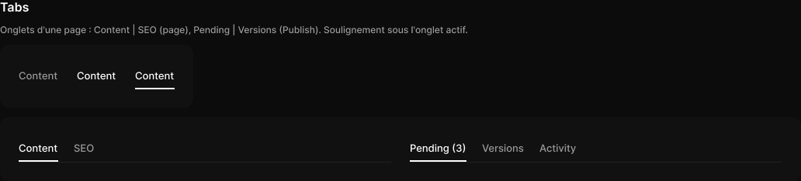

# Tabs

> Figma « Kuartz — Carte système » (`wvr98llwHnMufQ88qUp4Ih`) › 🎨 Design System › Components — Navigation — nœud `332:479` (COMPONENT_SET, 2 variantes, cadre 1032×83)

## Rôle

Rangée d’onglets (onglets exposés : état et libellé depuis le panneau). Largeur libre.

## Propriétés

| Propriété | Type | Défaut | Valeurs / préférences |
|---|---|---|---|
| `count` | VARIANT | `2` | `2`, `3` |

## Variantes et états

- `count` : 2, 3 (défaut : 2)

Variantes présentes (2) : `count=2` · `count=3`

## Anatomie — variante par défaut `count=2`

- **COMPONENT** `count=2` — taille: 480×35 · dim: W fixed / H hug · layout: H gap 20{space/20} pad 0 align min/max strokes-in-layout · contour: #212121 {border/subtle} · 0/0/1/0px inside · clip: oui
  - **INSTANCE** `tab 1` — taille: 51×34 · dim: W hug / H hug · layout: V gap 8{space/8} pad 8{space/8} 0 0 0 align min/center strokes-in-layout · clip: oui · instance: Tab {state=active} · props: Label="Content" · textes: "Content"
  - **INSTANCE** `tab 2` — taille: 27×34 · dim: W hug / H hug · layout: V gap 8{space/8} pad 8{space/8} 0 0 0 align min/center strokes-in-layout · clip: oui · instance: Tab {state=default} · props: Label="SEO" · textes: "SEO"

## Différences des autres variantes

Chaque variante est comparée à une variante de référence (la variante par défaut, ou la même combinaison avec une seule propriété ramenée à sa valeur par défaut — de préférence l'état). Clé = chemin du calque depuis la racine ; seules les propriétés qui changent sont listées (`+` calque ajouté, `−` calque absent).

### `count=3`

- ~ `/tab 1` — taille: 73×34 · props: Label="Pending (3)" · textes: "Pending (3)"
- ~ `/tab 2` — taille: 54×34 · props: Label="Versions" · textes: "Versions"
- + `/tab 3` (**INSTANCE**) — taille: 48×34 · dim: W hug / H hug · layout: V gap 8{space/8} pad 8{space/8} 0 0 0 align min/center strokes-in-layout · clip: oui · instance: Tab {state=default} · props: Label="Activity" · textes: "Activity"

## Tokens et ressources utilisés

- Variables : `border/subtle`, `space/20`, `space/8`
- Styles de texte : —
- Effets : —
- Icônes : —
- Composants imbriqués : Tab

## Capture

_Capture du cadre de documentation `group/Tabs` (`332:444`, 1032×235 px : titre, description et composant entier) — ce cadre contient aussi les composants voisins de la même rubrique. La capture du composant seul (1032×83 px) pesait 4033 octets (< 5 Ko), rendu 1× identique._
