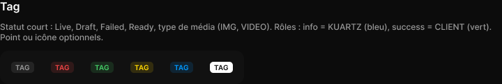

# Tag

> Figma « Kuartz — Carte système » (`wvr98llwHnMufQ88qUp4Ih`) › 🎨 Design System › Components — Feedback — nœud `142:38` (COMPONENT_SET, 6 variantes, cadre 350×48)

## Rôle

Statut court. tone : neutral, info (KUARTZ), success (CLIENT, Ready), warning (Draft, changements), error (Failed), inverse (Live). Options : point, icône 10 px.

## Propriétés

| Propriété | Type | Défaut | Valeurs / préférences |
|---|---|---|---|
| `Label` | TEXT | `TAG` |  |
| `Show dot` | BOOLEAN | `false` |  |
| `Show icon` | BOOLEAN | `false` |  |
| `Icon` | INSTANCE_SWAP | `Icon/close` | préférées : toutes les icônes Icon/* (73/75) sauf Icon/open, Icon/claude |
| `tone` | VARIANT | `neutral` | `neutral`, `error`, `success`, `warning`, `info`, `inverse` |

## Variantes et états

- `tone` : neutral, error, success, warning, info, inverse (défaut : neutral)

Variantes présentes (6) : `tone=neutral` · `tone=error` · `tone=success` · `tone=warning` · `tone=info` · `tone=inverse`

## Anatomie — variante par défaut `tone=neutral`

- **COMPONENT** `tone=neutral` — taille: 33×16 · dim: W hug / H hug · layout: H gap 4{space/4} pad 2{space/2} 6{space/6} align min/center strokes-in-layout · rayon: 5{radius/sm} · fond: #ffffff 8% {bg/tint/neutral} · modes: Icon color=default
  - **ELLIPSE** `dot` — taille: 6×6 · visible: masqué · dim: W fixed / H fixed · fond: #999999 {text/tertiary} · refs: visible←Show dot
  - **INSTANCE** `icon` — taille: 10×10 · visible: masqué · dim: W fixed / H fixed · instance: Icon/close {size=18} · refs: visible←Show icon, mainComponent←Icon
  - **TEXT** `label` — taille: 21×12 · dim: W hug / H hug · fond: #999999 {text/tertiary} · texte: "TAG" · style: Label Small · textopt: resize width_and_height · refs: characters←Label

## Différences des autres variantes

Chaque variante est comparée à une variante de référence (la variante par défaut, ou la même combinaison avec une seule propriété ramenée à sa valeur par défaut — de préférence l'état). Clé = chemin du calque depuis la racine ; seules les propriétés qui changent sont listées (`+` calque ajouté, `−` calque absent).

### `tone=error`

- ~ `(racine)` — fond: #ee4444 14% {bg/tint/danger} · modes: Icon color=danger
- ~ `/dot` — fond: #ee4444 {interactive/danger}
- ~ `/label` — fond: #ee4444 {interactive/danger}

### `tone=success`

- ~ `(racine)` — fond: #44cc66 14% {bg/tint/success} · modes: Icon color=success
- ~ `/dot` — fond: #44cc66 {interactive/success}
- ~ `/label` — fond: #44cc66 {interactive/success}

### `tone=warning`

- ~ `(racine)` — fond: #ffd700 14% {bg/tint/warning} · modes: Icon color=warning
- ~ `/dot` — fond: #ffd700 {interactive/warning}
- ~ `/label` — fond: #ffd700 {interactive/warning}

### `tone=info`

- ~ `(racine)` — fond: #0099ff 14% {bg/tint/info} · modes: Icon color=primary
- ~ `/dot` — fond: #0099ff {text/link}
- ~ `/label` — fond: #0099ff {text/link}

### `tone=inverse`

- ~ `(racine)` — fond: #ffffff {bg/inverse} · modes: Icon color=inverse
- ~ `/dot` — fond: #111111 {text/inverse}
- ~ `/label` — fond: #111111 {text/inverse}

## Tokens et ressources utilisés

- Variables : `bg/inverse`, `bg/tint/danger`, `bg/tint/info`, `bg/tint/neutral`, `bg/tint/success`, `bg/tint/warning`, `interactive/danger`, `interactive/success`, `interactive/warning`, `radius/sm`, `space/2`, `space/4`, `space/6`, `text/inverse`, `text/link`, `text/tertiary`
- Styles de texte : Label Small
- Effets : —
- Icônes : Icon/close
- Composants imbriqués : —

## Capture

_Capture du cadre de documentation `group/Tag` (`323:145`, 720×121 px : titre, description et composant entier). La capture du composant seul (350×48 px) pesait 3596 octets (< 5 Ko), rendu 1× identique._
