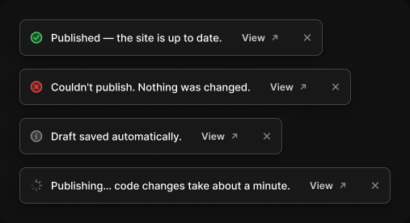

# Toast

> Figma « Kuartz — Carte système » (`wvr98llwHnMufQ88qUp4Ih`) › 🎨 Design System › Components — Feedback — nœud `323:412` (COMPONENT_SET, 4 variantes, cadre 507×276)

## Rôle

Notification temporaire (4–6 s), en bas au centre. Modifier le message directement dans le calque « message ». Propriété : Show action.

## Propriétés

| Propriété | Type | Défaut | Valeurs / préférences |
|---|---|---|---|
| `Show action` | BOOLEAN | `true` |  |
| `type` | VARIANT | `success` | `success`, `error`, `info`, `loading` |

## Variantes et états

- `type` : success, error, info, loading (défaut : success)

Variantes présentes (4) : `type=success` · `type=error` · `type=info` · `type=loading`

## Anatomie — variante par défaut `type=success`

- **COMPONENT** `type=success` — taille: 375×45 · dim: W hug / H hug · layout: H gap 10{space/10} pad 8{space/8} 8{space/8} 8{space/8} 12{space/12} align min/center strokes-in-layout · rayon: 8{radius/md} · fond: #181818 {bg/elevated} · contour: #444444 {border/strong} · 1px inside · effet: style Elevation/Popover · clip: oui · modes: Icon color=success
  - **INSTANCE** `icon` — taille: 16×16 · dim: W fixed / H fixed · instance: Icon/success {size=18}
  - **TEXT** `message` — taille: 212×16 · dim: W hug / H hug · fond: #ffffff {text/primary} · texte: "Published — the site is up to date." · style: Body · textopt: resize width_and_height
  - **INSTANCE** `action` — taille: 75×27 · dim: W hug / H hug · layout: H gap 6{space/6} pad 6{space/6} 14 align center/center strokes-in-layout · rayon: 6 · instance: Button {variant=ghost, state=default, size=small} · props: Icon left="Icon/plus", Show icon right=true, Icon right="Icon/external", Show icon left=false, Label="View" · textes: "View" · modes: Icon color=default · refs: visible←Show action
  - **INSTANCE** `icon-button` — taille: 20×20 · dim: W fixed / H fixed · layout: H gap 0 pad 0 align center/center strokes-in-layout · rayon: 5{radius/sm} · clip: oui · instance: Icon button {style=ghost, state=default, size=xsmall} · props: Icon="Icon/close" · modes: Icon color=default

## Différences des autres variantes

Chaque variante est comparée à une variante de référence (la variante par défaut, ou la même combinaison avec une seule propriété ramenée à sa valeur par défaut — de préférence l'état). Clé = chemin du calque depuis la racine ; seules les propriétés qui changent sont listées (`+` calque ajouté, `−` calque absent).

### `type=error`

- ~ `(racine)` — taille: 410×45 · modes: Icon color=danger
- ~ `/icon` — instance: Icon/error {size=18}
- ~ `/message` — taille: 247×16 · texte: "Couldn't publish. Nothing was changed."

### `type=info`

- ~ `(racine)` — taille: 325×45 · modes: Icon color=default
- ~ `/icon` — instance: Icon/info {size=18}
- ~ `/message` — taille: 162×16 · texte: "Draft saved automatically."

### `type=loading`

- ~ `(racine)` — taille: 459×45 · modes: Icon color=default
- ~ `/icon` — instance: Icon/loader {size=18}
- ~ `/message` — taille: 296×16 · texte: "Publishing… code changes take about a minute."

## Tokens et ressources utilisés

- Variables : `bg/elevated`, `border/strong`, `radius/md`, `radius/sm`, `space/10`, `space/12`, `space/6`, `space/8`, `text/primary`
- Styles de texte : Body
- Effets : Elevation/Popover
- Icônes : Icon/close, Icon/error, Icon/external, Icon/info, Icon/loader, Icon/plus, Icon/success
- Composants imbriqués : Button, Icon button

## Capture

