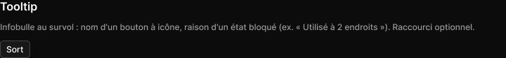

# Tooltip

> Figma « Kuartz — Carte système » (`wvr98llwHnMufQ88qUp4Ih`) › 🎨 Design System › Components — Feedback — nœud `323:189` (COMPONENT, cadre 43×25)

## Rôle

Infobulle. Propriétés : Label, Show shortcut.

## Propriétés

| Propriété | Type | Défaut | Valeurs / préférences |
|---|---|---|---|
| `Label` | TEXT | `Sort` |  |
| `Show shortcut` | BOOLEAN | `false` |  |

## Anatomie — composant

- **COMPONENT** `Tooltip` — taille: 43×25 · dim: W hug / H hug · layout: H gap 8{space/8} pad 4{space/4} 8{space/8} align min/center strokes-in-layout · rayon: 5{radius/sm} · fond: #181818 {bg/elevated} · contour: #444444 {border/strong} · 1px inside · effet: style Elevation/Popover · clip: oui
  - **TEXT** `label` — taille: 25×15 · dim: W hug / H hug · fond: #ffffff {text/primary} · texte: "Sort" · style: Body Small · textopt: resize width_and_height · refs: characters←Label
  - **INSTANCE** `shortcut` — taille: 35×16 · visible: masqué · dim: W hug / H hug · layout: H gap 0 pad 1 5 align center/center strokes-in-layout · minmax: minWidth 18 · rayon: 5{radius/sm} · fond: #212121 {bg/subtle} · contour: #252525 {border/default} · 1px inside · clip: oui · instance: Kbd · props: Label="⌘ ↵" · refs: visible←Show shortcut

## Tokens et ressources utilisés

- Variables : `bg/elevated`, `bg/subtle`, `border/default`, `border/strong`, `radius/sm`, `space/4`, `space/8`, `text/primary`
- Styles de texte : Body Small
- Effets : Elevation/Popover
- Icônes : —
- Composants imbriqués : Kbd

## Capture

_Capture du cadre de documentation `group/Tooltip` (`323:182`, 720×83 px : titre, description et composant entier). La capture du composant seul (67×41 px) pesait 1338 octets (< 5 Ko), rendu 1× identique._
