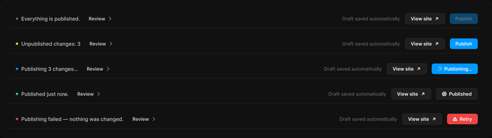

# Top bar

> Figma « Kuartz — Carte système » (`wvr98llwHnMufQ88qUp4Ih`) › 🎨 Design System › Components — Navigation — nœud `333:1407` (COMPONENT_SET, 5 variantes, cadre 1248×352)

## Rôle

Barre du haut (1200 × 48, étirable). state = étape de publication : up-to-date, pending, publishing, published, error. Le Publish button suit l'état.

## Propriétés

| Propriété | Type | Défaut | Valeurs / préférences |
|---|---|---|---|
| `state` | VARIANT | `up-to-date` | `up-to-date`, `pending`, `publishing`, `published`, `error` |

## Variantes et états

- `state` : up-to-date, pending, publishing, published, error (défaut : up-to-date)

Variantes présentes (5) : `state=up-to-date` · `state=pending` · `state=publishing` · `state=published` · `state=error`

## Anatomie — variante par défaut `state=up-to-date`

- **COMPONENT** `state=up-to-date` — taille: 1200×48 · dim: W fixed / H fixed · layout: H gap 12{space/12} pad 0 12{space/12} 0 16{space/16} align min/center strokes-in-layout · fond: #111111 {bg/primary} · contour: #212121 {border/subtle} · 0/0/1/0px inside · clip: oui
  - **FRAME** `status` — taille: 816×27 · dim: W fill / H hug · layout: H gap 8{space/8} pad 0 align min/center strokes-in-layout · clip: oui
    - **ELLIPSE** `dot` — taille: 6×6 · dim: W fixed / H fixed · fond: #666666 {text/muted}
    - **TEXT** `status-text` — taille: 149×16 · dim: W hug / H hug · fond: #cccccc {text/secondary} · texte: "Everything is published." · style: Body · textopt: resize width_and_height
    - **INSTANCE** `review` — taille: 88×27 · dim: W hug / H hug · layout: H gap 6{space/6} pad 6{space/6} 14 align center/center strokes-in-layout · rayon: 6 · instance: Button {variant=ghost, state=default, size=small} · props: Icon left="Icon/plus", Show icon right=true, Icon right="Icon/chevron-right", Show icon left=false, Label="Review" · textes: "Review" · modes: Icon color=default
  - **TEXT** `autosave` — taille: 147×15 · dim: W hug / H hug · fond: #666666 {text/muted} · texte: "Draft saved automatically" · style: Body Small · textopt: resize width_and_height
  - **INSTANCE** `view-site` — taille: 102×29 · dim: W hug / H hug · layout: H gap 6{space/6} pad 6{space/6} 14 align center/center strokes-in-layout · rayon: 6 · fond: #1f1f1f {bg/input} · contour: #252525 {border/default} · 1px inside · instance: Button {variant=secondary, state=default, size=small} · props: Icon left="Icon/plus", Show icon left=false, Icon right="Icon/external", Show icon right=true, Label="View site" · textes: "View site" · modes: Icon color=active
  - **INSTANCE** `publish` — taille: 71×27 · dim: W hug / H hug · layout: H gap 0 pad 0 align min/center strokes-in-layout · clip: oui · instance: Publish button {state=idle} · textes: "Publish"

## Différences des autres variantes

Chaque variante est comparée à une variante de référence (la variante par défaut, ou la même combinaison avec une seule propriété ramenée à sa valeur par défaut — de préférence l'état). Clé = chemin du calque depuis la racine ; seules les propriétés qui changent sont listées (`+` calque ajouté, `−` calque absent).

### `state=pending`

- ~ `/status/dot` — fond: #ffd700 {interactive/warning}
- ~ `/status/status-text` — taille: 151×16 · texte: "Unpublished changes: 3"
- ~ `/publish` — instance: Publish button {state=pending}

### `state=publishing`

- ~ `/status` — taille: 770×27
- ~ `/status/dot` — fond: #0099ff {interactive/primary}
- ~ `/status/status-text` — taille: 144×16 · texte: "Publishing 3 changes…"
- ~ `/publish` — taille: 117×27 · instance: Publish button {state=publishing} · textes: "Publishing…"

### `state=published`

- ~ `/status` — taille: 781×27
- ~ `/status/dot` — fond: #44cc66 {interactive/success}
- ~ `/status/status-text` — taille: 120×16 · texte: "Published just now."
- ~ `/publish` — taille: 106×29 · instance: Publish button {state=published} · textes: "Published"

### `state=error`

- ~ `/status` — taille: 809×27
- ~ `/status/dot` — fond: #ee4444 {interactive/danger}
- ~ `/status/status-text` — taille: 260×16 · texte: "Publishing failed — nothing was changed."
- ~ `/publish` — taille: 78×27 · instance: Publish button {state=error} · textes: "Retry"

## Tokens et ressources utilisés

- Variables : `bg/input`, `bg/primary`, `border/default`, `border/subtle`, `interactive/danger`, `interactive/primary`, `interactive/success`, `interactive/warning`, `space/12`, `space/16`, `space/6`, `space/8`, `text/muted`, `text/secondary`
- Styles de texte : Body, Body Small
- Effets : —
- Icônes : Icon/chevron-right, Icon/external, Icon/plus
- Composants imbriqués : Button, Publish button

## Capture

