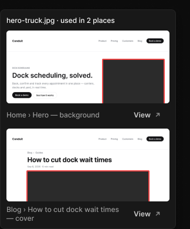

# Usage tooltip

> Figma « Kuartz — Carte système » (`wvr98llwHnMufQ88qUp4Ih`) › 🎨 Design System › Components — Overlays — nœud `336:1082` (COMPONENT, cadre 300×374)

## Rôle

Info-bulle d'usage d'un média : une miniature par emplacement (capture fidèle de la section, média entouré en rouge). Remplacer les miniatures par les vraies captures. Miniatures : vraie vue du site (Home, article…) exportée de la maquette Conduit, avec le cadre rouge sur l’emplacement exact de l’image.

## Propriétés

_Aucune propriété._

## Anatomie — composant

- **COMPONENT** `Usage tooltip` — taille: 300×374 · dim: W fixed / H hug · layout: V gap 10{space/10} pad 10{space/10} align min/min strokes-in-layout · rayon: 8{radius/md} · fond: #181818 {bg/elevated} · contour: #252525 {border/default} · 1px inside · effet: style Elevation/Popover · clip: oui · modes: Icon color=default
  - **TEXT** `title` — taille: 278×15 · dim: W fill / H hug · fond: #ffffff {text/primary} · texte: "hero-truck.jpg · used in 2 places" · style: Body Small · textopt: resize height
  - **FRAME** `place` — taille: 278×157 · dim: W fill / H hug · layout: V gap 6{space/6} pad 0 align min/min strokes-in-layout · clip: oui
    - **FRAME** `miniature` — taille: 278×124 · dim: W fill / H fixed · rayon: 5{radius/sm} · fond: IMAGE FILL · clip: oui
      - **RECTANGLE** `highlight` — taille: 107×81 · pos: x 163 y 48 (min/min) · rayon: 2 · fond: #2b2b2b {bg/input-hover} · contour: #ee4444 {interactive/danger} · 2px inside
    - **FRAME** `where` — taille: 278×27 · dim: W fill / H hug · layout: H gap 6{space/6} pad 0 align min/center strokes-in-layout · clip: oui
      - **TEXT** `label` — taille: 197×15 · dim: W fill / H hug · fond: #999999 {text/tertiary} · texte: "Home › Hero — background" · style: Body Small · textopt: resize height
      - **INSTANCE** `view` — taille: 75×27 · dim: W hug / H hug · layout: H gap 6{space/6} pad 6{space/6} 14 align center/center strokes-in-layout · rayon: 6 · instance: Button {variant=ghost, state=default, size=small} · props: Icon left="Icon/plus", Show icon right=true, Icon right="Icon/external", Show icon left=false, Label="View" · textes: "View" · modes: Icon color=default
  - **FRAME** `place` — taille: 278×160 · dim: W fill / H hug · layout: V gap 6{space/6} pad 0 align min/min strokes-in-layout · clip: oui
    - **FRAME** `miniature` — taille: 278×124 · dim: W fill / H fixed · rayon: 5{radius/sm} · fond: IMAGE FILL · clip: oui
      - **RECTANGLE** `highlight` — taille: 210×58 · pos: x 34 y 71 (min/min) · rayon: 2 · fond: #2b2b2b {bg/input-hover} · contour: #ee4444 {interactive/danger} · 2px inside
    - **FRAME** `where` — taille: 278×30 · dim: W fill / H hug · layout: H gap 6{space/6} pad 0 align min/center strokes-in-layout · clip: oui
      - **TEXT** `label` — taille: 197×30 · dim: W fill / H hug · fond: #999999 {text/tertiary} · texte: "Blog › How to cut dock wait times — cover" · style: Body Small · textopt: resize height
      - **INSTANCE** `view` — taille: 75×27 · dim: W hug / H hug · layout: H gap 6{space/6} pad 6{space/6} 14 align center/center strokes-in-layout · rayon: 6 · instance: Button {variant=ghost, state=default, size=small} · props: Icon left="Icon/plus", Show icon right=true, Icon right="Icon/external", Show icon left=false, Label="View" · textes: "View" · modes: Icon color=default

## Tokens et ressources utilisés

- Variables : `bg/elevated`, `bg/input-hover`, `border/default`, `interactive/danger`, `radius/md`, `radius/sm`, `space/10`, `space/6`, `text/primary`, `text/tertiary`
- Styles de texte : Body Small
- Effets : Elevation/Popover
- Icônes : Icon/external, Icon/plus
- Composants imbriqués : Button

## Capture

