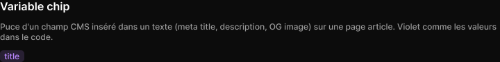

# Variable chip

> Figma « Kuartz — Carte système » (`wvr98llwHnMufQ88qUp4Ih`) › 🎨 Design System › Components — Forms — nœud `445:1898` (COMPONENT, cadre 35×17)

## Rôle

Champ CMS (variable) dans un texte : {{title}} s'affiche « title » sur fond violet léger. Label = nom du champ.

## Propriétés

| Propriété | Type | Défaut | Valeurs / préférences |
|---|---|---|---|
| `Label` | TEXT | `title` |  |

## Anatomie — composant

- **COMPONENT** `Variable chip` — taille: 35×17 · dim: W hug / H hug · layout: H gap 0 pad 1 6 align min/center strokes-in-layout · rayon: 5{radius/sm} · fond: #bb88ff 16% {bg/tint/variable}
  - **TEXT** `label` — taille: 23×15 · dim: W hug / H hug · fond: #bb88ff {text/variable} · texte: "title" · style: Body Small · textopt: resize width_and_height · refs: characters←Label

## Tokens et ressources utilisés

- Variables : `bg/tint/variable`, `radius/sm`, `text/variable`
- Styles de texte : Body Small
- Effets : —
- Icônes : —
- Composants imbriqués : —

## Capture

_Capture du cadre de documentation `group/Variable chip` (`445:1893`, 720×90 px : titre, description et composant entier). La capture du composant seul (35×17 px) pesait 696 octets (< 5 Ko), rendu 1× identique._
