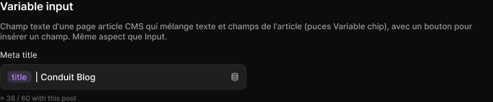

# Variable input

> Figma « Kuartz — Carte système » (`wvr98llwHnMufQ88qUp4Ih`) › 🎨 Design System › Components — Forms — nœud `445:1918` (COMPONENT, cadre 360×77)

## Rôle

Input d'une page article CMS : texte + champs de l'article (Variable chip exposé), bouton d'insertion (icône database) à droite, aide dessous (longueur estimée avec l'article d'aperçu).

## Propriétés

| Propriété | Type | Défaut | Valeurs / préférences |
|---|---|---|---|
| `Label` | TEXT | `Meta title` |  |
| `Text` | TEXT | « &#32;&#124; Conduit Blog » (valeur Figma exacte : espace, barre verticale, espace, « Conduit Blog ») |  |
| `Show text` | BOOLEAN | `true` |  |
| `Helper` | TEXT | `≈ 38 / 60 with this post` |  |

## Anatomie — composant

- **COMPONENT** `Variable input` — taille: 360×77 · dim: W fixed / H hug · layout: V gap 6 pad 0 align min/min strokes-in-layout
  - **TEXT** `label` — taille: 55×15 · dim: W hug / H hug · fond: #cccccc {text/secondary} · texte: "Meta title" · style: Body Small · textopt: resize width_and_height · refs: characters←Label
  - **FRAME** `input-box` — taille: 360×38 · dim: W fill / H hug · layout: H gap 6 pad 8 6 8 10 align min/center strokes-in-layout · rayon: 8{radius/md} · fond: #1f1f1f {bg/input} · contour: #252525 {border/default} · 1px inside
    - **FRAME** `content` — taille: 316×17 · dim: W fill / H hug · layout: H gap 2 pad 0 align min/center strokes-in-layout
      - **INSTANCE** `chip` — taille: 35×17 · dim: W hug / H hug · layout: H gap 0 pad 1 6 align min/center strokes-in-layout · rayon: 5{radius/sm} · fond: #bb88ff 16% {bg/tint/variable} · instance: Variable chip · props: Label="title" · textes: "title"
      - **TEXT** `text` — taille: 92×16 · dim: W hug / H hug · fond: #ffffff {text/primary} · texte: " | Conduit Blog" · style: Body · textopt: resize width_and_height · refs: visible←Show text, characters←Text
    - **INSTANCE** `insert` — taille: 20×20 · dim: W fixed / H fixed · layout: H gap 0 pad 0 align center/center strokes-in-layout · rayon: 5{radius/sm} · clip: oui · instance: Icon button {style=ghost, state=default, size=xsmall} · props: Icon="Icon/database" · modes: Icon color=default
  - **TEXT** `helper` — taille: 112×12 · dim: W hug / H hug · fond: #666666 {text/muted} · texte: "≈ 38 / 60 with this post" · style: Caption · textopt: resize width_and_height · refs: characters←Helper

## Tokens et ressources utilisés

- Variables : `bg/input`, `bg/tint/variable`, `border/default`, `radius/md`, `radius/sm`, `text/muted`, `text/primary`, `text/secondary`
- Styles de texte : Body Small, Body, Caption
- Effets : —
- Icônes : Icon/database
- Composants imbriqués : Icon button, Variable chip

## Capture

_Capture du cadre de documentation `group/Variable input` (`445:1899`, 720×150 px : titre, description et composant entier). La capture du composant seul (360×77 px) pesait 4497 octets (< 5 Ko), rendu 1× identique._
