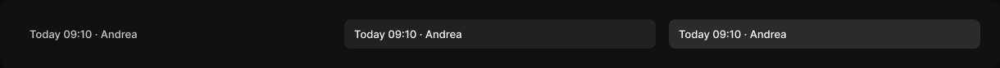

# Version item

> Figma « Kuartz — Carte système » (`wvr98llwHnMufQ88qUp4Ih`) › 🎨 Design System › Components — Data display — nœud `337:1486` (COMPONENT_SET, 3 variantes, cadre 1220×84)

## Rôle

Ligne de version (380 px). Propriétés : Label, Show tag (exposé : Live = inverse, Failed = error + icône ✕).

## Propriétés

| Propriété | Type | Défaut | Valeurs / préférences |
|---|---|---|---|
| `Label` | TEXT | `Today 09:10 · Andrea` |  |
| `Show tag` | BOOLEAN | `false` |  |
| `state` | VARIANT | `default` | `default`, `hover`, `selected` |

## Variantes et états

- `state` : default, hover, selected (défaut : default)

Variantes présentes (3) : `state=default` · `state=hover` · `state=selected`

## Anatomie — variante par défaut `state=default`

- **COMPONENT** `state=default` — taille: 380×36 · dim: W fixed / H hug · layout: H gap 8{space/8} pad 10{space/10} 12{space/12} align min/center strokes-in-layout · rayon: 8{radius/md} · clip: oui
  - **TEXT** `label` — taille: 356×16 · dim: W fill / H hug · fond: #cccccc {text/secondary} · texte: "Today 09:10 · Andrea" · style: Body · textopt: resize height · refs: characters←Label
  - **INSTANCE** `tag` — taille: 33×16 · visible: masqué · dim: W hug / H hug · layout: H gap 4{space/4} pad 2{space/2} 6{space/6} align min/center strokes-in-layout · rayon: 5{radius/sm} · fond: #ffffff {bg/inverse} · instance: Tag {tone=inverse} · props: Icon="Icon/close", Show icon=false, Show dot=false, Label="Live" · textes: "Live" · modes: Icon color=inverse · refs: visible←Show tag

## Différences des autres variantes

Chaque variante est comparée à une variante de référence (la variante par défaut, ou la même combinaison avec une seule propriété ramenée à sa valeur par défaut — de préférence l'état). Clé = chemin du calque depuis la racine ; seules les propriétés qui changent sont listées (`+` calque ajouté, `−` calque absent).

### `state=hover`

- ~ `(racine)` — fond: #212121 {bg/subtle}
- ~ `/label` — fond: #ffffff {text/primary}
- ~ `/tag` — textes: (aucun)

### `state=selected`

- ~ `(racine)` — fond: #2b2b2b {bg/input-hover}
- ~ `/label` — fond: #ffffff {text/primary}
- ~ `/tag` — textes: (aucun)

## Tokens et ressources utilisés

- Variables : `bg/input-hover`, `bg/inverse`, `bg/subtle`, `radius/md`, `radius/sm`, `space/10`, `space/12`, `space/2`, `space/4`, `space/6`, `space/8`, `text/primary`, `text/secondary`
- Styles de texte : Body
- Effets : —
- Icônes : Icon/close
- Composants imbriqués : Tag

## Capture

