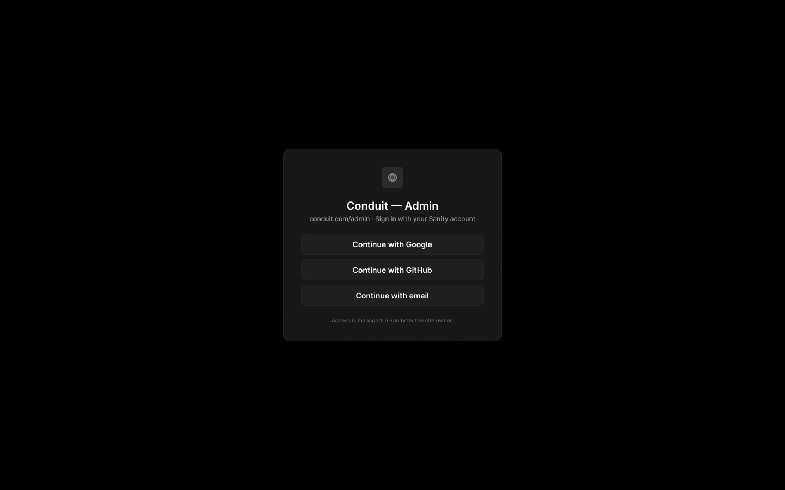
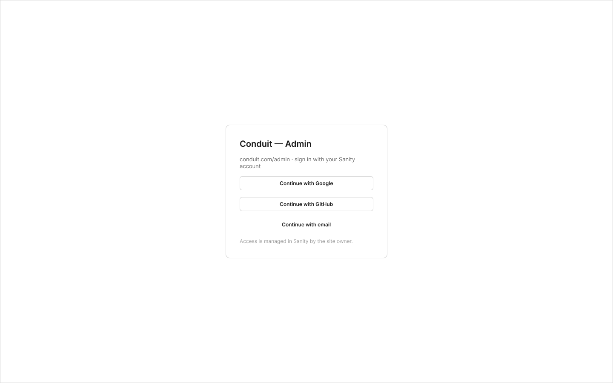

# A1 · Connexion à l’admin du site

Extraction Figma du fichier « Kuartz — Carte système » (fileKey `wvr98llwHnMufQ88qUp4Ih`). Notation des arbres et conventions : voir [../README.md](../README.md).

| Champ | Valeur |
|---|---|
| Route | `<site>/admin (ex. conduit.com/admin), sur le Vercel du client` |
| Accès | Kuartz et client admin (barre d’accès : « KUARTZ » + « CLIENT ADMIN ») · « Accès : tout membre du projet Sanity » |
| Seul Kuartz voit | rien de spécifique à cet écran (Kuartz y arrive depuis le hub, « K1, icône Admin » ; le rôle Sanity « Developer → Kuartz ») |
| Wireframe | `212:82` · caption `212:79` · accès `225:1303` |
| LLM context | `502:1928` |
| UI | `359:674` · caption `359:671` · accès `359:685` |
| Captures | [UI](./A1.ui.png) · [Wireframe](./A1.wf.png) |





## Caption et barre d’accès

- Caption wireframe (`212:79`) : A1 · Connexion à l’admin du site
- Barre d’accès wireframe (`225:1303`, 1440px) : "KUARTZ" 718px fill=#1f70eb | "CLIENT ADMIN" 718px fill=#1f9e57
- Caption UI (`359:671`) : A1 · Connexion à l’admin du site
- Barre d’accès UI (`359:685`, 1440px) : "KUARTZ" 718px fill=#1f70eb | "CLIENT ADMIN" 718px fill=#1f9e57

## LLM context

Bloc Figma `502:1928` (page Wireframe), texte verbatim.

> LLM CONTEXT
>
> A1 · Log in
>
> Connexion à l’admin du site
>
> Route : <site>/admin (ex. conduit.com/admin), sur le Vercel du client · Accès : tout membre du projet Sanity

<!-- col 1 -->

### EN BREF

Chaque site a son propre admin, à l’adresse du site + /admin. On s’y connecte avec son compte Sanity : les comptes et les rôles sont ceux du projet Sanity du client.

### COMPORTEMENT

• Carte « Conduit — Admin », « conduit.com/admin · sign in with your Sanity account ».
• Boutons « Continue with Google », « Continue with GitHub », « Continue with email » : les fournisseurs d’identité de Sanity.
• Mention « Access is managed in Sanity by the site owner. ».
• Après connexion : le rôle est lu dans le projet Sanity (Administrator → admin client, Developer → Kuartz), puis on arrive sur B1 Overview, ou sur l’URL demandée avant la connexion.
• Kuartz arrive depuis le hub (K1, icône Admin) ; le client par le lien direct.

<!-- col 2 -->

### ÉTATS ET CAS LIMITES

• Compte Sanity qui n’est pas membre du projet : message d’accès refusé avec « Ask the site owner to invite you. » (proposé).
• Session expirée : retour à A1, puis à l’écran demandé.
• Écran de moins de 1024 px : « This admin is designed for a computer. » à la place de l’admin.

### INTÉGRATION

• Authentification Sanity : dépend de la question 2 (Studio personnalisé ou interface propre). Pour une interface propre, à valider : l’App SDK de Sanity ou le client Sanity avec la session de l’utilisateur (withCredentials, origine CORS autorisée).
• Les écritures sensibles (publication, scripts, IA) passent par des routes serveur avec un jeton gardé côté serveur ; le rôle est vérifié côté serveur à chaque appel.

### HORS PÉRIMÈTRE

Pas de création de compte ni de mot de passe dans l’admin : tout se gère dans Sanity.

## Wireframe

Écran wireframe `212:82` — textes et annotations dans l’ordre de lecture (▸ = conteneur, [Composant {propriétés}], « (libre) » = conteneur sans auto-layout, enfants triés haut→bas puis gauche→droite).

- ▸ A1 · Log in
  - ▸ card
    - "Conduit — Admin"
    - "conduit.com/admin · sign in with your Sanity account"
    - [wf/Button {Label="Continue with Google", variant=secondary}] «btn/Continue with Google»
    - [wf/Button {Label="Continue with GitHub", variant=secondary}] «btn/Continue with GitHub»
    - [wf/Button {Label="Continue with email", variant=ghost}] «btn/Continue with email»
    - "Access is managed in Sanity by the site owner." (access-note)

## UI — arbre

Écran UI `359:674` (page UI). Légende : `AL H|V` auto-layout, `gap`, `pad` (1 valeur, [vertical, horizontal] ou [haut, droite, bas, gauche]), `align=principal/secondaire`, `size=largeur/hauteur` (fixed|hug|fill), `@x,y` position libre, `abs@x,y` position absolue dans un auto-layout, `fill/stroke/radius` = variable liée (valeur brute en hex/px si aucune variable), `effect` = style d’effet, `TEXT … · <style de texte> · <couleur>` puis `:: "texte"`, `INST "calque" → Composant {propriétés}` ; sous une instance : `T "texte"` = texte interne non déjà donné par une propriété.

```text
FRAME "A1 · Log in" 1440×900 · AL V gap=0 align=CENTER/CENTER · fill=bg/app
  FRAME "sign-in" 400×354 · AL V gap=space/20 pad=space/32 align=MIN/CENTER · size=fixed/hug · fill=bg/elevated · stroke=border/default 1 · radius=radius/lg · effect=Elevation/Modal
    FRAME "logo" 40×40 · AL H gap=0 align=CENTER/CENTER · size=fixed/fixed · fill=bg/input-hover · radius=radius/md
      INST "icon" 18×18 → Icon/globe {size=18} · size=fixed/fixed
    FRAME "titles" 334×43 · AL V gap=space/4 align=MIN/CENTER · size=fill/hug
      TEXT "title" 169×24 · Heading 3 · text/primary · size=hug/hug :: "Conduit — Admin"
      TEXT "subtitle" 305×15 · Body Small · text/tertiary · size=hug/hug :: "conduit.com/admin · Sign in with your Sanity account"
    FRAME "providers" 334×133 · AL V gap=space/8 align=MIN/CENTER · size=fill/hug
      INST "Button" 334×39 → Button {Icon left=Icon/plus, Show icon right=false, Show icon left=false, Icon right=Icon/chevron-down, Label="Continue with Google", variant=secondary, state=default, size=medium} · AL H gap=space/8 pad=[space/10, space/20] align=CENTER/CENTER · size=fill/hug · fill=bg/input · stroke=border/default 1 · radius=radius/md
      INST "Button" 334×39 → Button {Icon left=Icon/plus, Show icon right=false, Show icon left=false, Icon right=Icon/chevron-down, Label="Continue with GitHub", variant=secondary, state=default, size=medium} · AL H gap=space/8 pad=[space/10, space/20] align=CENTER/CENTER · size=fill/hug · fill=bg/input · stroke=border/default 1 · radius=radius/md
      INST "Button" 334×39 → Button {Icon left=Icon/plus, Show icon right=false, Show icon left=false, Icon right=Icon/chevron-down, Label="Continue with email", variant=secondary, state=default, size=medium} · AL H gap=space/8 pad=[space/10, space/20] align=CENTER/CENTER · size=fill/hug · fill=bg/input · stroke=border/default 1 · radius=radius/md
    TEXT "note" 224×12 · Caption · text/muted · size=hug/hug :: "Access is managed in Sanity by the site owner."
```

## Notes d’extraction

- Écarts wireframe / UI relevés tels quels, sans correction : sous-titre « sign in with your Sanity account » (wireframe et LLM context) contre « Sign in with your Sanity account » (UI) ; bouton « Continue with email » en `variant=ghost` dans le wireframe, `variant=secondary` dans l’UI.
