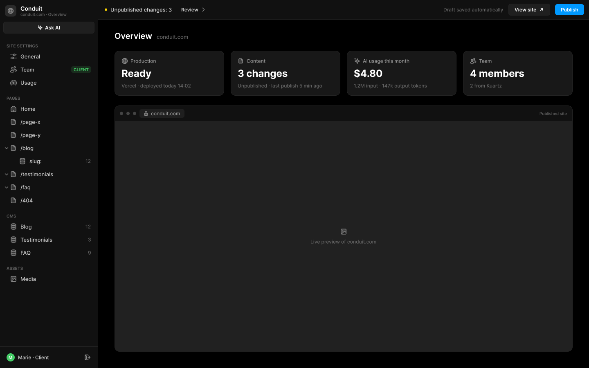
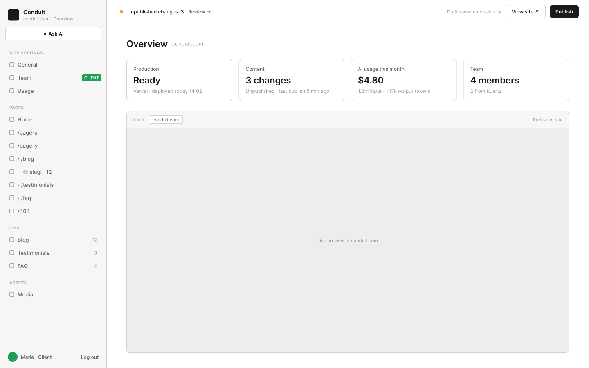

# B1 · Overview

Extraction Figma du fichier « Kuartz — Carte système » (fileKey `wvr98llwHnMufQ88qUp4Ih`). Notation des arbres et conventions : voir [../README.md](../README.md).

| Champ | Valeur |
|---|---|
| Route | `/admin` |
| Accès | Kuartz et client admin (barre d’accès : « KUARTZ » + « CLIENT ADMIN ») · « Accès : Kuartz et client » |
| Seul Kuartz voit | rien de spécifique à cet écran (à l’inverse, la carte « Team » n’est pas cliquable pour Kuartz : « pour Kuartz, la carte n’est pas cliquable » ; l’entrée de menu « Team » porte le tag « CLIENT ») |
| Wireframe | `213:136` · caption `213:133` · accès `226:1298` |
| LLM context | `503:1798` |
| UI | `359:696` · caption `359:691` · accès `359:816` |
| Captures | [UI](./B1.ui.png) · [Wireframe](./B1.wf.png) |

Voir aussi : [G4](../states/G4.md) — « ✦ Ask AI : questions seulement → G4 ».





## Caption et barre d’accès

- Caption wireframe (`213:133`) : B1 · Overview · [wf/Tag kind=vercel: "▲ Vercel · deployment"] · [wf/Tag kind=sanity: "Sanity · last publish"]
- Barre d’accès wireframe (`226:1298`, 1440px) : "KUARTZ" 718px fill=#1f70eb | "CLIENT ADMIN" 718px fill=#1f9e57
- Caption UI (`359:691`) : B1 · Overview · [Tag Icon=Icon/close, Show icon=false, Show dot=false, tone=neutral: "▲ Vercel · deployment"] · [Tag Icon=Icon/close, Show icon=false, Show dot=false, tone=neutral: "Sanity · last publish"]
- Barre d’accès UI (`359:816`, 1440px) : "KUARTZ" 718px fill=#1f70eb | "CLIENT ADMIN" 718px fill=#1f9e57

## LLM context

Bloc Figma `503:1798` (page Wireframe), texte verbatim.

> LLM CONTEXT
>
> B1 · Overview
>
> Page d’arrivée de l’admin
>
> Route : /admin · Accès : Kuartz et client

<!-- col 1 -->

### EN BREF

L’état du site en un coup d’œil : production, contenus en attente, consommation IA du mois, équipe, et le site publié.

### DONNÉES

• Production : dernier déploiement de production Vercel (API Vercel) : état (Ready, Building, Error) et heure (« Vercel · deployed today 14:02 »).
• Content : nombre de changements en attente (brouillons Sanity + modifications validées de l’éditeur IA non publiées) et heure de la dernière publication (« Unpublished · last publish 5 min ago »).
• AI usage this month : coût et tokens du mois (« $4.80 · 1.2M input · 147k output tokens ») ; même source que B5.
• Team : nombre de membres du projet Sanity, dont les membres Kuartz (« 4 members · 2 from Kuartz »).
• Aperçu : le site public (URL de production) dans un cadre de navigateur, en lecture seule.

### COMPOSANTS

Sidebar, Top bar, Page header (« Overview » + domaine), Stat card × 4, aperçu navigateur (barre d’adresse + iframe, libellé « Published site »).

<!-- col 2 -->

### COMPORTEMENT

• Clic sur une carte (proposé) : Production → E2 Versions ; Content → E1 Publish ; AI usage → B5 Usage ; Team → B4 Team (client) — pour Kuartz, la carte n’est pas cliquable.
• L’aperçu charge conduit.com ; « View site ↗ » (Top bar) ouvre le même site dans un nouvel onglet.
• Données rafraîchies à l’ouverture de l’écran et après une publication.

### ÉTATS ET CAS LIMITES

• Déploiement en cours : Production « Building… ». Échec : « Error », la version précédente reste en ligne (lien vers E2).
• Rien en attente : Content « Up to date » et Top bar « Everything is published. ».
• Aucune demande IA ce mois-ci : « $0.00 · 0 input · 0 output tokens ».
• Site qui refuse l’affichage en iframe (en-têtes) : message « Preview unavailable » + lien (proposé).

### HORS PÉRIMÈTRE

Pas d’analytics de trafic ni d’alertes sur cet écran.

## Wireframe

Écran wireframe `213:136` — textes et annotations dans l’ordre de lecture (▸ = conteneur, [Composant {propriétés}], « (libre) » = conteneur sans auto-layout, enfants triés haut→bas puis gauche→droite).

- ▸ B1 · Overview
  - [wf/Sidebar · Projet {role=Client admin}]
    - "Conduit"
    - "conduit.com · Overview"
    - [wf/Button {Label="✦ Ask AI", variant=secondary}]
    - "SITE SETTINGS"
    - [wf/Nav item {Show icon=true, Count="12", Show count=false, Label="General", state=default}]
    - [wf/Nav item {Show icon=true, Count="12", Show count=false, Label="Team", state=default}]
    - [wf/Tag ]
      - "CLIENT"
    - [wf/Nav item {Show icon=true, Count="12", Show count=false, Label="Usage", state=default}]
    - "PAGES"
    - [wf/Nav item {Show icon=true, Count="12", Show count=false, Label="Home", state=default}]
    - [wf/Nav item {Show icon=true, Count="12", Show count=false, Label="/page-x", state=default}]
    - [wf/Nav item {Show icon=true, Count="12", Show count=false, Label="/page-y", state=default}]
    - [wf/Nav item {Show icon=true, Count="12", Show count=false, Label="▾ /blog", state=default}]
    - [wf/Nav item {Show icon=true, Count="12", Show count=false, Label="    ⛁ slug:   12", state=default}]
    - [wf/Nav item {Show icon=true, Count="12", Show count=false, Label="▸ /testimonials", state=default}]
    - [wf/Nav item {Show icon=true, Count="12", Show count=false, Label="▸ /faq", state=default}]
    - [wf/Nav item {Show icon=true, Count="12", Show count=false, Label="/404", state=default}]
    - "CMS"
    - [wf/Nav item {Show icon=true, Count="12", Show count=true, Label="Blog", state=default}]
    - [wf/Nav item {Show icon=true, Count="3", Show count=true, Label="Testimonials", state=default}]
    - [wf/Nav item {Show icon=true, Count="9", Show count=true, Label="FAQ", state=default}]
    - "ASSETS"
    - [wf/Nav item {Show icon=true, Count="12", Show count=false, Label="Media", state=default}]
    - "Marie · Client"
    - "Log out"
  - ▸ main
    - [wf/Top bar {Status="Unpublished changes: 3"}]
      - "Review →"
      - "Draft saved automatically"
      - [wf/Button {Label="View site ↗", variant=secondary}]
      - [wf/Button {Label="Publish", variant=primary}]
    - ▸ content
      - ▸ header
        - "Overview"
        - "conduit.com"
      - ▸ stats
        - ▸ stat · Production
          - "Production"
          - "Ready"
          - "Vercel · deployed today 14:02"
        - ▸ stat · Content
          - "Content"
          - "3 changes"
          - "Unpublished · last publish 5 min ago"
        - ▸ stat · AI usage this month
          - "AI usage this month"
          - "$4.80"
          - "1.2M input · 147k output tokens"
        - ▸ stat · Team
          - "Team"
          - "4 members"
          - "2 from Kuartz"
      - ▸ browser · published site
        - ▸ chrome
          - "● ● ●"
          - ▸ url
            - "conduit.com"
          - "Published site"
        - [wf/Image {Label="Live preview of conduit.com"}]

## UI — arbre

Écran UI `359:696` (page UI). Légende : `AL H|V` auto-layout, `gap`, `pad` (1 valeur, [vertical, horizontal] ou [haut, droite, bas, gauche]), `align=principal/secondaire`, `size=largeur/hauteur` (fixed|hug|fill), `@x,y` position libre, `abs@x,y` position absolue dans un auto-layout, `fill/stroke/radius` = variable liée (valeur brute en hex/px si aucune variable), `effect` = style d’effet, `TEXT … · <style de texte> · <couleur>` puis `:: "texte"`, `INST "calque" → Composant {propriétés}` ; sous une instance : `T "texte"` = texte interne non déjà donné par une propriété.

```text
FRAME "B1 · Overview" 1440×900 · AL H gap=0 align=MIN/MIN · fill=bg/app
  INST "Sidebar" 240×900 → Sidebar {role=client} · AL V gap=0 align=MIN/MIN · size=fixed/fill · fill=bg/primary · stroke=border/subtle sides[T0 R1 B0 L0]
    INST "icon" 16×16 → Icon/globe {size=18}
    T "Conduit"
    T "conduit.com · Overview"
    INST "ask-ai" 223×29 → Button {Icon left=Icon/ai, Show icon left=true, Icon right=Icon/chevron-down, Show icon right=false, Label="Ask AI", variant=secondary, state=default, size=small}
    INST "section/SITE SETTINGS" 223×32 → Nav section {Show action=false, Label="SITE SETTINGS"}
    INST "nav/General" 223×32 → Nav item {Show tag=false, Show count=false, Count="12", Show chevron=false, Icon=Icon/sliders, Show icon=true, Label="General", state=default}
    INST "nav/Team" 223×32 → Nav item {Show tag=true, Show count=false, Count="12", Show chevron=false, Icon=Icon/team, Show icon=true, Label="Team", state=default}
      INST "tag" 49×16 → Tag {Icon=Icon/close, Show icon=false, Show dot=false, Label="CLIENT", tone=success}
    INST "nav/Usage" 223×32 → Nav item {Show tag=false, Show count=false, Count="12", Show chevron=false, Icon=Icon/usage, Show icon=true, Label="Usage", state=default}
    INST "section/PAGES" 223×32 → Nav section {Show action=false, Label="PAGES"}
    INST "nav/Home" 223×32 → Nav item {Show tag=false, Show count=false, Count="12", Show chevron=false, Icon=Icon/house, Show icon=true, Label="Home", state=default}
    INST "nav//page-x" 223×32 → Nav item {Show tag=false, Show count=false, Count="12", Show chevron=false, Icon=Icon/page, Show icon=true, Label="/page-x", state=default}
    INST "nav//page-y" 223×32 → Nav item {Show tag=false, Show count=false, Count="12", Show chevron=false, Icon=Icon/page, Show icon=true, Label="/page-y", state=default}
    INST "nav//blog" 223×32 → Nav item {Show tag=false, Show count=false, Count="12", Show chevron=true, Icon=Icon/page, Show icon=true, Label="/blog", state=default}
      INST "chevron" 10×10 → Icon/chevron-down {size=12}
    INST "nav//blog/:slug" 223×32 → Nav item {Show tag=false, Show count=true, Count="12", Show chevron=false, Icon=Icon/database, Show icon=true, Label="slug:", state=default}
    INST "nav//testimonials" 223×32 → Nav item {Show tag=false, Show count=false, Count="12", Show chevron=true, Icon=Icon/page, Show icon=true, Label="/testimonials", state=default}
      INST "chevron" 10×10 → Icon/chevron-down {size=12}
    INST "nav//faq" 223×32 → Nav item {Show tag=false, Show count=false, Count="12", Show chevron=true, Icon=Icon/page, Show icon=true, Label="/faq", state=default}
      INST "chevron" 10×10 → Icon/chevron-down {size=12}
    INST "nav//404" 223×32 → Nav item {Show tag=false, Show count=false, Count="12", Show chevron=false, Icon=Icon/page, Show icon=true, Label="/404", state=default}
    INST "section/CMS" 223×32 → Nav section {Show action=false, Label="CMS"}
    INST "nav/Blog" 223×32 → Nav item {Show tag=false, Show count=true, Count="12", Show chevron=false, Icon=Icon/database, Show icon=true, Label="Blog", state=default}
    INST "nav/Testimonials" 223×32 → Nav item {Show tag=false, Show count=true, Count="3", Show chevron=false, Icon=Icon/database, Show icon=true, Label="Testimonials", state=default}
    INST "nav/FAQ" 223×32 → Nav item {Show tag=false, Show count=true, Count="9", Show chevron=false, Icon=Icon/database, Show icon=true, Label="FAQ", state=default}
    INST "section/ASSETS" 223×32 → Nav section {Show action=false, Label="ASSETS"}
    INST "nav/Media" 223×32 → Nav item {Show tag=false, Show count=false, Count="12", Show chevron=false, Icon=Icon/image, Show icon=true, Label="Media", state=default}
    INST "avatar" 20×20 → Avatar {Initials="M", size=20, tone=green}
    T "Marie · Client"
    INST "logout" 28×28 → Icon button {Icon=Icon/logout, style=ghost, state=default, size=small}
  FRAME "main" 1200×900 · AL V gap=0 align=MIN/MIN · size=fill/fill
    INST "Top bar" 1200×48 → Top bar {state=pending} · AL H gap=space/12 pad=[0, space/12, 0, space/16] align=MIN/CENTER · size=fill/fixed · fill=bg/primary · stroke=border/subtle sides[T0 R0 B1 L0]
      T "Unpublished changes: 3"
      INST "review" 88×27 → Button {Icon left=Icon/plus, Show icon right=true, Icon right=Icon/chevron-right, Show icon left=false, Label="Review", variant=ghost, state=default, size=small}
      T "Draft saved automatically"
      INST "view-site" 102×29 → Button {Icon left=Icon/plus, Show icon left=false, Icon right=Icon/external, Show icon right=true, Label="View site", variant=secondary, state=default, size=small}
      INST "publish" 71×27 → Publish button {state=pending}
        INST "button" 71×27 → Button {Icon left=Icon/plus, Icon right=Icon/chevron-down, Show icon right=false, Show icon left=false, Label="Publish", variant=primary, state=default, size=small}
    FRAME "content" 1200×852 · AL V gap=space/24 pad=[28, space/40, space/40, space/40] align=MIN/MIN · size=fill/fill
      INST "Page header" 1120×24 → Page header {Show description=false, Description="Images, videos and files used on the site. A file that is in use cannot be deleted.", Show meta=true, Meta="conduit.com", Title="Overview"} · AL V gap=space/4 align=MIN/MIN · size=fill/hug
      FRAME "stats" 1120×110 · AL H gap=space/16 align=MIN/MIN · size=fill/hug
        INST "Stat card" 268×110 → Stat card {Icon=Icon/globe, Show hint=true, Show icon=true, Hint="Vercel · deployed today 14:02", Value="Ready", Label="Production"} · AL V gap=space/8 pad=space/16 align=MIN/MIN · size=fill/hug · fill=bg/elevated · stroke=border/default 1 · radius=radius/lg
        INST "Stat card" 268×110 → Stat card {Icon=Icon/page, Show hint=true, Show icon=true, Hint="Unpublished · last publish 5 min ago", Value="3 changes", Label="Content"} · AL V gap=space/8 pad=space/16 align=MIN/MIN · size=fill/hug · fill=bg/elevated · stroke=border/default 1 · radius=radius/lg
        INST "Stat card" 268×110 → Stat card {Icon=Icon/ai, Show hint=true, Show icon=true, Hint="1.2M input · 147k output tokens", Value="$4.80", Label="AI usage this month"} · AL V gap=space/8 pad=space/16 align=MIN/MIN · size=fill/hug · fill=bg/elevated · stroke=border/default 1 · radius=radius/lg
        INST "Stat card" 268×110 → Stat card {Icon=Icon/team, Show hint=true, Show icon=true, Hint="2 from Kuartz", Value="4 members", Label="Team"} · AL V gap=space/8 pad=space/16 align=MIN/MIN · size=fill/hug · fill=bg/elevated · stroke=border/default 1 · radius=radius/lg
      FRAME "site-preview" 1120×602 · AL V gap=0 align=MIN/MIN · size=fill/fill · fill=bg/elevated · stroke=border/default 1 · radius=radius/lg
        FRAME "browser-bar" 1118×38 · AL H gap=space/8 pad=[space/8, space/12] align=MIN/CENTER · size=fill/hug · fill=bg/primary · stroke=border/subtle sides[T0 R0 B1 L0]
          ELLIPSE "dot" 8×8 · size=fixed/fixed · fill=border/strong
          ELLIPSE "dot" 8×8 · size=fixed/fixed · fill=border/strong
          ELLIPSE "dot" 8×8 · size=fixed/fixed · fill=border/strong
          FRAME "url" 110×21 · AL H gap=space/6 pad=[3, space/10] align=MIN/CENTER · size=hug/hug · fill=bg/input · radius=radius/sm
            INST "icon" 12×12 → Icon/lock {size=18} · size=fixed/fixed
            TEXT "url" 72×15 · Body Small · text/tertiary · size=hug/hug :: "conduit.com"
          FRAME "spacer" 852×1 · AL H gap=0 align=MIN/CENTER · size=fill/fixed
          TEXT "label" 68×12 · Caption · text/muted · size=hug/hug :: "Published site"
        FRAME "preview" 1118×562 · AL V gap=space/8 align=CENTER/CENTER · size=fill/fill · fill=bg/subtle
          INST "icon" 18×18 → Icon/image {size=18} · size=fixed/fixed
          TEXT "hint" 162×15 · Body Small · text/muted · size=hug/hug :: "Live preview of conduit.com"
```
