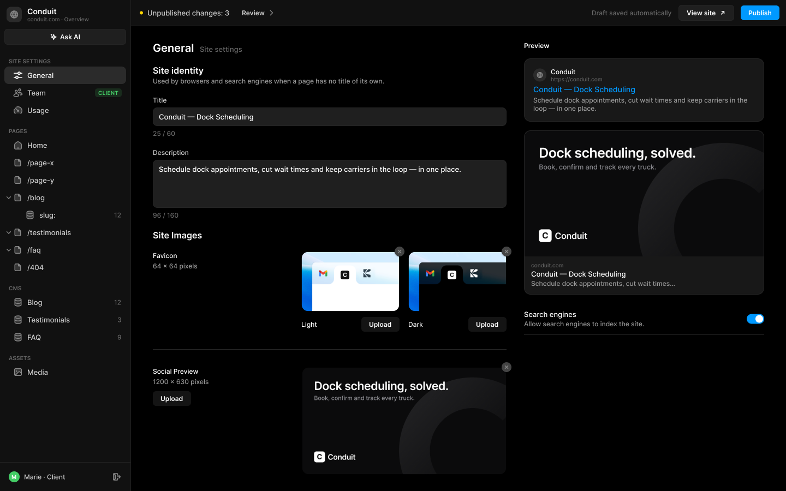
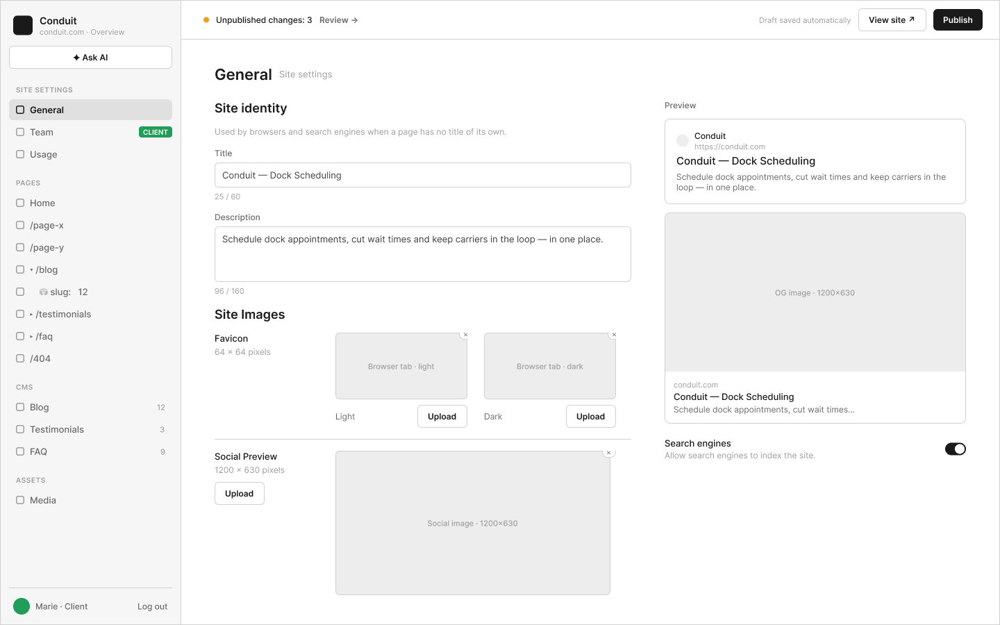

# B2 · Site Settings › General

Extraction Figma du fichier « Kuartz — Carte système » (fileKey `wvr98llwHnMufQ88qUp4Ih`). Notation des arbres et conventions : voir [../README.md](../README.md).

| Champ | Valeur |
|---|---|
| Route | `/admin/settings/general` |
| Accès | Kuartz et client admin (barre d’accès : « KUARTZ » + « CLIENT ADMIN ») · « Accès : Kuartz et client » |
| Seul Kuartz voit | rien de spécifique à cet écran |
| Wireframe | `213:240` · caption `213:237` · accès `226:1377` |
| LLM context | `503:1827` |
| UI | `359:717` · caption `359:713` · accès `359:821` |
| Captures | [UI](./B2.ui.png) · [Wireframe](./B2.wf.png) |





## Caption et barre d’accès

- Caption wireframe (`213:237`) : B2 · Site Settings › General · [wf/Tag kind=sanity: "Sanity · siteSettings"]
- Barre d’accès wireframe (`226:1377`, 1440px) : "KUARTZ" 718px fill=#1f70eb | "CLIENT ADMIN" 718px fill=#1f9e57
- Caption UI (`359:713`) : B2 · Site Settings › General · [Tag Icon=Icon/close, Show icon=false, Show dot=false, tone=neutral: "Sanity · siteSettings"]
- Barre d’accès UI (`359:821`, 1440px) : "KUARTZ" 718px fill=#1f70eb | "CLIENT ADMIN" 718px fill=#1f9e57

## LLM context

Bloc Figma `503:1827` (page Wireframe), texte verbatim.

> LLM CONTEXT
>
> B2 · General
>
> Site Settings › General
>
> Route : /admin/settings/general · Accès : Kuartz et client · Sanity : siteSettings

<!-- col 1 -->

### EN BREF

L’identité du site et ses valeurs par défaut : titre, description, favicons clair et sombre, image de partage, indexation.

### DONNÉES

siteSettings { title (≤ 60 car.), description (≤ 160 car.), faviconLight, faviconDark (64 × 64), socialImage (1200 × 630), allowIndexing (booléen) }. Lu par le site (métadonnées par défaut, <link rel="icon">, og:image).

### COMPOSANTS

Page header (« General » + « Site settings »), Input + compteur, Textarea + compteur, Favicon preview (light / dark), Image preview, Remove badge, Button Upload, Search preview (Google), Social preview, Setting row + Switch.

### COMPORTEMENT

• Site identity : « Used by browsers and search engines when a page has no title of its own. » Title (compteur 25 / 60) et Description (compteur 96 / 160). Ce sont les valeurs par défaut quand une page n’a pas les siennes (C2).
• Favicon (64 × 64 pixels) : deux aperçus, Light et Dark (un onglet de navigateur clair et un sombre), chacun avec Upload et une pastille × qui retire l’image.
• Social Preview (1200 × 630 pixels) : Upload, aperçu au bon ratio, pastille ×.
• Colonne de droite, mise à jour pendant la frappe : aperçu Google (favicon, nom du site, URL, titre, description) et carte réseaux sociaux (image, domaine, titre, description).
• Search engines : « Allow search engines to index the site. » Désactivé → noindex sur tout le site, prioritaire sur le réglage de chaque page.

<!-- col 2 -->

### ENREGISTREMENT

Chaque modification part en brouillon (Sanity) ; la Top bar passe à « Unpublished changes: N ». En ligne après Publish, sans build (le site relit les réglages, revalidation par webhook).

### ÉTATS ET CAS LIMITES

• Compteur au-delà de la limite : chiffre en orange, sans bloquer la saisie (proposé).
• Image au mauvais ratio : acceptée, avec un avertissement sous l’aperçu (proposé) ; formats : PNG, JPG, SVG, ICO pour les favicons.
• Favicon sombre absent : le clair sert partout.
• Upload : sélecteur de fichier ou choix dans la médiathèque (C5).

### VOIR AUSSI

C2 (SEO d’une page, qui prend ces valeurs par défaut), C5 (médiathèque).

## Wireframe

Écran wireframe `213:240` — textes et annotations dans l’ordre de lecture (▸ = conteneur, [Composant {propriétés}], « (libre) » = conteneur sans auto-layout, enfants triés haut→bas puis gauche→droite).

- ▸ B2 · General
  - [wf/Sidebar · Projet {role=Client admin}]
    - "Conduit"
    - "conduit.com · Overview"
    - [wf/Button {Label="✦ Ask AI", variant=secondary}]
    - "SITE SETTINGS"
    - [wf/Nav item {Show icon=true, Show count=false, Count="12", Label="General", state=active}]
    - [wf/Nav item {Show icon=true, Count="12", Show count=false, Label="Team", state=default}]
    - [wf/Tag ]
      - "CLIENT"
    - [wf/Nav item {Show icon=true, Count="12", Show count=false, Label="Usage", state=default}]
    - "PAGES"
    - [wf/Nav item {Show icon=true, Count="12", Show count=false, Label="Home", state=default}]
    - [wf/Nav item {Show icon=true, Count="12", Show count=false, Label="/page-x", state=default}]
    - [wf/Nav item {Show icon=true, Count="12", Show count=false, Label="/page-y", state=default}]
    - [wf/Nav item {Show icon=true, Count="12", Show count=false, Label="▾ /blog", state=default}]
    - [wf/Nav item {Show icon=true, Count="12", Show count=false, Label="    ⛁ slug:   12", state=default}]
    - [wf/Nav item {Show icon=true, Count="12", Show count=false, Label="▸ /testimonials", state=default}]
    - [wf/Nav item {Show icon=true, Count="12", Show count=false, Label="▸ /faq", state=default}]
    - [wf/Nav item {Show icon=true, Count="12", Show count=false, Label="/404", state=default}]
    - "CMS"
    - [wf/Nav item {Show icon=true, Count="12", Show count=true, Label="Blog", state=default}]
    - [wf/Nav item {Show icon=true, Count="3", Show count=true, Label="Testimonials", state=default}]
    - [wf/Nav item {Show icon=true, Count="9", Show count=true, Label="FAQ", state=default}]
    - "ASSETS"
    - [wf/Nav item {Show icon=true, Count="12", Show count=false, Label="Media", state=default}]
    - "Marie · Client"
    - "Log out"
  - ▸ main
    - [wf/Top bar {Status="Unpublished changes: 3"}]
      - "Review →"
      - "Draft saved automatically"
      - [wf/Button {Label="View site ↗", variant=secondary}]
      - [wf/Button {Label="Publish", variant=primary}]
    - ▸ content
      - ▸ header
        - "General"
        - "Site settings"
      - ▸ cols
        - ▸ left
          - "Site identity"
          - "Used by browsers and search engines when a page has no title of its own." (helper)
          - ▸ group · Title
            - [wf/Field {Value="Conduit — Dock Scheduling", Show label=true, Label="Title", type=text}] «field/Title»
            - "25 / 60" (counter)
          - ▸ group · Description
            - [wf/Field {Show label=true, Value="Schedule dock appointments, cut wait times and keep carriers in the loop — in one place.", Label="Description", type=textarea}] «field/Description»
            - "96 / 160" (counter)
          - "Site Images"
          - ▸ row · Favicon
            - ▸ label
              - "Favicon"
              - "64 × 64 pixels"
            - ▸ favicon · Light
              - ▸ preview (× remove) (libre)
                - ▸ remove ×
                  - "×"
                - [wf/Image {Label="Browser tab · light"}]
              - ▸ actions
                - "Light"
                - [wf/Button {Label="Upload", variant=secondary}] «btn/Upload»
            - ▸ favicon · Dark
              - ▸ preview (× remove) (libre)
                - ▸ remove ×
                  - "×"
                - [wf/Image {Label="Browser tab · dark"}]
              - ▸ actions
                - "Dark"
                - [wf/Button {Label="Upload", variant=secondary}] «btn/Upload»
          - ▸ row · Social Preview
            - ▸ label
              - "Social Preview"
              - "1200 × 630 pixels"
              - ▸ upload
                - [wf/Button {Label="Upload", variant=secondary}] «btn/Upload»
            - ▸ preview (× remove) (libre)
              - ▸ remove ×
                - "×"
              - [wf/Image {Label="Social image · 1200×630"}]
        - ▸ right
          - "Preview"
          - ▸ google-preview
            - ▸ site
              - ▸ site-name
                - "Conduit"
                - "https://conduit.com"
            - "Conduit — Dock Scheduling"
            - "Schedule dock appointments, cut wait times and keep carriers in the loop — in one place."
          - ▸ social-card
            - [wf/Image {Label="OG image · 1200×630"}]
            - ▸ text
              - "conduit.com"
              - "Conduit — Dock Scheduling"
              - "Schedule dock appointments, cut wait times…"
          - ▸ row · Search engines
            - ▸ text
              - "Search engines"
              - "Allow search engines to index the site."

## UI — arbre

Écran UI `359:717` (page UI). Légende : `AL H|V` auto-layout, `gap`, `pad` (1 valeur, [vertical, horizontal] ou [haut, droite, bas, gauche]), `align=principal/secondaire`, `size=largeur/hauteur` (fixed|hug|fill), `@x,y` position libre, `abs@x,y` position absolue dans un auto-layout, `fill/stroke/radius` = variable liée (valeur brute en hex/px si aucune variable), `effect` = style d’effet, `TEXT … · <style de texte> · <couleur>` puis `:: "texte"`, `INST "calque" → Composant {propriétés}` ; sous une instance : `T "texte"` = texte interne non déjà donné par une propriété.

```text
FRAME "B2 · General" 1440×900 · AL H gap=0 align=MIN/MIN · fill=bg/app
  INST "Sidebar" 240×900 → Sidebar {role=client} · AL V gap=0 align=MIN/MIN · size=fixed/fill · fill=bg/primary · stroke=border/subtle sides[T0 R1 B0 L0]
    INST "icon" 16×16 → Icon/globe {size=18}
    T "Conduit"
    T "conduit.com · Overview"
    INST "ask-ai" 223×29 → Button {Icon left=Icon/ai, Show icon left=true, Icon right=Icon/chevron-down, Show icon right=false, Label="Ask AI", variant=secondary, state=default, size=small}
    INST "section/SITE SETTINGS" 223×32 → Nav section {Show action=false, Label="SITE SETTINGS"}
    INST "nav/General" 223×32 → Nav item {Show tag=false, Show chevron=false, Show count=false, Label="General", Icon=Icon/sliders, Count="12", Show icon=true, state=active}
    INST "nav/Team" 223×32 → Nav item {Show tag=true, Show count=false, Count="12", Show chevron=false, Icon=Icon/team, Show icon=true, Label="Team", state=default}
      INST "tag" 49×16 → Tag {Icon=Icon/close, Show icon=false, Show dot=false, Label="CLIENT", tone=success}
    INST "nav/Usage" 223×32 → Nav item {Show tag=false, Show count=false, Count="12", Show chevron=false, Icon=Icon/usage, Show icon=true, Label="Usage", state=default}
    INST "section/PAGES" 223×32 → Nav section {Show action=false, Label="PAGES"}
    INST "nav/Home" 223×32 → Nav item {Show tag=false, Show count=false, Count="12", Show chevron=false, Icon=Icon/house, Show icon=true, Label="Home", state=default}
    INST "nav//page-x" 223×32 → Nav item {Show tag=false, Show count=false, Count="12", Show chevron=false, Icon=Icon/page, Show icon=true, Label="/page-x", state=default}
    INST "nav//page-y" 223×32 → Nav item {Show tag=false, Show count=false, Count="12", Show chevron=false, Icon=Icon/page, Show icon=true, Label="/page-y", state=default}
    INST "nav//blog" 223×32 → Nav item {Show tag=false, Show count=false, Count="12", Show chevron=true, Icon=Icon/page, Show icon=true, Label="/blog", state=default}
      INST "chevron" 10×10 → Icon/chevron-down {size=12}
    INST "nav//blog/:slug" 223×32 → Nav item {Show tag=false, Show count=true, Count="12", Show chevron=false, Icon=Icon/database, Show icon=true, Label="slug:", state=default}
    INST "nav//testimonials" 223×32 → Nav item {Show tag=false, Show count=false, Count="12", Show chevron=true, Icon=Icon/page, Show icon=true, Label="/testimonials", state=default}
      INST "chevron" 10×10 → Icon/chevron-down {size=12}
    INST "nav//faq" 223×32 → Nav item {Show tag=false, Show count=false, Count="12", Show chevron=true, Icon=Icon/page, Show icon=true, Label="/faq", state=default}
      INST "chevron" 10×10 → Icon/chevron-down {size=12}
    INST "nav//404" 223×32 → Nav item {Show tag=false, Show count=false, Count="12", Show chevron=false, Icon=Icon/page, Show icon=true, Label="/404", state=default}
    INST "section/CMS" 223×32 → Nav section {Show action=false, Label="CMS"}
    INST "nav/Blog" 223×32 → Nav item {Show tag=false, Show count=true, Count="12", Show chevron=false, Icon=Icon/database, Show icon=true, Label="Blog", state=default}
    INST "nav/Testimonials" 223×32 → Nav item {Show tag=false, Show count=true, Count="3", Show chevron=false, Icon=Icon/database, Show icon=true, Label="Testimonials", state=default}
    INST "nav/FAQ" 223×32 → Nav item {Show tag=false, Show count=true, Count="9", Show chevron=false, Icon=Icon/database, Show icon=true, Label="FAQ", state=default}
    INST "section/ASSETS" 223×32 → Nav section {Show action=false, Label="ASSETS"}
    INST "nav/Media" 223×32 → Nav item {Show tag=false, Show count=false, Count="12", Show chevron=false, Icon=Icon/image, Show icon=true, Label="Media", state=default}
    INST "avatar" 20×20 → Avatar {Initials="M", size=20, tone=green}
    T "Marie · Client"
    INST "logout" 28×28 → Icon button {Icon=Icon/logout, style=ghost, state=default, size=small}
  FRAME "main" 1200×900 · AL V gap=0 align=MIN/MIN · size=fill/fill
    INST "Top bar" 1200×48 → Top bar {state=pending} · AL H gap=space/12 pad=[0, space/12, 0, space/16] align=MIN/CENTER · size=fill/fixed · fill=bg/primary · stroke=border/subtle sides[T0 R0 B1 L0]
      T "Unpublished changes: 3"
      INST "review" 88×27 → Button {Icon left=Icon/plus, Show icon right=true, Icon right=Icon/chevron-right, Show icon left=false, Label="Review", variant=ghost, state=default, size=small}
      T "Draft saved automatically"
      INST "view-site" 102×29 → Button {Icon left=Icon/plus, Show icon left=false, Icon right=Icon/external, Show icon right=true, Label="View site", variant=secondary, state=default, size=small}
      INST "publish" 71×27 → Publish button {state=pending}
        INST "button" 71×27 → Button {Icon left=Icon/plus, Icon right=Icon/chevron-down, Show icon right=false, Show icon left=false, Label="Publish", variant=primary, state=default, size=small}
    FRAME "content" 1200×852 · AL H gap=space/32 pad=[28, space/40, space/40, space/40] align=MIN/MIN · size=fill/fill
      FRAME "form" 648×794 · AL V gap=space/20 align=MIN/MIN · size=fill/hug
        INST "Page header" 648×24 → Page header {Show description=false, Description="Images, videos and files used on the site. A file that is in use cannot be deleted.", Show meta=true, Meta="Site settings", Title="General"} · AL V gap=space/4 align=MIN/MIN · size=fill/hug
        INST "Section header" 648×36 → Section header {Show action=false, Show description=true, Description="Used by browsers and search engines when a page has no title of its own.", Title="Site identity"} · AL H gap=space/16 align=MIN/MIN · size=fill/hug
        INST "Input" 648×76 → Input {Placeholder="Placeholder", Show icon=false, Helper="25 / 60", Show helper=true, Show label=true, Icon=Icon/search, Value="Conduit — Dock Scheduling", Label="Title", state=filled, layout=stacked} · AL V gap=space/6 align=MIN/MIN · size=fill/hug
        INST "Textarea" 648×130 → Textarea {Placeholder="Describe this page in one or two sentences…", Value="Schedule dock appointments, cut wait times and keep carriers in the loop — in one place.", Helper="96 / 160", Label="Description", Show label=true, Show helper=true, state=filled, layout=stacked} · AL V gap=space/6 align=MIN/MIN · size=fill/hug
        INST "Section header" 648×19 → Section header {Show action=false, Show description=false, Description="Favicon for light and dark browser themes, and the default image shared on social networks.", Title="Site Images"} · AL H gap=space/16 align=MIN/MIN · size=fill/hug
        FRAME "site-images" 648×409 · AL V gap=space/32 align=MIN/MIN · size=fill/hug
          FRAME "favicon-row" 648×147 · AL H gap=space/16 align=MIN/MIN · size=fill/hug
            FRAME "meta" 256×34 · AL V gap=space/10 align=MIN/MIN · size=fill/hug
              FRAME "labels" 256×34 · AL V gap=space/4 align=MIN/MIN · size=fill/hug
                TEXT "label" 45×15 · Body Small · text/primary · size=hug/hug :: "Favicon"
                TEXT "dimensions" 82×15 · Body Small · text/tertiary · size=hug/hug :: "64 × 64 pixels"
            FRAME "favicon-previews" 376×147 · AL H gap=space/16 align=MIN/MIN · size=hug/hug
              INST "favicon-light" 180×147 → Favicon preview {Show remove=true, theme=light} · AL V gap=space/10 align=MIN/MIN · size=fixed/hug
                INST "remove" 18×18 → Remove badge
                T "Light"
                INST "upload" 70×27 → Button {Icon left=Icon/plus, Show icon right=false, Icon right=Icon/chevron-down, Show icon left=false, Label="Upload", variant=subtle, state=default, size=small}
              INST "favicon-dark" 180×147 → Favicon preview {Show remove=true, theme=dark} · AL V gap=space/10 align=MIN/MIN · size=fixed/hug
                INST "remove" 18×18 → Remove badge
                T "Dark"
                INST "upload" 70×27 → Button {Icon left=Icon/plus, Show icon right=false, Icon right=Icon/chevron-down, Show icon left=false, Label="Upload", variant=subtle, state=default, size=small}
          FRAME "divider" 648×1 · size=fill/fixed · fill=border/default
          FRAME "social-preview-row" 648×197 · AL H gap=space/16 align=MIN/MIN · size=fill/hug
            FRAME "meta" 257×71 · AL V gap=space/10 align=MIN/MIN · size=fill/hug
              FRAME "labels" 257×34 · AL V gap=space/4 align=MIN/MIN · size=fill/hug
                TEXT "label" 84×15 · Body Small · text/primary · size=hug/hug :: "Social Preview"
                TEXT "dimensions" 103×15 · Body Small · text/tertiary · size=hug/hug :: "1200 × 630 pixels"
              INST "upload" 70×27 → Button {Icon left=Icon/plus, Show icon right=false, Icon right=Icon/chevron-down, Show icon left=false, Label="Upload", variant=subtle, state=default, size=small} · AL H gap=space/6 pad=[space/6, 14] align=CENTER/CENTER · size=hug/hug · fill=bg/tint/neutral@8% · radius=6
            INST "social-image" 375×197 → Image preview {state=filled} · size=fixed/fixed
              INST "remove" 18×18 → Remove badge
      FRAME "previews" 440×538 · AL V gap=space/16 align=MIN/MIN · size=fixed/hug
        TEXT "title" 47×15 · Label · text/primary · size=hug/hug :: "Preview"
        INST "Search preview" 440×116 → Search preview {Description="Schedule dock appointments, cut wait times and keep carriers in the loop — in one place.", Title="Conduit — Dock Scheduling", URL="https://conduit.com", Site name="Conduit"} · AL V gap=space/4 pad=space/16 align=MIN/MIN · size=fill/hug · fill=bg/elevated · stroke=border/default 1 · radius=radius/lg
          INST "icon" 12×12 → Icon/globe {size=12}
        INST "Social preview" 440×301 → Social preview {Description="Schedule dock appointments, cut wait times…", Title="Conduit — Dock Scheduling", Domain="conduit.com"} · AL V gap=0 align=MIN/MIN · size=fill/hug · fill=bg/elevated · stroke=border/default 1 · radius=radius/lg
        INST "Setting row" 440×58 → Setting row {Show description=true, Description="Allow search engines to index the site.", Title="Search engines"} · AL H gap=space/24 pad=[space/12, 0] align=MIN/CENTER · size=fill/hug · stroke=border/subtle sides[T0 R0 B1 L0]
          INST "switch" 32×18 → Switch {Show label=false, Label="Switch label", state=on}
```
