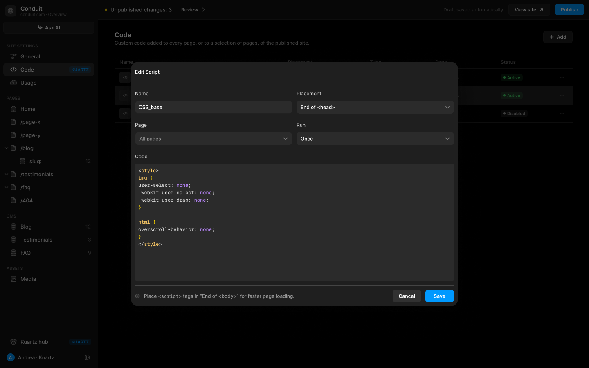
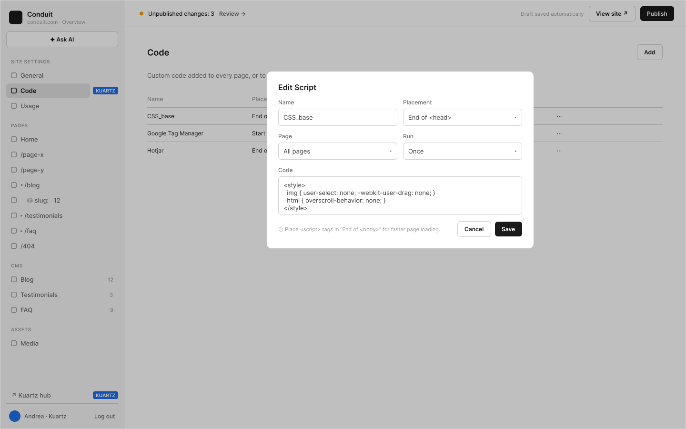

# B3 · Site Settings › Code

Extraction Figma du fichier « Kuartz — Carte système » (fileKey `wvr98llwHnMufQ88qUp4Ih`). Notation des arbres et conventions : voir [../README.md](../README.md).

| Champ | Valeur |
|---|---|
| Route | `/admin/settings/code` |
| Accès | Kuartz seulement (barre d’accès : « KUARTZ » sur toute la largeur) · « Accès : Kuartz seulement (proposé) » ; question ouverte « Question 5 : le client admin a-t-il accès à Code ? » |
| Seul Kuartz voit | tout l’écran : l’entrée de menu « Code » (tag « KUARTZ ») et la gestion des scripts (« réservé à Kuartz (rôle Developer), vérifié côté serveur ») ; dans la sidebar Kuartz, l’entrée « ↗ Kuartz hub » (tag « KUARTZ ») |
| Wireframe | `213:368` · caption `213:365` · accès `226:1456` |
| LLM context | `503:1859` |
| UI | `359:745` · caption `359:741` · accès `359:826` |
| Captures | [UI](./B3.ui.png) · [Wireframe](./B3.wf.png) |

Voir aussi : [G6](../states/G6.md) — « Scripts : Run, Page, champs CMS → G6 ».





## Caption et barre d’accès

- Caption wireframe (`213:365`) : B3 · Site Settings › Code · [wf/Tag kind=sanity: "Sanity · siteSettings.scripts"]
- Barre d’accès wireframe (`226:1456`, 1440px) : "KUARTZ" 1440px fill=#1f70eb
- Caption UI (`359:741`) : B3 · Site Settings › Code · [Tag Icon=Icon/close, Show icon=false, Show dot=false, tone=neutral: "Sanity · siteSettings.scripts"]
- Barre d’accès UI (`359:826`, 1440px) : "KUARTZ" 1440px fill=#1f70eb

## LLM context

Bloc Figma `503:1859` (page Wireframe), texte verbatim.

> LLM CONTEXT
>
> B3 · Code
>
> Site Settings › Code — scripts du site
>
> Route : /admin/settings/code · Accès : Kuartz seulement (proposé) · Sanity : siteSettings.scripts[]

<!-- col 1 -->

### EN BREF

Du code ajouté au site publié (CSS ou JavaScript : outils de suivi, styles, JSON-LD d’articles…), sur toutes les pages ou sur une page précise. Détail des menus et des champs CMS : G6.

### DONNÉES

siteSettings.scripts[] : { name, placement (Start of <body> · End of <head> · End of <body>), page (all · une page · la page article d’une collection), run (once · everyPageVisit), code (texte), enabled (booléen) }. L’ordre du tableau = l’ordre d’injection pour un même emplacement.

### COMPOSANTS

Page header (« Code » + sous-titre, Button « + Add »), Table cell, Tag de statut, Menu ⋯, Script dialog (modale).

### TABLEAU

• Colonnes : Name · Placement · Type (CSS ou JavaScript, déduit du code : <style> ou <script>) · Page (« All pages », « /demo »…) · Status (Active / Disabled) · ⋯.
• Menu ⋯ (proposé) : Edit, Disable / Enable, Move up, Move down, Delete (avec confirmation).
• Clic sur une ligne = Edit.

<!-- col 2 -->

### MODALE « EDIT SCRIPT » / « NEW SCRIPT »

• Name, Placement, Page, Run (Once / On every page visit), Code (éditeur coloré, police mono).
• Pied : « Place <script> tags in “End of <body>” for faster page loading. », Cancel, Save.
• Page = page article CMS (ex. /blog/:slug, « slug: ») : « Insert field » ou la frappe de {{ insère un champ de l’article dans le code (ex. JSON-LD BlogPosting avec {{title}}, {{excerpt}}, {{cover}}, {{date}}, {{author}}).
• Save écrit dans le brouillon ; le script est en ligne après Publish, sans build.

### CÔTÉ SITE (INTÉGRATION)

• Le layout lit siteSettings.scripts et injecte chaque script actif à son emplacement, sur les pages ciblées.
• Once : exécuté une fois, au premier chargement du site. On every page visit : exécuté à chaque page vue, navigation interne comprise (changement de route côté client).
• Page article : les {{champ}} sont remplacés par les valeurs de l’article, échappées pour le contexte (JSON, HTML).
• Jamais chargé dans /admin ni en Draft Mode (aperçus, éditeur IA).

### RÈGLES ET SÉCURITÉ

• Un script, c’est du code exécuté sur tout le site : réservé à Kuartz (rôle Developer), vérifié côté serveur.
• Pas de validation du JavaScript ; avertissement si une balise <script> ou <style> n’est pas fermée (proposé).

### À TRANCHER

• Question 5 : le client admin a-t-il accès à Code ?
• Question 15 : /testimonials et /faq dans le menu Page ?

## Wireframe

Écran wireframe `213:368` — textes et annotations dans l’ordre de lecture (▸ = conteneur, [Composant {propriétés}], « (libre) » = conteneur sans auto-layout, enfants triés haut→bas puis gauche→droite).

- ▸ B3 · Code
  - [wf/Sidebar · Projet {role=Kuartz}]
    - "Conduit"
    - "conduit.com · Overview"
    - [wf/Button {Label="✦ Ask AI", variant=secondary}]
    - "SITE SETTINGS"
    - [wf/Nav item {Show icon=true, Count="12", Show count=false, Label="General", state=default}]
    - [wf/Nav item {Show icon=true, Show count=false, Count="12", Label="Code", state=active}]
    - [wf/Tag ]
      - "KUARTZ"
    - [wf/Nav item {Show icon=true, Count="12", Show count=false, Label="Usage", state=default}]
    - "PAGES"
    - [wf/Nav item {Show icon=true, Count="12", Show count=false, Label="Home", state=default}]
    - [wf/Nav item {Show icon=true, Count="12", Show count=false, Label="/page-x", state=default}]
    - [wf/Nav item {Show icon=true, Count="12", Show count=false, Label="/page-y", state=default}]
    - [wf/Nav item {Show icon=true, Count="12", Show count=false, Label="▾ /blog", state=default}]
    - [wf/Nav item {Show icon=true, Count="12", Show count=false, Label="    ⛁ slug:   12", state=default}]
    - [wf/Nav item {Show icon=true, Count="12", Show count=false, Label="▸ /testimonials", state=default}]
    - [wf/Nav item {Show icon=true, Count="12", Show count=false, Label="▸ /faq", state=default}]
    - [wf/Nav item {Show icon=true, Count="12", Show count=false, Label="/404", state=default}]
    - "CMS"
    - [wf/Nav item {Show icon=true, Count="12", Show count=true, Label="Blog", state=default}]
    - [wf/Nav item {Show icon=true, Count="3", Show count=true, Label="Testimonials", state=default}]
    - [wf/Nav item {Show icon=true, Count="9", Show count=true, Label="FAQ", state=default}]
    - "ASSETS"
    - [wf/Nav item {Show icon=true, Count="12", Show count=false, Label="Media", state=default}]
    - [wf/Nav item {Show icon=false, Count="12", Show count=false, Label="↗ Kuartz hub", state=default}]
    - [wf/Tag ]
      - "KUARTZ"
    - "Andrea · Kuartz"
    - "Log out"
  - ▸ main
    - [wf/Top bar {Status="Unpublished changes: 3"}]
      - "Review →"
      - "Draft saved automatically"
      - [wf/Button {Label="View site ↗", variant=secondary}]
      - [wf/Button {Label="Publish", variant=primary}]
    - ▸ content
      - ▸ Frame
        - "Code"
        - [wf/Button {Label="Add", variant=secondary}] «btn/Add»
      - "Custom code added to every page, or to a selection of pages, of the published site."
      - ▸ table
        - ▸ row
          - "Name"
          - "Placement"
          - "Type"
          - "Page"
          - "Status"
          - ""
        - ▸ row
          - "CSS_base"
          - "End of <head>"
          - "CSS"
          - "All pages"
          - "● Active"
          - "⋯"
        - ▸ row
          - "Google Tag Manager"
          - "Start of <body>"
          - "JavaScript"
          - "All pages"
          - "● Active"
          - "⋯"
        - ▸ row
          - "Hotjar"
          - "End of <body>"
          - "JavaScript"
          - "/demo"
          - "○ Disabled"
          - "⋯"
  - ▸ modal · Edit Script
    - "Edit Script"
    - ▸ Frame
      - [wf/Field {Value="CSS_base", Show label=true, Label="Name", type=text}] «field/Name»
      - [wf/Field {Show label=true, Value="End of <head>", Label="Placement", type=select}] «field/Location»
        - "▾"
    - ▸ Frame
      - [wf/Field {Show label=true, Value="All pages", Label="Page", type=select}] «field/Page»
        - "▾"
      - [wf/Field {Show label=true, Value="Once", Label="Run", type=select}] «field/Type»
        - "▾"
    - [wf/Field {Show label=true, Value="<style>\n  img { user-select: none; -webkit-user-drag: none; }\n  html { overscroll-behavior: none; }\n</style>", Label="Code", type=textarea}] «field/Code»
    - ▸ Frame
      - "ⓘ Place <script> tags in “End of <body>” for faster page loading." (hint)
      - [wf/Button {Label="Cancel", variant=secondary}] «btn/Cancel»
      - [wf/Button {Label="Save", variant=primary}] «btn/Save»

## UI — arbre

Écran UI `359:745` (page UI). Légende : `AL H|V` auto-layout, `gap`, `pad` (1 valeur, [vertical, horizontal] ou [haut, droite, bas, gauche]), `align=principal/secondaire`, `size=largeur/hauteur` (fixed|hug|fill), `@x,y` position libre, `abs@x,y` position absolue dans un auto-layout, `fill/stroke/radius` = variable liée (valeur brute en hex/px si aucune variable), `effect` = style d’effet, `TEXT … · <style de texte> · <couleur>` puis `:: "texte"`, `INST "calque" → Composant {propriétés}` ; sous une instance : `T "texte"` = texte interne non déjà donné par une propriété.

```text
FRAME "B3 · Code" 1440×900 · AL H gap=0 align=MIN/MIN · fill=bg/app
  INST "Sidebar" 240×900 → Sidebar {role=kuartz} · AL V gap=0 align=MIN/MIN · size=fixed/fill · fill=bg/primary · stroke=border/subtle sides[T0 R1 B0 L0]
    INST "icon" 16×16 → Icon/globe {size=18}
    T "Conduit"
    T "conduit.com · Overview"
    INST "ask-ai" 223×29 → Button {Icon left=Icon/ai, Show icon left=true, Icon right=Icon/chevron-down, Show icon right=false, Label="Ask AI", variant=secondary, state=default, size=small}
    INST "section/SITE SETTINGS" 223×32 → Nav section {Show action=false, Label="SITE SETTINGS"}
    INST "nav/General" 223×32 → Nav item {Show tag=false, Show count=false, Count="12", Show chevron=false, Icon=Icon/sliders, Show icon=true, Label="General", state=default}
    INST "nav/Code" 223×32 → Nav item {Show tag=true, Show chevron=false, Show count=false, Label="Code", Icon=Icon/code, Count="12", Show icon=true, state=active}
      INST "tag" 54×16 → Tag {Icon=Icon/close, Show icon=false, Show dot=false, Label="KUARTZ", tone=info}
    INST "nav/Usage" 223×32 → Nav item {Show tag=false, Show count=false, Count="12", Show chevron=false, Icon=Icon/usage, Show icon=true, Label="Usage", state=default}
    INST "section/PAGES" 223×32 → Nav section {Show action=false, Label="PAGES"}
    INST "nav/Home" 223×32 → Nav item {Show tag=false, Show count=false, Count="12", Show chevron=false, Icon=Icon/house, Show icon=true, Label="Home", state=default}
    INST "nav//page-x" 223×32 → Nav item {Show tag=false, Show count=false, Count="12", Show chevron=false, Icon=Icon/page, Show icon=true, Label="/page-x", state=default}
    INST "nav//page-y" 223×32 → Nav item {Show tag=false, Show count=false, Count="12", Show chevron=false, Icon=Icon/page, Show icon=true, Label="/page-y", state=default}
    INST "nav//blog" 223×32 → Nav item {Show tag=false, Show count=false, Count="12", Show chevron=true, Icon=Icon/page, Show icon=true, Label="/blog", state=default}
      INST "chevron" 10×10 → Icon/chevron-down {size=12}
    INST "nav//blog/:slug" 223×32 → Nav item {Show tag=false, Show count=true, Count="12", Show chevron=false, Icon=Icon/database, Show icon=true, Label="slug:", state=default}
    INST "nav//testimonials" 223×32 → Nav item {Show tag=false, Show count=false, Count="12", Show chevron=true, Icon=Icon/page, Show icon=true, Label="/testimonials", state=default}
      INST "chevron" 10×10 → Icon/chevron-down {size=12}
    INST "nav//faq" 223×32 → Nav item {Show tag=false, Show count=false, Count="12", Show chevron=true, Icon=Icon/page, Show icon=true, Label="/faq", state=default}
      INST "chevron" 10×10 → Icon/chevron-down {size=12}
    INST "nav//404" 223×32 → Nav item {Show tag=false, Show count=false, Count="12", Show chevron=false, Icon=Icon/page, Show icon=true, Label="/404", state=default}
    INST "section/CMS" 223×32 → Nav section {Show action=false, Label="CMS"}
    INST "nav/Blog" 223×32 → Nav item {Show tag=false, Show count=true, Count="12", Show chevron=false, Icon=Icon/database, Show icon=true, Label="Blog", state=default}
    INST "nav/Testimonials" 223×32 → Nav item {Show tag=false, Show count=true, Count="3", Show chevron=false, Icon=Icon/database, Show icon=true, Label="Testimonials", state=default}
    INST "nav/FAQ" 223×32 → Nav item {Show tag=false, Show count=true, Count="9", Show chevron=false, Icon=Icon/database, Show icon=true, Label="FAQ", state=default}
    INST "section/ASSETS" 223×32 → Nav section {Show action=false, Label="ASSETS"}
    INST "nav/Media" 223×32 → Nav item {Show tag=false, Show count=false, Count="12", Show chevron=false, Icon=Icon/image, Show icon=true, Label="Media", state=default}
    INST "nav/Kuartz hub" 223×32 → Nav item {Show tag=true, Show count=false, Count="12", Show chevron=false, Icon=Icon/hub, Show icon=true, Label="Kuartz hub", state=default}
      INST "tag" 54×16 → Tag {Icon=Icon/close, Show icon=false, Show dot=false, Label="KUARTZ", tone=info}
    INST "avatar" 20×20 → Avatar {Initials="A", size=20, tone=blue}
    T "Andrea · Kuartz"
    INST "logout" 28×28 → Icon button {Icon=Icon/logout, style=ghost, state=default, size=small}
  FRAME "main" 1200×900 · AL V gap=0 align=MIN/MIN · size=fill/fill
    INST "Top bar" 1200×48 → Top bar {state=pending} · AL H gap=space/12 pad=[0, space/12, 0, space/16] align=MIN/CENTER · size=fill/fixed · fill=bg/primary · stroke=border/subtle sides[T0 R0 B1 L0]
      T "Unpublished changes: 3"
      INST "review" 88×27 → Button {Icon left=Icon/plus, Show icon right=true, Icon right=Icon/chevron-right, Show icon left=false, Label="Review", variant=ghost, state=default, size=small}
      T "Draft saved automatically"
      INST "view-site" 102×29 → Button {Icon left=Icon/plus, Show icon left=false, Icon right=Icon/external, Show icon right=true, Label="View site", variant=secondary, state=default, size=small}
      INST "publish" 71×27 → Publish button {state=pending}
        INST "button" 71×27 → Button {Icon left=Icon/plus, Icon right=Icon/chevron-down, Show icon right=false, Show icon left=false, Label="Publish", variant=primary, state=default, size=small}
    FRAME "content" 1200×852 · AL V gap=space/24 pad=[28, space/40, space/40, space/40] align=MIN/MIN · size=fill/fill
      INST "Section header" 1120×36 → Section header {Show action=true, Show description=true, Description="Custom code added to every page, or to a selection of pages, of the published site.", Title="Code"} · AL H gap=space/16 align=MIN/MIN · size=fill/hug
        INST "action" 72×29 → Button {Icon left=Icon/plus, Show icon left=true, Icon right=Icon/chevron-down, Show icon right=false, Label="Add", variant=secondary, state=default, size=small}
      FRAME "scripts" 1120×164 · AL V gap=0 align=MIN/MIN · size=fill/hug
        FRAME "row/header" 1120×32 · AL H gap=0 align=MIN/CENTER · size=fill/hug
          INST "Table cell" 412×32 → Table cell {Show sort=false, Label="Name", type=header, state=default} · AL H gap=space/8 pad=[0, space/12] align=MIN/CENTER · size=fill/fixed · stroke=border/subtle sides[T0 R0 B1 L0]
          INST "Table cell" 200×32 → Table cell {Show sort=false, Label="Placement", type=header, state=default} · AL H gap=space/8 pad=[0, space/12] align=MIN/CENTER · size=fixed/fixed · stroke=border/subtle sides[T0 R0 B1 L0]
          INST "Table cell" 160×32 → Table cell {Show sort=false, Label="Type", type=header, state=default} · AL H gap=space/8 pad=[0, space/12] align=MIN/CENTER · size=fixed/fixed · stroke=border/subtle sides[T0 R0 B1 L0]
          INST "Table cell" 160×32 → Table cell {Show sort=false, Label="Page", type=header, state=default} · AL H gap=space/8 pad=[0, space/12] align=MIN/CENTER · size=fixed/fixed · stroke=border/subtle sides[T0 R0 B1 L0]
          INST "Table cell" 140×32 → Table cell {Show sort=false, Label="Status", type=header, state=default} · AL H gap=space/8 pad=[0, space/12] align=MIN/CENTER · size=fixed/fixed · stroke=border/subtle sides[T0 R0 B1 L0]
          INST "Table cell" 48×32 → Table cell {Show sort=false, Label=" ", type=header, state=default} · AL H gap=space/8 pad=[0, space/12] align=MIN/CENTER · size=fixed/fixed · stroke=border/subtle sides[T0 R0 B1 L0]
        FRAME "row/CSS_base" 1120×44 · AL H gap=0 align=MIN/CENTER · size=fill/hug
          INST "Table cell" 412×44 → Table cell {Show sort=false, Label="CSS_base", type=title, state=default} · AL H gap=space/8 pad=[0, space/12] align=MIN/CENTER · size=fill/fixed · stroke=border/subtle sides[T0 R0 B1 L0]
            INST "icon" 12×12 → Icon/code {size=12}
          INST "Table cell" 200×44 → Table cell {Show sort=false, Label="End of <head>", type=text, state=default} · AL H gap=space/8 pad=[0, space/12] align=MIN/CENTER · size=fixed/fixed · stroke=border/subtle sides[T0 R0 B1 L0]
          INST "Table cell" 160×44 → Table cell {Show sort=false, Label="CSS", type=text, state=default} · AL H gap=space/8 pad=[0, space/12] align=MIN/CENTER · size=fixed/fixed · stroke=border/subtle sides[T0 R0 B1 L0]
          INST "Table cell" 160×44 → Table cell {Show sort=false, Label="All pages", type=text, state=default} · AL H gap=space/8 pad=[0, space/12] align=MIN/CENTER · size=fixed/fixed · stroke=border/subtle sides[T0 R0 B1 L0]
          INST "Table cell" 140×44 → Table cell {Show sort=false, Label="Label", type=tag, state=default} · AL H gap=space/8 pad=[0, space/12] align=MIN/CENTER · size=fixed/fixed · stroke=border/subtle sides[T0 R0 B1 L0]
            INST "tag" 54×16 → Tag {Icon=Icon/close, Show icon=false, Show dot=true, Label="Active", tone=success}
          INST "Table cell" 48×44 → Table cell {Show sort=false, Label="Label", type=actions, state=default} · AL H gap=space/8 pad=[0, space/12] align=MAX/CENTER · size=fixed/fixed · stroke=border/subtle sides[T0 R0 B1 L0]
            INST "icon-button" 28×28 → Icon button {Icon=Icon/more, style=ghost, state=default, size=small}
        FRAME "row/Google Tag Manager" 1120×44 · AL H gap=0 align=MIN/CENTER · size=fill/hug
          INST "Table cell" 412×44 → Table cell {Show sort=false, Label="Google Tag Manager", type=title, state=hover} · AL H gap=space/8 pad=[0, space/12] align=MIN/CENTER · size=fill/fixed · fill=bg/subtle · stroke=border/subtle sides[T0 R0 B1 L0]
            INST "icon" 12×12 → Icon/code {size=12}
          INST "Table cell" 200×44 → Table cell {Show sort=false, Label="Start of <body>", type=text, state=hover} · AL H gap=space/8 pad=[0, space/12] align=MIN/CENTER · size=fixed/fixed · fill=bg/subtle · stroke=border/subtle sides[T0 R0 B1 L0]
          INST "Table cell" 160×44 → Table cell {Show sort=false, Label="JavaScript", type=text, state=hover} · AL H gap=space/8 pad=[0, space/12] align=MIN/CENTER · size=fixed/fixed · fill=bg/subtle · stroke=border/subtle sides[T0 R0 B1 L0]
          INST "Table cell" 160×44 → Table cell {Show sort=false, Label="All pages", type=text, state=hover} · AL H gap=space/8 pad=[0, space/12] align=MIN/CENTER · size=fixed/fixed · fill=bg/subtle · stroke=border/subtle sides[T0 R0 B1 L0]
          INST "Table cell" 140×44 → Table cell {Show sort=false, Label="Label", type=tag, state=hover} · AL H gap=space/8 pad=[0, space/12] align=MIN/CENTER · size=fixed/fixed · fill=bg/subtle · stroke=border/subtle sides[T0 R0 B1 L0]
            INST "tag" 54×16 → Tag {Icon=Icon/close, Show icon=false, Show dot=true, Label="Active", tone=success}
          INST "Table cell" 48×44 → Table cell {Show sort=false, Label="Label", type=actions, state=hover} · AL H gap=space/8 pad=[0, space/12] align=MAX/CENTER · size=fixed/fixed · fill=bg/subtle · stroke=border/subtle sides[T0 R0 B1 L0]
            INST "icon-button" 28×28 → Icon button {Icon=Icon/more, style=ghost, state=default, size=small}
        FRAME "row/Hotjar" 1120×44 · AL H gap=0 align=MIN/CENTER · size=fill/hug
          INST "Table cell" 412×44 → Table cell {Show sort=false, Label="Hotjar", type=title, state=default} · AL H gap=space/8 pad=[0, space/12] align=MIN/CENTER · size=fill/fixed · stroke=border/subtle sides[T0 R0 B1 L0]
            INST "icon" 12×12 → Icon/code {size=12}
          INST "Table cell" 200×44 → Table cell {Show sort=false, Label="End of <body>", type=text, state=default} · AL H gap=space/8 pad=[0, space/12] align=MIN/CENTER · size=fixed/fixed · stroke=border/subtle sides[T0 R0 B1 L0]
          INST "Table cell" 160×44 → Table cell {Show sort=false, Label="JavaScript", type=text, state=default} · AL H gap=space/8 pad=[0, space/12] align=MIN/CENTER · size=fixed/fixed · stroke=border/subtle sides[T0 R0 B1 L0]
          INST "Table cell" 160×44 → Table cell {Show sort=false, Label="/demo", type=text, state=default} · AL H gap=space/8 pad=[0, space/12] align=MIN/CENTER · size=fixed/fixed · stroke=border/subtle sides[T0 R0 B1 L0]
          INST "Table cell" 140×44 → Table cell {Show sort=false, Label="Label", type=tag, state=default} · AL H gap=space/8 pad=[0, space/12] align=MIN/CENTER · size=fixed/fixed · stroke=border/subtle sides[T0 R0 B1 L0]
            INST "tag" 66×16 → Tag {Icon=Icon/close, Show icon=false, Show dot=true, Label="Disabled", tone=neutral}
          INST "Table cell" 48×44 → Table cell {Show sort=false, Label="Label", type=actions, state=default} · AL H gap=space/8 pad=[0, space/12] align=MAX/CENTER · size=fixed/fixed · stroke=border/subtle sides[T0 R0 B1 L0]
            INST "icon-button" 28×28 → Icon button {Icon=Icon/more, style=ghost, state=default, size=small}
  INST "Scrim" 1440×900 → Scrim · abs@0,0 · fill=bg/scrim@60%
  INST "modal/edit-script" 800×598 → Script dialog {Title="Edit Script", page=all} · AL V gap=0 pad=[0, 10] align=MIN/MIN · abs@320,151 · fill=bg/input · radius=radius/xl · effect=Elevation/Modal
    T "Name"
    T "CSS_base"
    T "Placement"
    T "End of <head>"
    INST "chevron" 12×12 → Icon/chevron-down {size=12}
    T "Page"
    T "All pages"
    INST "chevron" 12×12 → Icon/chevron-down {size=12}
    T "Run"
    T "Once"
    INST "chevron" 12×12 → Icon/chevron-down {size=12}
    T "Code"
    T "<style>\nimg {\nuser-select: none;\n-webkit-user-select: none;\n-webkit-user-drag: none;\n}\n\nhtml {\noverscroll-behavior: none;\n}\n</style>"
    INST "icon" 12×12 → Icon/info {size=12}
    T "Place <script> tags in “End of <body>” for faster page loading."
    INST "cancel" 70×30 → Button {Icon left=Icon/plus, Show icon right=false, Icon right=Icon/chevron-down, Show icon left=false, Label="Cancel", variant=subtle, state=default, size=small}
    INST "save" 70×30 → Button {Icon left=Icon/plus, Icon right=Icon/chevron-down, Show icon right=false, Show icon left=false, Label="Save", variant=primary, state=default, size=small}
```

## Notes d’extraction

- Le bouton « Add » (wireframe et UI) est libellé « + Add » dans le LLM context ; l’UI l’affiche avec `Icon left=Icon/plus`.
- Le code d’exemple de la modale diffère entre wireframe (3 lignes, sans `-webkit-user-select`) et UI (11 lignes, avec `-webkit-user-select: none;`) : recopiés tels quels.
