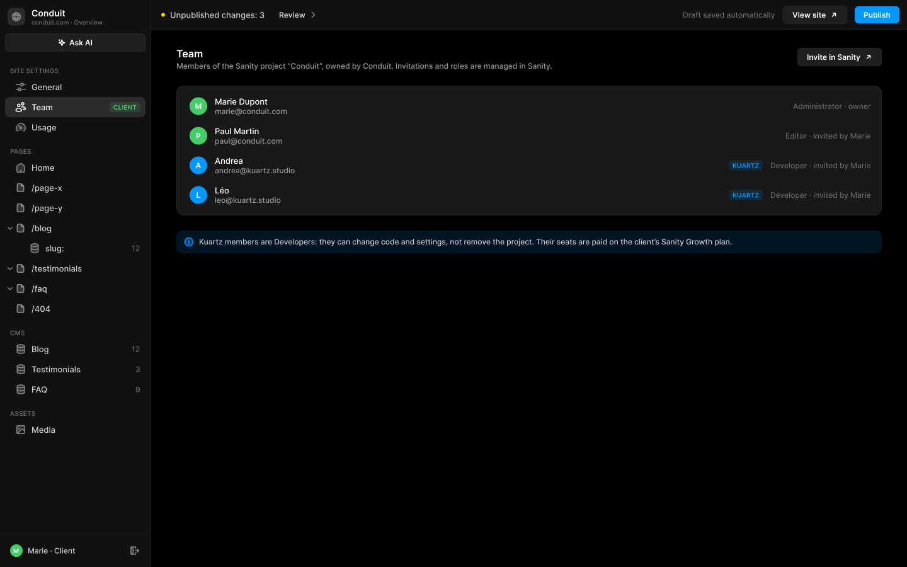
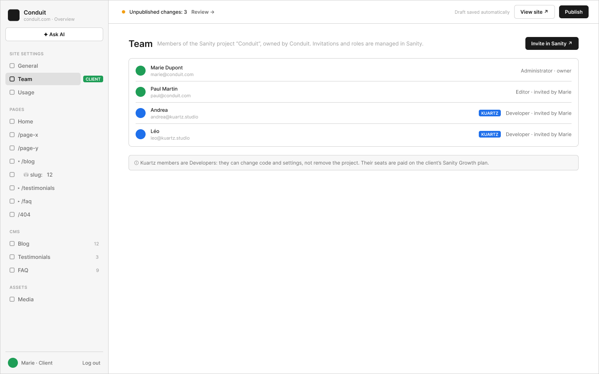

# B4 · Site Settings › Team

Extraction Figma du fichier « Kuartz — Carte système » (fileKey `wvr98llwHnMufQ88qUp4Ih`). Notation des arbres et conventions : voir [../README.md](../README.md).

| Champ | Valeur |
|---|---|
| Route | `/admin/settings/team` |
| Accès | Client admin seulement (barre d’accès : « CLIENT ADMIN » sur toute la largeur) · « Accès : client admin seulement (Administrator) » |
| Seul Kuartz voit | rien : écran invisible pour Kuartz (« Kuartz ne voit pas cet écran : le rôle Developer ne gère pas les membres. ») ; les membres Kuartz y apparaissent seulement, marqués du tag « KUARTZ » |
| Wireframe | `226:1551` · caption `226:1544` · accès `226:1673` |
| LLM context | `503:1894` |
| UI | `359:838` · caption `359:834` · accès `359:876` |
| Captures | [UI](./B4.ui.png) · [Wireframe](./B4.wf.png) |





## Caption et barre d’accès

- Caption wireframe (`226:1544`) : B4 · Site Settings › Team · [wf/Tag kind=sanity: "Sanity · project members"]
- Barre d’accès wireframe (`226:1673`, 1440px) : "CLIENT ADMIN" 1440px fill=#1f9e57
- Caption UI (`359:834`) : B4 · Site Settings › Team · [Tag Icon=Icon/close, Show icon=false, Show dot=false, tone=neutral: "Sanity · project members"]
- Barre d’accès UI (`359:876`, 1440px) : "CLIENT ADMIN" 1440px fill=#1f9e57

## LLM context

Bloc Figma `503:1894` (page Wireframe), texte verbatim.

> LLM CONTEXT
>
> B4 · Team
>
> Site Settings › Team
>
> Route : /admin/settings/team · Accès : client admin seulement (Administrator) · Sanity : membres du projet

<!-- col 1 -->

### EN BREF

Les membres du projet Sanity « Conduit », qui appartient au client. Les invitations et les rôles se gèrent dans Sanity.

### DONNÉES

Membres du projet Sanity via l’API de gestion : nom, e-mail, avatar, rôle, invité par. Kuartz = membres Developer (ou e-mail @kuartz.studio), marqués KUARTZ.

### COMPOSANTS

Page header (« Team » + sous-titre, Button « Invite in Sanity ↗ »), List item (avatar, nom, e-mail, tag, rôle), Callout.

<!-- col 2 -->

### COMPORTEMENT

• Liste : avatar, nom, e-mail ; à droite, tag KUARTZ s’il y a lieu, puis « rôle · invited by … » (Administrator · owner, Editor · invited by Marie, Developer · invited by Marie).
• « Invite in Sanity ↗ » : ouvre la gestion des membres du projet sur sanity.io (nouvel onglet).
• Encadré : « Kuartz members are Developers: they can change code and settings, not remove the project. Their seats are paid on the client’s Sanity Growth plan. »

### RÈGLES

• Kuartz ne voit pas cet écran : le rôle Developer ne gère pas les membres.
• Rôles Sanity : Administrator (le client), Developer (Kuartz, à partir de Growth), Editor (éditeurs du client). Le plan Free n’a qu’Administrator et Viewer.

### À TRANCHER

• Question 6 : inviter depuis l’admin (API Sanity, droits Administrator) ou lien vers Sanity ?
• Question 11 : quel admin pour un Editor ?

## Wireframe

Écran wireframe `226:1551` — textes et annotations dans l’ordre de lecture (▸ = conteneur, [Composant {propriétés}], « (libre) » = conteneur sans auto-layout, enfants triés haut→bas puis gauche→droite).

- ▸ B4 · Team
  - [wf/Sidebar · Projet {role=Client admin}]
    - "Conduit"
    - "conduit.com · Overview"
    - [wf/Button {Label="✦ Ask AI", variant=secondary}]
    - "SITE SETTINGS"
    - [wf/Nav item {Show icon=true, Count="12", Show count=false, Label="General", state=default}]
    - [wf/Nav item {Show icon=true, Show count=false, Count="12", Label="Team", state=active}]
    - [wf/Tag ]
      - "CLIENT"
    - [wf/Nav item {Show icon=true, Count="12", Show count=false, Label="Usage", state=default}]
    - "PAGES"
    - [wf/Nav item {Show icon=true, Count="12", Show count=false, Label="Home", state=default}]
    - [wf/Nav item {Show icon=true, Count="12", Show count=false, Label="/page-x", state=default}]
    - [wf/Nav item {Show icon=true, Count="12", Show count=false, Label="/page-y", state=default}]
    - [wf/Nav item {Show icon=true, Count="12", Show count=false, Label="▾ /blog", state=default}]
    - [wf/Nav item {Show icon=true, Count="12", Show count=false, Label="    ⛁ slug:   12", state=default}]
    - [wf/Nav item {Show icon=true, Count="12", Show count=false, Label="▸ /testimonials", state=default}]
    - [wf/Nav item {Show icon=true, Count="12", Show count=false, Label="▸ /faq", state=default}]
    - [wf/Nav item {Show icon=true, Count="12", Show count=false, Label="/404", state=default}]
    - "CMS"
    - [wf/Nav item {Show icon=true, Count="12", Show count=true, Label="Blog", state=default}]
    - [wf/Nav item {Show icon=true, Count="3", Show count=true, Label="Testimonials", state=default}]
    - [wf/Nav item {Show icon=true, Count="9", Show count=true, Label="FAQ", state=default}]
    - "ASSETS"
    - [wf/Nav item {Show icon=true, Count="12", Show count=false, Label="Media", state=default}]
    - "Marie · Client"
    - "Log out"
  - ▸ main
    - [wf/Top bar {Status="Unpublished changes: 3"}]
      - "Review →"
      - "Draft saved automatically"
      - [wf/Button {Label="View site ↗", variant=secondary}]
      - [wf/Button {Label="Publish", variant=primary}]
    - ▸ content
      - ▸ Frame
        - "Team"
        - "Members of the Sanity project “Conduit”, owned by Conduit. Invitations and roles are managed in Sanity."
        - [wf/Button {Label="Invite in Sanity ↗", variant=primary}] «btn/Invite in Sanity ↗»
      - ▸ members
        - ▸ member · Marie Dupont
          - ▸ who
            - "Marie Dupont"
            - "marie@conduit.com"
          - "Administrator · owner"
        - ▸ member · Paul Martin
          - ▸ who
            - "Paul Martin"
            - "paul@conduit.com"
          - "Editor · invited by Marie"
        - ▸ member · Andrea
          - ▸ who
            - "Andrea"
            - "andrea@kuartz.studio"
          - [wf/Tag ]
            - "KUARTZ"
          - "Developer · invited by Marie"
        - ▸ member · Léo
          - ▸ who
            - "Léo"
            - "leo@kuartz.studio"
          - [wf/Tag ]
            - "KUARTZ"
          - "Developer · invited by Marie"
      - ▸ info · Kuartz members
        - "ⓘ Kuartz members are Developers: they can change code and settings, not remove the project. Their seats are paid on the client’s Sanity Growth plan."

## UI — arbre

Écran UI `359:838` (page UI). Légende : `AL H|V` auto-layout, `gap`, `pad` (1 valeur, [vertical, horizontal] ou [haut, droite, bas, gauche]), `align=principal/secondaire`, `size=largeur/hauteur` (fixed|hug|fill), `@x,y` position libre, `abs@x,y` position absolue dans un auto-layout, `fill/stroke/radius` = variable liée (valeur brute en hex/px si aucune variable), `effect` = style d’effet, `TEXT … · <style de texte> · <couleur>` puis `:: "texte"`, `INST "calque" → Composant {propriétés}` ; sous une instance : `T "texte"` = texte interne non déjà donné par une propriété.

```text
FRAME "B4 · Team" 1440×900 · AL H gap=0 align=MIN/MIN · fill=bg/app
  INST "Sidebar" 240×900 → Sidebar {role=client} · AL V gap=0 align=MIN/MIN · size=fixed/fill · fill=bg/primary · stroke=border/subtle sides[T0 R1 B0 L0]
    INST "icon" 16×16 → Icon/globe {size=18}
    T "Conduit"
    T "conduit.com · Overview"
    INST "ask-ai" 223×29 → Button {Icon left=Icon/ai, Show icon left=true, Icon right=Icon/chevron-down, Show icon right=false, Label="Ask AI", variant=secondary, state=default, size=small}
    INST "section/SITE SETTINGS" 223×32 → Nav section {Show action=false, Label="SITE SETTINGS"}
    INST "nav/General" 223×32 → Nav item {Show tag=false, Show count=false, Count="12", Show chevron=false, Icon=Icon/sliders, Show icon=true, Label="General", state=default}
    INST "nav/Team" 223×32 → Nav item {Show tag=true, Show chevron=false, Show count=false, Label="Team", Icon=Icon/team, Count="12", Show icon=true, state=active}
      INST "tag" 49×16 → Tag {Icon=Icon/close, Show icon=false, Show dot=false, Label="CLIENT", tone=success}
    INST "nav/Usage" 223×32 → Nav item {Show tag=false, Show count=false, Count="12", Show chevron=false, Icon=Icon/usage, Show icon=true, Label="Usage", state=default}
    INST "section/PAGES" 223×32 → Nav section {Show action=false, Label="PAGES"}
    INST "nav/Home" 223×32 → Nav item {Show tag=false, Show count=false, Count="12", Show chevron=false, Icon=Icon/house, Show icon=true, Label="Home", state=default}
    INST "nav//page-x" 223×32 → Nav item {Show tag=false, Show count=false, Count="12", Show chevron=false, Icon=Icon/page, Show icon=true, Label="/page-x", state=default}
    INST "nav//page-y" 223×32 → Nav item {Show tag=false, Show count=false, Count="12", Show chevron=false, Icon=Icon/page, Show icon=true, Label="/page-y", state=default}
    INST "nav//blog" 223×32 → Nav item {Show tag=false, Show count=false, Count="12", Show chevron=true, Icon=Icon/page, Show icon=true, Label="/blog", state=default}
      INST "chevron" 10×10 → Icon/chevron-down {size=12}
    INST "nav//blog/:slug" 223×32 → Nav item {Show tag=false, Show count=true, Count="12", Show chevron=false, Icon=Icon/database, Show icon=true, Label="slug:", state=default}
    INST "nav//testimonials" 223×32 → Nav item {Show tag=false, Show count=false, Count="12", Show chevron=true, Icon=Icon/page, Show icon=true, Label="/testimonials", state=default}
      INST "chevron" 10×10 → Icon/chevron-down {size=12}
    INST "nav//faq" 223×32 → Nav item {Show tag=false, Show count=false, Count="12", Show chevron=true, Icon=Icon/page, Show icon=true, Label="/faq", state=default}
      INST "chevron" 10×10 → Icon/chevron-down {size=12}
    INST "nav//404" 223×32 → Nav item {Show tag=false, Show count=false, Count="12", Show chevron=false, Icon=Icon/page, Show icon=true, Label="/404", state=default}
    INST "section/CMS" 223×32 → Nav section {Show action=false, Label="CMS"}
    INST "nav/Blog" 223×32 → Nav item {Show tag=false, Show count=true, Count="12", Show chevron=false, Icon=Icon/database, Show icon=true, Label="Blog", state=default}
    INST "nav/Testimonials" 223×32 → Nav item {Show tag=false, Show count=true, Count="3", Show chevron=false, Icon=Icon/database, Show icon=true, Label="Testimonials", state=default}
    INST "nav/FAQ" 223×32 → Nav item {Show tag=false, Show count=true, Count="9", Show chevron=false, Icon=Icon/database, Show icon=true, Label="FAQ", state=default}
    INST "section/ASSETS" 223×32 → Nav section {Show action=false, Label="ASSETS"}
    INST "nav/Media" 223×32 → Nav item {Show tag=false, Show count=false, Count="12", Show chevron=false, Icon=Icon/image, Show icon=true, Label="Media", state=default}
    INST "avatar" 20×20 → Avatar {Initials="M", size=20, tone=green}
    T "Marie · Client"
    INST "logout" 28×28 → Icon button {Icon=Icon/logout, style=ghost, state=default, size=small}
  FRAME "main" 1200×900 · AL V gap=0 align=MIN/MIN · size=fill/fill
    INST "Top bar" 1200×48 → Top bar {state=pending} · AL H gap=space/12 pad=[0, space/12, 0, space/16] align=MIN/CENTER · size=fill/fixed · fill=bg/primary · stroke=border/subtle sides[T0 R0 B1 L0]
      T "Unpublished changes: 3"
      INST "review" 88×27 → Button {Icon left=Icon/plus, Show icon right=true, Icon right=Icon/chevron-right, Show icon left=false, Label="Review", variant=ghost, state=default, size=small}
      T "Draft saved automatically"
      INST "view-site" 102×29 → Button {Icon left=Icon/plus, Show icon left=false, Icon right=Icon/external, Show icon right=true, Label="View site", variant=secondary, state=default, size=small}
      INST "publish" 71×27 → Publish button {state=pending}
        INST "button" 71×27 → Button {Icon left=Icon/plus, Icon right=Icon/chevron-down, Show icon right=false, Show icon left=false, Label="Publish", variant=primary, state=default, size=small}
    FRAME "content" 1200×852 · AL V gap=space/24 pad=[28, space/40, space/40, space/40] align=MIN/MIN · size=fill/fill
      INST "Section header" 1120×36 → Section header {Show action=true, Show description=true, Description="Members of the Sanity project “Conduit”, owned by Conduit. Invitations and roles are managed in Sanity.", Title="Team"} · AL H gap=space/16 align=MIN/MIN · size=fill/hug
        INST "action" 134×29 → Button {Icon left=Icon/plus, Show icon left=false, Icon right=Icon/external, Show icon right=true, Label="Invite in Sanity", variant=secondary, state=default, size=small}
      FRAME "members" 1120×206 · AL V gap=0 pad=space/8 align=MIN/MIN · size=fill/hug · fill=bg/elevated · stroke=border/default 1 · radius=radius/lg
        INST "List item" 1102×47 → List item {Show action=false, Show tag=false, Show subtitle=true, Show meta=true, Subtitle="marie@conduit.com", Icon=Icon/page, Meta="Administrator · owner", Title="Marie Dupont", leading=avatar, state=default} · AL H gap=space/12 pad=[space/8, space/8, space/8, space/12] align=MIN/CENTER · size=fill/hug · radius=radius/md
          INST "avatar" 28×28 → Avatar {Initials="M", size=28, tone=green}
        INST "List item" 1102×47 → List item {Show action=false, Show tag=false, Show subtitle=true, Show meta=true, Subtitle="paul@conduit.com", Icon=Icon/page, Meta="Editor · invited by Marie", Title="Paul Martin", leading=avatar, state=default} · AL H gap=space/12 pad=[space/8, space/8, space/8, space/12] align=MIN/CENTER · size=fill/hug · radius=radius/md
          INST "avatar" 28×28 → Avatar {Initials="P", size=28, tone=green}
        INST "List item" 1102×47 → List item {Show action=false, Show tag=true, Show subtitle=true, Show meta=true, Subtitle="andrea@kuartz.studio", Icon=Icon/page, Meta="Developer · invited by Marie", Title="Andrea", leading=avatar, state=default} · AL H gap=space/12 pad=[space/8, space/8, space/8, space/12] align=MIN/CENTER · size=fill/hug · radius=radius/md
          INST "avatar" 28×28 → Avatar {Initials="A", size=28, tone=blue}
          INST "tag" 54×16 → Tag {Icon=Icon/close, Show icon=false, Show dot=false, Label="KUARTZ", tone=info}
        INST "List item" 1102×47 → List item {Show action=false, Show tag=true, Show subtitle=true, Show meta=true, Subtitle="leo@kuartz.studio", Icon=Icon/page, Meta="Developer · invited by Marie", Title="Léo", leading=avatar, state=default} · AL H gap=space/12 pad=[space/8, space/8, space/8, space/12] align=MIN/CENTER · size=fill/hug · radius=radius/md
          INST "avatar" 28×28 → Avatar {Initials="L", size=28, tone=blue}
          INST "tag" 54×16 → Tag {Icon=Icon/close, Show icon=false, Show dot=false, Label="KUARTZ", tone=info}
      INST "Callout" 1120×36 → Callout {Show action=false, Text="Kuartz members are Developers: they can change code and settings, not remove the project. Their seats are paid on the client’s Sanity Growth plan.", tone=info} · AL H gap=space/8 pad=[space/10, space/12] align=MIN/MIN · size=fill/hug · fill=bg/tint/info@14% · radius=radius/md
        INST "icon" 16×16 → Icon/info {size=18}
```

## Notes d’extraction

- Bouton « Invite in Sanity ↗ » en `variant=primary` dans le wireframe, « Invite in Sanity » + `Icon right=Icon/external` en `variant=secondary` dans l’UI : recopiés tels quels.
