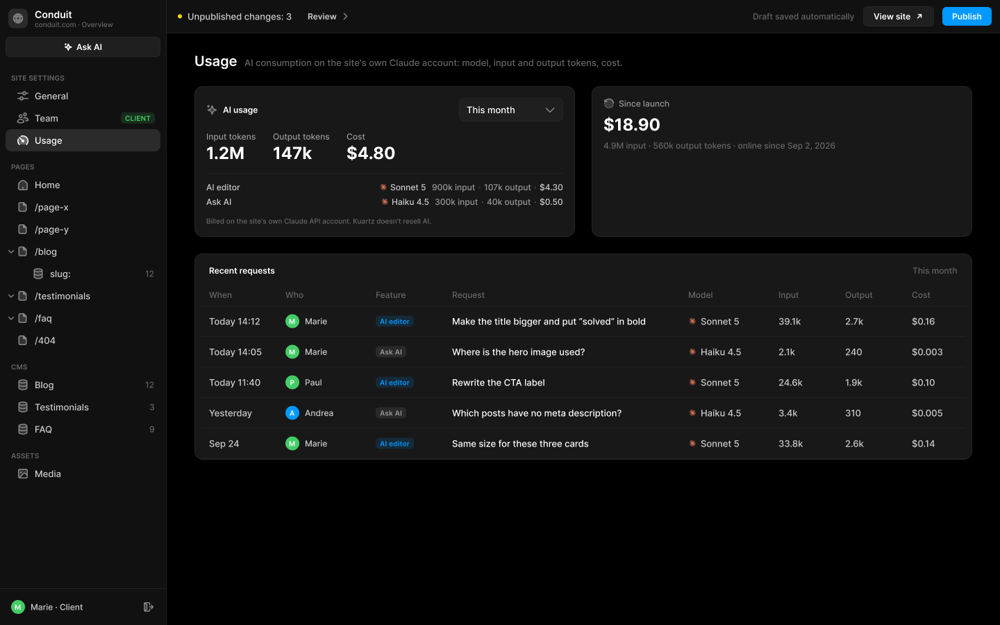
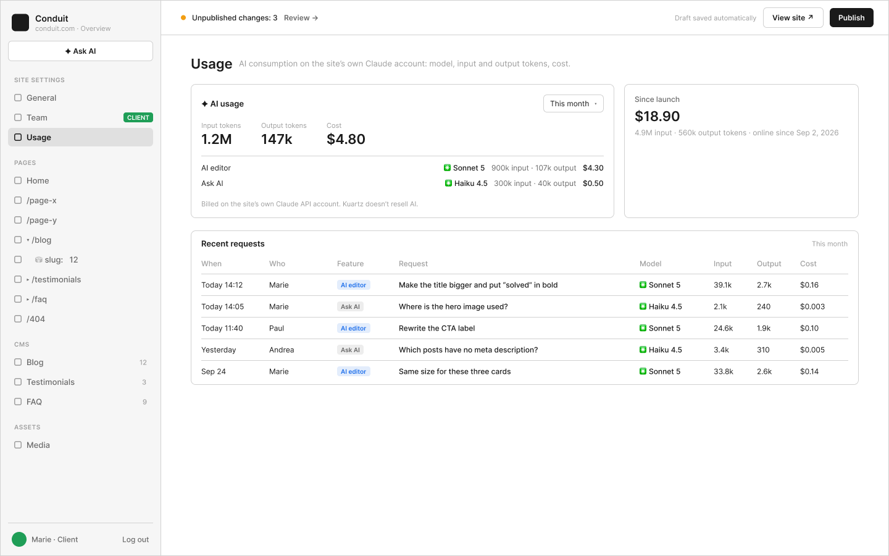

# B5 · Site Settings › Usage

Extraction Figma du fichier « Kuartz — Carte système » (fileKey `wvr98llwHnMufQ88qUp4Ih`). Notation des arbres et conventions : voir [../README.md](../README.md).

| Champ | Valeur |
|---|---|
| Route | `/admin/settings/usage` |
| Accès | Kuartz et client admin (barre d’accès : « KUARTZ » + « CLIENT ADMIN ») · « Accès : Kuartz et client » |
| Seul Kuartz voit | rien de spécifique à cet écran |
| Wireframe | `274:1380` · caption `274:1372` · accès `274:1375` |
| LLM context | `503:1923` |
| UI | `359:892` · caption `359:884` · accès `359:887` |
| Captures | [UI](./B5.ui.png) · [Wireframe](./B5.wf.png) |





## Caption et barre d’accès

- Caption wireframe (`274:1372`) : B5 · Site Settings › Usage
- Barre d’accès wireframe (`274:1375`, 1440px) : "KUARTZ" 718px fill=#1f70eb | "CLIENT ADMIN" 718px fill=#1f9e57
- Caption UI (`359:884`) : B5 · Site Settings › Usage
- Barre d’accès UI (`359:887`, 1440px) : "KUARTZ" 718px fill=#1f70eb | "CLIENT ADMIN" 718px fill=#1f9e57

## LLM context

Bloc Figma `503:1923` (page Wireframe), texte verbatim.

> LLM CONTEXT
>
> B5 · Usage
>
> Site Settings › Usage — consommation IA
>
> Route : /admin/settings/usage · Accès : Kuartz et client

<!-- col 1 -->

### EN BREF

Ce que l’IA a consommé sur le compte Claude (API Anthropic) du client : par période, par fonctionnalité et par modèle, en tokens et en $. Kuartz ne revend pas d’IA.

### DONNÉES

• Journal des demandes : { at, user, feature (aiEditor · askAi), request (texte de la demande), model, inputTokens, outputTokens, cost } ; cost calculé au moment de la demande avec le tarif du modèle (input et output au million de tokens) et stocké.
• Stockage : à trancher (proposé : un document Sanity par demande, non public).
• Date de mise en ligne du site (pour « Since launch »).

### COMPOSANTS

Page header, AI usage (carte avec Select de période), Model usage (logo Claude + modèle + tokens + coût), Stat card « Since launch », Table cell (dont type=model), Tag de fonctionnalité.

<!-- col 2 -->

### COMPORTEMENT

• Carte « AI usage » : période « This month » / « Last 3 months » / « Since launch » ; totaux Input tokens (1.2M), Output tokens (147k), Cost ($4.80) ; une ligne par fonctionnalité avec son modèle : AI editor · Sonnet 5 · 900k input · 107k output · $4.30 ; Ask AI · Haiku 4.5 · 300k input · 40k output · $0.50 ; mention « Billed on the site’s own Claude API account. Kuartz doesn’t resell AI. »
• Carte « Since launch » : $18.90, « 4.9M input · 560k output tokens · online since Sep 2, 2026 ».
• Tableau « Recent requests » (période choisie, la plus récente en haut) : When · Who · Feature · Request · Model · Input · Output · Cost.

### RÈGLES

• Jamais de « crédits », ni solde, ni plafond, ni alerte, ni jauge colorée : seulement ce qui a été consommé et ce que ça coûte.
• Formats : 1.2M, 147k, 240 ; $4.80 ; trois décimales sous un cent ($0.003).
• Mêmes chiffres qu’en B1 (carte AI usage), dans l’éditeur IA (D) et dans Ask AI (G4).

### ÉTATS ET CAS LIMITES

• Aucune demande sur la période : totaux à 0 et tableau vide « No AI requests yet. ».
• Beaucoup de demandes : pagination ou chargement au défilement (proposé).

### À TRANCHER

• Question 12 : où stocker le journal.

## Wireframe

Écran wireframe `274:1380` — textes et annotations dans l’ordre de lecture (▸ = conteneur, [Composant {propriétés}], « (libre) » = conteneur sans auto-layout, enfants triés haut→bas puis gauche→droite).

- ▸ B5 · Usage
  - [wf/Sidebar · Projet {role=Client admin}]
    - "Conduit"
    - "conduit.com · Overview"
    - [wf/Button {Label="✦ Ask AI", variant=secondary}]
    - "SITE SETTINGS"
    - [wf/Nav item {Show icon=true, Count="12", Show count=false, Label="General", state=default}]
    - [wf/Nav item {Show icon=true, Count="12", Show count=false, Label="Team", state=default}]
    - [wf/Tag ]
      - "CLIENT"
    - [wf/Nav item {Show icon=true, Show count=false, Count="12", Label="Usage", state=active}]
    - "PAGES"
    - [wf/Nav item {Show icon=true, Count="12", Show count=false, Label="Home", state=default}]
    - [wf/Nav item {Show icon=true, Count="12", Show count=false, Label="/page-x", state=default}]
    - [wf/Nav item {Show icon=true, Count="12", Show count=false, Label="/page-y", state=default}]
    - [wf/Nav item {Show icon=true, Count="12", Show count=false, Label="▾ /blog", state=default}]
    - [wf/Nav item {Show icon=true, Count="12", Show count=false, Label="    ⛁ slug:   12", state=default}]
    - [wf/Nav item {Show icon=true, Count="12", Show count=false, Label="▸ /testimonials", state=default}]
    - [wf/Nav item {Show icon=true, Count="12", Show count=false, Label="▸ /faq", state=default}]
    - [wf/Nav item {Show icon=true, Count="12", Show count=false, Label="/404", state=default}]
    - "CMS"
    - [wf/Nav item {Show icon=true, Count="12", Show count=true, Label="Blog", state=default}]
    - [wf/Nav item {Show icon=true, Count="3", Show count=true, Label="Testimonials", state=default}]
    - [wf/Nav item {Show icon=true, Count="9", Show count=true, Label="FAQ", state=default}]
    - "ASSETS"
    - [wf/Nav item {Show icon=true, Count="12", Show count=false, Label="Media", state=default}]
    - "Marie · Client"
    - "Log out"
  - ▸ main
    - [wf/Top bar {Status="Unpublished changes: 3"}]
      - "Review →"
      - "Draft saved automatically"
      - [wf/Button {Label="View site ↗", variant=secondary}]
      - [wf/Button {Label="Publish", variant=primary}]
    - ▸ content
      - ▸ header
        - "Usage"
        - "AI consumption on the site’s own Claude account: model, input and output tokens, cost."
      - ▸ cards
        - ▸ card · AI usage
          - ▸ head
            - "✦ AI usage"
            - ▸ select · This month
              - "This month"
              - "▾"
          - ▸ totals
            - ▸ Input tokens
              - "Input tokens"
              - "1.2M"
            - ▸ Output tokens
              - "Output tokens"
              - "147k"
            - ▸ Cost
              - "Cost"
              - "$4.80"
          - ▸ by feature
            - ▸ feature · AI editor
              - "AI editor"
              - ▸ model · Sonnet 5
                - "✳"
                - "Sonnet 5"
              - "900k input · 107k output"
              - "$4.30"
            - ▸ feature · Ask AI
              - "Ask AI"
              - ▸ model · Haiku 4.5
                - "✳"
                - "Haiku 4.5"
              - "300k input · 40k output"
              - "$0.50"
          - "Billed on the site’s own Claude API account. Kuartz doesn’t resell AI."
        - ▸ card · Since launch
          - "Since launch"
          - "$18.90"
          - "4.9M input · 560k output tokens · online since Sep 2, 2026"
      - ▸ card · Recent requests
        - ▸ head
          - "Recent requests"
          - "This month"
        - ▸ thead
          - "When"
          - "Who"
          - "Feature"
          - "Request"
          - "Model"
          - "Input"
          - "Output"
          - "Cost"
        - ▸ row
          - "Today 14:12"
          - "Marie"
          - ▸ cell
            - ▸ feature tag
              - "AI editor"
          - "Make the title bigger and put “solved” in bold"
          - ▸ cell
            - ▸ model · Sonnet 5
              - "✳"
              - "Sonnet 5"
          - "39.1k"
          - "2.7k"
          - "$0.16"
        - ▸ row
          - "Today 14:05"
          - "Marie"
          - ▸ cell
            - ▸ feature tag
              - "Ask AI"
          - "Where is the hero image used?"
          - ▸ cell
            - ▸ model · Haiku 4.5
              - "✳"
              - "Haiku 4.5"
          - "2.1k"
          - "240"
          - "$0.003"
        - ▸ row
          - "Today 11:40"
          - "Paul"
          - ▸ cell
            - ▸ feature tag
              - "AI editor"
          - "Rewrite the CTA label"
          - ▸ cell
            - ▸ model · Sonnet 5
              - "✳"
              - "Sonnet 5"
          - "24.6k"
          - "1.9k"
          - "$0.10"
        - ▸ row
          - "Yesterday"
          - "Andrea"
          - ▸ cell
            - ▸ feature tag
              - "Ask AI"
          - "Which posts have no meta description?"
          - ▸ cell
            - ▸ model · Haiku 4.5
              - "✳"
              - "Haiku 4.5"
          - "3.4k"
          - "310"
          - "$0.005"
        - ▸ row
          - "Sep 24"
          - "Marie"
          - ▸ cell
            - ▸ feature tag
              - "AI editor"
          - "Same size for these three cards"
          - ▸ cell
            - ▸ model · Sonnet 5
              - "✳"
              - "Sonnet 5"
          - "33.8k"
          - "2.6k"
          - "$0.14"

## UI — arbre

Écran UI `359:892` (page UI). Légende : `AL H|V` auto-layout, `gap`, `pad` (1 valeur, [vertical, horizontal] ou [haut, droite, bas, gauche]), `align=principal/secondaire`, `size=largeur/hauteur` (fixed|hug|fill), `@x,y` position libre, `abs@x,y` position absolue dans un auto-layout, `fill/stroke/radius` = variable liée (valeur brute en hex/px si aucune variable), `effect` = style d’effet, `TEXT … · <style de texte> · <couleur>` puis `:: "texte"`, `INST "calque" → Composant {propriétés}` ; sous une instance : `T "texte"` = texte interne non déjà donné par une propriété.

```text
FRAME "B5 · Usage" 1440×900 · AL H gap=0 align=MIN/MIN · fill=bg/app
  INST "Sidebar" 240×900 → Sidebar {role=client} · AL V gap=0 align=MIN/MIN · size=fixed/fill · fill=bg/primary · stroke=border/subtle sides[T0 R1 B0 L0]
    INST "icon" 16×16 → Icon/globe {size=18}
    T "Conduit"
    T "conduit.com · Overview"
    INST "ask-ai" 223×29 → Button {Icon left=Icon/ai, Show icon left=true, Icon right=Icon/chevron-down, Show icon right=false, Label="Ask AI", variant=secondary, state=default, size=small}
    INST "section/SITE SETTINGS" 223×32 → Nav section {Show action=false, Label="SITE SETTINGS"}
    INST "nav/General" 223×32 → Nav item {Show tag=false, Show count=false, Count="12", Show chevron=false, Icon=Icon/sliders, Show icon=true, Label="General", state=default}
    INST "nav/Team" 223×32 → Nav item {Show tag=true, Show count=false, Count="12", Show chevron=false, Icon=Icon/team, Show icon=true, Label="Team", state=default}
      INST "tag" 49×16 → Tag {Icon=Icon/close, Show icon=false, Show dot=false, Label="CLIENT", tone=success}
    INST "nav/Usage" 223×32 → Nav item {Show tag=false, Show chevron=false, Show count=false, Label="Usage", Icon=Icon/usage, Count="12", Show icon=true, state=active}
    INST "section/PAGES" 223×32 → Nav section {Show action=false, Label="PAGES"}
    INST "nav/Home" 223×32 → Nav item {Show tag=false, Show count=false, Count="12", Show chevron=false, Icon=Icon/house, Show icon=true, Label="Home", state=default}
    INST "nav//page-x" 223×32 → Nav item {Show tag=false, Show count=false, Count="12", Show chevron=false, Icon=Icon/page, Show icon=true, Label="/page-x", state=default}
    INST "nav//page-y" 223×32 → Nav item {Show tag=false, Show count=false, Count="12", Show chevron=false, Icon=Icon/page, Show icon=true, Label="/page-y", state=default}
    INST "nav//blog" 223×32 → Nav item {Show tag=false, Show count=false, Count="12", Show chevron=true, Icon=Icon/page, Show icon=true, Label="/blog", state=default}
      INST "chevron" 10×10 → Icon/chevron-down {size=12}
    INST "nav//blog/:slug" 223×32 → Nav item {Show tag=false, Show count=true, Count="12", Show chevron=false, Icon=Icon/database, Show icon=true, Label="slug:", state=default}
    INST "nav//testimonials" 223×32 → Nav item {Show tag=false, Show count=false, Count="12", Show chevron=true, Icon=Icon/page, Show icon=true, Label="/testimonials", state=default}
      INST "chevron" 10×10 → Icon/chevron-down {size=12}
    INST "nav//faq" 223×32 → Nav item {Show tag=false, Show count=false, Count="12", Show chevron=true, Icon=Icon/page, Show icon=true, Label="/faq", state=default}
      INST "chevron" 10×10 → Icon/chevron-down {size=12}
    INST "nav//404" 223×32 → Nav item {Show tag=false, Show count=false, Count="12", Show chevron=false, Icon=Icon/page, Show icon=true, Label="/404", state=default}
    INST "section/CMS" 223×32 → Nav section {Show action=false, Label="CMS"}
    INST "nav/Blog" 223×32 → Nav item {Show tag=false, Show count=true, Count="12", Show chevron=false, Icon=Icon/database, Show icon=true, Label="Blog", state=default}
    INST "nav/Testimonials" 223×32 → Nav item {Show tag=false, Show count=true, Count="3", Show chevron=false, Icon=Icon/database, Show icon=true, Label="Testimonials", state=default}
    INST "nav/FAQ" 223×32 → Nav item {Show tag=false, Show count=true, Count="9", Show chevron=false, Icon=Icon/database, Show icon=true, Label="FAQ", state=default}
    INST "section/ASSETS" 223×32 → Nav section {Show action=false, Label="ASSETS"}
    INST "nav/Media" 223×32 → Nav item {Show tag=false, Show count=false, Count="12", Show chevron=false, Icon=Icon/image, Show icon=true, Label="Media", state=default}
    INST "avatar" 20×20 → Avatar {Initials="M", size=20, tone=green}
    T "Marie · Client"
    INST "logout" 28×28 → Icon button {Icon=Icon/logout, style=ghost, state=default, size=small}
  FRAME "main" 1200×900 · AL V gap=0 align=MIN/MIN · size=fill/fill
    INST "Top bar" 1200×48 → Top bar {state=pending} · AL H gap=space/12 pad=[0, space/12, 0, space/16] align=MIN/CENTER · size=fill/fixed · fill=bg/primary · stroke=border/subtle sides[T0 R0 B1 L0]
      T "Unpublished changes: 3"
      INST "review" 88×27 → Button {Icon left=Icon/plus, Show icon right=true, Icon right=Icon/chevron-right, Show icon left=false, Label="Review", variant=ghost, state=default, size=small}
      T "Draft saved automatically"
      INST "view-site" 102×29 → Button {Icon left=Icon/plus, Show icon left=false, Icon right=Icon/external, Show icon right=true, Label="View site", variant=secondary, state=default, size=small}
      INST "publish" 71×27 → Publish button {state=pending}
        INST "button" 71×27 → Button {Icon left=Icon/plus, Icon right=Icon/chevron-down, Show icon right=false, Show icon left=false, Label="Publish", variant=primary, state=default, size=small}
    FRAME "content" 1200×852 · AL V gap=space/24 pad=[28, space/40, space/40, space/40] align=MIN/MIN · size=fill/fill
      INST "Page header" 1120×24 → Page header {Show description=false, Description="Images, videos and files used on the site. A file that is in use cannot be deleted.", Show meta=true, Meta="AI consumption on the site's own Claude account: model, input and output tokens, cost.", Title="Usage"} · AL V gap=space/4 align=MIN/MIN · size=fill/hug
      FRAME "row" 1120×217 · AL H gap=space/24 align=MIN/MIN · size=fill/hug
        INST "AI usage" 548×217 → AI usage {period=month} · AL V gap=14 pad=space/16 align=MIN/MIN · size=fill/hug · fill=bg/elevated · stroke=border/default 1 · radius=radius/lg
          INST "icon" 16×16 → Icon/ai {size=18}
          T "AI usage"
          INST "period" 150×34 → Select {Label="Label", Show helper=false, Placeholder="Select…", Helper="Shown in browser tabs and search results.", Value="This month", Show label=false, state=filled, layout=stacked}
            INST "chevron" 16×16 → Icon/chevron-down {size=18}
          T "Input tokens"
          T "1.2M"
          T "Output tokens"
          T "147k"
          T "Cost"
          T "$4.80"
          T "AI editor"
          INST "usage" 265×15 → Model usage {Show model=true, Show usage=true, Cost="$4.30", Output="107k output", Input="900k input", Model="Sonnet 5", size=default}
            INST "mark" 12×12 → Icon/claude {size=12}
            T "·"
            T "·"
          T "Ask AI"
          INST "usage" 263×15 → Model usage {Show model=true, Show usage=true, Cost="$0.50", Output="40k output", Input="300k input", Model="Haiku 4.5", size=default}
            INST "mark" 12×12 → Icon/claude {size=12}
            T "·"
            T "·"
          T "Billed on the site's own Claude API account. Kuartz doesn't resell AI."
        INST "Stat card" 548×217 → Stat card {Icon=Icon/history, Show hint=true, Show icon=true, Hint="4.9M input · 560k output tokens · online since Sep 2, 2026", Value="$18.90", Label="Since launch"} · AL V gap=space/8 pad=space/16 align=MIN/MIN · size=fill/fill · fill=bg/elevated · stroke=border/default 1 · radius=radius/lg
      FRAME "recent-requests" 1120×297 · AL V gap=0 align=MIN/MIN · size=fill/hug · fill=bg/elevated · stroke=border/default 1 · radius=radius/lg
        FRAME "header" 1118×43 · AL H gap=space/8 pad=[space/16, space/20, space/12, space/20] align=MIN/CENTER · size=fill/hug
          TEXT "title" 1005×15 · Label · text/primary · size=fill/hug :: "Recent requests"
          TEXT "period" 65×15 · Body Small · text/muted · size=hug/hug :: "This month"
        FRAME "row/header" 1118×32 · AL H gap=0 pad=[0, space/8] align=MIN/CENTER · size=fill/hug
          INST "When" 110×32 → Table cell {Show sort=false, Label="When", type=header, state=default} · AL H gap=space/8 pad=[0, space/12] align=MIN/CENTER · size=fixed/fixed · stroke=border/subtle sides[T0 R0 B1 L0]
          INST "Who" 130×32 → Table cell {Show sort=false, Label="Who", type=header, state=default} · AL H gap=space/8 pad=[0, space/12] align=MIN/CENTER · size=fixed/fixed · stroke=border/subtle sides[T0 R0 B1 L0]
          INST "Feature" 110×32 → Table cell {Show sort=false, Label="Feature", type=header, state=default} · AL H gap=space/8 pad=[0, space/12] align=MIN/CENTER · size=fixed/fixed · stroke=border/subtle sides[T0 R0 B1 L0]
          INST "Request" 340×32 → Table cell {Show sort=false, Label="Request", type=header, state=default} · AL H gap=space/8 pad=[0, space/12] align=MIN/CENTER · size=fill/fixed · stroke=border/subtle sides[T0 R0 B1 L0]
          INST "Model" 130×32 → Table cell {Show sort=false, Label="Model", type=header, state=default} · AL H gap=space/8 pad=[0, space/12] align=MIN/CENTER · size=fixed/fixed · stroke=border/subtle sides[T0 R0 B1 L0]
          INST "Input" 96×32 → Table cell {Show sort=false, Label="Input", type=header, state=default} · AL H gap=space/8 pad=[0, space/12] align=MIN/CENTER · size=fixed/fixed · stroke=border/subtle sides[T0 R0 B1 L0]
          INST "Output" 96×32 → Table cell {Show sort=false, Label="Output", type=header, state=default} · AL H gap=space/8 pad=[0, space/12] align=MIN/CENTER · size=fixed/fixed · stroke=border/subtle sides[T0 R0 B1 L0]
          INST "Cost" 90×32 → Table cell {Show sort=false, Label="Cost", type=header, state=default} · AL H gap=space/8 pad=[0, space/12] align=MIN/CENTER · size=fixed/fixed · stroke=border/subtle sides[T0 R0 B1 L0]
        FRAME "row" 1118×44 · AL H gap=0 pad=[0, space/8] align=MIN/CENTER · size=fill/hug
          INST "Table cell" 110×44 → Table cell {Show sort=false, Label="Today 14:12", type=text, state=default} · AL H gap=space/8 pad=[0, space/12] align=MIN/CENTER · size=fixed/fixed · stroke=border/subtle sides[T0 R0 B1 L0]
          INST "Table cell" 130×44 → Table cell {Show sort=false, Label="Marie", type=user, state=default} · AL H gap=space/8 pad=[0, space/12] align=MIN/CENTER · size=fixed/fixed · stroke=border/subtle sides[T0 R0 B1 L0]
            INST "avatar" 20×20 → Avatar {Initials="M", size=20, tone=green}
          INST "Table cell" 110×44 → Table cell {Show sort=false, Label="Label", type=tag, state=default} · AL H gap=space/8 pad=[0, space/12] align=MIN/CENTER · size=fixed/fixed · stroke=border/subtle sides[T0 R0 B1 L0]
            INST "tag" 55×16 → Tag {Icon=Icon/close, Show icon=false, Show dot=false, Label="AI editor", tone=info}
          INST "Table cell" 340×44 → Table cell {Show sort=false, Label="Make the title bigger and put “solved” in bold", type=title, state=default} · AL H gap=space/8 pad=[0, space/12] align=MIN/CENTER · size=fill/fixed · stroke=border/subtle sides[T0 R0 B1 L0]
          INST "Table cell" 130×44 → Table cell {Show sort=false, Label="Sonnet 5", type=model, state=default} · AL H gap=6 pad=[0, space/12] align=MIN/CENTER · size=fixed/fixed · stroke=border/subtle sides[T0 R0 B1 L0]
            INST "mark" 12×12 → Icon/claude {size=12}
          INST "Table cell" 96×44 → Table cell {Show sort=false, Label="39.1k", type=text, state=default} · AL H gap=space/8 pad=[0, space/12] align=MIN/CENTER · size=fixed/fixed · stroke=border/subtle sides[T0 R0 B1 L0]
          INST "Table cell" 96×44 → Table cell {Show sort=false, Label="2.7k", type=text, state=default} · AL H gap=space/8 pad=[0, space/12] align=MIN/CENTER · size=fixed/fixed · stroke=border/subtle sides[T0 R0 B1 L0]
          INST "Table cell" 90×44 → Table cell {Show sort=false, Label="$0.16", type=text, state=default} · AL H gap=space/8 pad=[0, space/12] align=MIN/CENTER · size=fixed/fixed · stroke=border/subtle sides[T0 R0 B1 L0]
        FRAME "row" 1118×44 · AL H gap=0 pad=[0, space/8] align=MIN/CENTER · size=fill/hug
          INST "Table cell" 110×44 → Table cell {Show sort=false, Label="Today 14:05", type=text, state=default} · AL H gap=space/8 pad=[0, space/12] align=MIN/CENTER · size=fixed/fixed · stroke=border/subtle sides[T0 R0 B1 L0]
          INST "Table cell" 130×44 → Table cell {Show sort=false, Label="Marie", type=user, state=default} · AL H gap=space/8 pad=[0, space/12] align=MIN/CENTER · size=fixed/fixed · stroke=border/subtle sides[T0 R0 B1 L0]
            INST "avatar" 20×20 → Avatar {Initials="M", size=20, tone=green}
          INST "Table cell" 110×44 → Table cell {Show sort=false, Label="Label", type=tag, state=default} · AL H gap=space/8 pad=[0, space/12] align=MIN/CENTER · size=fixed/fixed · stroke=border/subtle sides[T0 R0 B1 L0]
            INST "tag" 44×16 → Tag {Icon=Icon/close, Show icon=false, Show dot=false, Label="Ask AI", tone=neutral}
          INST "Table cell" 340×44 → Table cell {Show sort=false, Label="Where is the hero image used?", type=title, state=default} · AL H gap=space/8 pad=[0, space/12] align=MIN/CENTER · size=fill/fixed · stroke=border/subtle sides[T0 R0 B1 L0]
          INST "Table cell" 130×44 → Table cell {Show sort=false, Label="Haiku 4.5", type=model, state=default} · AL H gap=6 pad=[0, space/12] align=MIN/CENTER · size=fixed/fixed · stroke=border/subtle sides[T0 R0 B1 L0]
            INST "mark" 12×12 → Icon/claude {size=12}
          INST "Table cell" 96×44 → Table cell {Show sort=false, Label="2.1k", type=text, state=default} · AL H gap=space/8 pad=[0, space/12] align=MIN/CENTER · size=fixed/fixed · stroke=border/subtle sides[T0 R0 B1 L0]
          INST "Table cell" 96×44 → Table cell {Show sort=false, Label="240", type=text, state=default} · AL H gap=space/8 pad=[0, space/12] align=MIN/CENTER · size=fixed/fixed · stroke=border/subtle sides[T0 R0 B1 L0]
          INST "Table cell" 90×44 → Table cell {Show sort=false, Label="$0.003", type=text, state=default} · AL H gap=space/8 pad=[0, space/12] align=MIN/CENTER · size=fixed/fixed · stroke=border/subtle sides[T0 R0 B1 L0]
        FRAME "row" 1118×44 · AL H gap=0 pad=[0, space/8] align=MIN/CENTER · size=fill/hug
          INST "Table cell" 110×44 → Table cell {Show sort=false, Label="Today 11:40", type=text, state=default} · AL H gap=space/8 pad=[0, space/12] align=MIN/CENTER · size=fixed/fixed · stroke=border/subtle sides[T0 R0 B1 L0]
          INST "Table cell" 130×44 → Table cell {Show sort=false, Label="Paul", type=user, state=default} · AL H gap=space/8 pad=[0, space/12] align=MIN/CENTER · size=fixed/fixed · stroke=border/subtle sides[T0 R0 B1 L0]
            INST "avatar" 20×20 → Avatar {Initials="P", size=20, tone=green}
          INST "Table cell" 110×44 → Table cell {Show sort=false, Label="Label", type=tag, state=default} · AL H gap=space/8 pad=[0, space/12] align=MIN/CENTER · size=fixed/fixed · stroke=border/subtle sides[T0 R0 B1 L0]
            INST "tag" 55×16 → Tag {Icon=Icon/close, Show icon=false, Show dot=false, Label="AI editor", tone=info}
          INST "Table cell" 340×44 → Table cell {Show sort=false, Label="Rewrite the CTA label", type=title, state=default} · AL H gap=space/8 pad=[0, space/12] align=MIN/CENTER · size=fill/fixed · stroke=border/subtle sides[T0 R0 B1 L0]
          INST "Table cell" 130×44 → Table cell {Show sort=false, Label="Sonnet 5", type=model, state=default} · AL H gap=6 pad=[0, space/12] align=MIN/CENTER · size=fixed/fixed · stroke=border/subtle sides[T0 R0 B1 L0]
            INST "mark" 12×12 → Icon/claude {size=12}
          INST "Table cell" 96×44 → Table cell {Show sort=false, Label="24.6k", type=text, state=default} · AL H gap=space/8 pad=[0, space/12] align=MIN/CENTER · size=fixed/fixed · stroke=border/subtle sides[T0 R0 B1 L0]
          INST "Table cell" 96×44 → Table cell {Show sort=false, Label="1.9k", type=text, state=default} · AL H gap=space/8 pad=[0, space/12] align=MIN/CENTER · size=fixed/fixed · stroke=border/subtle sides[T0 R0 B1 L0]
          INST "Table cell" 90×44 → Table cell {Show sort=false, Label="$0.10", type=text, state=default} · AL H gap=space/8 pad=[0, space/12] align=MIN/CENTER · size=fixed/fixed · stroke=border/subtle sides[T0 R0 B1 L0]
        FRAME "row" 1118×44 · AL H gap=0 pad=[0, space/8] align=MIN/CENTER · size=fill/hug
          INST "Table cell" 110×44 → Table cell {Show sort=false, Label="Yesterday", type=text, state=default} · AL H gap=space/8 pad=[0, space/12] align=MIN/CENTER · size=fixed/fixed · stroke=border/subtle sides[T0 R0 B1 L0]
          INST "Table cell" 130×44 → Table cell {Show sort=false, Label="Andrea", type=user, state=default} · AL H gap=space/8 pad=[0, space/12] align=MIN/CENTER · size=fixed/fixed · stroke=border/subtle sides[T0 R0 B1 L0]
            INST "avatar" 20×20 → Avatar {Initials="A", size=20, tone=blue}
          INST "Table cell" 110×44 → Table cell {Show sort=false, Label="Label", type=tag, state=default} · AL H gap=space/8 pad=[0, space/12] align=MIN/CENTER · size=fixed/fixed · stroke=border/subtle sides[T0 R0 B1 L0]
            INST "tag" 44×16 → Tag {Icon=Icon/close, Show icon=false, Show dot=false, Label="Ask AI", tone=neutral}
          INST "Table cell" 340×44 → Table cell {Show sort=false, Label="Which posts have no meta description?", type=title, state=default} · AL H gap=space/8 pad=[0, space/12] align=MIN/CENTER · size=fill/fixed · stroke=border/subtle sides[T0 R0 B1 L0]
          INST "Table cell" 130×44 → Table cell {Show sort=false, Label="Haiku 4.5", type=model, state=default} · AL H gap=6 pad=[0, space/12] align=MIN/CENTER · size=fixed/fixed · stroke=border/subtle sides[T0 R0 B1 L0]
            INST "mark" 12×12 → Icon/claude {size=12}
          INST "Table cell" 96×44 → Table cell {Show sort=false, Label="3.4k", type=text, state=default} · AL H gap=space/8 pad=[0, space/12] align=MIN/CENTER · size=fixed/fixed · stroke=border/subtle sides[T0 R0 B1 L0]
          INST "Table cell" 96×44 → Table cell {Show sort=false, Label="310", type=text, state=default} · AL H gap=space/8 pad=[0, space/12] align=MIN/CENTER · size=fixed/fixed · stroke=border/subtle sides[T0 R0 B1 L0]
          INST "Table cell" 90×44 → Table cell {Show sort=false, Label="$0.005", type=text, state=default} · AL H gap=space/8 pad=[0, space/12] align=MIN/CENTER · size=fixed/fixed · stroke=border/subtle sides[T0 R0 B1 L0]
        FRAME "row" 1118×44 · AL H gap=0 pad=[0, space/8] align=MIN/CENTER · size=fill/hug
          INST "Table cell" 110×44 → Table cell {Show sort=false, Label="Sep 24", type=text, state=default} · AL H gap=space/8 pad=[0, space/12] align=MIN/CENTER · size=fixed/fixed · stroke=border/subtle sides[T0 R0 B1 L0]
          INST "Table cell" 130×44 → Table cell {Show sort=false, Label="Marie", type=user, state=default} · AL H gap=space/8 pad=[0, space/12] align=MIN/CENTER · size=fixed/fixed · stroke=border/subtle sides[T0 R0 B1 L0]
            INST "avatar" 20×20 → Avatar {Initials="M", size=20, tone=green}
          INST "Table cell" 110×44 → Table cell {Show sort=false, Label="Label", type=tag, state=default} · AL H gap=space/8 pad=[0, space/12] align=MIN/CENTER · size=fixed/fixed · stroke=border/subtle sides[T0 R0 B1 L0]
            INST "tag" 55×16 → Tag {Icon=Icon/close, Show icon=false, Show dot=false, Label="AI editor", tone=info}
          INST "Table cell" 340×44 → Table cell {Show sort=false, Label="Same size for these three cards", type=title, state=default} · AL H gap=space/8 pad=[0, space/12] align=MIN/CENTER · size=fill/fixed · stroke=border/subtle sides[T0 R0 B1 L0]
          INST "Table cell" 130×44 → Table cell {Show sort=false, Label="Sonnet 5", type=model, state=default} · AL H gap=6 pad=[0, space/12] align=MIN/CENTER · size=fixed/fixed · stroke=border/subtle sides[T0 R0 B1 L0]
            INST "mark" 12×12 → Icon/claude {size=12}
          INST "Table cell" 96×44 → Table cell {Show sort=false, Label="33.8k", type=text, state=default} · AL H gap=space/8 pad=[0, space/12] align=MIN/CENTER · size=fixed/fixed · stroke=border/subtle sides[T0 R0 B1 L0]
          INST "Table cell" 96×44 → Table cell {Show sort=false, Label="2.6k", type=text, state=default} · AL H gap=space/8 pad=[0, space/12] align=MIN/CENTER · size=fixed/fixed · stroke=border/subtle sides[T0 R0 B1 L0]
          INST "Table cell" 90×44 → Table cell {Show sort=false, Label="$0.14", type=text, state=default} · AL H gap=space/8 pad=[0, space/12] align=MIN/CENTER · size=fixed/fixed · stroke=border/subtle sides[T0 R0 B1 L0]
```

## Notes d’extraction

- Arbre UI paginé par le script (PART 1/2 et PART 2/2), concaténé dans l’ordre.
- Apostrophes : typographiques (’) dans le wireframe et le LLM context (« site’s », « doesn’t »), droites (') dans l’UI (« site's », « doesn't ») : recopiées telles quelles.
