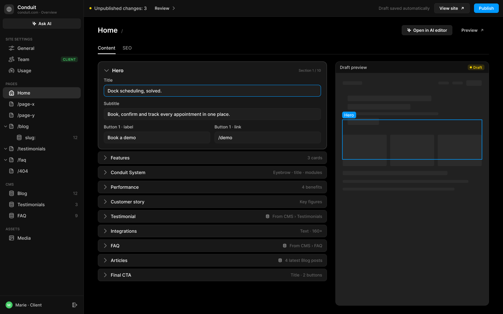
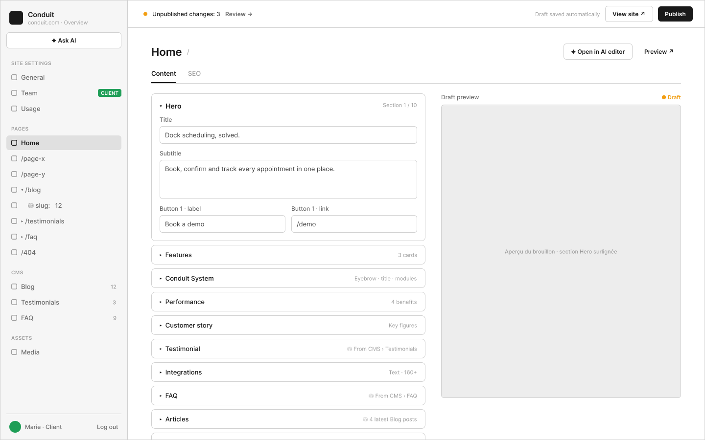

# C1 · Pages › Home — onglet Content

Extraction Figma du fichier « Kuartz — Carte système » (fileKey `wvr98llwHnMufQ88qUp4Ih`). Notation des arbres et conventions : voir [../README.md](../README.md).

| Champ | Valeur |
|---|---|
| Route | `/admin/pages/<page> (ex. /admin/pages/home)` |
| Accès | Kuartz et client admin (barre d’accès : « KUARTZ » bleu #1f70eb + « CLIENT ADMIN » vert #1f9e57 ; LLM context : « Accès : Kuartz et client ») |
| Seul Kuartz voit | Rien de spécifique à cet écran. La structure est figée pour le client (« le client ne peut ni ajouter, ni supprimer, ni réordonner des sections ou des champs ») : « Nouvelle section ou nouvelle page → demande à Kuartz ». |
| Wireframe | `214:527` · caption `214:524` · accès `227:1362` |
| LLM context | `504:1784` |
| UI | `359:978` · caption `359:974` · accès `359:1548` |
| Captures | [UI](./C1.ui.png) · [Wireframe](./C1.wf.png) |

Voir aussi : « Open in AI editor → G1 » → [G1](../states/G1.md)





## Caption et barre d’accès

- Caption wireframe (`214:524`) : C1 · Pages › Home — onglet Content · [wf/Tag kind=sanity: "Sanity · page (1 doc / page)"]
- Barre d’accès wireframe (`227:1362`, 1440px) : "KUARTZ" 718px fill=#1f70eb | "CLIENT ADMIN" 718px fill=#1f9e57
- Caption UI (`359:974`) : C1 · Pages › Home — onglet Content · [Tag Icon=Icon/close, Show icon=false, Show dot=false, tone=neutral: "Sanity · page (1 doc / page)"]
- Barre d’accès UI (`359:1548`, 1440px) : "KUARTZ" 718px fill=#1f70eb | "CLIENT ADMIN" 718px fill=#1f9e57

## LLM context

Bloc Figma `504:1784` (page Wireframe), texte verbatim.

> LLM CONTEXT
>
> C1 · Page › Content
>
> Pages › Home — onglet Content
>
> Route : /admin/pages/<page> (ex. /admin/pages/home) · Accès : Kuartz et client · Sanity : page (un document par page)

<!-- col 1 -->

### EN BREF

Les textes d’une page, section par section, avec l’aperçu du brouillon à droite. Un document Sanity par page ; un groupe de champs par section.

### DONNÉES

• page { sections: un objet par section (hero, features, system, performance, customerStory, testimonial, integrations, faq, articles, finalCta…), seo }.
• Les champs de chaque section sont définis dans le code (schéma Sanity). Sur Conduit : hero = Title, Subtitle, Button 1 · label, Button 1 · link, etc.
• Les sections alimentées par une collection ne portent pas le contenu : elles pointent vers la collection (Testimonials, FAQ) ou affichent les 4 derniers articles du Blog.

### COMPOSANTS

Page header (nom + chemin « Home / », Button « ✦ Open in AI editor », Button ghost « Preview ↗ »), Tabs (Content | SEO), Section header / accordéon, Input, Textarea, aperçu du brouillon (badge Draft).

<!-- col 2 -->

### COMPORTEMENT

• Onglets Content | SEO (C2). Un seul item par page dans la sidebar.
• Sections en accordéon, dans l’ordre du site ; une seule ouverte à la fois (proposé). Ouverte : « Section 1 / 10 » et ses champs. Fermée : nom + résumé (« 3 cards », « Eyebrow · title · modules », « 4 benefits », « Key figures », « Text · 160+ », « Title · 2 buttons »).
• Section liée à une collection : « ⛁ From CMS › Testimonials » / « ⛁ From CMS › FAQ » / « ⛁ 4 latest Blog posts » ; un clic ouvre la collection (C3) au lieu de montrer des champs.
• Aperçu « Draft preview » (badge Draft) : la page en brouillon (Draft Mode Next.js + Visual Editing Sanity) ; la section ouverte y est surlignée et amenée à l’écran.
• Chaque frappe enregistre le brouillon ; la Top bar passe à « Unpublished changes: N ».
• Mise en avant dans un texte : *…* (deux groupes au plus), affichée en gras ou en couleur sur le site (ex. « Dock scheduling, *solved*. »).
• « ✦ Open in AI editor » ouvre l’éditeur IA sur cette page (G1, D1). « Preview ↗ » ouvre la page en brouillon dans un nouvel onglet.

### RÈGLES

• Structure figée : le client ne peut ni ajouter, ni supprimer, ni réordonner des sections ou des champs. Nouvelle section ou nouvelle page → demande à Kuartz.
• Longueurs maximales et champs obligatoires : définis dans le schéma, affichés sous le champ.

### À TRANCHER

• Question 4 : deux chemins pour modifier un texte (ce formulaire et l’éditeur IA) : on garde les deux ?
• Question 10 : images et vidéos des sections dans Sanity (pour la médiathèque) ou dans le code ?

## Wireframe

Écran wireframe `214:527` — textes et annotations dans l’ordre de lecture (▸ = conteneur, [Composant {propriétés}], « (libre) » = conteneur sans auto-layout, enfants triés haut→bas puis gauche→droite).

- ▸ C1 · Page › Content
  - [wf/Sidebar · Projet {role=Client admin}]
    - "Conduit"
    - "conduit.com · Overview"
    - [wf/Button {Label="✦ Ask AI", variant=secondary}]
    - "SITE SETTINGS"
    - [wf/Nav item {Show icon=true, Count="12", Show count=false, Label="General", state=default}]
    - [wf/Nav item {Show icon=true, Count="12", Show count=false, Label="Team", state=default}]
    - [wf/Tag ]
      - "CLIENT"
    - [wf/Nav item {Show icon=true, Count="12", Show count=false, Label="Usage", state=default}]
    - "PAGES"
    - [wf/Nav item {Show icon=true, Show count=false, Count="12", Label="Home", state=active}]
    - [wf/Nav item {Show icon=true, Count="12", Show count=false, Label="/page-x", state=default}]
    - [wf/Nav item {Show icon=true, Count="12", Show count=false, Label="/page-y", state=default}]
    - [wf/Nav item {Show icon=true, Count="12", Show count=false, Label="▾ /blog", state=default}]
    - [wf/Nav item {Show icon=true, Count="12", Show count=false, Label="    ⛁ slug:   12", state=default}]
    - [wf/Nav item {Show icon=true, Count="12", Show count=false, Label="▸ /testimonials", state=default}]
    - [wf/Nav item {Show icon=true, Count="12", Show count=false, Label="▸ /faq", state=default}]
    - [wf/Nav item {Show icon=true, Count="12", Show count=false, Label="/404", state=default}]
    - "CMS"
    - [wf/Nav item {Show icon=true, Count="12", Show count=true, Label="Blog", state=default}]
    - [wf/Nav item {Show icon=true, Count="3", Show count=true, Label="Testimonials", state=default}]
    - [wf/Nav item {Show icon=true, Count="9", Show count=true, Label="FAQ", state=default}]
    - "ASSETS"
    - [wf/Nav item {Show icon=true, Count="12", Show count=false, Label="Media", state=default}]
    - "Marie · Client"
    - "Log out"
  - ▸ main
    - [wf/Top bar {Status="Unpublished changes: 3"}]
      - "Review →"
      - "Draft saved automatically"
      - [wf/Button {Label="View site ↗", variant=secondary}]
      - [wf/Button {Label="Publish", variant=primary}]
    - ▸ content
      - ▸ page-header
        - "Home"
        - "/"
        - [wf/Button {Label="✦ Open in AI editor", variant=secondary}] «btn/✦ Open in AI editor»
        - [wf/Button {Label="Preview ↗", variant=ghost}] «btn/Preview ↗»
      - ▸ tabs
        - ▸ tab/Content
          - "Content"
        - ▸ tab/SEO
          - "SEO"
      - ▸ cols
        - ▸ sections
          - ▸ section/Hero (open)
            - ▸ Frame
              - "▾  Hero"
              - "Section 1 / 10"
            - [wf/Field {Value="Dock scheduling, solved.", Show label=true, Label="Title", type=text}] «field/Title»
            - [wf/Field {Show label=true, Value="Book, confirm and track every appointment in one place.", Label="Subtitle", type=textarea}] «field/Subtitle»
            - ▸ Frame
              - [wf/Field {Value="Book a demo", Show label=true, Label="Button 1 · label", type=text}] «field/Button 1 · label»
              - [wf/Field {Value="/demo", Show label=true, Label="Button 1 · link", type=text}] «field/Button 1 · link»
          - ▸ section/Features
            - "▸  Features"
            - "3 cards"
          - ▸ section/Conduit System
            - "▸  Conduit System"
            - "Eyebrow · title · modules"
          - ▸ section/Performance
            - "▸  Performance"
            - "4 benefits"
          - ▸ section/Customer story
            - "▸  Customer story"
            - "Key figures"
          - ▸ section/Testimonial
            - "▸  Testimonial"
            - "⛁ From CMS › Testimonials"
          - ▸ section/Integrations
            - "▸  Integrations"
            - "Text · 160+"
          - ▸ section/FAQ
            - "▸  FAQ"
            - "⛁ From CMS › FAQ"
          - ▸ section/Articles
            - "▸  Articles"
            - "⛁ 4 latest Blog posts"
          - ▸ section/Final CTA
            - "▸  Final CTA"
            - "Title · 2 buttons"
        - ▸ preview
          - ▸ label-row
            - "Draft preview"
            - "● Draft"
          - [wf/Image {Label="Aperçu du brouillon · section Hero surlignée"}]

## UI — arbre

Écran UI `359:978` (page UI). Légende : `AL H|V` auto-layout, `gap`, `pad` (1 valeur, [vertical, horizontal] ou [haut, droite, bas, gauche]), `align=principal/secondaire`, `size=largeur/hauteur` (fixed|hug|fill), `@x,y` position libre, `abs@x,y` position absolue dans un auto-layout, `fill/stroke/radius` = variable liée (valeur brute en hex/px si aucune variable), `effect` = style d’effet, `TEXT … · <style de texte> · <couleur>` puis `:: "texte"`, `INST "calque" → Composant {propriétés}` ; sous une instance : `T "texte"` = texte interne non déjà donné par une propriété.

```text
FRAME "C1 · Page › Content" 1440×900 · AL H gap=0 align=MIN/MIN · fill=bg/app
  INST "Sidebar" 240×900 → Sidebar {role=client} · AL V gap=0 align=MIN/MIN · size=fixed/fill · fill=bg/primary · stroke=border/subtle sides[T0 R1 B0 L0]
    INST "icon" 16×16 → Icon/globe {size=18}
    T "Conduit"
    T "conduit.com · Overview"
    INST "ask-ai" 223×29 → Button {Icon left=Icon/ai, Show icon left=true, Icon right=Icon/chevron-down, Show icon right=false, Label="Ask AI", variant=secondary, state=default, size=small}
    INST "section/SITE SETTINGS" 223×32 → Nav section {Show action=false, Label="SITE SETTINGS"}
    INST "nav/General" 223×32 → Nav item {Show tag=false, Show count=false, Count="12", Show chevron=false, Icon=Icon/sliders, Show icon=true, Label="General", state=default}
    INST "nav/Team" 223×32 → Nav item {Show tag=true, Show count=false, Count="12", Show chevron=false, Icon=Icon/team, Show icon=true, Label="Team", state=default}
      INST "tag" 49×16 → Tag {Icon=Icon/close, Show icon=false, Show dot=false, Label="CLIENT", tone=success}
    INST "nav/Usage" 223×32 → Nav item {Show tag=false, Show count=false, Count="12", Show chevron=false, Icon=Icon/usage, Show icon=true, Label="Usage", state=default}
    INST "section/PAGES" 223×32 → Nav section {Show action=false, Label="PAGES"}
    INST "nav/Home" 223×32 → Nav item {Show tag=false, Show chevron=false, Show count=false, Label="Home", Icon=Icon/house, Count="12", Show icon=true, state=active}
    INST "nav//page-x" 223×32 → Nav item {Show tag=false, Show count=false, Count="12", Show chevron=false, Icon=Icon/page, Show icon=true, Label="/page-x", state=default}
    INST "nav//page-y" 223×32 → Nav item {Show tag=false, Show count=false, Count="12", Show chevron=false, Icon=Icon/page, Show icon=true, Label="/page-y", state=default}
    INST "nav//blog" 223×32 → Nav item {Show tag=false, Show count=false, Count="12", Show chevron=true, Icon=Icon/page, Show icon=true, Label="/blog", state=default}
      INST "chevron" 10×10 → Icon/chevron-down {size=12}
    INST "nav//blog/:slug" 223×32 → Nav item {Show tag=false, Show count=true, Count="12", Show chevron=false, Icon=Icon/database, Show icon=true, Label="slug:", state=default}
    INST "nav//testimonials" 223×32 → Nav item {Show tag=false, Show count=false, Count="12", Show chevron=true, Icon=Icon/page, Show icon=true, Label="/testimonials", state=default}
      INST "chevron" 10×10 → Icon/chevron-down {size=12}
    INST "nav//faq" 223×32 → Nav item {Show tag=false, Show count=false, Count="12", Show chevron=true, Icon=Icon/page, Show icon=true, Label="/faq", state=default}
      INST "chevron" 10×10 → Icon/chevron-down {size=12}
    INST "nav//404" 223×32 → Nav item {Show tag=false, Show count=false, Count="12", Show chevron=false, Icon=Icon/page, Show icon=true, Label="/404", state=default}
    INST "section/CMS" 223×32 → Nav section {Show action=false, Label="CMS"}
    INST "nav/Blog" 223×32 → Nav item {Show tag=false, Show count=true, Count="12", Show chevron=false, Icon=Icon/database, Show icon=true, Label="Blog", state=default}
    INST "nav/Testimonials" 223×32 → Nav item {Show tag=false, Show count=true, Count="3", Show chevron=false, Icon=Icon/database, Show icon=true, Label="Testimonials", state=default}
    INST "nav/FAQ" 223×32 → Nav item {Show tag=false, Show count=true, Count="9", Show chevron=false, Icon=Icon/database, Show icon=true, Label="FAQ", state=default}
    INST "section/ASSETS" 223×32 → Nav section {Show action=false, Label="ASSETS"}
    INST "nav/Media" 223×32 → Nav item {Show tag=false, Show count=false, Count="12", Show chevron=false, Icon=Icon/image, Show icon=true, Label="Media", state=default}
    INST "avatar" 20×20 → Avatar {Initials="M", size=20, tone=green}
    T "Marie · Client"
    INST "logout" 28×28 → Icon button {Icon=Icon/logout, style=ghost, state=default, size=small}
  FRAME "main" 1200×900 · AL V gap=0 align=MIN/MIN · size=fill/fill
    INST "Top bar" 1200×48 → Top bar {state=pending} · AL H gap=space/12 pad=[0, space/12, 0, space/16] align=MIN/CENTER · size=fill/fixed · fill=bg/primary · stroke=border/subtle sides[T0 R0 B1 L0]
      T "Unpublished changes: 3"
      INST "review" 88×27 → Button {Icon left=Icon/plus, Show icon right=true, Icon right=Icon/chevron-right, Show icon left=false, Label="Review", variant=ghost, state=default, size=small}
      T "Draft saved automatically"
      INST "view-site" 102×29 → Button {Icon left=Icon/plus, Show icon left=false, Icon right=Icon/external, Show icon right=true, Label="View site", variant=secondary, state=default, size=small}
      INST "publish" 71×27 → Publish button {state=pending}
        INST "button" 71×27 → Button {Icon left=Icon/plus, Icon right=Icon/chevron-down, Show icon right=false, Show icon left=false, Label="Publish", variant=primary, state=default, size=small}
    FRAME "content" 1200×852 · AL V gap=space/20 pad=[space/24, space/40] align=MIN/MIN · size=fill/fill
      FRAME "page-header" 1120×29 · AL H gap=space/12 align=MIN/CENTER · size=fill/hug
        INST "Page header" 858×24 → Page header {Show description=false, Description="Images, videos and files used on the site. A file that is in use cannot be deleted.", Show meta=true, Meta="/", Title="Home"} · AL V gap=space/4 align=MIN/MIN · size=fill/hug
        INST "Button" 145×29 → Button {Icon left=Icon/ai, Show icon left=true, Icon right=Icon/chevron-down, Show icon right=false, Label="Open in AI editor", variant=secondary, state=default, size=small} · AL H gap=space/6 pad=[space/6, 14] align=CENTER/CENTER · size=hug/hug · fill=bg/input · stroke=border/default 1 · radius=6
        INST "Button" 93×27 → Button {Icon left=Icon/plus, Show icon right=true, Icon right=Icon/external, Show icon left=false, Label="Preview", variant=ghost, state=default, size=small} · AL H gap=space/6 pad=[space/6, 14] align=CENTER/CENTER · size=hug/hug · radius=6
      INST "Tabs" 1120×35 → Tabs {count=2} · AL H gap=space/20 align=MIN/MAX · size=fill/hug · stroke=border/subtle sides[T0 R0 B1 L0]
        INST "tab 1" 51×34 → Tab {Label="Content", state=active}
        INST "tab 2" 27×34 → Tab {Label="SEO", state=default}
      FRAME "body" 1120×700 · AL H gap=space/24 align=MIN/MIN · size=fill/fill
        FRAME "sections" 656×630 · AL V gap=space/6 align=MIN/MIN · size=fill/hug
          FRAME "section/Hero" 656×252 · AL V gap=space/12 pad=space/16 align=MIN/MIN · size=fill/hug · fill=bg/elevated · stroke=border/strong 1 · radius=radius/lg
            FRAME "header" 622×17 · AL H gap=space/8 align=MIN/CENTER · size=fill/hug
              INST "icon" 16×16 → Icon/chevron-down {size=18} · size=fixed/fixed
              TEXT "title" 526×17 · Label Large · text/primary · size=fill/hug :: "Hero"
              TEXT "meta" 64×12 · Caption · text/muted · size=hug/hug :: "Section 1 / 10"
            INST "Input" 622×55 → Input {Show icon=false, Placeholder="Placeholder", Show helper=false, Helper="Shown in browser tabs and search results.", Value="Dock scheduling, solved.", Icon=Icon/search, Show label=true, Label="Title", state=focused, layout=stacked} · AL V gap=space/6 align=MIN/MIN · size=fill/hug
            INST "Input" 622×55 → Input {Placeholder="Placeholder", Show icon=false, Helper="Shown in browser tabs and search results.", Show helper=false, Show label=true, Icon=Icon/search, Value="Book, confirm and track every appointment in one place.", Label="Subtitle", state=filled, layout=stacked} · AL V gap=space/6 align=MIN/MIN · size=fill/hug
            FRAME "button-fields" 622×55 · AL H gap=space/12 align=MIN/MIN · size=fill/hug
              INST "Input" 305×55 → Input {Placeholder="Placeholder", Show icon=false, Helper="Shown in browser tabs and search results.", Show helper=false, Show label=true, Icon=Icon/search, Value="Book a demo", Label="Button 1 · label", state=filled, layout=stacked} · AL V gap=space/6 align=MIN/MIN · size=fill/hug
              INST "Input" 305×55 → Input {Placeholder="Placeholder", Show icon=false, Helper="Shown in browser tabs and search results.", Show helper=false, Show label=true, Icon=Icon/search, Value="/demo", Label="Button 1 · link", state=filled, layout=stacked} · AL V gap=space/6 align=MIN/MIN · size=fill/hug
          FRAME "section/Features" 656×36 · AL H gap=space/8 pad=[0, space/12] align=MIN/CENTER · size=fill/fixed · fill=bg/elevated · stroke=border/default 1 · radius=radius/md
            INST "icon" 16×16 → Icon/chevron-right {size=18} · size=fixed/fixed
            TEXT "title" 555×16 · Body · text/primary · size=fill/hug :: "Features"
            TEXT "meta" 43×15 · Body Small · text/muted · size=hug/hug :: "3 cards"
          FRAME "section/Conduit System" 656×36 · AL H gap=space/8 pad=[0, space/12] align=MIN/CENTER · size=fill/fixed · fill=bg/elevated · stroke=border/default 1 · radius=radius/md
            INST "icon" 16×16 → Icon/chevron-right {size=18} · size=fixed/fixed
            TEXT "title" 457×16 · Body · text/primary · size=fill/hug :: "Conduit System"
            TEXT "meta" 141×15 · Body Small · text/muted · size=hug/hug :: "Eyebrow · title · modules"
          FRAME "section/Performance" 656×36 · AL H gap=space/8 pad=[0, space/12] align=MIN/CENTER · size=fill/fixed · fill=bg/elevated · stroke=border/default 1 · radius=radius/md
            INST "icon" 16×16 → Icon/chevron-right {size=18} · size=fixed/fixed
            TEXT "title" 539×16 · Body · text/primary · size=fill/hug :: "Performance"
            TEXT "meta" 59×15 · Body Small · text/muted · size=hug/hug :: "4 benefits"
          FRAME "section/Customer story" 656×36 · AL H gap=space/8 pad=[0, space/12] align=MIN/CENTER · size=fill/fixed · fill=bg/elevated · stroke=border/default 1 · radius=radius/md
            INST "icon" 16×16 → Icon/chevron-right {size=18} · size=fixed/fixed
            TEXT "title" 533×16 · Body · text/primary · size=fill/hug :: "Customer story"
            TEXT "meta" 65×15 · Body Small · text/muted · size=hug/hug :: "Key figures"
          FRAME "section/Testimonial" 656×36 · AL H gap=space/8 pad=[0, space/12] align=MIN/CENTER · size=fill/fixed · fill=bg/elevated · stroke=border/default 1 · radius=radius/md
            INST "icon" 16×16 → Icon/chevron-right {size=18} · size=fixed/fixed
            TEXT "title" 435×16 · Body · text/primary · size=fill/hug :: "Testimonial"
            INST "icon" 12×12 → Icon/database {size=18} · size=fixed/fixed
            TEXT "meta" 143×15 · Body Small · text/muted · size=hug/hug :: "From CMS › Testimonials"
          FRAME "section/Integrations" 656×36 · AL H gap=space/8 pad=[0, space/12] align=MIN/CENTER · size=fill/fixed · fill=bg/elevated · stroke=border/default 1 · radius=radius/md
            INST "icon" 16×16 → Icon/chevron-right {size=18} · size=fixed/fixed
            TEXT "title" 534×16 · Body · text/primary · size=fill/hug :: "Integrations"
            TEXT "meta" 64×15 · Body Small · text/muted · size=hug/hug :: "Text · 160+"
          FRAME "section/FAQ" 656×36 · AL H gap=space/8 pad=[0, space/12] align=MIN/CENTER · size=fill/fixed · fill=bg/elevated · stroke=border/default 1 · radius=radius/md
            INST "icon" 16×16 → Icon/chevron-right {size=18} · size=fixed/fixed
            TEXT "title" 484×16 · Body · text/primary · size=fill/hug :: "FAQ"
            INST "icon" 12×12 → Icon/database {size=18} · size=fixed/fixed
            TEXT "meta" 94×15 · Body Small · text/muted · size=hug/hug :: "From CMS › FAQ"
          FRAME "section/Articles" 656×36 · AL H gap=space/8 pad=[0, space/12] align=MIN/CENTER · size=fill/fixed · fill=bg/elevated · stroke=border/default 1 · radius=radius/md
            INST "icon" 16×16 → Icon/chevron-right {size=18} · size=fixed/fixed
            TEXT "title" 471×16 · Body · text/primary · size=fill/hug :: "Articles"
            INST "icon" 12×12 → Icon/database {size=18} · size=fixed/fixed
            TEXT "meta" 107×15 · Body Small · text/muted · size=hug/hug :: "4 latest Blog posts"
          FRAME "section/Final CTA" 656×36 · AL H gap=space/8 pad=[0, space/12] align=MIN/CENTER · size=fill/fixed · fill=bg/elevated · stroke=border/default 1 · radius=radius/md
            INST "icon" 16×16 → Icon/chevron-right {size=18} · size=fixed/fixed
            TEXT "title" 507×16 · Body · text/primary · size=fill/hug :: "Final CTA"
            TEXT "meta" 91×15 · Body Small · text/muted · size=hug/hug :: "Title · 2 buttons"
        FRAME "draft-preview" 440×700 · AL V gap=0 align=MIN/MIN · size=fixed/fill · fill=bg/elevated · stroke=border/default 1 · radius=radius/lg
          FRAME "bar" 438×33 · AL H gap=space/8 pad=[space/8, space/12] align=MIN/CENTER · size=fill/hug · fill=bg/primary · stroke=border/subtle sides[T0 R0 B1 L0]
            TEXT "title" 358×15 · Body Small · text/secondary · size=fill/hug :: "Draft preview"
            INST "Tag" 48×16 → Tag {Icon=Icon/close, Show icon=false, Show dot=true, Label="Draft", tone=warning} · AL H gap=space/4 pad=[space/2, space/6] align=MIN/CENTER · size=hug/hug · fill=bg/tint/warning@14% · radius=radius/sm
          FRAME "page" 438×665 · AL V gap=14 pad=space/20 align=MIN/MIN · size=fill/fill · fill=bg/subtle
            FRAME "nav" 398×16 · AL H gap=space/10 align=MIN/CENTER · size=fill/hug
              RECTANGLE "logo" 56×10 · size=fixed/fixed · fill=bg/input-hover · radius=3
              FRAME "s" 198×1 · AL H gap=0 align=MIN/CENTER · size=fill/fixed
              RECTANGLE "block" 30×8 · size=fixed/fixed · fill=bg/input-hover · radius=3
              RECTANGLE "block" 30×8 · size=fixed/fixed · fill=bg/input-hover · radius=3
              RECTANGLE "cta" 44×16 · size=fixed/fixed · fill=bg/input-hover · radius=3
            FRAME "hero" 398×112 · AL V gap=space/8 pad=14 align=MIN/MIN · size=fill/hug
              RECTANGLE "block" 240×16 · size=fixed/fixed · fill=bg/input-hover · radius=3
              RECTANGLE "block" 180×16 · size=fixed/fixed · fill=bg/input-hover · radius=3
              RECTANGLE "block" 260×8 · size=fixed/fixed · fill=bg/input-hover · radius=3
              RECTANGLE "button" 90×20 · size=fixed/fixed · fill=bg/input-hover · radius=3
            FRAME "features" 398×90 · AL H gap=space/10 align=MIN/CENTER · size=fill/hug
              RECTANGLE "block" 126×90 · size=fill/fixed · fill=bg/input-hover · radius=3
              RECTANGLE "block" 126×90 · size=fill/fixed · fill=bg/input-hover · radius=3
              RECTANGLE "block" 126×90 · size=fill/fixed · fill=bg/input-hover · radius=3
            RECTANGLE "block" 300×12 · size=fixed/fixed · fill=bg/input-hover · radius=3
            RECTANGLE "block" 360×8 · size=fixed/fixed · fill=bg/input-hover · radius=3
            RECTANGLE "block" 320×8 · size=fixed/fixed · fill=bg/input-hover · radius=3
            INST "Canvas selection" 398×112 → Canvas selection {Name="Hero", state=selected} · abs@20,134 · stroke=interactive/primary 1.5
```
