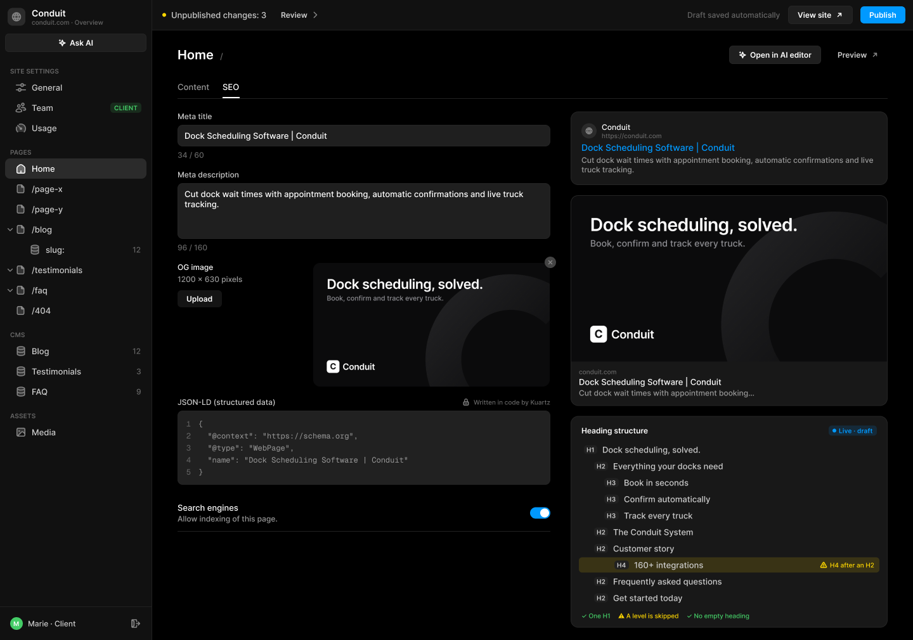
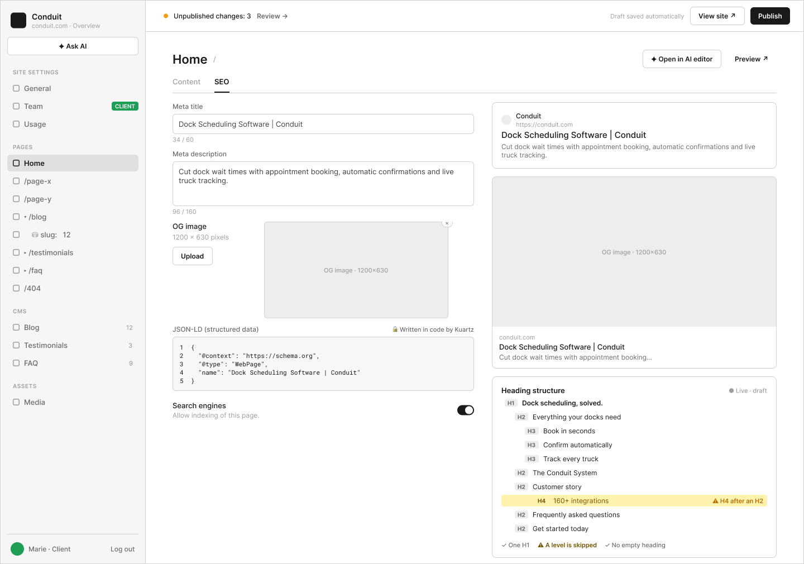

# C2 · Pages › Home — onglet SEO

Extraction Figma du fichier « Kuartz — Carte système » (fileKey `wvr98llwHnMufQ88qUp4Ih`). Notation des arbres et conventions : voir [../README.md](../README.md).

| Champ | Valeur |
|---|---|
| Route | `/admin/pages/<page>/seo` |
| Accès | Kuartz et client admin (barre d’accès : « KUARTZ » bleu #1f70eb + « CLIENT ADMIN » vert #1f9e57 ; LLM context : « Accès : Kuartz et client ») |
| Seul Kuartz voit | Rien de spécifique à voir ; seul Kuartz écrit le JSON-LD (« JSON-LD : écrit à la main par Kuartz dans le code de la page »), affiché au client en lecture seule « 🔒 Written in code by Kuartz ». |
| Wireframe | `214:705` · caption `214:702` · accès `227:1435` |
| LLM context | `504:1813` |
| UI | `359:1054` · caption `359:1050` · accès `359:1553` |
| Captures | [UI](./C2.ui.png) · [Wireframe](./C2.wf.png) |





## Caption et barre d’accès

- Caption wireframe (`214:702`) : C2 · Pages › Home — onglet SEO · [wf/Tag kind=sanity: "Sanity · page.seo"]
- Barre d’accès wireframe (`227:1435`, 1440px) : "KUARTZ" 718px fill=#1f70eb | "CLIENT ADMIN" 718px fill=#1f9e57
- Caption UI (`359:1050`) : C2 · Pages › Home — onglet SEO · [Tag Icon=Icon/close, Show icon=false, Show dot=false, tone=neutral: "Sanity · page.seo"]
- Barre d’accès UI (`359:1553`, 1440px) : "KUARTZ" 718px fill=#1f70eb | "CLIENT ADMIN" 718px fill=#1f9e57

## LLM context

Bloc Figma `504:1813` (page Wireframe), texte verbatim.

> LLM CONTEXT
>
> C2 · Page › SEO
>
> Pages › Home — onglet SEO
>
> Route : /admin/pages/<page>/seo · Accès : Kuartz et client · Sanity : page.seo

<!-- col 1 -->

### EN BREF

Le référencement d’une page : meta title et description, image de partage, JSON-LD (lecture seule), indexation, avec les aperçus et la structure des titres en direct.

### DONNÉES

• page.seo { metaTitle (≤ 60 car.), metaDescription (≤ 160 car.), ogImage (1200 × 630), allowIndexing }.
• JSON-LD : écrit à la main par Kuartz dans le code de la page ; l’admin le lit dans le HTML rendu (balises <script type="application/ld+json">).
• Structure des titres : lue sur la page en brouillon (H1 → H6 du HTML rendu).

### COMPOSANTS

Tabs, Input + compteur, Textarea + compteur, Image preview + Upload + Remove badge, Code block (numéros de ligne, cadenas), Setting row + Switch, Search preview (Google), Social preview, Heading row (H1–H6), tag « Live · draft ».

### COMPORTEMENT (COLONNE GAUCHE)

• Meta title (compteur 34 / 60), Meta description (compteur 96 / 160).
• OG image : « 1200 × 630 pixels », Upload, aperçu au bon ratio, pastille × pour retirer.
• JSON-LD (structured data) : « 🔒 Written in code by Kuartz », lecture seule, numéros de ligne.
• Search engines : « Allow indexing of this page. » Désactivé → noindex pour cette page. Si l’indexation du site est coupée (B2), elle l’emporte.

<!-- col 2 -->

### COMPORTEMENT (COLONNE DROITE)

• Aperçu Google (favicon, nom du site, URL, titre, description) puis carte réseaux sociaux (OG image, domaine, titre, description), mis à jour pendant la frappe.
• Heading structure (tag « Live · draft ») : l’arbre H1 → H6 de la page en brouillon, indenté par niveau, avec les alertes sur la ligne concernée (« ⚠ H4 after an H2 ») et un résumé en bas (« ✓ One H1 · ⚠ A level is skipped · ✓ No empty heading »).
• Alertes : aucun H1 ou plusieurs H1 ; niveau sauté ; titre vide. Elles n’empêchent pas de publier.

### VALEURS PAR DÉFAUT

Champ vide → titre, description ou image du site (B2). Les aperçus montrent la valeur effective.

### RÈGLES

• Compteurs indicatifs : au-delà, chiffre en orange, pas de blocage (proposé).
• L’écran fait 1 010 px de haut : il défile.
• Enregistrement en brouillon, en ligne après Publish.

### VOIR AUSSI

B2 (valeurs par défaut du site), C6 (même onglet pour une page article CMS, avec des variables).

## Wireframe

Écran wireframe `214:705` — textes et annotations dans l’ordre de lecture (▸ = conteneur, [Composant {propriétés}], « (libre) » = conteneur sans auto-layout, enfants triés haut→bas puis gauche→droite).

- ▸ C2 · Page › SEO
  - [wf/Sidebar · Projet {role=Client admin}]
    - "Conduit"
    - "conduit.com · Overview"
    - [wf/Button {Label="✦ Ask AI", variant=secondary}]
    - "SITE SETTINGS"
    - [wf/Nav item {Show icon=true, Count="12", Show count=false, Label="General", state=default}]
    - [wf/Nav item {Show icon=true, Count="12", Show count=false, Label="Team", state=default}]
    - [wf/Tag ]
      - "CLIENT"
    - [wf/Nav item {Show icon=true, Count="12", Show count=false, Label="Usage", state=default}]
    - "PAGES"
    - [wf/Nav item {Show icon=true, Show count=false, Count="12", Label="Home", state=active}]
    - [wf/Nav item {Show icon=true, Count="12", Show count=false, Label="/page-x", state=default}]
    - [wf/Nav item {Show icon=true, Count="12", Show count=false, Label="/page-y", state=default}]
    - [wf/Nav item {Show icon=true, Count="12", Show count=false, Label="▾ /blog", state=default}]
    - [wf/Nav item {Show icon=true, Count="12", Show count=false, Label="    ⛁ slug:   12", state=default}]
    - [wf/Nav item {Show icon=true, Count="12", Show count=false, Label="▸ /testimonials", state=default}]
    - [wf/Nav item {Show icon=true, Count="12", Show count=false, Label="▸ /faq", state=default}]
    - [wf/Nav item {Show icon=true, Count="12", Show count=false, Label="/404", state=default}]
    - "CMS"
    - [wf/Nav item {Show icon=true, Count="12", Show count=true, Label="Blog", state=default}]
    - [wf/Nav item {Show icon=true, Count="3", Show count=true, Label="Testimonials", state=default}]
    - [wf/Nav item {Show icon=true, Count="9", Show count=true, Label="FAQ", state=default}]
    - "ASSETS"
    - [wf/Nav item {Show icon=true, Count="12", Show count=false, Label="Media", state=default}]
    - "Marie · Client"
    - "Log out"
  - ▸ main
    - [wf/Top bar {Status="Unpublished changes: 3"}]
      - "Review →"
      - "Draft saved automatically"
      - [wf/Button {Label="View site ↗", variant=secondary}]
      - [wf/Button {Label="Publish", variant=primary}]
    - ▸ content
      - ▸ page-header
        - "Home"
        - "/"
        - [wf/Button {Label="✦ Open in AI editor", variant=secondary}] «btn/✦ Open in AI editor»
        - [wf/Button {Label="Preview ↗", variant=ghost}] «btn/Preview ↗»
      - ▸ tabs
        - ▸ tab/Content
          - "Content"
        - ▸ tab/SEO
          - "SEO"
      - ▸ cols
        - ▸ fields
          - ▸ Frame
            - [wf/Field {Value="Dock Scheduling Software | Conduit", Show label=true, Label="Meta title", type=text}] «field/Meta title»
            - "34 / 60"
          - ▸ Frame
            - [wf/Field {Show label=true, Value="Cut dock wait times with appointment booking, automatic confirmations and live truck tracking.", Label="Meta description", type=textarea}] «field/Meta description»
            - "96 / 160"
          - ▸ row · OG image
            - ▸ label
              - "OG image"
              - "1200 × 630 pixels"
              - ▸ upload
                - [wf/Button {Label="Upload", variant=secondary}] «btn/Upload»
            - ▸ preview (× remove) (libre)
              - ▸ remove ×
                - "×"
              - [wf/Image {Label="OG image · 1200×630"}]
          - ▸ json-ld
            - ▸ Frame
              - "JSON-LD (structured data)"
              - "🔒 Written in code by Kuartz"
            - ▸ code
              - "1  {\n2    \"@context\": \"https://schema.org\",\n3    \"@type\": \"WebPage\",\n4    \"name\": \"Dock Scheduling Software | Conduit\"\n5  }"
          - ▸ row · Search engines
            - ▸ text
              - "Search engines"
              - "Allow indexing of this page."
        - ▸ right
          - ▸ google-card
            - ▸ google
              - ▸ site
                - ▸ site-name
                  - "Conduit"
                  - "https://conduit.com"
              - "Dock Scheduling Software | Conduit"
              - "Cut dock wait times with appointment booking, automatic confirmations and live truck tracking."
          - ▸ social-card
            - [wf/Image {Label="OG image · 1200×630"}]
            - ▸ text
              - "conduit.com"
              - "Dock Scheduling Software | Conduit"
              - "Cut dock wait times with appointment booking…"
          - ▸ heading-outline
            - ▸ Frame
              - "Heading structure"
              - "● Live · draft"
            - ▸ Frame
              - ▸ Frame
                - "H1"
              - "Dock scheduling, solved."
            - ▸ Frame
              - ▸ Frame
                - "H2"
              - "Everything your docks need"
            - ▸ Frame
              - ▸ Frame
                - "H3"
              - "Book in seconds"
            - ▸ Frame
              - ▸ Frame
                - "H3"
              - "Confirm automatically"
            - ▸ Frame
              - ▸ Frame
                - "H3"
              - "Track every truck"
            - ▸ Frame
              - ▸ Frame
                - "H2"
              - "The Conduit System"
            - ▸ Frame
              - ▸ Frame
                - "H2"
              - "Customer story"
            - ▸ Frame
              - ▸ Frame
                - "H4"
              - "160+ integrations"
              - "⚠ H4 after an H2"
            - ▸ Frame
              - ▸ Frame
                - "H2"
              - "Frequently asked questions"
            - ▸ Frame
              - ▸ Frame
                - "H2"
              - "Get started today"
            - ▸ Frame
              - "✓ One H1"
              - "⚠ A level is skipped"
              - "✓ No empty heading"

## UI — arbre

Écran UI `359:1054` (page UI). Légende : `AL H|V` auto-layout, `gap`, `pad` (1 valeur, [vertical, horizontal] ou [haut, droite, bas, gauche]), `align=principal/secondaire`, `size=largeur/hauteur` (fixed|hug|fill), `@x,y` position libre, `abs@x,y` position absolue dans un auto-layout, `fill/stroke/radius` = variable liée (valeur brute en hex/px si aucune variable), `effect` = style d’effet, `TEXT … · <style de texte> · <couleur>` puis `:: "texte"`, `INST "calque" → Composant {propriétés}` ; sous une instance : `T "texte"` = texte interne non déjà donné par une propriété.

```text
FRAME "C2 · Page › SEO" 1440×1010 · AL H gap=0 align=MIN/MIN · fill=bg/app
  INST "Sidebar" 240×1010 → Sidebar {role=client} · AL V gap=0 align=MIN/MIN · size=fixed/fill · fill=bg/primary · stroke=border/subtle sides[T0 R1 B0 L0]
    INST "icon" 16×16 → Icon/globe {size=18}
    T "Conduit"
    T "conduit.com · Overview"
    INST "ask-ai" 223×29 → Button {Icon left=Icon/ai, Show icon left=true, Icon right=Icon/chevron-down, Show icon right=false, Label="Ask AI", variant=secondary, state=default, size=small}
    INST "section/SITE SETTINGS" 223×32 → Nav section {Show action=false, Label="SITE SETTINGS"}
    INST "nav/General" 223×32 → Nav item {Show tag=false, Show count=false, Count="12", Show chevron=false, Icon=Icon/sliders, Show icon=true, Label="General", state=default}
    INST "nav/Team" 223×32 → Nav item {Show tag=true, Show count=false, Count="12", Show chevron=false, Icon=Icon/team, Show icon=true, Label="Team", state=default}
      INST "tag" 49×16 → Tag {Icon=Icon/close, Show icon=false, Show dot=false, Label="CLIENT", tone=success}
    INST "nav/Usage" 223×32 → Nav item {Show tag=false, Show count=false, Count="12", Show chevron=false, Icon=Icon/usage, Show icon=true, Label="Usage", state=default}
    INST "section/PAGES" 223×32 → Nav section {Show action=false, Label="PAGES"}
    INST "nav/Home" 223×32 → Nav item {Show tag=false, Show chevron=false, Show count=false, Label="Home", Icon=Icon/house, Count="12", Show icon=true, state=active}
    INST "nav//page-x" 223×32 → Nav item {Show tag=false, Show count=false, Count="12", Show chevron=false, Icon=Icon/page, Show icon=true, Label="/page-x", state=default}
    INST "nav//page-y" 223×32 → Nav item {Show tag=false, Show count=false, Count="12", Show chevron=false, Icon=Icon/page, Show icon=true, Label="/page-y", state=default}
    INST "nav//blog" 223×32 → Nav item {Show tag=false, Show count=false, Count="12", Show chevron=true, Icon=Icon/page, Show icon=true, Label="/blog", state=default}
      INST "chevron" 10×10 → Icon/chevron-down {size=12}
    INST "nav//blog/:slug" 223×32 → Nav item {Show tag=false, Show count=true, Count="12", Show chevron=false, Icon=Icon/database, Show icon=true, Label="slug:", state=default}
    INST "nav//testimonials" 223×32 → Nav item {Show tag=false, Show count=false, Count="12", Show chevron=true, Icon=Icon/page, Show icon=true, Label="/testimonials", state=default}
      INST "chevron" 10×10 → Icon/chevron-down {size=12}
    INST "nav//faq" 223×32 → Nav item {Show tag=false, Show count=false, Count="12", Show chevron=true, Icon=Icon/page, Show icon=true, Label="/faq", state=default}
      INST "chevron" 10×10 → Icon/chevron-down {size=12}
    INST "nav//404" 223×32 → Nav item {Show tag=false, Show count=false, Count="12", Show chevron=false, Icon=Icon/page, Show icon=true, Label="/404", state=default}
    INST "section/CMS" 223×32 → Nav section {Show action=false, Label="CMS"}
    INST "nav/Blog" 223×32 → Nav item {Show tag=false, Show count=true, Count="12", Show chevron=false, Icon=Icon/database, Show icon=true, Label="Blog", state=default}
    INST "nav/Testimonials" 223×32 → Nav item {Show tag=false, Show count=true, Count="3", Show chevron=false, Icon=Icon/database, Show icon=true, Label="Testimonials", state=default}
    INST "nav/FAQ" 223×32 → Nav item {Show tag=false, Show count=true, Count="9", Show chevron=false, Icon=Icon/database, Show icon=true, Label="FAQ", state=default}
    INST "section/ASSETS" 223×32 → Nav section {Show action=false, Label="ASSETS"}
    INST "nav/Media" 223×32 → Nav item {Show tag=false, Show count=false, Count="12", Show chevron=false, Icon=Icon/image, Show icon=true, Label="Media", state=default}
    INST "avatar" 20×20 → Avatar {Initials="M", size=20, tone=green}
    T "Marie · Client"
    INST "logout" 28×28 → Icon button {Icon=Icon/logout, style=ghost, state=default, size=small}
  FRAME "main" 1200×1010 · AL V gap=0 align=MIN/MIN · size=fill/fill
    INST "Top bar" 1200×48 → Top bar {state=pending} · AL H gap=space/12 pad=[0, space/12, 0, space/16] align=MIN/CENTER · size=fill/fixed · fill=bg/primary · stroke=border/subtle sides[T0 R0 B1 L0]
      T "Unpublished changes: 3"
      INST "review" 88×27 → Button {Icon left=Icon/plus, Show icon right=true, Icon right=Icon/chevron-right, Show icon left=false, Label="Review", variant=ghost, state=default, size=small}
      T "Draft saved automatically"
      INST "view-site" 102×29 → Button {Icon left=Icon/plus, Show icon left=false, Icon right=Icon/external, Show icon right=true, Label="View site", variant=secondary, state=default, size=small}
      INST "publish" 71×27 → Publish button {state=pending}
        INST "button" 71×27 → Button {Icon left=Icon/plus, Icon right=Icon/chevron-down, Show icon right=false, Show icon left=false, Label="Publish", variant=primary, state=default, size=small}
    FRAME "content" 1200×962 · AL V gap=space/20 pad=[space/24, space/40, space/16, space/40] align=MIN/MIN · size=fill/fill
      FRAME "page-header" 1120×29 · AL H gap=space/12 align=MIN/CENTER · size=fill/hug
        INST "Page header" 858×24 → Page header {Show description=false, Description="Images, videos and files used on the site. A file that is in use cannot be deleted.", Show meta=true, Meta="/", Title="Home"} · AL V gap=space/4 align=MIN/MIN · size=fill/hug
        INST "Button" 145×29 → Button {Icon left=Icon/ai, Show icon left=true, Icon right=Icon/chevron-down, Show icon right=false, Label="Open in AI editor", variant=secondary, state=default, size=small} · AL H gap=space/6 pad=[space/6, 14] align=CENTER/CENTER · size=hug/hug · fill=bg/input · stroke=border/default 1 · radius=6
        INST "Button" 93×27 → Button {Icon left=Icon/plus, Show icon right=true, Icon right=Icon/external, Show icon left=false, Label="Preview", variant=ghost, state=default, size=small} · AL H gap=space/6 pad=[space/6, 14] align=CENTER/CENTER · size=hug/hug · radius=6
      INST "Tabs" 1120×35 → Tabs {count=2} · AL H gap=space/20 align=MIN/MAX · size=fill/hug · stroke=border/subtle sides[T0 R0 B1 L0]
        INST "tab 1" 51×34 → Tab {Label="Content", state=default}
        INST "tab 2" 27×34 → Tab {Label="SEO", state=active}
      FRAME "body" 1120×815 · AL H gap=space/32 align=MIN/MIN · size=fill/hug
        FRAME "fields" 588×663 · AL V gap=space/16 align=MIN/MIN · size=fill/hug
          INST "Input" 588×76 → Input {Placeholder="Placeholder", Show icon=false, Helper="34 / 60", Show helper=true, Show label=true, Icon=Icon/search, Value="Dock Scheduling Software | Conduit", Label="Meta title", state=filled, layout=stacked} · AL V gap=space/6 align=MIN/MIN · size=fill/hug
          INST "Textarea" 588×130 → Textarea {Placeholder="Describe this page in one or two sentences…", Value="Cut dock wait times with appointment booking, automatic confirmations and live truck tracking.", Helper="96 / 160", Label="Meta description", Show label=true, Show helper=true, state=filled, layout=stacked} · AL V gap=space/6 align=MIN/MIN · size=fill/hug
          FRAME "og-row" 588×197 · AL H gap=space/16 align=MIN/MIN · size=fill/hug
            FRAME "meta" 197×71 · AL V gap=space/10 align=MIN/MIN · size=fill/hug
              FRAME "labels" 197×34 · AL V gap=space/4 align=MIN/MIN · size=fill/hug
                TEXT "label" 57×15 · Body Small · text/primary · size=hug/hug :: "OG image"
                TEXT "dimensions" 103×15 · Body Small · text/tertiary · size=hug/hug :: "1200 × 630 pixels"
              INST "upload" 70×27 → Button {Icon left=Icon/plus, Show icon right=false, Icon right=Icon/chevron-down, Show icon left=false, Label="Upload", variant=subtle, state=default, size=small} · AL H gap=space/6 pad=[space/6, 14] align=CENTER/CENTER · size=hug/hug · fill=bg/tint/neutral@8% · radius=6
            INST "og-image" 375×197 → Image preview {state=filled} · size=fixed/fixed
              INST "remove" 18×18 → Remove badge
          INST "Code block" 588×138 → Code block {Label="JSON-LD (structured data)", state=read-only} · AL V gap=space/6 align=MIN/MIN · size=fill/hug
            INST "lock" 12×12 → Icon/lock {size=12}
            T "Written in code by Kuartz"
            T "1\n2\n3\n4\n5"
            T "{\n  \"@context\": \"https://schema.org\",\n  \"@type\": \"WebPage\",\n  \"name\": \"Dock Scheduling Software | Conduit\"\n}"
          INST "Setting row" 588×58 → Setting row {Show description=true, Description="Allow indexing of this page.", Title="Search engines"} · AL H gap=space/24 pad=[space/12, 0] align=MIN/CENTER · size=fill/hug · stroke=border/subtle sides[T0 R0 B1 L0]
            INST "switch" 32×18 → Switch {Show label=false, Label="Switch label", state=on}
        FRAME "previews" 500×815 · AL V gap=space/16 align=MIN/MIN · size=fixed/hug
          INST "Search preview" 500×116 → Search preview {Description="Cut dock wait times with appointment booking, automatic confirmations and live truck tracking.", Title="Dock Scheduling Software | Conduit", URL="https://conduit.com", Site name="Conduit"} · AL V gap=space/4 pad=space/16 align=MIN/MIN · size=fill/hug · fill=bg/elevated · stroke=border/default 1 · radius=radius/lg
            INST "icon" 12×12 → Icon/globe {size=12}
          INST "Social preview" 500×333 → Social preview {Description="Cut dock wait times with appointment booking…", Title="Dock Scheduling Software | Conduit", Domain="conduit.com"} · AL V gap=0 align=MIN/MIN · size=fill/hug · fill=bg/elevated · stroke=border/default 1 · radius=radius/lg
          FRAME "heading-structure" 500×334 · AL V gap=space/2 pad=space/12 align=MIN/MIN · size=fill/hug · fill=bg/elevated · stroke=border/default 1 · radius=radius/lg
            FRAME "header" 474×26 · AL H gap=space/8 pad=[space/2, space/4, space/8, space/4] align=MIN/CENTER · size=fill/hug
              TEXT "title" 382×15 · Label · text/primary · size=fill/hug :: "Heading structure"
              INST "Tag" 76×16 → Tag {Icon=Icon/close, Show icon=false, Show dot=true, Label="Live · draft", tone=info} · AL H gap=space/4 pad=[space/2, space/6] align=MIN/CENTER · size=hug/hug · fill=bg/tint/info@14% · radius=radius/sm
            INST "Heading row" 474×24 → Heading row {Note="H4 after an H2", Text="Dock scheduling, solved.", level=h1, status=ok} · AL H gap=space/8 pad=[space/4, space/8] align=MIN/CENTER · size=fill/hug · radius=radius/sm
              T "H1"
            INST "Heading row" 474×24 → Heading row {Note="H4 after an H2", Text="Everything your docks need", level=h2, status=ok} · AL H gap=space/8 pad=[space/4, space/8, space/4, space/24] align=MIN/CENTER · size=fill/hug · radius=radius/sm
              T "H2"
            INST "Heading row" 474×24 → Heading row {Note="H4 after an H2", Text="Book in seconds", level=h3, status=ok} · AL H gap=space/8 pad=[space/4, space/8, space/4, space/40] align=MIN/CENTER · size=fill/hug · radius=radius/sm
              T "H3"
            INST "Heading row" 474×24 → Heading row {Note="H4 after an H2", Text="Confirm automatically", level=h3, status=ok} · AL H gap=space/8 pad=[space/4, space/8, space/4, space/40] align=MIN/CENTER · size=fill/hug · radius=radius/sm
              T "H3"
            INST "Heading row" 474×24 → Heading row {Note="H4 after an H2", Text="Track every truck", level=h3, status=ok} · AL H gap=space/8 pad=[space/4, space/8, space/4, space/40] align=MIN/CENTER · size=fill/hug · radius=radius/sm
              T "H3"
            INST "Heading row" 474×24 → Heading row {Note="H4 after an H2", Text="The Conduit System", level=h2, status=ok} · AL H gap=space/8 pad=[space/4, space/8, space/4, space/24] align=MIN/CENTER · size=fill/hug · radius=radius/sm
              T "H2"
            INST "Heading row" 474×24 → Heading row {Note="H4 after an H2", Text="Customer story", level=h2, status=ok} · AL H gap=space/8 pad=[space/4, space/8, space/4, space/24] align=MIN/CENTER · size=fill/hug · radius=radius/sm
              T "H2"
            INST "Heading row" 474×24 → Heading row {Note="H4 after an H2", Text="160+ integrations", level=h4, status=warning} · AL H gap=space/8 pad=[space/4, space/8, space/4, 56] align=MIN/CENTER · size=fill/hug · fill=bg/tint/warning@14% · radius=radius/sm
              T "H4"
              INST "icon" 12×12 → Icon/warning {size=12}
            INST "Heading row" 474×24 → Heading row {Note="H4 after an H2", Text="Frequently asked questions", level=h2, status=ok} · AL H gap=space/8 pad=[space/4, space/8, space/4, space/24] align=MIN/CENTER · size=fill/hug · radius=radius/sm
              T "H2"
            INST "Heading row" 474×24 → Heading row {Note="H4 after an H2", Text="Get started today", level=h2, status=ok} · AL H gap=space/8 pad=[space/4, space/8, space/4, space/24] align=MIN/CENTER · size=fill/hug · radius=radius/sm
              T "H2"
            FRAME "summary" 474×20 · AL H gap=space/12 pad=[space/8, space/4, 0, space/4] align=MIN/CENTER · size=fill/hug
              TEXT "ok1" 46×12 · Caption · interactive/success · size=hug/hug :: "✓ One H1"
              TEXT "warn" 96×12 · Caption · interactive/warning · size=hug/hug :: "⚠ A level is skipped"
              TEXT "ok2" 99×12 · Caption · interactive/success · size=hug/hug :: "✓ No empty heading"
```
