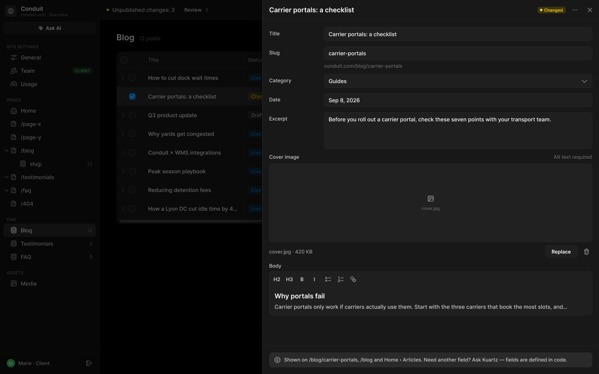
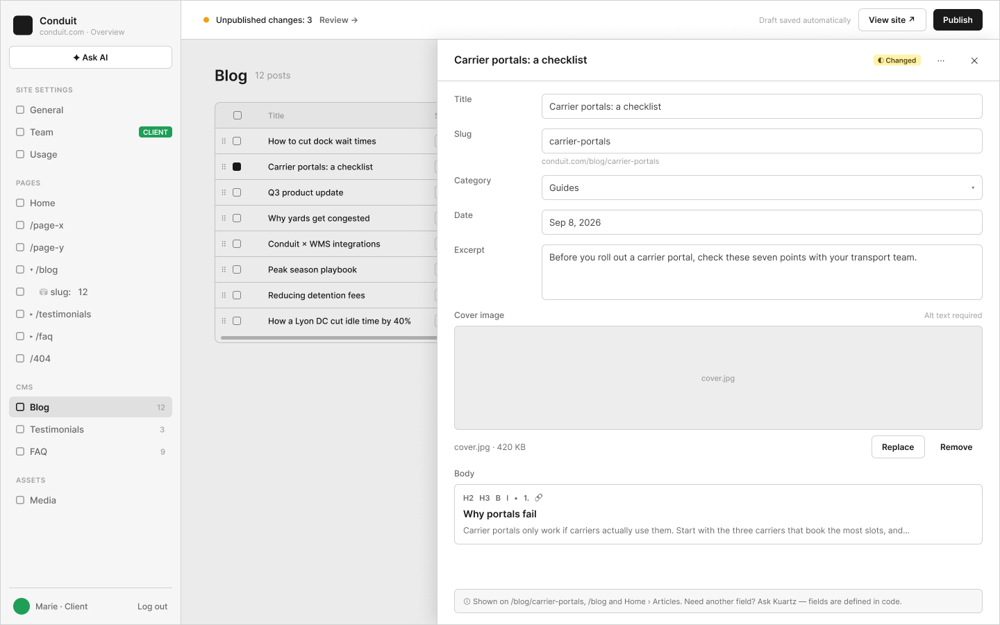

# C4 · CMS › Blog — fiche en panneau à droite

Extraction Figma du fichier « Kuartz — Carte système » (fileKey `wvr98llwHnMufQ88qUp4Ih`). Notation des arbres et conventions : voir [../README.md](../README.md).

| Champ | Valeur |
|---|---|
| Route | `/admin/cms/<collection>/<id> (proposé : URL partageable)` |
| Accès | Kuartz et client admin (barre d’accès : « KUARTZ » bleu #1f70eb + « CLIENT ADMIN » vert #1f9e57 ; LLM context : « Accès : Kuartz et client ») |
| Seul Kuartz voit | Rien de spécifique à cet écran. Ajouter un champ reste du ressort de Kuartz : « Ajouter un champ = demande à Kuartz : schéma + affichage sur le site + déploiement » ; pied du drawer « Need another field? Ask Kuartz — fields are defined in code. » |
| Wireframe | `214:1015` · caption `214:1012` · accès `227:1581` |
| LLM context | `505:1773` |
| UI | `359:1229` · caption `359:1225` · accès `359:1563` |
| Captures | [UI](./C4.ui.png) · [Wireframe](./C4.wf.png) |





## Caption et barre d’accès

- Caption wireframe (`214:1012`) : C4 · CMS › Blog — fiche en panneau à droite · [wf/Tag kind=sanity: "Sanity · post (drafts.<id>)"]
- Barre d’accès wireframe (`227:1581`, 1440px) : "KUARTZ" 718px fill=#1f70eb | "CLIENT ADMIN" 718px fill=#1f9e57
- Caption UI (`359:1225`) : C4 · CMS › Blog — fiche en panneau à droite · [Tag Icon=Icon/close, Show icon=false, Show dot=false, tone=neutral: "Sanity · post (drafts.<id>)"]
- Barre d’accès UI (`359:1563`, 1440px) : "KUARTZ" 718px fill=#1f70eb | "CLIENT ADMIN" 718px fill=#1f9e57

## LLM context

Bloc Figma `505:1773` (page Wireframe), texte verbatim.

> LLM CONTEXT
>
> C4 · CMS › Blog item (drawer)
>
> La fiche d’un élément, dans un panneau à droite
>
> Route : /admin/cms/<collection>/<id> (proposé : URL partageable) · Accès : Kuartz et client · Sanity : post (brouillon drafts.<id>)

<!-- col 1 -->

### EN BREF

La fiche complète d’un élément s’ouvre dans un drawer de 810 px à droite, par-dessus la liste (comme le CMS de Framer), pas sur une nouvelle page. Les champs sont les uns sous les autres, libellé à gauche.

### OUVERTURE ET FERMETURE

• S’ouvre par : le bouton open d’une ligne (C3), « + » (nouvel élément créé en brouillon), ou un lien depuis un autre écran.
• La liste reste visible à gauche, grisée ; la ligne ouverte y est cochée.
• Se ferme par ✕, par un clic dans la zone grisée (retour à la liste) ou par Échap.

### COMPOSANTS

Drawer (810 px, prop Title, statut), Tag de statut, Icon button ⋯ et ✕, Input, Select, Textarea, Image upload, Rich text field, Callout.

### EN-TÊTE

• Titre de l’élément et statut (◐ Changed).
• ⋯ (proposé) : Preview ↗ (la page de l’article en brouillon, nouvel onglet), Discard changes (supprime le brouillon, retour à la version en ligne, avec confirmation), Delete (supprime l’élément, avec confirmation).
• ✕ ferme.

<!-- col 2 -->

### CHAMPS (BLOG)

• Title ; Slug (généré depuis le titre à la création, modifiable ; l’adresse complète dessous : conduit.com/blog/carrier-portals) ; Category (liste fermée) ; Date ; Excerpt.
• Cover image : aperçu, « cover.jpg · 420 KB », Replace (médiathèque ou fichier), Remove ; « Alt text required » tant que l’image n’a pas de texte alternatif.
• Body : texte riche (Portable Text) avec H2, H3, gras, italique, listes, lien.
• Pied : où l’élément apparaît (« Shown on /blog/carrier-portals, /blog and Home › Articles ») + « Need another field? Ask Kuartz — fields are defined in code. »
• Testimonials, FAQ… utilisent le même drawer avec leurs propres champs.

### RÈGLES

• Chaque frappe enregistre le brouillon ; en ligne après Publish (E1).
• Les champs d’une collection sont définis dans le code (schéma Sanity). Ajouter un champ = demande à Kuartz : schéma + affichage sur le site + déploiement.
• Texte alternatif : stocké sur l’asset dans la médiathèque (C5), une valeur par image reprise partout (hypothèse, question 13).
• Slug : unique dans la collection ; un changement de slug change l’URL publique (redirection : à prévoir, proposé).

### À TRANCHER

• Question 3 : publier un élément seul, ou seulement via Publish ? Proposé : Publish seulement.

## Wireframe

Écran wireframe `214:1015` — textes et annotations dans l’ordre de lecture (▸ = conteneur, [Composant {propriétés}], « (libre) » = conteneur sans auto-layout, enfants triés haut→bas puis gauche→droite).

- ▸ C4 · CMS › Blog item (drawer)
  - [wf/Sidebar · Projet {role=Client admin}]
    - "Conduit"
    - "conduit.com · Overview"
    - [wf/Button {Label="✦ Ask AI", variant=secondary}]
    - "SITE SETTINGS"
    - [wf/Nav item {Show icon=true, Count="12", Show count=false, Label="General", state=default}]
    - [wf/Nav item {Show icon=true, Count="12", Show count=false, Label="Team", state=default}]
    - [wf/Tag ]
      - "CLIENT"
    - [wf/Nav item {Show icon=true, Count="12", Show count=false, Label="Usage", state=default}]
    - "PAGES"
    - [wf/Nav item {Show icon=true, Count="12", Show count=false, Label="Home", state=default}]
    - [wf/Nav item {Show icon=true, Count="12", Show count=false, Label="/page-x", state=default}]
    - [wf/Nav item {Show icon=true, Count="12", Show count=false, Label="/page-y", state=default}]
    - [wf/Nav item {Show icon=true, Count="12", Show count=false, Label="▾ /blog", state=default}]
    - [wf/Nav item {Show icon=true, Count="12", Show count=false, Label="    ⛁ slug:   12", state=default}]
    - [wf/Nav item {Show icon=true, Count="12", Show count=false, Label="▸ /testimonials", state=default}]
    - [wf/Nav item {Show icon=true, Count="12", Show count=false, Label="▸ /faq", state=default}]
    - [wf/Nav item {Show icon=true, Count="12", Show count=false, Label="/404", state=default}]
    - "CMS"
    - [wf/Nav item {Show icon=true, Show count=true, Count="12", Label="Blog", state=active}]
    - [wf/Nav item {Show icon=true, Count="3", Show count=true, Label="Testimonials", state=default}]
    - [wf/Nav item {Show icon=true, Count="9", Show count=true, Label="FAQ", state=default}]
    - "ASSETS"
    - [wf/Nav item {Show icon=true, Count="12", Show count=false, Label="Media", state=default}]
    - "Marie · Client"
    - "Log out"
  - ▸ main
    - [wf/Top bar {Status="Unpublished changes: 3"}]
      - "Review →"
      - "Draft saved automatically"
      - [wf/Button {Label="View site ↗", variant=secondary}]
      - [wf/Button {Label="Publish", variant=primary}]
    - ▸ content
      - ▸ page-header
        - "Blog"
        - "12 posts"
        - ▸ toolbar-icons
          - ▸ icon/add
            - "+"
          - ▸ icon/sort
            - "⇅"
          - ▸ icon/filter
            - "≡"
          - ▸ icon/search
            - "⌕"
      - ▸ cms-table
        - ▸ viewport (clips, scroll x) (libre)
          - ▸ grid (1460 wide, scrolls in x)
            - ▸ thead
              - ▸ cell · Title
                - "Title"
              - ▸ cell · Status
                - "Status"
              - ▸ cell · Slug
                - "Slug"
              - ▸ cell · Cover
                - "Cover"
              - ▸ cell · Category
                - "Category"
              - ▸ cell · Date
                - "Date"
              - ▸ cell · Author
                - "Author"
              - ▸ cell · Excerpt
                - "Excerpt"
            - ▸ row · How to cut dock wait times
              - ▸ cell · grip + select
                - "⠿"
              - ▸ cell · Title
                - "How to cut dock wait times"
              - ▸ cell · Status
                - ▸ status · Live
                  - "● Live"
                  - "▾"
              - ▸ cell · Slug
                - "how-to-cut-dock-wait-times"
              - ▸ cell · Cover
                - [wf/Image {Label=""}]
              - ▸ cell · Category
                - "Guides"
              - ▸ cell · Date
                - "Sep 12, 2026"
              - ▸ cell · Author
                - "Marie Laurent"
              - ▸ cell · Excerpt
                - "Five changes that cut average dock wait from 42 to 12 minutes."
            - ▸ row · Carrier portals: a checklist
              - ▸ cell · grip + select
                - "⠿"
              - ▸ cell · Title
                - "Carrier portals: a checklist"
              - ▸ cell · Status
                - ▸ status · Changed
                  - "◐ Changed"
                  - "▾"
              - ▸ cell · Slug
                - "carrier-portals"
              - ▸ cell · Cover
                - [wf/Image {Label=""}]
              - ▸ cell · Category
                - "Guides"
              - ▸ cell · Date
                - "Sep 8, 2026"
              - ▸ cell · Author
                - "Paul Girard"
              - ▸ cell · Excerpt
                - "Before you roll out a carrier portal, check these seven points with your transport team."
            - ▸ row · Q3 product update
              - ▸ cell · grip + select
                - "⠿"
              - ▸ cell · Title
                - "Q3 product update"
              - ▸ cell · Status
                - ▸ status · Draft
                  - "○ Draft"
                  - "▾"
              - ▸ cell · Slug
                - "q3-product-update"
              - ▸ cell · Cover
                - [wf/Image {Label=""}]
              - ▸ cell · Category
                - "News"
              - ▸ cell · Date
                - "—"
              - ▸ cell · Author
                - "Marie Laurent"
              - ▸ cell · Excerpt
                - "Dock calendar sync, carrier ETAs and a faster mobile app."
            - ▸ row · Why yards get congested
              - ▸ cell · grip + select
                - "⠿"
              - ▸ cell · Title
                - "Why yards get congested"
              - ▸ cell · Status
                - ▸ status · Live
                  - "● Live"
                  - "▾"
              - ▸ cell · Slug
                - "why-yards-get-congested"
              - ▸ cell · Cover
                - [wf/Image {Label=""}]
              - ▸ cell · Category
                - "Insights"
              - ▸ cell · Date
                - "Aug 30, 2026"
              - ▸ cell · Author
                - "Andrea Costa"
              - ▸ cell · Excerpt
                - "Most yard congestion starts with appointments nobody confirms."
            - ▸ row · Conduit × WMS integrations
              - ▸ cell · grip + select
                - "⠿"
              - ▸ cell · Title
                - "Conduit × WMS integrations"
              - ▸ cell · Status
                - ▸ status · Live
                  - "● Live"
                  - "▾"
              - ▸ cell · Slug
                - "conduit-wms-integrations"
              - ▸ cell · Cover
                - [wf/Image {Label=""}]
              - ▸ cell · Category
                - "Product"
              - ▸ cell · Date
                - "Aug 21, 2026"
              - ▸ cell · Author
                - "Paul Girard"
              - ▸ cell · Excerpt
                - "Connect Conduit to your WMS in an afternoon."
            - ▸ row · Peak season playbook
              - ▸ cell · grip + select
                - "⠿"
              - ▸ cell · Title
                - "Peak season playbook"
              - ▸ cell · Status
                - ▸ status · Live
                  - "● Live"
                  - "▾"
              - ▸ cell · Slug
                - "peak-season-playbook"
              - ▸ cell · Cover
                - [wf/Image {Label=""}]
              - ▸ cell · Category
                - "Guides"
              - ▸ cell · Date
                - "Aug 2, 2026"
              - ▸ cell · Author
                - "Marie Laurent"
              - ▸ cell · Excerpt
                - "How to plan dock capacity before the Q4 rush."
            - ▸ row · Reducing detention fees
              - ▸ cell · grip + select
                - "⠿"
              - ▸ cell · Title
                - "Reducing detention fees"
              - ▸ cell · Status
                - ▸ status · Live
                  - "● Live"
                  - "▾"
              - ▸ cell · Slug
                - "reducing-detention-fees"
              - ▸ cell · Cover
                - [wf/Image {Label=""}]
              - ▸ cell · Category
                - "Guides"
              - ▸ cell · Date
                - "Jul 18, 2026"
              - ▸ cell · Author
                - "Andrea Costa"
              - ▸ cell · Excerpt
                - "Detention fees drop when carriers can book their own slots."
            - ▸ row · How a Lyon DC cut idle time by 40%
              - ▸ cell · grip + select
                - "⠿"
              - ▸ cell · Title
                - "How a Lyon DC cut idle time by 40%"
              - ▸ cell · Status
                - ▸ status · Live
                  - "● Live"
                  - "▾"
              - ▸ cell · Slug
                - "lyon-dc-idle-time"
              - ▸ cell · Cover
                - [wf/Image {Label=""}]
              - ▸ cell · Category
                - "Case study"
              - ▸ cell · Date
                - "Jul 3, 2026"
              - ▸ cell · Author
                - "Paul Girard"
              - ▸ cell · Excerpt
                - "A regional DC shares its numbers after six months."
    - ▸ drawer
      - ▸ drawer-header
        - "Carrier portals: a checklist"
        - ▸ status · Changed
          - "◐ Changed"
        - [wf/Button {Label="⋯", variant=ghost}] «btn/⋯»
        - [wf/Button {Label="✕", variant=ghost}] «btn/✕»
      - ▸ fields
        - ▸ field · Title
          - "Title"
          - ▸ input
            - [wf/Field {Value="Carrier portals: a checklist", Show label=false, Label="Label", type=text}]
        - ▸ field · Slug
          - "Slug"
          - ▸ input
            - [wf/Field {Value="carrier-portals", Show label=false, Label="Label", type=text}]
            - "conduit.com/blog/carrier-portals"
        - ▸ field · Category
          - "Category"
          - ▸ input
            - [wf/Field {Show label=false, Value="Guides", Label="Label", type=select}]
              - "▾"
        - ▸ field · Date
          - "Date"
          - ▸ input
            - [wf/Field {Value="Sep 8, 2026", Show label=false, Label="Label", type=text}]
        - ▸ field · Excerpt
          - "Excerpt"
          - ▸ input
            - [wf/Field {Show label=false, Value="Before you roll out a carrier portal, check these seven points with your transport team.", Label="Label", type=textarea}]
        - ▸ field · Cover image
          - ▸ label-row
            - "Cover image"
            - "Alt text required"
          - [wf/Image {Label="cover.jpg"}]
          - ▸ file-row
            - "cover.jpg · 420 KB"
            - [wf/Button {Label="Replace", variant=secondary}] «btn/Replace»
            - [wf/Button {Label="Remove", variant=ghost}] «btn/Remove»
        - ▸ field · Body
          - "Body"
          - ▸ rich text
            - "H2   H3   B   I   •   1.   🔗" (toolbar)
            - "Why portals fail"
            - "Carrier portals only work if carriers actually use them. Start with the three carriers that book the most slots, and…"
      - ▸ drawer-footer
        - ▸ footer · info
          - "ⓘ Shown on /blog/carrier-portals, /blog and Home › Articles. Need another field? Ask Kuartz — fields are defined in code."

## UI — arbre

Écran UI `359:1229` (page UI). Légende : `AL H|V` auto-layout, `gap`, `pad` (1 valeur, [vertical, horizontal] ou [haut, droite, bas, gauche]), `align=principal/secondaire`, `size=largeur/hauteur` (fixed|hug|fill), `@x,y` position libre, `abs@x,y` position absolue dans un auto-layout, `fill/stroke/radius` = variable liée (valeur brute en hex/px si aucune variable), `effect` = style d’effet, `TEXT … · <style de texte> · <couleur>` puis `:: "texte"`, `INST "calque" → Composant {propriétés}` ; sous une instance : `T "texte"` = texte interne non déjà donné par une propriété.

```text
FRAME "C4 · CMS › Blog item (drawer)" 1440×900 · AL H gap=0 align=MIN/MIN · fill=bg/app
  INST "Sidebar" 240×900 → Sidebar {role=client} · AL V gap=0 align=MIN/MIN · size=fixed/fill · fill=bg/primary · stroke=border/subtle sides[T0 R1 B0 L0]
    INST "icon" 16×16 → Icon/globe {size=18}
    T "Conduit"
    T "conduit.com · Overview"
    INST "ask-ai" 223×29 → Button {Icon left=Icon/ai, Show icon left=true, Icon right=Icon/chevron-down, Show icon right=false, Label="Ask AI", variant=secondary, state=default, size=small}
    INST "section/SITE SETTINGS" 223×32 → Nav section {Show action=false, Label="SITE SETTINGS"}
    INST "nav/General" 223×32 → Nav item {Show tag=false, Show count=false, Count="12", Show chevron=false, Icon=Icon/sliders, Show icon=true, Label="General", state=default}
    INST "nav/Team" 223×32 → Nav item {Show tag=true, Show count=false, Count="12", Show chevron=false, Icon=Icon/team, Show icon=true, Label="Team", state=default}
      INST "tag" 49×16 → Tag {Icon=Icon/close, Show icon=false, Show dot=false, Label="CLIENT", tone=success}
    INST "nav/Usage" 223×32 → Nav item {Show tag=false, Show count=false, Count="12", Show chevron=false, Icon=Icon/usage, Show icon=true, Label="Usage", state=default}
    INST "section/PAGES" 223×32 → Nav section {Show action=false, Label="PAGES"}
    INST "nav/Home" 223×32 → Nav item {Show tag=false, Show count=false, Count="12", Show chevron=false, Icon=Icon/house, Show icon=true, Label="Home", state=default}
    INST "nav//page-x" 223×32 → Nav item {Show tag=false, Show count=false, Count="12", Show chevron=false, Icon=Icon/page, Show icon=true, Label="/page-x", state=default}
    INST "nav//page-y" 223×32 → Nav item {Show tag=false, Show count=false, Count="12", Show chevron=false, Icon=Icon/page, Show icon=true, Label="/page-y", state=default}
    INST "nav//blog" 223×32 → Nav item {Show tag=false, Show count=false, Count="12", Show chevron=true, Icon=Icon/page, Show icon=true, Label="/blog", state=default}
      INST "chevron" 10×10 → Icon/chevron-down {size=12}
    INST "nav//blog/:slug" 223×32 → Nav item {Show tag=false, Show count=true, Count="12", Show chevron=false, Icon=Icon/database, Show icon=true, Label="slug:", state=default}
    INST "nav//testimonials" 223×32 → Nav item {Show tag=false, Show count=false, Count="12", Show chevron=true, Icon=Icon/page, Show icon=true, Label="/testimonials", state=default}
      INST "chevron" 10×10 → Icon/chevron-down {size=12}
    INST "nav//faq" 223×32 → Nav item {Show tag=false, Show count=false, Count="12", Show chevron=true, Icon=Icon/page, Show icon=true, Label="/faq", state=default}
      INST "chevron" 10×10 → Icon/chevron-down {size=12}
    INST "nav//404" 223×32 → Nav item {Show tag=false, Show count=false, Count="12", Show chevron=false, Icon=Icon/page, Show icon=true, Label="/404", state=default}
    INST "section/CMS" 223×32 → Nav section {Show action=false, Label="CMS"}
    INST "nav/Blog" 223×32 → Nav item {Show tag=false, Show chevron=false, Show count=true, Label="Blog", Icon=Icon/database, Count="12", Show icon=true, state=active}
    INST "nav/Testimonials" 223×32 → Nav item {Show tag=false, Show count=true, Count="3", Show chevron=false, Icon=Icon/database, Show icon=true, Label="Testimonials", state=default}
    INST "nav/FAQ" 223×32 → Nav item {Show tag=false, Show count=true, Count="9", Show chevron=false, Icon=Icon/database, Show icon=true, Label="FAQ", state=default}
    INST "section/ASSETS" 223×32 → Nav section {Show action=false, Label="ASSETS"}
    INST "nav/Media" 223×32 → Nav item {Show tag=false, Show count=false, Count="12", Show chevron=false, Icon=Icon/image, Show icon=true, Label="Media", state=default}
    INST "avatar" 20×20 → Avatar {Initials="M", size=20, tone=green}
    T "Marie · Client"
    INST "logout" 28×28 → Icon button {Icon=Icon/logout, style=ghost, state=default, size=small}
  FRAME "main" 1200×900 · AL V gap=0 align=MIN/MIN · size=fill/fill
    INST "Top bar" 1200×48 → Top bar {state=pending} · AL H gap=space/12 pad=[0, space/12, 0, space/16] align=MIN/CENTER · size=fill/fixed · fill=bg/primary · stroke=border/subtle sides[T0 R0 B1 L0]
      T "Unpublished changes: 3"
      INST "review" 88×27 → Button {Icon left=Icon/plus, Show icon right=true, Icon right=Icon/chevron-right, Show icon left=false, Label="Review", variant=ghost, state=default, size=small}
      T "Draft saved automatically"
      INST "view-site" 102×29 → Button {Icon left=Icon/plus, Show icon left=false, Icon right=Icon/external, Show icon right=true, Label="View site", variant=secondary, state=default, size=small}
      INST "publish" 71×27 → Publish button {state=pending}
        INST "button" 71×27 → Button {Icon left=Icon/plus, Icon right=Icon/chevron-down, Show icon right=false, Show icon left=false, Label="Publish", variant=primary, state=default, size=small}
    FRAME "content" 1200×852 · AL V gap=space/20 pad=[28, space/40, space/40, space/40] align=MIN/MIN · size=fill/fill
      FRAME "page-header" 1120×28 · AL H gap=space/4 align=MIN/CENTER · size=fill/hug
        INST "Page header" 992×24 → Page header {Show description=false, Description="Images, videos and files used on the site. A file that is in use cannot be deleted.", Show meta=true, Meta="12 posts", Title="Blog"} · AL V gap=space/4 align=MIN/MIN · size=fill/hug
        INST "tool/plus" 28×28 → Icon button {Icon=Icon/plus, style=ghost, state=default, size=small} · AL H gap=0 align=CENTER/CENTER · size=fixed/fixed · radius=radius/md
        INST "tool/sort" 28×28 → Icon button {Icon=Icon/sort, style=ghost, state=default, size=small} · AL H gap=0 align=CENTER/CENTER · size=fixed/fixed · radius=radius/md
        INST "tool/filter" 28×28 → Icon button {Icon=Icon/filter, style=ghost, state=default, size=small} · AL H gap=0 align=CENTER/CENTER · size=fixed/fixed · radius=radius/md
        INST "tool/search" 28×28 → Icon button {Icon=Icon/search, style=ghost, state=default, size=small} · AL H gap=0 align=CENTER/CENTER · size=fixed/fixed · radius=radius/md
      FRAME "cms-table" 1120×415 · AL V gap=0 pad=[0, 0, 14, 0] align=MIN/MIN · size=fill/hug · fill=bg/elevated · radius=12
        FRAME "grid" 1460×401 · AL V gap=0 align=MIN/MIN · size=hug/hug
          FRAME "row/header" 1460×41 · AL H gap=0 align=MIN/MIN · size=hug/hug · stroke=border/default sides[T0 R0 B1 L0]
            INST "h/select" 64×40 → CMS cell {Label="Title", type=handle, state=default} · AL H gap=8 pad=[0, 10] align=MIN/CENTER · size=fixed/fixed · stroke=border/subtle sides[T0 R1 B0 L0]
              INST "checkbox" 16×16 → Checkbox {Show label=false, Label="Checkbox label", state=unchecked}
            INST "h/Title" 240×40 → CMS cell {Label="Title", type=header, state=default} · AL H gap=2 pad=[0, 12] align=MIN/CENTER · size=fixed/fixed · stroke=border/subtle sides[T0 R1 B0 L0]
            INST "h/Status" 120×40 → CMS cell {Label="Status", type=header, state=default} · AL H gap=2 pad=[0, 12] align=MIN/CENTER · size=fixed/fixed · stroke=border/subtle sides[T0 R1 B0 L0]
            INST "h/Slug" 220×40 → CMS cell {Label="Slug", type=header, state=default} · AL H gap=2 pad=[0, 12] align=MIN/CENTER · size=fixed/fixed · stroke=border/subtle sides[T0 R1 B0 L0]
            INST "h/Cover" 96×40 → CMS cell {Label="Cover", type=header, state=default} · AL H gap=2 pad=[0, 12] align=MIN/CENTER · size=fixed/fixed · stroke=border/subtle sides[T0 R1 B0 L0]
            INST "h/Category" 130×40 → CMS cell {Label="Category", type=header, state=default} · AL H gap=2 pad=[0, 12] align=MIN/CENTER · size=fixed/fixed · stroke=border/subtle sides[T0 R1 B0 L0]
            INST "h/Date" 120×40 → CMS cell {Label="Date", type=header, state=default} · AL H gap=2 pad=[0, 12] align=MIN/CENTER · size=fixed/fixed · stroke=border/subtle sides[T0 R1 B0 L0]
            INST "h/Author" 150×40 → CMS cell {Label="Author", type=header, state=default} · AL H gap=2 pad=[0, 12] align=MIN/CENTER · size=fixed/fixed · stroke=border/subtle sides[T0 R1 B0 L0]
            INST "h/Excerpt" 320×40 → CMS cell {Label="Excerpt", type=header, state=default} · AL H gap=2 pad=[0, 12] align=MIN/CENTER · size=fixed/fixed · stroke=border/subtle sides[T0 R1 B0 L0]
          FRAME "row/How to cut dock wait tim" 1460×45 · AL H gap=0 align=MIN/MIN · size=hug/hug · stroke=border/subtle sides[T0 R0 B1 L0]
            INST "c/select" 64×44 → CMS cell {Label="Title", type=handle, state=default} · AL H gap=8 pad=[0, 10] align=MIN/CENTER · size=fixed/fixed · stroke=border/subtle sides[T0 R1 B0 L0]
              INST "grip" 12×12 → Icon/grip {size=12}
              INST "checkbox" 16×16 → Checkbox {Show label=false, Label="Checkbox label", state=unchecked}
            INST "c/Title" 240×44 → CMS cell {Label="How to cut dock wait times", type=title, state=default} · AL H gap=2 pad=[0, 12] align=MIN/CENTER · size=fixed/fixed · stroke=border/subtle sides[T0 R1 B0 L0]
            INST "c/Status" 120×44 → CMS cell {Label="Title", type=status, state=default} · AL H gap=2 pad=[0, 12] align=MIN/CENTER · size=fixed/fixed · stroke=border/subtle sides[T0 R1 B0 L0]
              INST "status" 54×19 → Status select {tone=live}
                T "Live"
                INST "chevron" 12×12 → Icon/chevron-down {size=12}
            INST "c/Slug" 220×44 → CMS cell {Label="how-to-cut-dock-wait-times", type=text, state=default} · AL H gap=2 pad=[0, 12] align=MIN/CENTER · size=fixed/fixed · stroke=border/subtle sides[T0 R1 B0 L0]
            INST "c/Cover" 96×44 → CMS cell {Label="Title", type=image, state=default} · AL H gap=2 pad=[0, 12] align=MIN/CENTER · size=fixed/fixed · stroke=border/subtle sides[T0 R1 B0 L0]
            INST "c/Category" 130×44 → CMS cell {Label="Guides", type=text, state=default} · AL H gap=2 pad=[0, 12] align=MIN/CENTER · size=fixed/fixed · stroke=border/subtle sides[T0 R1 B0 L0]
            INST "c/Date" 120×44 → CMS cell {Label="Sep 12, 2026", type=text, state=default} · AL H gap=2 pad=[0, 12] align=MIN/CENTER · size=fixed/fixed · stroke=border/subtle sides[T0 R1 B0 L0]
            INST "c/Author" 150×44 → CMS cell {Label="Marie Laurent", type=text, state=default} · AL H gap=2 pad=[0, 12] align=MIN/CENTER · size=fixed/fixed · stroke=border/subtle sides[T0 R1 B0 L0]
            INST "c/Excerpt" 320×44 → CMS cell {Label="Five changes that cut average dock wait from 42 to 12 minutes.", type=text, state=default} · AL H gap=2 pad=[0, 12] align=MIN/CENTER · size=fixed/fixed · stroke=border/subtle sides[T0 R1 B0 L0]
          FRAME "row/Carrier portals: a check" 1460×45 · AL H gap=0 align=MIN/MIN · size=hug/hug · fill=bg/ghost-hover@8% · stroke=border/subtle sides[T0 R0 B1 L0]
            INST "c/select" 64×44 → CMS cell {Label="Title", type=handle, state=default} · AL H gap=8 pad=[0, 10] align=MIN/CENTER · size=fixed/fixed · stroke=border/subtle sides[T0 R1 B0 L0]
              INST "grip" 12×12 → Icon/grip {size=12}
              INST "checkbox" 16×16 → Checkbox {Show label=false, Label="Checkbox label", state=checked}
                INST "mark" 12×12 → Icon/check {size=12}
            INST "c/Title" 240×44 → CMS cell {Label="Carrier portals: a checklist", type=title, state=default} · AL H gap=2 pad=[0, 12] align=MIN/CENTER · size=fixed/fixed · stroke=border/subtle sides[T0 R1 B0 L0]
            INST "c/Status" 120×44 → CMS cell {Label="Title", type=status, state=default} · AL H gap=2 pad=[0, 12] align=MIN/CENTER · size=fixed/fixed · stroke=border/subtle sides[T0 R1 B0 L0]
              INST "status" 83×19 → Status select {tone=changed}
                T "Changed"
                INST "chevron" 12×12 → Icon/chevron-down {size=12}
            INST "c/Slug" 220×44 → CMS cell {Label="carrier-portals", type=text, state=default} · AL H gap=2 pad=[0, 12] align=MIN/CENTER · size=fixed/fixed · stroke=border/subtle sides[T0 R1 B0 L0]
            INST "c/Cover" 96×44 → CMS cell {Label="Title", type=image, state=default} · AL H gap=2 pad=[0, 12] align=MIN/CENTER · size=fixed/fixed · stroke=border/subtle sides[T0 R1 B0 L0]
            INST "c/Category" 130×44 → CMS cell {Label="Guides", type=text, state=default} · AL H gap=2 pad=[0, 12] align=MIN/CENTER · size=fixed/fixed · stroke=border/subtle sides[T0 R1 B0 L0]
            INST "c/Date" 120×44 → CMS cell {Label="Sep 8, 2026", type=text, state=default} · AL H gap=2 pad=[0, 12] align=MIN/CENTER · size=fixed/fixed · stroke=border/subtle sides[T0 R1 B0 L0]
            INST "c/Author" 150×44 → CMS cell {Label="Paul Girard", type=text, state=default} · AL H gap=2 pad=[0, 12] align=MIN/CENTER · size=fixed/fixed · stroke=border/subtle sides[T0 R1 B0 L0]
            INST "c/Excerpt" 320×44 → CMS cell {Label="Before you roll out a carrier portal, check these seven points with your transport team.", type=text, state=default} · AL H gap=2 pad=[0, 12] align=MIN/CENTER · size=fixed/fixed · stroke=border/subtle sides[T0 R1 B0 L0]
          FRAME "row/Q3 product update" 1460×45 · AL H gap=0 align=MIN/MIN · size=hug/hug · stroke=border/subtle sides[T0 R0 B1 L0]
            INST "c/select" 64×44 → CMS cell {Label="Title", type=handle, state=default} · AL H gap=8 pad=[0, 10] align=MIN/CENTER · size=fixed/fixed · stroke=border/subtle sides[T0 R1 B0 L0]
              INST "grip" 12×12 → Icon/grip {size=12}
              INST "checkbox" 16×16 → Checkbox {Show label=false, Label="Checkbox label", state=unchecked}
            INST "c/Title" 240×44 → CMS cell {Label="Q3 product update", type=title, state=default} · AL H gap=2 pad=[0, 12] align=MIN/CENTER · size=fixed/fixed · stroke=border/subtle sides[T0 R1 B0 L0]
            INST "c/Status" 120×44 → CMS cell {Label="Title", type=status, state=default} · AL H gap=2 pad=[0, 12] align=MIN/CENTER · size=fixed/fixed · stroke=border/subtle sides[T0 R1 B0 L0]
              INST "status" 59×19 → Status select {tone=draft}
                T "Draft"
                INST "chevron" 12×12 → Icon/chevron-down {size=12}
            INST "c/Slug" 220×44 → CMS cell {Label="q3-product-update", type=text, state=default} · AL H gap=2 pad=[0, 12] align=MIN/CENTER · size=fixed/fixed · stroke=border/subtle sides[T0 R1 B0 L0]
            INST "c/Cover" 96×44 → CMS cell {Label="Title", type=image, state=default} · AL H gap=2 pad=[0, 12] align=MIN/CENTER · size=fixed/fixed · stroke=border/subtle sides[T0 R1 B0 L0]
            INST "c/Category" 130×44 → CMS cell {Label="News", type=text, state=default} · AL H gap=2 pad=[0, 12] align=MIN/CENTER · size=fixed/fixed · stroke=border/subtle sides[T0 R1 B0 L0]
            INST "c/Date" 120×44 → CMS cell {Label="—", type=text, state=default} · AL H gap=2 pad=[0, 12] align=MIN/CENTER · size=fixed/fixed · stroke=border/subtle sides[T0 R1 B0 L0]
            INST "c/Author" 150×44 → CMS cell {Label="Marie Laurent", type=text, state=default} · AL H gap=2 pad=[0, 12] align=MIN/CENTER · size=fixed/fixed · stroke=border/subtle sides[T0 R1 B0 L0]
            INST "c/Excerpt" 320×44 → CMS cell {Label="Dock calendar sync, carrier ETAs and a faster mobile app.", type=text, state=default} · AL H gap=2 pad=[0, 12] align=MIN/CENTER · size=fixed/fixed · stroke=border/subtle sides[T0 R1 B0 L0]
          FRAME "row/Why yards get congested" 1460×45 · AL H gap=0 align=MIN/MIN · size=hug/hug · stroke=border/subtle sides[T0 R0 B1 L0]
            INST "c/select" 64×44 → CMS cell {Label="Title", type=handle, state=default} · AL H gap=8 pad=[0, 10] align=MIN/CENTER · size=fixed/fixed · stroke=border/subtle sides[T0 R1 B0 L0]
              INST "grip" 12×12 → Icon/grip {size=12}
              INST "checkbox" 16×16 → Checkbox {Show label=false, Label="Checkbox label", state=unchecked}
            INST "c/Title" 240×44 → CMS cell {Label="Why yards get congested", type=title, state=default} · AL H gap=2 pad=[0, 12] align=MIN/CENTER · size=fixed/fixed · stroke=border/subtle sides[T0 R1 B0 L0]
            INST "c/Status" 120×44 → CMS cell {Label="Title", type=status, state=default} · AL H gap=2 pad=[0, 12] align=MIN/CENTER · size=fixed/fixed · stroke=border/subtle sides[T0 R1 B0 L0]
              INST "status" 54×19 → Status select {tone=live}
                T "Live"
                INST "chevron" 12×12 → Icon/chevron-down {size=12}
            INST "c/Slug" 220×44 → CMS cell {Label="why-yards-get-congested", type=text, state=default} · AL H gap=2 pad=[0, 12] align=MIN/CENTER · size=fixed/fixed · stroke=border/subtle sides[T0 R1 B0 L0]
            INST "c/Cover" 96×44 → CMS cell {Label="Title", type=image, state=default} · AL H gap=2 pad=[0, 12] align=MIN/CENTER · size=fixed/fixed · stroke=border/subtle sides[T0 R1 B0 L0]
            INST "c/Category" 130×44 → CMS cell {Label="Insights", type=text, state=default} · AL H gap=2 pad=[0, 12] align=MIN/CENTER · size=fixed/fixed · stroke=border/subtle sides[T0 R1 B0 L0]
            INST "c/Date" 120×44 → CMS cell {Label="Aug 30, 2026", type=text, state=default} · AL H gap=2 pad=[0, 12] align=MIN/CENTER · size=fixed/fixed · stroke=border/subtle sides[T0 R1 B0 L0]
            INST "c/Author" 150×44 → CMS cell {Label="Andrea Costa", type=text, state=default} · AL H gap=2 pad=[0, 12] align=MIN/CENTER · size=fixed/fixed · stroke=border/subtle sides[T0 R1 B0 L0]
            INST "c/Excerpt" 320×44 → CMS cell {Label="Most yard congestion starts with appointments nobody confirms.", type=text, state=default} · AL H gap=2 pad=[0, 12] align=MIN/CENTER · size=fixed/fixed · stroke=border/subtle sides[T0 R1 B0 L0]
          FRAME "row/Conduit × WMS integratio" 1460×45 · AL H gap=0 align=MIN/MIN · size=hug/hug · stroke=border/subtle sides[T0 R0 B1 L0]
            INST "c/select" 64×44 → CMS cell {Label="Title", type=handle, state=default} · AL H gap=8 pad=[0, 10] align=MIN/CENTER · size=fixed/fixed · stroke=border/subtle sides[T0 R1 B0 L0]
              INST "grip" 12×12 → Icon/grip {size=12}
              INST "checkbox" 16×16 → Checkbox {Show label=false, Label="Checkbox label", state=unchecked}
            INST "c/Title" 240×44 → CMS cell {Label="Conduit × WMS integrations", type=title, state=default} · AL H gap=2 pad=[0, 12] align=MIN/CENTER · size=fixed/fixed · stroke=border/subtle sides[T0 R1 B0 L0]
            INST "c/Status" 120×44 → CMS cell {Label="Title", type=status, state=default} · AL H gap=2 pad=[0, 12] align=MIN/CENTER · size=fixed/fixed · stroke=border/subtle sides[T0 R1 B0 L0]
              INST "status" 54×19 → Status select {tone=live}
                T "Live"
                INST "chevron" 12×12 → Icon/chevron-down {size=12}
            INST "c/Slug" 220×44 → CMS cell {Label="conduit-wms-integrations", type=text, state=default} · AL H gap=2 pad=[0, 12] align=MIN/CENTER · size=fixed/fixed · stroke=border/subtle sides[T0 R1 B0 L0]
            INST "c/Cover" 96×44 → CMS cell {Label="Title", type=image, state=default} · AL H gap=2 pad=[0, 12] align=MIN/CENTER · size=fixed/fixed · stroke=border/subtle sides[T0 R1 B0 L0]
            INST "c/Category" 130×44 → CMS cell {Label="Product", type=text, state=default} · AL H gap=2 pad=[0, 12] align=MIN/CENTER · size=fixed/fixed · stroke=border/subtle sides[T0 R1 B0 L0]
            INST "c/Date" 120×44 → CMS cell {Label="Aug 21, 2026", type=text, state=default} · AL H gap=2 pad=[0, 12] align=MIN/CENTER · size=fixed/fixed · stroke=border/subtle sides[T0 R1 B0 L0]
            INST "c/Author" 150×44 → CMS cell {Label="Paul Girard", type=text, state=default} · AL H gap=2 pad=[0, 12] align=MIN/CENTER · size=fixed/fixed · stroke=border/subtle sides[T0 R1 B0 L0]
            INST "c/Excerpt" 320×44 → CMS cell {Label="Connect Conduit to your WMS in an afternoon.", type=text, state=default} · AL H gap=2 pad=[0, 12] align=MIN/CENTER · size=fixed/fixed · stroke=border/subtle sides[T0 R1 B0 L0]
          FRAME "row/Peak season playbook" 1460×45 · AL H gap=0 align=MIN/MIN · size=hug/hug · stroke=border/subtle sides[T0 R0 B1 L0]
            INST "c/select" 64×44 → CMS cell {Label="Title", type=handle, state=default} · AL H gap=8 pad=[0, 10] align=MIN/CENTER · size=fixed/fixed · stroke=border/subtle sides[T0 R1 B0 L0]
              INST "grip" 12×12 → Icon/grip {size=12}
              INST "checkbox" 16×16 → Checkbox {Show label=false, Label="Checkbox label", state=unchecked}
            INST "c/Title" 240×44 → CMS cell {Label="Peak season playbook", type=title, state=default} · AL H gap=2 pad=[0, 12] align=MIN/CENTER · size=fixed/fixed · stroke=border/subtle sides[T0 R1 B0 L0]
            INST "c/Status" 120×44 → CMS cell {Label="Title", type=status, state=default} · AL H gap=2 pad=[0, 12] align=MIN/CENTER · size=fixed/fixed · stroke=border/subtle sides[T0 R1 B0 L0]
              INST "status" 54×19 → Status select {tone=live}
                T "Live"
                INST "chevron" 12×12 → Icon/chevron-down {size=12}
            INST "c/Slug" 220×44 → CMS cell {Label="peak-season-playbook", type=text, state=default} · AL H gap=2 pad=[0, 12] align=MIN/CENTER · size=fixed/fixed · stroke=border/subtle sides[T0 R1 B0 L0]
            INST "c/Cover" 96×44 → CMS cell {Label="Title", type=image, state=default} · AL H gap=2 pad=[0, 12] align=MIN/CENTER · size=fixed/fixed · stroke=border/subtle sides[T0 R1 B0 L0]
            INST "c/Category" 130×44 → CMS cell {Label="Guides", type=text, state=default} · AL H gap=2 pad=[0, 12] align=MIN/CENTER · size=fixed/fixed · stroke=border/subtle sides[T0 R1 B0 L0]
            INST "c/Date" 120×44 → CMS cell {Label="Aug 2, 2026", type=text, state=default} · AL H gap=2 pad=[0, 12] align=MIN/CENTER · size=fixed/fixed · stroke=border/subtle sides[T0 R1 B0 L0]
            INST "c/Author" 150×44 → CMS cell {Label="Marie Laurent", type=text, state=default} · AL H gap=2 pad=[0, 12] align=MIN/CENTER · size=fixed/fixed · stroke=border/subtle sides[T0 R1 B0 L0]
            INST "c/Excerpt" 320×44 → CMS cell {Label="How to plan dock capacity before the Q4 rush.", type=text, state=default} · AL H gap=2 pad=[0, 12] align=MIN/CENTER · size=fixed/fixed · stroke=border/subtle sides[T0 R1 B0 L0]
          FRAME "row/Reducing detention fees" 1460×45 · AL H gap=0 align=MIN/MIN · size=hug/hug · stroke=border/subtle sides[T0 R0 B1 L0]
            INST "c/select" 64×44 → CMS cell {Label="Title", type=handle, state=default} · AL H gap=8 pad=[0, 10] align=MIN/CENTER · size=fixed/fixed · stroke=border/subtle sides[T0 R1 B0 L0]
              INST "grip" 12×12 → Icon/grip {size=12}
              INST "checkbox" 16×16 → Checkbox {Show label=false, Label="Checkbox label", state=unchecked}
            INST "c/Title" 240×44 → CMS cell {Label="Reducing detention fees", type=title, state=default} · AL H gap=2 pad=[0, 12] align=MIN/CENTER · size=fixed/fixed · stroke=border/subtle sides[T0 R1 B0 L0]
            INST "c/Status" 120×44 → CMS cell {Label="Title", type=status, state=default} · AL H gap=2 pad=[0, 12] align=MIN/CENTER · size=fixed/fixed · stroke=border/subtle sides[T0 R1 B0 L0]
              INST "status" 54×19 → Status select {tone=live}
                T "Live"
                INST "chevron" 12×12 → Icon/chevron-down {size=12}
            INST "c/Slug" 220×44 → CMS cell {Label="reducing-detention-fees", type=text, state=default} · AL H gap=2 pad=[0, 12] align=MIN/CENTER · size=fixed/fixed · stroke=border/subtle sides[T0 R1 B0 L0]
            INST "c/Cover" 96×44 → CMS cell {Label="Title", type=image, state=default} · AL H gap=2 pad=[0, 12] align=MIN/CENTER · size=fixed/fixed · stroke=border/subtle sides[T0 R1 B0 L0]
            INST "c/Category" 130×44 → CMS cell {Label="Guides", type=text, state=default} · AL H gap=2 pad=[0, 12] align=MIN/CENTER · size=fixed/fixed · stroke=border/subtle sides[T0 R1 B0 L0]
            INST "c/Date" 120×44 → CMS cell {Label="Jul 18, 2026", type=text, state=default} · AL H gap=2 pad=[0, 12] align=MIN/CENTER · size=fixed/fixed · stroke=border/subtle sides[T0 R1 B0 L0]
            INST "c/Author" 150×44 → CMS cell {Label="Andrea Costa", type=text, state=default} · AL H gap=2 pad=[0, 12] align=MIN/CENTER · size=fixed/fixed · stroke=border/subtle sides[T0 R1 B0 L0]
            INST "c/Excerpt" 320×44 → CMS cell {Label="Detention fees drop when carriers can book their own slots.", type=text, state=default} · AL H gap=2 pad=[0, 12] align=MIN/CENTER · size=fixed/fixed · stroke=border/subtle sides[T0 R1 B0 L0]
          FRAME "row/How a Lyon DC cut idle t" 1460×45 · AL H gap=0 align=MIN/MIN · size=hug/hug · stroke=border/subtle sides[T0 R0 B1 L0]
            INST "c/select" 64×44 → CMS cell {Label="Title", type=handle, state=default} · AL H gap=8 pad=[0, 10] align=MIN/CENTER · size=fixed/fixed · stroke=border/subtle sides[T0 R1 B0 L0]
              INST "grip" 12×12 → Icon/grip {size=12}
              INST "checkbox" 16×16 → Checkbox {Show label=false, Label="Checkbox label", state=unchecked}
            INST "c/Title" 240×44 → CMS cell {Label="How a Lyon DC cut idle time by 40%", type=title, state=default} · AL H gap=2 pad=[0, 12] align=MIN/CENTER · size=fixed/fixed · stroke=border/subtle sides[T0 R1 B0 L0]
            INST "c/Status" 120×44 → CMS cell {Label="Title", type=status, state=default} · AL H gap=2 pad=[0, 12] align=MIN/CENTER · size=fixed/fixed · stroke=border/subtle sides[T0 R1 B0 L0]
              INST "status" 54×19 → Status select {tone=live}
                T "Live"
                INST "chevron" 12×12 → Icon/chevron-down {size=12}
            INST "c/Slug" 220×44 → CMS cell {Label="lyon-dc-idle-time", type=text, state=default} · AL H gap=2 pad=[0, 12] align=MIN/CENTER · size=fixed/fixed · stroke=border/subtle sides[T0 R1 B0 L0]
            INST "c/Cover" 96×44 → CMS cell {Label="Title", type=image, state=default} · AL H gap=2 pad=[0, 12] align=MIN/CENTER · size=fixed/fixed · stroke=border/subtle sides[T0 R1 B0 L0]
            INST "c/Category" 130×44 → CMS cell {Label="Case study", type=text, state=default} · AL H gap=2 pad=[0, 12] align=MIN/CENTER · size=fixed/fixed · stroke=border/subtle sides[T0 R1 B0 L0]
            INST "c/Date" 120×44 → CMS cell {Label="Jul 3, 2026", type=text, state=default} · AL H gap=2 pad=[0, 12] align=MIN/CENTER · size=fixed/fixed · stroke=border/subtle sides[T0 R1 B0 L0]
            INST "c/Author" 150×44 → CMS cell {Label="Paul Girard", type=text, state=default} · AL H gap=2 pad=[0, 12] align=MIN/CENTER · size=fixed/fixed · stroke=border/subtle sides[T0 R1 B0 L0]
            INST "c/Excerpt" 320×44 → CMS cell {Label="A regional DC shares its numbers after six months.", type=text, state=default} · AL H gap=2 pad=[0, 12] align=MIN/CENTER · size=fixed/fixed · stroke=border/subtle sides[T0 R1 B0 L0]
        FRAME "scrollbar-x" 1104×6 · abs@8,405 · fill=bg/tint/neutral@8% · radius=3
          FRAME "thumb" 847×6 · @0,0 · fill=bg/strong · radius=3
  INST "Scrim" 1440×900 → Scrim · abs@0,0 · fill=bg/scrim@60%
  INST "Drawer" 810×900 → Drawer {Show status=true, Title="Carrier portals: a checklist"} · AL V gap=0 align=MIN/MIN · abs@630,0 · fill=bg/elevated · stroke=border/default sides[T0 R0 B0 L1] · effect=Elevation/Modal
    INST "status" 68×16 → Tag {Icon=Icon/close, Show icon=false, Show dot=true, Label="Changed", tone=warning}
    INST "icon-button" 28×28 → Icon button {Icon=Icon/more, style=ghost, state=default, size=small}
    INST "close" 28×28 → Icon button {Icon=Icon/close, style=ghost, state=default, size=small}
    INST "Input" 777×34 → Input {Icon=Icon/search, Show icon=false, Placeholder="Placeholder", Helper="Shown in browser tabs and search results.", Label="Title", Show label=true, Show helper=false, Value="Carrier portals: a checklist", state=filled, layout=inline}
    INST "Input" 777×55 → Input {Icon=Icon/search, Show icon=false, Placeholder="Placeholder", Helper="conduit.com/blog/carrier-portals", Label="Slug", Show label=true, Show helper=true, Value="carrier-portals", state=filled, layout=inline}
    INST "Select" 777×34 → Select {Placeholder="Select…", Value="Guides", Show helper=false, Show label=true, Helper="Shown in browser tabs and search results.", Label="Category", state=filled, layout=inline}
      INST "chevron" 16×16 → Icon/chevron-down {size=18}
    INST "Input" 777×34 → Input {Icon=Icon/search, Show icon=false, Placeholder="Placeholder", Helper="Shown in browser tabs and search results.", Label="Date", Show label=true, Show helper=false, Value="Sep 8, 2026", state=filled, layout=inline}
    INST "Textarea" 777×88 → Textarea {Placeholder="Describe this page in one or two sentences…", Show helper=false, Value="Before you roll out a carrier portal, check these seven points with your transport team.", Show label=true, Helper="112 / 160", Label="Excerpt", state=filled, layout=inline}
    INST "Image upload" 777×250 → Image upload {Show label=true, Hint="Alt text required", Label="Cover image", state=filled}
      INST "icon" 18×18 → Icon/image {size=18}
      T "cover.jpg"
      T "cover.jpg · 420 KB"
      INST "replace" 77×29 → Button {Icon left=Icon/plus, Show icon left=false, Icon right=Icon/chevron-down, Show icon right=false, Label="Replace", variant=secondary, state=default, size=small}
      INST "icon-button" 28×28 → Icon button {Icon=Icon/trash, style=ghost, state=default, size=small}
    INST "Rich text field" 777×127 → Rich text field {Label="Body", state=default}
      T "H2"
      T "H3"
      T "B"
      T "I"
      INST "icon-button" 28×28 → Icon button {Icon=Icon/list-bullets, style=ghost, state=default, size=small}
      INST "icon-button" 28×28 → Icon button {Icon=Icon/list-numbers, style=ghost, state=default, size=small}
      INST "icon-button" 28×28 → Icon button {Icon=Icon/link, style=ghost, state=default, size=small}
      T "Why portals fail"
      T "Carrier portals only work if carriers actually use them. Start with the three carriers that book the most slots, and…"
    INST "callout" 777×36 → Callout {Show action=false, Text="Shown on /blog/carrier-portals, /blog and Home › Articles. Need another field? Ask Kuartz — fields are defined in code.", tone=neutral}
      INST "icon" 16×16 → Icon/info {size=18}
```

## Notes d’extraction

- Sortie `ui_tree` paginée en 2 parties (PART 1/2 et 2/2), concaténées dans l’ordre ; coupure entre les lignes `c/Slug` et `c/Cover` de la ligne « Conduit × WMS integrations ».
