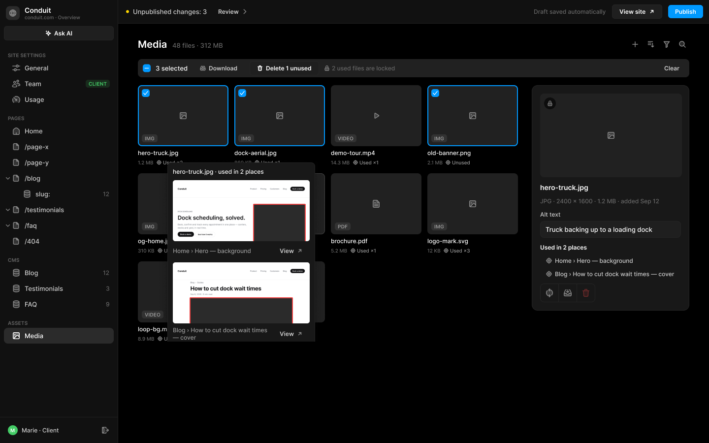
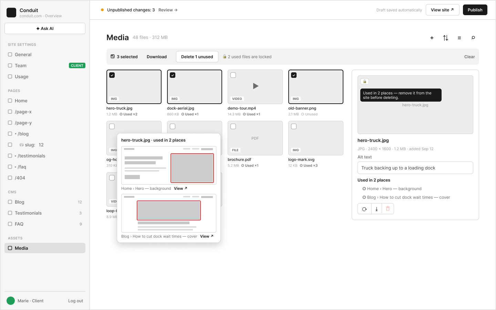

# C5 · Assets › Media

Extraction Figma du fichier « Kuartz — Carte système » (fileKey `wvr98llwHnMufQ88qUp4Ih`). Notation des arbres et conventions : voir [../README.md](../README.md).

| Champ | Valeur |
|---|---|
| Route | `/admin/media` |
| Accès | Kuartz et client admin (barre d’accès : « KUARTZ » bleu #1f70eb + « CLIENT ADMIN » vert #1f9e57 ; LLM context : « Accès : Kuartz et client ») |
| Seul Kuartz voit | Rien de spécifique à cet écran. |
| Wireframe | `214:1173` · caption `214:1170` · accès `227:1654` |
| LLM context | `505:1805` |
| UI | `359:1346` · caption `359:1342` · accès `359:1568` |
| Captures | [UI](./C5.ui.png) · [Wireframe](./C5.wf.png) |





## Caption et barre d’accès

- Caption wireframe (`214:1170`) : C5 · Assets › Media · [wf/Tag kind=sanity: "Sanity · assets"]
- Barre d’accès wireframe (`227:1654`, 1440px) : "KUARTZ" 718px fill=#1f70eb | "CLIENT ADMIN" 718px fill=#1f9e57
- Caption UI (`359:1342`) : C5 · Assets › Media · [Tag Icon=Icon/close, Show icon=false, Show dot=false, tone=neutral: "Sanity · assets"]
- Barre d’accès UI (`359:1568`, 1440px) : "KUARTZ" 718px fill=#1f70eb | "CLIENT ADMIN" 718px fill=#1f9e57

## LLM context

Bloc Figma `505:1805` (page Wireframe), texte verbatim.

> LLM CONTEXT
>
> C5 · Media
>
> Assets › Media — la médiathèque
>
> Route : /admin/media · Accès : Kuartz et client · Sanity : assets (sanity.imageAsset, sanity.fileAsset)

<!-- col 1 -->

### EN BREF

Tous les fichiers du site (images, vidéos, PDF…) : trouver, situer (où le fichier est utilisé sur le site), remplacer, télécharger, supprimer ce qui ne sert plus. Media est dans ASSETS, à part de CMS : la médiathèque sert aux pages, aux collections et aux réglages.

### DONNÉES

• Asset : nom, type, taille, dimensions, date d’ajout, altText (sur l’asset).
• Utilisations : documents qui référencent l’asset (requête « références ») + chemin du champ → « ◎ Used ×N » ou « Unused », et les lignes « Home › Hero — background », « Blog › How to cut dock wait times — cover ».
• En-tête : « 48 files · 312 MB ».

### COMPOSANTS

Page header (4 icônes à droite), Selection bar, Media card, Usage tooltip, Lock badge + Tooltip, Input (Alt text), Tool links (actions icônes : Replace, Download, Delete en rouge).

### GRILLE ET SÉLECTION

• Carte : vignette, badge de type (IMG, VIDEO, PDF, FILE), nom, taille, usage. Case à cocher au survol.
• Barre de sélection : « 3 selected », Download, « Delete 1 unused », « 🔒 2 used files are locked », Clear. Seuls les fichiers inutilisés sont supprimés.
• 4 icônes (G5) : + importer (sélecteur ou glisser-déposer), tri (date, nom, taille), filtre (type, usage), recherche.

<!-- col 2 -->

### INFO-BULLE D’USAGE

• Au survol de « ◎ Used ×N » : une miniature fidèle du site pour chaque utilisation, l’élément entouré en rouge, avec son chemin et « View ↗ » (ouvre la page à cet endroit). Pareil pour les vidéos.
• Miniatures (proposé) : captures de la page en brouillon, générées côté serveur par un navigateur sans interface, recadrées sur la section ; l’élément est repéré par ses attributs Sanity (stega / data-sanity) ; cache régénéré à la publication.

### FICHE À DROITE

• Aperçu ; si le fichier est utilisé, pastille 🔒 en haut à gauche de l’image, avec au survol « Used in 2 places — remove it from the site before deleting. ».
• Nom, « JPG · 2400 × 1600 · 1.2 MB · added Sep 12 ».
• Alt text : modifiable ; vaut pour toutes les utilisations de l’image.
• « Used in 2 places » : lignes décalées, cliquables (ouvrent l’écran où le fichier est utilisé).
• Actions en icônes collées : Replace (nouveau fichier, les utilisations suivent), Download, Delete (rouge ; grisé et bloqué si le fichier est utilisé, avec l’explication au survol).

### RÈGLES

Un média utilisé ne peut pas être supprimé : il faut d’abord le retirer du site. Inutilisé → Delete débloqué. Sanity refuse aussi de supprimer un asset encore référencé.

### À TRANCHER

• Question 10 : les images et vidéos des pages dans Sanity (sinon la médiathèque ne peut ni les voir ni les situer). Proposé : Sanity.
• Question 13 : texte alternatif par image ou par utilisation.

## Wireframe

Écran wireframe `214:1173` — textes et annotations dans l’ordre de lecture (▸ = conteneur, [Composant {propriétés}], « (libre) » = conteneur sans auto-layout, enfants triés haut→bas puis gauche→droite).

- ▸ C5 · Media
  - [wf/Sidebar · Projet {role=Client admin}]
    - "Conduit"
    - "conduit.com · Overview"
    - [wf/Button {Label="✦ Ask AI", variant=secondary}]
    - "SITE SETTINGS"
    - [wf/Nav item {Show icon=true, Count="12", Show count=false, Label="General", state=default}]
    - [wf/Nav item {Show icon=true, Count="12", Show count=false, Label="Team", state=default}]
    - [wf/Tag ]
      - "CLIENT"
    - [wf/Nav item {Show icon=true, Count="12", Show count=false, Label="Usage", state=default}]
    - "PAGES"
    - [wf/Nav item {Show icon=true, Count="12", Show count=false, Label="Home", state=default}]
    - [wf/Nav item {Show icon=true, Count="12", Show count=false, Label="/page-x", state=default}]
    - [wf/Nav item {Show icon=true, Count="12", Show count=false, Label="/page-y", state=default}]
    - [wf/Nav item {Show icon=true, Count="12", Show count=false, Label="▾ /blog", state=default}]
    - [wf/Nav item {Show icon=true, Count="12", Show count=false, Label="    ⛁ slug:   12", state=default}]
    - [wf/Nav item {Show icon=true, Count="12", Show count=false, Label="▸ /testimonials", state=default}]
    - [wf/Nav item {Show icon=true, Count="12", Show count=false, Label="▸ /faq", state=default}]
    - [wf/Nav item {Show icon=true, Count="12", Show count=false, Label="/404", state=default}]
    - "CMS"
    - [wf/Nav item {Show icon=true, Count="12", Show count=true, Label="Blog", state=default}]
    - [wf/Nav item {Show icon=true, Count="3", Show count=true, Label="Testimonials", state=default}]
    - [wf/Nav item {Show icon=true, Count="9", Show count=true, Label="FAQ", state=default}]
    - "ASSETS"
    - [wf/Nav item {Show icon=true, Show count=false, Count="12", Label="Media", state=active}]
    - "Marie · Client"
    - "Log out"
  - ▸ main
    - [wf/Top bar {Status="Unpublished changes: 3"}]
      - "Review →"
      - "Draft saved automatically"
      - [wf/Button {Label="View site ↗", variant=secondary}]
      - [wf/Button {Label="Publish", variant=primary}]
    - ▸ content
      - ▸ Frame
        - "Media"
        - "48 files · 312 MB"
        - ▸ toolbar-icons
          - ▸ icon/add
            - "+"
          - ▸ icon/sort
            - "⇅"
          - ▸ icon/filter
            - "≡"
          - ▸ icon/search
            - "⌕"
      - ▸ selection-bar
        - "☑  3 selected"
        - [wf/Button {Label="Download", variant=ghost}] «btn/Download»
        - [wf/Button {Label="Delete 1 unused", variant=secondary}] «btn/Delete 1 unused»
        - "🔒 2 used files are locked"
        - "Clear"
      - ▸ cols
        - ▸ grid
          - ▸ file/hero-truck.jpg
            - ▸ thumb (libre)
              - [wf/Image {Label=""}]
              - ▸ checkbox
                - "✓"
              - ▸ type
                - "IMG"
            - "hero-truck.jpg"
            - ▸ Frame
              - "1.2 MB"
              - "◎ Used ×2" (usage)
          - ▸ file/dock-aerial.jpg
            - ▸ thumb (libre)
              - [wf/Image {Label=""}]
              - ▸ checkbox
                - "✓"
              - ▸ type
                - "IMG"
            - "dock-aerial.jpg"
            - ▸ Frame
              - "860 KB"
              - "◎ Used ×1" (usage)
          - ▸ file/demo-tour.mp4
            - ▸ thumb (libre)
              - [wf/Image {Label=""}]
              - "▶"
              - ▸ type
                - "VIDEO"
            - "demo-tour.mp4"
            - ▸ Frame
              - "14.3 MB"
              - "◎ Used ×1" (usage)
          - ▸ file/old-banner.png
            - ▸ thumb (libre)
              - [wf/Image {Label=""}]
              - ▸ checkbox
                - "✓"
              - ▸ type
                - "IMG"
            - "old-banner.png"
            - ▸ Frame
              - "2.1 MB"
              - "○ Unused" (usage)
          - ▸ file/og-home.jpg
            - ▸ thumb (libre)
              - [wf/Image {Label=""}]
              - ▸ type
                - "IMG"
            - "og-home.jpg"
            - ▸ Frame
              - "310 KB"
              - "◎ Used ×1" (usage)
          - ▸ file/team-photo.jpg
            - ▸ thumb (libre)
              - [wf/Image {Label=""}]
              - ▸ type
                - "IMG"
            - "team-photo.jpg"
            - ▸ Frame
              - "3.4 MB"
              - "○ Unused" (usage)
          - ▸ file/brochure.pdf
            - ▸ thumb (libre)
              - [wf/Image {Label="PDF"}]
              - ▸ type
                - "FILE"
            - "brochure.pdf"
            - ▸ Frame
              - "5.2 MB"
              - "◎ Used ×1" (usage)
          - ▸ file/logo-mark.svg
            - ▸ thumb (libre)
              - [wf/Image {Label=""}]
              - ▸ type
                - "IMG"
            - "logo-mark.svg"
            - ▸ Frame
              - "12 KB"
              - "◎ Used ×3" (usage)
          - ▸ file/loop-bg.mp4
            - ▸ thumb (libre)
              - [wf/Image {Label=""}]
              - "▶"
              - ▸ type
                - "VIDEO"
            - "loop-bg.mp4"
            - ▸ Frame
              - "8.9 MB"
              - "◎ Used ×1" (usage)
          - ▸ file/case-study.jpg
            - ▸ thumb (libre)
              - [wf/Image {Label=""}]
              - ▸ type
                - "IMG"
            - "case-study.jpg"
            - ▸ Frame
              - "1.9 MB"
              - "◎ Used ×1" (usage)
        - ▸ detail
          - ▸ image + lock badge (libre)
            - [wf/Image {Label="hero-truck.jpg"}]
            - ▸ lock badge (hover → tooltip)
              - "🔒"
            - ▸ tooltip (on hover)
              - "Used in 2 places — remove it from the site before deleting."
          - "hero-truck.jpg"
          - "JPG · 2400 × 1600 · 1.2 MB · added Sep 12"
          - [wf/Field {Value="Truck backing up to a loading dock", Show label=true, Label="Alt text", type=text}] «field/Alt text»
          - "Used in 2 places"
          - ▸ usage row
            - "◎ Home › Hero — background"
          - ▸ usage row
            - "◎ Blog › How to cut dock wait times — cover"
          - ▸ actions (icon-only, stuck)
            - ▸ icon-button · Replace
              - "⟳"
            - ▸ icon-button · Download
              - "⤓"
      - ▸ tooltip · where used
        - "hero-truck.jpg · used in 2 places"
        - ▸ Frame
          - ▸ Frame
            - "Home › Hero — background"
            - "View ↗"
        - ▸ Frame
          - ▸ Frame
            - "Blog › How to cut dock wait times — cover"
            - "View ↗"

## UI — arbre

Écran UI `359:1346` (page UI). Légende : `AL H|V` auto-layout, `gap`, `pad` (1 valeur, [vertical, horizontal] ou [haut, droite, bas, gauche]), `align=principal/secondaire`, `size=largeur/hauteur` (fixed|hug|fill), `@x,y` position libre, `abs@x,y` position absolue dans un auto-layout, `fill/stroke/radius` = variable liée (valeur brute en hex/px si aucune variable), `effect` = style d’effet, `TEXT … · <style de texte> · <couleur>` puis `:: "texte"`, `INST "calque" → Composant {propriétés}` ; sous une instance : `T "texte"` = texte interne non déjà donné par une propriété.

```text
FRAME "C5 · Media" 1440×900 · AL H gap=0 align=MIN/MIN · fill=bg/app
  INST "Sidebar" 240×900 → Sidebar {role=client} · AL V gap=0 align=MIN/MIN · size=fixed/fill · fill=bg/primary · stroke=border/subtle sides[T0 R1 B0 L0]
    INST "icon" 16×16 → Icon/globe {size=18}
    T "Conduit"
    T "conduit.com · Overview"
    INST "ask-ai" 223×29 → Button {Icon left=Icon/ai, Show icon left=true, Icon right=Icon/chevron-down, Show icon right=false, Label="Ask AI", variant=secondary, state=default, size=small}
    INST "section/SITE SETTINGS" 223×32 → Nav section {Show action=false, Label="SITE SETTINGS"}
    INST "nav/General" 223×32 → Nav item {Show tag=false, Show count=false, Count="12", Show chevron=false, Icon=Icon/sliders, Show icon=true, Label="General", state=default}
    INST "nav/Team" 223×32 → Nav item {Show tag=true, Show count=false, Count="12", Show chevron=false, Icon=Icon/team, Show icon=true, Label="Team", state=default}
      INST "tag" 49×16 → Tag {Icon=Icon/close, Show icon=false, Show dot=false, Label="CLIENT", tone=success}
    INST "nav/Usage" 223×32 → Nav item {Show tag=false, Show count=false, Count="12", Show chevron=false, Icon=Icon/usage, Show icon=true, Label="Usage", state=default}
    INST "section/PAGES" 223×32 → Nav section {Show action=false, Label="PAGES"}
    INST "nav/Home" 223×32 → Nav item {Show tag=false, Show count=false, Count="12", Show chevron=false, Icon=Icon/house, Show icon=true, Label="Home", state=default}
    INST "nav//page-x" 223×32 → Nav item {Show tag=false, Show count=false, Count="12", Show chevron=false, Icon=Icon/page, Show icon=true, Label="/page-x", state=default}
    INST "nav//page-y" 223×32 → Nav item {Show tag=false, Show count=false, Count="12", Show chevron=false, Icon=Icon/page, Show icon=true, Label="/page-y", state=default}
    INST "nav//blog" 223×32 → Nav item {Show tag=false, Show count=false, Count="12", Show chevron=true, Icon=Icon/page, Show icon=true, Label="/blog", state=default}
      INST "chevron" 10×10 → Icon/chevron-down {size=12}
    INST "nav//blog/:slug" 223×32 → Nav item {Show tag=false, Show count=true, Count="12", Show chevron=false, Icon=Icon/database, Show icon=true, Label="slug:", state=default}
    INST "nav//testimonials" 223×32 → Nav item {Show tag=false, Show count=false, Count="12", Show chevron=true, Icon=Icon/page, Show icon=true, Label="/testimonials", state=default}
      INST "chevron" 10×10 → Icon/chevron-down {size=12}
    INST "nav//faq" 223×32 → Nav item {Show tag=false, Show count=false, Count="12", Show chevron=true, Icon=Icon/page, Show icon=true, Label="/faq", state=default}
      INST "chevron" 10×10 → Icon/chevron-down {size=12}
    INST "nav//404" 223×32 → Nav item {Show tag=false, Show count=false, Count="12", Show chevron=false, Icon=Icon/page, Show icon=true, Label="/404", state=default}
    INST "section/CMS" 223×32 → Nav section {Show action=false, Label="CMS"}
    INST "nav/Blog" 223×32 → Nav item {Show tag=false, Show count=true, Count="12", Show chevron=false, Icon=Icon/database, Show icon=true, Label="Blog", state=default}
    INST "nav/Testimonials" 223×32 → Nav item {Show tag=false, Show count=true, Count="3", Show chevron=false, Icon=Icon/database, Show icon=true, Label="Testimonials", state=default}
    INST "nav/FAQ" 223×32 → Nav item {Show tag=false, Show count=true, Count="9", Show chevron=false, Icon=Icon/database, Show icon=true, Label="FAQ", state=default}
    INST "section/ASSETS" 223×32 → Nav section {Show action=false, Label="ASSETS"}
    INST "nav/Media" 223×32 → Nav item {Show tag=false, Show chevron=false, Show count=false, Label="Media", Icon=Icon/image, Count="12", Show icon=true, state=active}
    INST "avatar" 20×20 → Avatar {Initials="M", size=20, tone=green}
    T "Marie · Client"
    INST "logout" 28×28 → Icon button {Icon=Icon/logout, style=ghost, state=default, size=small}
  FRAME "main" 1200×900 · AL V gap=0 align=MIN/MIN · size=fill/fill
    INST "Top bar" 1200×48 → Top bar {state=pending} · AL H gap=space/12 pad=[0, space/12, 0, space/16] align=MIN/CENTER · size=fill/fixed · fill=bg/primary · stroke=border/subtle sides[T0 R0 B1 L0]
      T "Unpublished changes: 3"
      INST "review" 88×27 → Button {Icon left=Icon/plus, Show icon right=true, Icon right=Icon/chevron-right, Show icon left=false, Label="Review", variant=ghost, state=default, size=small}
      T "Draft saved automatically"
      INST "view-site" 102×29 → Button {Icon left=Icon/plus, Show icon left=false, Icon right=Icon/external, Show icon right=true, Label="View site", variant=secondary, state=default, size=small}
      INST "publish" 71×27 → Publish button {state=pending}
        INST "button" 71×27 → Button {Icon left=Icon/plus, Icon right=Icon/chevron-down, Show icon right=false, Show icon left=false, Label="Publish", variant=primary, state=default, size=small}
    FRAME "content" 1200×852 · AL V gap=space/16 pad=[28, space/40, space/40, space/40] align=MIN/MIN · size=fill/fill
      FRAME "page-header" 1120×28 · AL H gap=space/4 align=MIN/CENTER · size=fill/hug
        INST "Page header" 992×24 → Page header {Show description=false, Description="Images, videos and files used on the site. A file that is in use cannot be deleted.", Show meta=true, Meta="48 files · 312 MB", Title="Media"} · AL V gap=space/4 align=MIN/MIN · size=fill/hug
        INST "tool/plus" 28×28 → Icon button {Icon=Icon/plus, style=ghost, state=default, size=small} · AL H gap=0 align=CENTER/CENTER · size=fixed/fixed · radius=radius/md
        INST "tool/sort" 28×28 → Icon button {Icon=Icon/sort, style=ghost, state=default, size=small} · AL H gap=0 align=CENTER/CENTER · size=fixed/fixed · radius=radius/md
        INST "tool/filter" 28×28 → Icon button {Icon=Icon/filter, style=ghost, state=default, size=small} · AL H gap=0 align=CENTER/CENTER · size=fixed/fixed · radius=radius/md
        INST "tool/search" 28×28 → Icon button {Icon=Icon/search, style=ghost, state=default, size=small} · AL H gap=0 align=CENTER/CENTER · size=fixed/fixed · radius=radius/md
      INST "Selection bar" 1120×37 → Selection bar {delete=partial} · AL H gap=space/10 pad=[space/4, space/6, space/4, space/10] align=MIN/CENTER · size=fill/hug · fill=bg/subtle · radius=radius/md
        INST "Checkbox" 16×16 → Checkbox {Show label=false, Label="Checkbox label", state=indeterminate}
          INST "mark" 12×12 → Icon/minus {size=12}
        T "3 selected"
        INST "download" 105×27 → Button {Show icon right=false, Icon left=Icon/download, Icon right=Icon/chevron-down, Show icon left=true, Label="Download", variant=ghost, state=default, size=small}
        INST "delete" 141×29 → Button {Icon left=Icon/trash, Show icon left=true, Icon right=Icon/chevron-down, Show icon right=false, Label="Delete 1 unused", variant=secondary, state=default, size=small}
        INST "icon" 12×12 → Icon/lock {size=12}
        T "2 used files are locked"
        INST "clear" 59×27 → Button {Icon left=Icon/plus, Show icon right=false, Icon right=Icon/chevron-down, Show icon left=false, Label="Clear", variant=ghost, state=default, size=small}
      FRAME "body" 1120×521 · AL H gap=space/24 align=MIN/MIN · size=fill/hug
        FRAME "grid" 776×521 · AL H wrap gap=space/12 align=MIN/MIN · size=fill/hug
          INST "Media card" 184×163 → Media card {Size="1.2 MB", Usage="Used ×2", Name="hero-truck.jpg", type=image, state=selected} · AL V gap=space/6 align=MIN/MIN · size=fixed/hug
            INST "type-icon" 18×18 → Icon/image {size=18}
            INST "checkbox" 16×16 → Checkbox {Show label=false, Label="Checkbox label", state=checked}
              INST "mark" 12×12 → Icon/check {size=12}
            INST "type-tag" 32×16 → Tag {Icon=Icon/close, Show icon=false, Show dot=false, Label="IMG", tone=neutral}
            INST "icon" 10×10 → Icon/locate {size=12}
          INST "Media card" 184×163 → Media card {Size="860 KB", Usage="Used ×1", Name="dock-aerial.jpg", type=image, state=selected} · AL V gap=space/6 align=MIN/MIN · size=fixed/hug
            INST "type-icon" 18×18 → Icon/image {size=18}
            INST "checkbox" 16×16 → Checkbox {Show label=false, Label="Checkbox label", state=checked}
              INST "mark" 12×12 → Icon/check {size=12}
            INST "type-tag" 32×16 → Tag {Icon=Icon/close, Show icon=false, Show dot=false, Label="IMG", tone=neutral}
            INST "icon" 10×10 → Icon/locate {size=12}
          INST "Media card" 184×163 → Media card {Usage="Used ×1", Size="14.3 MB", Name="demo-tour.mp4", type=video, state=default} · AL V gap=space/6 align=MIN/MIN · size=fixed/hug
            INST "type-icon" 18×18 → Icon/play {size=18}
            INST "type-tag" 44×16 → Tag {Icon=Icon/close, Show icon=false, Show dot=false, Label="VIDEO", tone=neutral}
            INST "icon" 10×10 → Icon/locate {size=12}
          INST "Media card" 184×163 → Media card {Size="2.1 MB", Usage="Unused", Name="old-banner.png", type=image, state=selected} · AL V gap=space/6 align=MIN/MIN · size=fixed/hug
            INST "type-icon" 18×18 → Icon/image {size=18}
            INST "checkbox" 16×16 → Checkbox {Show label=false, Label="Checkbox label", state=checked}
              INST "mark" 12×12 → Icon/check {size=12}
            INST "type-tag" 32×16 → Tag {Icon=Icon/close, Show icon=false, Show dot=false, Label="IMG", tone=neutral}
            INST "icon" 10×10 → Icon/locate {size=12}
          INST "Media card" 184×163 → Media card {Usage="Used ×1", Size="310 KB", Name="og-home.jpg", type=image, state=default} · AL V gap=space/6 align=MIN/MIN · size=fixed/hug
            INST "type-icon" 18×18 → Icon/image {size=18}
            INST "type-tag" 32×16 → Tag {Icon=Icon/close, Show icon=false, Show dot=false, Label="IMG", tone=neutral}
            INST "icon" 10×10 → Icon/locate {size=12}
          INST "Media card" 184×163 → Media card {Size="3.4 MB", Usage="Unused", Name="team-photo.jpg", type=image, state=hover} · AL V gap=space/6 align=MIN/MIN · size=fixed/hug
            INST "type-icon" 18×18 → Icon/image {size=18}
            INST "checkbox" 16×16 → Checkbox {Show label=false, Label="Checkbox label", state=unchecked}
            INST "type-tag" 32×16 → Tag {Icon=Icon/close, Show icon=false, Show dot=false, Label="IMG", tone=neutral}
            INST "icon" 10×10 → Icon/locate {size=12}
          INST "Media card" 184×163 → Media card {Usage="Used ×1", Size="5.2 MB", Name="brochure.pdf", type=file, state=default} · AL V gap=space/6 align=MIN/MIN · size=fixed/hug
            INST "type-icon" 18×18 → Icon/file {size=18}
            INST "type-tag" 32×16 → Tag {Icon=Icon/close, Show icon=false, Show dot=false, Label="PDF", tone=neutral}
            INST "icon" 10×10 → Icon/locate {size=12}
          INST "Media card" 184×163 → Media card {Usage="Used ×3", Size="12 KB", Name="logo-mark.svg", type=image, state=default} · AL V gap=space/6 align=MIN/MIN · size=fixed/hug
            INST "type-icon" 18×18 → Icon/image {size=18}
            INST "type-tag" 32×16 → Tag {Icon=Icon/close, Show icon=false, Show dot=false, Label="IMG", tone=neutral}
            INST "icon" 10×10 → Icon/locate {size=12}
          INST "Media card" 184×163 → Media card {Usage="Used ×1", Size="8.9 MB", Name="loop-bg.mp4", type=video, state=default} · AL V gap=space/6 align=MIN/MIN · size=fixed/hug
            INST "type-icon" 18×18 → Icon/play {size=18}
            INST "type-tag" 44×16 → Tag {Icon=Icon/close, Show icon=false, Show dot=false, Label="VIDEO", tone=neutral}
            INST "icon" 10×10 → Icon/locate {size=12}
          INST "Media card" 184×163 → Media card {Usage="Used ×1", Size="1.9 MB", Name="case-study.jpg", type=image, state=default} · AL V gap=space/6 align=MIN/MIN · size=fixed/hug
            INST "type-icon" 18×18 → Icon/image {size=18}
            INST "type-tag" 32×16 → Tag {Icon=Icon/close, Show icon=false, Show dot=false, Label="IMG", tone=neutral}
            INST "icon" 10×10 → Icon/locate {size=12}
        FRAME "details" 320×458 · AL V gap=space/12 pad=space/16 align=MIN/MIN · size=fixed/hug · fill=bg/elevated · stroke=border/default 1 · radius=radius/lg
          FRAME "preview" 288×170 · AL V gap=0 align=CENTER/CENTER · size=fixed/fixed · fill=bg/subtle · radius=radius/md
            INST "icon" 18×18 → Icon/image {size=18} · size=fixed/fixed
            INST "lock" 24×24 → Lock badge {state=default} · abs@8,8 · fill=bg/scrim@60% · radius=12
              INST "icon" 12×12 → Icon/lock {size=12}
          TEXT "name" 98×17 · Label Large · text/primary · size=hug/hug :: "hero-truck.jpg"
          TEXT "meta" 286×15 · Body Small · text/muted · size=fill/hug :: "JPG · 2400 × 1600 · 1.2 MB · added Sep 12"
          INST "Input" 286×55 → Input {Placeholder="Placeholder", Show icon=false, Helper="Shown in browser tabs and search results.", Show helper=false, Show label=true, Icon=Icon/search, Value="Truck backing up to a loading dock", Label="Alt text", state=filled, layout=stacked} · AL V gap=space/6 align=MIN/MIN · size=fill/hug
          TEXT "used-title" 96×15 · Label · text/primary · size=hug/hug :: "Used in 2 places"
          FRAME "place" 286×15 · AL H gap=space/6 pad=[0, 0, 0, 12] align=MIN/CENTER · size=fill/hug
            INST "icon" 12×12 → Icon/locate {size=18} · size=fixed/fixed
            TEXT "label" 256×15 · Body Small · text/secondary · size=fill/hug :: "Home › Hero — background"
          FRAME "place" 286×15 · AL H gap=space/6 pad=[0, 0, 0, 12] align=MIN/CENTER · size=fill/hug
            INST "icon" 12×12 → Icon/locate {size=18} · size=fixed/fixed
            TEXT "label" 256×15 · Body Small · text/secondary · size=fill/hug :: "Blog › How to cut dock wait times — cover"
          FRAME "actions" 112×38 · AL H gap=0 align=MIN/CENTER · size=hug/hug · stroke=border/default 1 · radius=radius/md
            INST "action/Replace" 36×36 → Tool link {Icon=Icon/replace, state=default, tone=default} · AL H gap=0 align=CENTER/CENTER · size=fixed/fixed
            FRAME "divider" 1×36 · size=fixed/fill · fill=border/default
            INST "action/Download" 36×36 → Tool link {Icon=Icon/download, state=default, tone=default} · AL H gap=0 align=CENTER/CENTER · size=fixed/fixed
            FRAME "divider" 1×36 · size=fixed/fill · fill=border/default
            INST "action/Delete" 36×36 → Tool link {Icon=Icon/trash, state=disabled, tone=danger} · AL H gap=0 align=CENTER/CENTER · size=fixed/fixed
        INST "Usage tooltip" 300×374 → Usage tooltip · AL V gap=space/10 pad=space/10 align=MIN/MIN · abs@60,157 · fill=bg/elevated · stroke=border/default 1 · radius=radius/md · effect=Elevation/Popover
          T "hero-truck.jpg · used in 2 places"
          T "Home › Hero — background"
          INST "view" 75×27 → Button {Icon left=Icon/plus, Show icon right=true, Icon right=Icon/external, Show icon left=false, Label="View", variant=ghost, state=default, size=small}
          T "Blog › How to cut dock wait times — cover"
          INST "view" 75×27 → Button {Icon left=Icon/plus, Show icon right=true, Icon right=Icon/external, Show icon left=false, Label="View", variant=ghost, state=default, size=small}
```

## Notes d’extraction

- Dans le plan du wireframe, le groupe « actions (icon-only, stuck) » ne liste que Replace et Download : l’icône Delete n’y porte pas de texte (le script ne relève que les textes et instances). Elle figure dans l’arbre UI (`action/Delete`, `state=disabled, tone=danger`).
