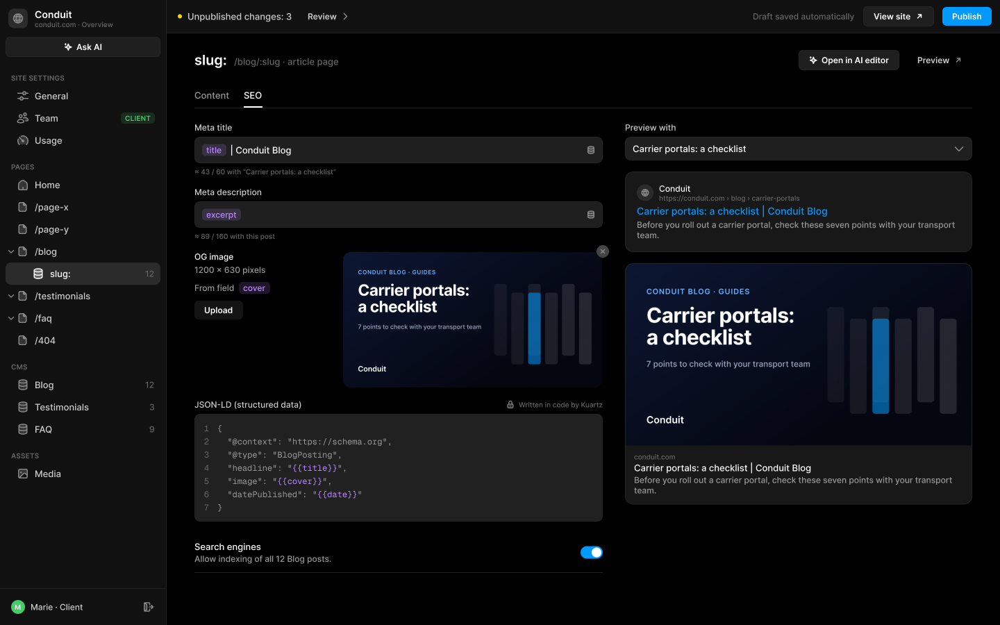
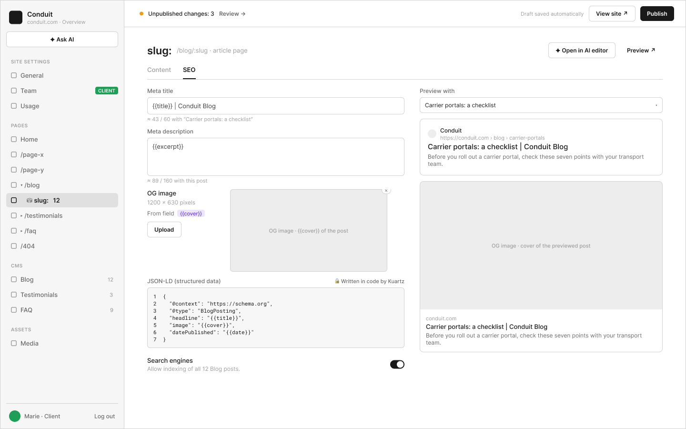

# C6 · Pages › /blog › slug: (page article) — onglet SEO

Extraction Figma du fichier « Kuartz — Carte système » (fileKey `wvr98llwHnMufQ88qUp4Ih`). Notation des arbres et conventions : voir [../README.md](../README.md).

| Champ | Valeur |
|---|---|
| Route | `/admin/pages/blog/slug/seo` |
| Accès | Kuartz et client admin (barre d’accès : « KUARTZ » bleu #1f70eb + « CLIENT ADMIN » vert #1f9e57 ; LLM context : « Accès : Kuartz et client ») |
| Seul Kuartz voit | Rien de spécifique à voir ; seul Kuartz écrit le JSON-LD du modèle (« JSON-LD du modèle : écrit dans le code (lecture seule) avec les mêmes {{…}} »), affiché au client en lecture seule « 🔒 Written in code by Kuartz ». |
| Wireframe | `455:1473` · caption `455:1469` · accès `455:1575` |
| LLM context | `505:1840` |
| UI | `447:7656` · caption `447:7700` · accès `447:7704` |
| Captures | [UI](./C6.ui.png) · [Wireframe](./C6.wf.png) |





## Caption et barre d’accès

- Caption wireframe (`455:1469`) : C6 · Pages › /blog › slug: (page article) — onglet SEO · [wf/Tag kind=sanity: "Sanity · modèle d’article, champs en variables"]
- Barre d’accès wireframe (`455:1575`, 1440px) : "KUARTZ" 718px fill=#1f70eb | "CLIENT ADMIN" 718px fill=#1f9e57
- Caption UI (`447:7700`) : C6 · Pages › /blog › slug: (page article) — onglet SEO · [Tag Icon=Icon/close, Show icon=false, Show dot=false, tone=neutral: "Sanity · modèle d’article, champs en variables"]
- Barre d’accès UI (`447:7704`, 1440px) : "KUARTZ" 718px fill=#1f70eb | "CLIENT ADMIN" 718px fill=#1f9e57

## LLM context

Bloc Figma `505:1840` (page Wireframe), texte verbatim.

> LLM CONTEXT
>
> C6 · CMS article page › SEO (Blog)
>
> Pages › /blog › slug: — onglet SEO, champs en variables
>
> Route : /admin/pages/blog/slug/seo · Accès : Kuartz et client · Sanity : modèle SEO de la page article du Blog

<!-- col 1 -->

### EN BREF

Le SEO de toutes les pages article d’une collection (/blog/:slug) se règle une fois, avec les champs de l’article en variables. Accès : PAGES › /blog (chevron) › slug:.

### DONNÉES

• Un modèle par collection qui a une page article : seo { metaTitle, metaDescription (texte avec {{champs}}), ogImage : « From field » (ex. cover) ou image fixe, allowIndexing (toutes les pages article) }.
• JSON-LD du modèle : écrit dans le code (lecture seule) avec les mêmes {{…}}.
• Variables disponibles = champs de la collection : {{title}}, {{slug}}, {{date}}, {{excerpt}}, {{cover}}, {{author}}, {{category}}.

### COMPOSANTS

Page header (« slug: » + « /blog/:slug · article page »), Tabs, Variable input (puces violettes + bouton base de données), Variable chip, Select « Preview with », Image preview, Code block, Setting row + Switch, Search preview, Social preview.

<!-- col 2 -->

### COMPORTEMENT

• Meta title « {{title}} | Conduit Blog » ; Meta description « {{excerpt}} ». Les variables s’affichent en puces violettes. Insertion : bouton base de données à droite du champ, ou taper {{ (autocomplétion des champs).
• Longueurs estimées avec l’article d’aperçu : « ≈ 43 / 60 with “Carrier portals: a checklist” », « ≈ 89 / 160 with this post ».
• OG image : « 1200 × 630 pixels », « From field [cover] » ; Upload pour une image fixe à la place.
• « Preview with » : choisit l’article qui sert aux aperçus Google et réseaux sociaux et aux longueurs estimées.
• Search engines : « Allow indexing of all 12 Blog posts. » (off → noindex sur toutes les pages article).

### CÔTÉ SITE (INTÉGRATION)

• generateMetadata de /blog/[slug] remplace les {{…}} par les valeurs de l’article.
• Variable vide pour un article : valeur par défaut du site (B2) pour ce champ (proposé).
• Variable inconnue : refusée à la saisie (puce rouge, proposé).

### VOIR AUSSI

G6 (mêmes variables dans les scripts), C2 (SEO d’une page normale), C3 / C4 (les articles).

## Wireframe

Écran wireframe `455:1473` — textes et annotations dans l’ordre de lecture (▸ = conteneur, [Composant {propriétés}], « (libre) » = conteneur sans auto-layout, enfants triés haut→bas puis gauche→droite).

- ▸ C6 · CMS article page › SEO (Blog)
  - [wf/Sidebar · Projet {role=Client admin}]
    - "Conduit"
    - "conduit.com · Overview"
    - [wf/Button {Label="✦ Ask AI", variant=secondary}]
    - "SITE SETTINGS"
    - [wf/Nav item {Show icon=true, Count="12", Show count=false, Label="General", state=default}]
    - [wf/Nav item {Show icon=true, Count="12", Show count=false, Label="Team", state=default}]
    - [wf/Tag ]
      - "CLIENT"
    - [wf/Nav item {Show icon=true, Count="12", Show count=false, Label="Usage", state=default}]
    - "PAGES"
    - [wf/Nav item {Show icon=true, Count="12", Show count=false, Label="Home", state=default}]
    - [wf/Nav item {Show icon=true, Count="12", Show count=false, Label="/page-x", state=default}]
    - [wf/Nav item {Show icon=true, Count="12", Show count=false, Label="/page-y", state=default}]
    - [wf/Nav item {Show icon=true, Count="12", Show count=false, Label="▾ /blog", state=default}]
    - [wf/Nav item {Show icon=true, Show count=false, Count="12", Label="    ⛁ slug:   12", state=active}]
    - [wf/Nav item {Show icon=true, Count="12", Show count=false, Label="▸ /testimonials", state=default}]
    - [wf/Nav item {Show icon=true, Count="12", Show count=false, Label="▸ /faq", state=default}]
    - [wf/Nav item {Show icon=true, Count="12", Show count=false, Label="/404", state=default}]
    - "CMS"
    - [wf/Nav item {Show icon=true, Count="12", Show count=true, Label="Blog", state=default}]
    - [wf/Nav item {Show icon=true, Count="3", Show count=true, Label="Testimonials", state=default}]
    - [wf/Nav item {Show icon=true, Count="9", Show count=true, Label="FAQ", state=default}]
    - "ASSETS"
    - [wf/Nav item {Show icon=true, Count="12", Show count=false, Label="Media", state=default}]
    - "Marie · Client"
    - "Log out"
  - ▸ main
    - [wf/Top bar {Status="Unpublished changes: 3"}]
      - "Review →"
      - "Draft saved automatically"
      - [wf/Button {Label="View site ↗", variant=secondary}]
      - [wf/Button {Label="Publish", variant=primary}]
    - ▸ content
      - ▸ page-header
        - "slug:"
        - "/blog/:slug · article page"
        - [wf/Button {Label="✦ Open in AI editor", variant=secondary}] «btn/✦ Open in AI editor»
        - [wf/Button {Label="Preview ↗", variant=ghost}] «btn/Preview ↗»
      - ▸ tabs
        - ▸ tab/Content
          - "Content"
        - ▸ tab/SEO
          - "SEO"
      - ▸ cols
        - ▸ fields
          - ▸ Frame
            - [wf/Field {Value="{{title}} | Conduit Blog", Show label=true, Label="Meta title", type=text}] «field/Meta title»
            - "≈ 43 / 60 with “Carrier portals: a checklist”"
          - ▸ Frame
            - [wf/Field {Show label=true, Value="{{excerpt}}", Label="Meta description", type=textarea}] «field/Meta description»
            - "≈ 89 / 160 with this post"
          - ▸ row · OG image
            - ▸ label
              - "OG image"
              - "1200 × 630 pixels"
              - ▸ from field
                - "From field"
                - ▸ variable chip · cover
                  - "{{cover}}"
              - ▸ upload
                - [wf/Button {Label="Upload", variant=secondary}] «btn/Upload»
            - ▸ preview (× remove) (libre)
              - ▸ remove ×
                - "×"
              - [wf/Image {Label="OG image · {{cover}} of the post"}]
          - ▸ json-ld
            - ▸ Frame
              - "JSON-LD (structured data)"
              - "🔒 Written in code by Kuartz"
            - ▸ code
              - "1  {\n2    \"@context\": \"https://schema.org\",\n3    \"@type\": \"BlogPosting\",\n4    \"headline\": \"{{title}}\",\n5    \"image\": \"{{cover}}\",\n6    \"datePublished\": \"{{date}}\"\n7  }"
          - ▸ row · Search engines
            - ▸ text
              - "Search engines"
              - "Allow indexing of all 12 Blog posts."
        - ▸ right
          - ▸ preview with
            - "Preview with"
            - ▸ select · post
              - "Carrier portals: a checklist"
              - "▾"
          - ▸ google-card
            - ▸ site
              - ▸ site-name
                - "Conduit"
                - "https://conduit.com › blog › carrier-portals"
            - "Carrier portals: a checklist | Conduit Blog"
            - "Before you roll out a carrier portal, check these seven points with your transport team."
          - ▸ social-card
            - [wf/Image {Label="OG image · cover of the previewed post"}]
            - ▸ text
              - "conduit.com"
              - "Carrier portals: a checklist | Conduit Blog"
              - "Before you roll out a carrier portal, check these seven points with your transport team."

## UI — arbre

Écran UI `447:7656` (page UI). Légende : `AL H|V` auto-layout, `gap`, `pad` (1 valeur, [vertical, horizontal] ou [haut, droite, bas, gauche]), `align=principal/secondaire`, `size=largeur/hauteur` (fixed|hug|fill), `@x,y` position libre, `abs@x,y` position absolue dans un auto-layout, `fill/stroke/radius` = variable liée (valeur brute en hex/px si aucune variable), `effect` = style d’effet, `TEXT … · <style de texte> · <couleur>` puis `:: "texte"`, `INST "calque" → Composant {propriétés}` ; sous une instance : `T "texte"` = texte interne non déjà donné par une propriété.

```text
FRAME "C6 · CMS article page › SEO (Blog)" 1440×900 · AL H gap=0 align=MIN/MIN · fill=bg/app
  INST "Sidebar" 240×900 → Sidebar {role=client} · AL V gap=0 align=MIN/MIN · size=fixed/fill · fill=bg/primary · stroke=border/subtle sides[T0 R1 B0 L0]
    INST "icon" 16×16 → Icon/globe {size=18}
    T "Conduit"
    T "conduit.com · Overview"
    INST "ask-ai" 223×29 → Button {Icon left=Icon/ai, Show icon left=true, Icon right=Icon/chevron-down, Show icon right=false, Label="Ask AI", variant=secondary, state=default, size=small}
    INST "section/SITE SETTINGS" 223×32 → Nav section {Show action=false, Label="SITE SETTINGS"}
    INST "nav/General" 223×32 → Nav item {Show tag=false, Show count=false, Count="12", Show chevron=false, Icon=Icon/sliders, Show icon=true, Label="General", state=default}
    INST "nav/Team" 223×32 → Nav item {Show tag=true, Show count=false, Count="12", Show chevron=false, Icon=Icon/team, Show icon=true, Label="Team", state=default}
      INST "tag" 49×16 → Tag {Icon=Icon/close, Show icon=false, Show dot=false, Label="CLIENT", tone=success}
    INST "nav/Usage" 223×32 → Nav item {Show tag=false, Show count=false, Count="12", Show chevron=false, Icon=Icon/usage, Show icon=true, Label="Usage", state=default}
    INST "section/PAGES" 223×32 → Nav section {Show action=false, Label="PAGES"}
    INST "nav/Home" 223×32 → Nav item {Show tag=false, Show count=false, Count="12", Show chevron=false, Icon=Icon/house, Show icon=true, Label="Home", state=default}
    INST "nav//page-x" 223×32 → Nav item {Show tag=false, Show count=false, Count="12", Show chevron=false, Icon=Icon/page, Show icon=true, Label="/page-x", state=default}
    INST "nav//page-y" 223×32 → Nav item {Show tag=false, Show count=false, Count="12", Show chevron=false, Icon=Icon/page, Show icon=true, Label="/page-y", state=default}
    INST "nav//blog" 223×32 → Nav item {Show tag=false, Show count=false, Count="12", Show chevron=true, Icon=Icon/page, Show icon=true, Label="/blog", state=default}
      INST "chevron" 10×10 → Icon/chevron-down {size=12}
    INST "nav//blog/:slug" 223×32 → Nav item {Show tag=false, Show chevron=false, Show count=true, Label="slug:", Icon=Icon/database, Count="12", Show icon=true, state=active}
    INST "nav//testimonials" 223×32 → Nav item {Show tag=false, Show count=false, Count="12", Show chevron=true, Icon=Icon/page, Show icon=true, Label="/testimonials", state=default}
      INST "chevron" 10×10 → Icon/chevron-down {size=12}
    INST "nav//faq" 223×32 → Nav item {Show tag=false, Show count=false, Count="12", Show chevron=true, Icon=Icon/page, Show icon=true, Label="/faq", state=default}
      INST "chevron" 10×10 → Icon/chevron-down {size=12}
    INST "nav//404" 223×32 → Nav item {Show tag=false, Show count=false, Count="12", Show chevron=false, Icon=Icon/page, Show icon=true, Label="/404", state=default}
    INST "section/CMS" 223×32 → Nav section {Show action=false, Label="CMS"}
    INST "nav/Blog" 223×32 → Nav item {Show tag=false, Show count=true, Count="12", Show chevron=false, Icon=Icon/database, Show icon=true, Label="Blog", state=default}
    INST "nav/Testimonials" 223×32 → Nav item {Show tag=false, Show count=true, Count="3", Show chevron=false, Icon=Icon/database, Show icon=true, Label="Testimonials", state=default}
    INST "nav/FAQ" 223×32 → Nav item {Show tag=false, Show count=true, Count="9", Show chevron=false, Icon=Icon/database, Show icon=true, Label="FAQ", state=default}
    INST "section/ASSETS" 223×32 → Nav section {Show action=false, Label="ASSETS"}
    INST "nav/Media" 223×32 → Nav item {Show tag=false, Show count=false, Count="12", Show chevron=false, Icon=Icon/image, Show icon=true, Label="Media", state=default}
    INST "avatar" 20×20 → Avatar {Initials="M", size=20, tone=green}
    T "Marie · Client"
    INST "logout" 28×28 → Icon button {Icon=Icon/logout, style=ghost, state=default, size=small}
  FRAME "main" 1200×900 · AL V gap=0 align=MIN/MIN · size=fill/fill
    INST "Top bar" 1200×48 → Top bar {state=pending} · AL H gap=space/12 pad=[0, space/12, 0, space/16] align=MIN/CENTER · size=fill/fixed · fill=bg/primary · stroke=border/subtle sides[T0 R0 B1 L0]
      T "Unpublished changes: 3"
      INST "review" 88×27 → Button {Icon left=Icon/plus, Show icon right=true, Icon right=Icon/chevron-right, Show icon left=false, Label="Review", variant=ghost, state=default, size=small}
      T "Draft saved automatically"
      INST "view-site" 102×29 → Button {Icon left=Icon/plus, Show icon left=false, Icon right=Icon/external, Show icon right=true, Label="View site", variant=secondary, state=default, size=small}
      INST "publish" 71×27 → Publish button {state=pending}
        INST "button" 71×27 → Button {Icon left=Icon/plus, Icon right=Icon/chevron-down, Show icon right=false, Show icon left=false, Label="Publish", variant=primary, state=default, size=small}
    FRAME "content" 1200×852 · AL V gap=space/20 pad=[space/24, space/40, space/16, space/40] align=MIN/MIN · size=fill/fill
      FRAME "page-header" 1120×29 · AL H gap=space/12 align=MIN/CENTER · size=fill/hug
        INST "Page header" 858×24 → Page header {Show description=false, Description="Images, videos and files used on the site. A file that is in use cannot be deleted.", Show meta=true, Meta="/blog/:slug · article page", Title="slug:"} · AL V gap=space/4 align=MIN/MIN · size=fill/hug
        INST "Button" 145×29 → Button {Icon left=Icon/ai, Show icon left=true, Icon right=Icon/chevron-down, Show icon right=false, Label="Open in AI editor", variant=secondary, state=default, size=small} · AL H gap=space/6 pad=[space/6, 14] align=CENTER/CENTER · size=hug/hug · fill=bg/input · stroke=border/default 1 · radius=6
        INST "Button" 93×27 → Button {Icon left=Icon/plus, Show icon right=true, Icon right=Icon/external, Show icon left=false, Label="Preview", variant=ghost, state=default, size=small} · AL H gap=space/6 pad=[space/6, 14] align=CENTER/CENTER · size=hug/hug · radius=6
      INST "Tabs" 1120×35 → Tabs {count=2} · AL H gap=space/20 align=MIN/MAX · size=fill/hug · stroke=border/subtle sides[T0 R0 B1 L0]
        INST "tab 1" 51×34 → Tab {Label="Content", state=default}
        INST "tab 2" 27×34 → Tab {Label="SEO", state=active}
      FRAME "body" 1120×649 · AL H gap=space/32 align=MIN/MIN · size=fill/hug
        FRAME "fields" 588×649 · AL V gap=space/16 align=MIN/MIN · size=fill/hug
          INST "Variable input" 588×77 → Variable input {Helper="≈ 43 / 60 with “Carrier portals: a checklist”", Show text=true, Text=" | Conduit Blog", Label="Meta title"} · AL V gap=6 align=MIN/MIN · size=fill/hug
            INST "chip" 35×17 → Variable chip {Label="title"}
            INST "insert" 20×20 → Icon button {Icon=Icon/database, style=ghost, state=default, size=xsmall}
          INST "Variable input" 588×77 → Variable input {Helper="≈ 89 / 160 with this post", Show text=false, Text="", Label="Meta description"} · AL V gap=6 align=MIN/MIN · size=fill/hug
            INST "chip" 56×17 → Variable chip {Label="excerpt"}
            INST "insert" 20×20 → Icon button {Icon=Icon/database, style=ghost, state=default, size=xsmall}
          FRAME "og-row" 588×197 · AL H gap=space/16 align=MIN/MIN · size=fill/hug
            FRAME "meta" 197×98 · AL V gap=space/10 align=MIN/MIN · size=fill/hug
              FRAME "labels" 197×34 · AL V gap=space/4 align=MIN/MIN · size=fill/hug
                TEXT "label" 57×15 · Body Small · text/primary · size=hug/hug :: "OG image"
                TEXT "dimensions" 103×15 · Body Small · text/tertiary · size=hug/hug :: "1200 × 630 pixels"
              FRAME "field" 109×17 · AL H gap=6 align=MIN/CENTER · size=hug/hug
                TEXT "From field" 58×15 · Body Small · text/tertiary · size=hug/hug :: "From field"
                INST "Variable chip" 45×17 → Variable chip {Label="cover"} · AL H gap=0 pad=[1, 6] align=MIN/CENTER · size=hug/hug · fill=bg/tint/variable@16% · radius=radius/sm
              INST "upload" 70×27 → Button {Icon left=Icon/plus, Show icon right=false, Icon right=Icon/chevron-down, Show icon left=false, Label="Upload", variant=subtle, state=default, size=small} · AL H gap=space/6 pad=[space/6, 14] align=CENTER/CENTER · size=hug/hug · fill=bg/tint/neutral@8% · radius=6
            INST "og-image" 375×197 → Image preview {state=filled} · size=fixed/fixed
              INST "remove" 18×18 → Remove badge
          INST "Code block" 588×176 → Code block {Label="JSON-LD (structured data)", state=read-only} · AL V gap=space/6 align=MIN/MIN · size=fill/hug
            INST "lock" 12×12 → Icon/lock {size=12}
            T "Written in code by Kuartz"
            T "1\n2\n3\n4\n5\n6\n7"
            T "{\n  \"@context\": \"https://schema.org\",\n  \"@type\": \"BlogPosting\",\n  \"headline\": \"{{title}}\",\n  \"image\": \"{{cover}}\",\n  \"datePublished\": \"{{date}}\"\n}"
          INST "Setting row" 588×58 → Setting row {Show description=true, Description="Allow indexing of all 12 Blog posts.", Title="Search engines"} · AL H gap=space/24 pad=[space/12, 0] align=MIN/CENTER · size=fill/hug · stroke=border/subtle sides[T0 R0 B1 L0]
            INST "switch" 32×18 → Switch {Show label=false, Label="Switch label", state=on}
        FRAME "previews" 500×551 · AL V gap=space/16 align=MIN/MIN · size=fixed/hug
          INST "preview-with" 500×55 → Select {Show helper=false, Placeholder="Select…", Helper="Shown in browser tabs and search results.", Value="Carrier portals: a checklist", Show label=true, Label="Preview with", state=filled, layout=stacked} · AL V gap=space/6 align=MIN/MIN · size=fill/hug
            INST "chevron" 16×16 → Icon/chevron-down {size=18}
          INST "Search preview" 500×116 → Search preview {Description="Before you roll out a carrier portal, check these seven points with your transport team.", Title="Carrier portals: a checklist | Conduit Blog", URL="https://conduit.com › blog › carrier-portals", Site name="Conduit"} · AL V gap=space/4 pad=space/16 align=MIN/MIN · size=fill/hug · fill=bg/elevated · stroke=border/default 1 · radius=radius/lg
            INST "icon" 12×12 → Icon/globe {size=12}
          INST "Social preview" 500×348 → Social preview {Description="Before you roll out a carrier portal, check these seven points with your transport team.", Title="Carrier portals: a checklist | Conduit Blog", Domain="conduit.com"} · AL V gap=0 align=MIN/MIN · size=fill/hug · fill=bg/elevated · stroke=border/default 1 · radius=radius/lg
```
