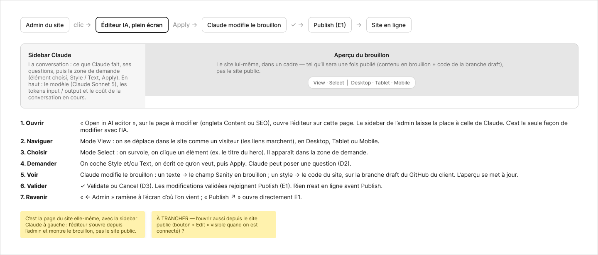

# D0 · Ce qui se passe au clic sur « Open in AI editor »

Extraction Figma du fichier « Kuartz — Carte système » (fileKey `wvr98llwHnMufQ88qUp4Ih`). Notation des arbres et conventions : voir [../README.md](../README.md).

| Champ | Valeur |
|---|---|
| Route | — (pas de route propre : schéma explicatif, pas d’écran) |
| Accès | Kuartz et client admin (barre d’accès : « KUARTZ » bleu #1f70eb et « CLIENT ADMIN » vert #1f9e57, 718px chacun) |
| Seul Kuartz voit | rien de spécifique à cet écran |
| Wireframe | `254:1310` · caption `254:1302` · accès `254:1305` |
| LLM context | `506:1763` |
| UI | — (pas d’écran UI : schéma explicatif) |
| Captures | [Wireframe](./D0.wf.png) |

Voir aussi : [G1 (ouvrir l’éditeur)](../states/G1.md)

## Caption et barre d’accès

- Caption wireframe (`254:1302`) : D0 · Ce qui se passe au clic sur « Open in AI editor »
- Barre d’accès wireframe (`254:1305`, 1440px) : "KUARTZ" 718px fill=#1f70eb | "CLIENT ADMIN" 718px fill=#1f9e57

## LLM context

Bloc Figma `506:1763` (page Wireframe), texte verbatim.

> LLM CONTEXT
>
> D0 · Ce qui se passe au clic sur « Open in AI editor »
>
> Schéma explicatif
>
> Pas d’écran : le parcours complet de l’éditeur IA, de l’admin au site en ligne.

<!-- col 1 -->

### PARCOURS

1. Ouvrir : « ✦ Open in AI editor » sur une page (C1, C2 ou C6) ouvre l’éditeur en plein écran sur cette page. C’est la seule façon de modifier avec l’IA.
2. Naviguer (View) : on parcourt le site comme un visiteur, en Desktop, Tablet ou Mobile.
3. Choisir (Select) : on clique un élément (ex. le titre du hero) ; Maj + clic pour plusieurs.
4. Demander : Style et/ou Text, la demande, Apply. Claude peut poser une question (D2).
5. Voir : Claude modifie le brouillon (texte → brouillon Sanity ; style → code sur la branche draft) ; l’aperçu se met à jour.
6. Valider : ✓ Validate ou Cancel (D3). Ce qui est validé rejoint Publish (E1) ; rien n’est en ligne avant.
7. Revenir : « ← Admin » ramène à l’écran d’origine ; « Publish ↗ » ouvre E1.

<!-- col 2 -->

### L’APERÇU

C’est le site lui-même dans un cadre, tel qu’il sera une fois publié : contenu en brouillon (Sanity) + code de la branche draft. Ce n’est pas le site public.

### À TRANCHER

• Question 9 : ouvrir aussi l’éditeur depuis le site public (bouton « Edit » quand on est connecté) ?

### VOIR AUSSI

G1 (ouvrir l’éditeur), D1 à D3, G2 (les 9 états de la sidebar Claude), E1.

## Wireframe

Écran wireframe `254:1310` — textes et annotations dans l’ordre de lecture (▸ = conteneur, [Composant {propriétés}], « (libre) » = conteneur sans auto-layout, enfants triés haut→bas puis gauche→droite).

- ▸ D0 · Ce qui se passe au clic
  - ▸ flow
    - ▸ Frame
      - "Admin du site"
    - "clic →"
    - ▸ Frame
      - "Éditeur IA, plein écran"
    - "Apply →"
    - ▸ Frame
      - "Claude modifie le brouillon"
    - "✓ →"
    - ▸ Frame
      - "Publish (E1)"
    - "→"
    - ▸ Frame
      - "Site en ligne"
  - ▸ schema-ecran
    - ▸ Frame
      - "Sidebar Claude"
      - "La conversation : ce que Claude fait, ses questions, puis la zone de demande (élément choisi, Style / Text, Apply). En haut : le modèle (Claude Sonnet 5), les tokens input / output et le coût de la conversation en cours."
    - ▸ Frame
      - "Aperçu du brouillon"
      - "Le site lui-même, dans un cadre — tel qu’il sera une fois publié (contenu en brouillon + code de la branche draft), pas le site public."
      - ▸ Frame
        - "View · Select  |  Desktop · Tablet · Mobile"
  - ▸ etapes
    - ▸ Frame
      - "1. Ouvrir"
      - "« Open in AI editor », sur la page à modifier (onglets Content ou SEO), ouvre l’éditeur sur cette page. La sidebar de l’admin laisse la place à celle de Claude. C’est la seule façon de modifier avec l’IA."
    - ▸ Frame
      - "2. Naviguer"
      - "Mode View : on se déplace dans le site comme un visiteur (les liens marchent), en Desktop, Tablet ou Mobile."
    - ▸ Frame
      - "3. Choisir"
      - "Mode Select : on survole, on clique un élément (ex. le titre du hero). Il apparaît dans la zone de demande."
    - ▸ Frame
      - "4. Demander"
      - "On coche Style et/ou Text, on écrit ce qu’on veut, puis Apply. Claude peut poser une question (D2)."
    - ▸ Frame
      - "5. Voir"
      - "Claude modifie le brouillon : un texte → le champ Sanity en brouillon ; un style → le code du site, sur la branche draft du GitHub du client. L’aperçu se met à jour."
    - ▸ Frame
      - "6. Valider"
      - "✓ Validate ou Cancel (D3). Les modifications validées rejoignent Publish (E1). Rien n’est en ligne avant Publish."
    - ▸ Frame
      - "7. Revenir"
      - "« ← Admin » ramène à l’écran d’où l’on vient ; « Publish ↗ » ouvre directement E1."
  - ▸ notes-d0
    - [wf/Note {Text="C’est la page du site elle-même, avec la sidebar Claude à gauche : l’éditeur s’ouvre depuis l’admin et montre le brouillon, pas le site public."}]
    - [wf/Note {Text="À TRANCHER — l’ouvrir aussi depuis le site public (bouton « Edit » visible quand on est connecté) ?"}]

## UI — arbre

Pas d’écran UI pour D0 : c’est un schéma explicatif, voir la section Wireframe.

## Notes d’extraction

- Le bloc LLM context de D0 ne contient ni ligne « Route : … » ni ligne « Accès : … » ; la ligne Route du tableau le signale, et la ligne Accès est déduite de la seule barre d’accès wireframe.
