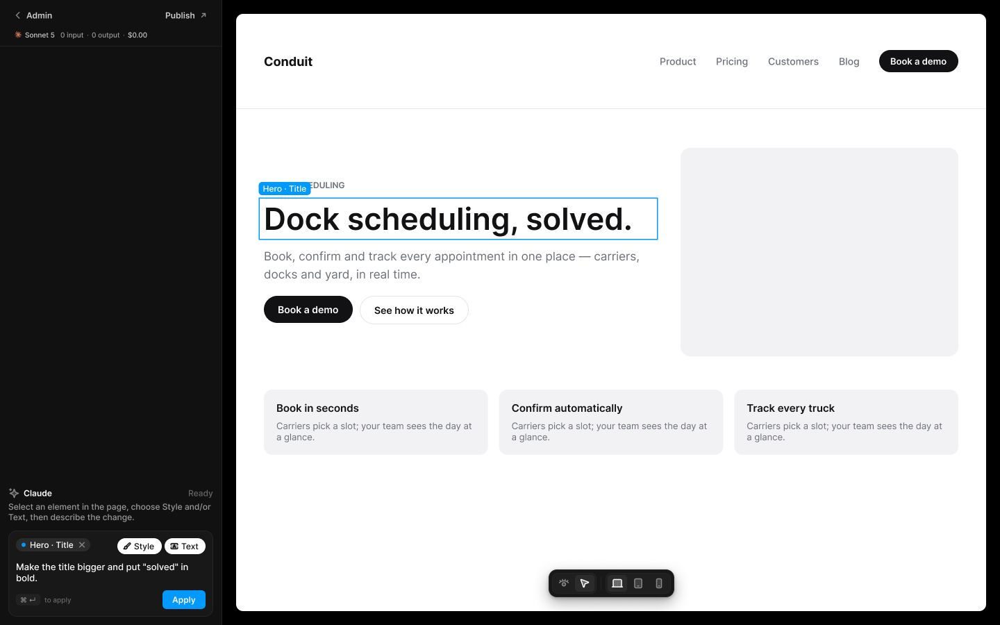
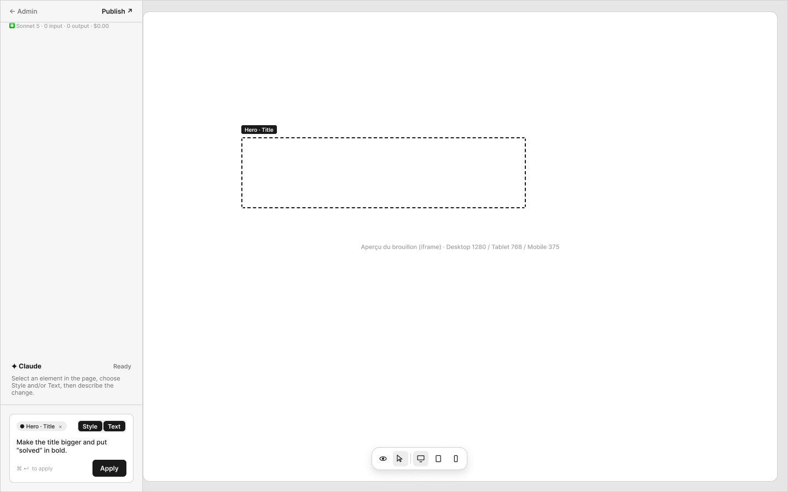

# D1 · Éditeur IA — sélection et demande

Extraction Figma du fichier « Kuartz — Carte système » (fileKey `wvr98llwHnMufQ88qUp4Ih`). Notation des arbres et conventions : voir [../README.md](../README.md).

| Champ | Valeur |
|---|---|
| Route | `/admin/editor?page=<page> (plein écran, hors de la coque de l’admin ; proposé)` |
| Accès | Kuartz et client admin (barres d’accès wireframe et UI : « KUARTZ » bleu #1f70eb et « CLIENT ADMIN » vert #1f9e57, 718px chacun ; ligne « Accès : Kuartz et client ») |
| Seul Kuartz voit | rien de spécifique à cet écran |
| Wireframe | `215:1043` · caption `215:1040` · accès `227:1733` |
| LLM context | `506:1786` |
| UI | `359:1577` · caption `359:1574` · accès `359:1745` |
| Captures | [UI](./D1.ui.png) · [Wireframe](./D1.wf.png) |

Voir aussi : [Sidebar Claude : 9 états → G2](../states/G2.md)





## Caption et barre d’accès

- Caption wireframe (`215:1040`) : D1 · Éditeur IA — sélection et demande
- Barre d’accès wireframe (`227:1733`, 1440px) : "KUARTZ" 718px fill=#1f70eb | "CLIENT ADMIN" 718px fill=#1f9e57
- Caption UI (`359:1574`) : D1 · Éditeur IA — sélection et demande
- Barre d’accès UI (`359:1745`, 1440px) : "KUARTZ" 718px fill=#1f70eb | "CLIENT ADMIN" 718px fill=#1f9e57

## LLM context

Bloc Figma `506:1786` (page Wireframe), texte verbatim.

> LLM CONTEXT
>
> D1 · AI editor — select & ask
>
> Éditeur IA — sélection et demande
>
> Route : /admin/editor?page=<page> (plein écran, hors de la coque de l’admin ; proposé) · Accès : Kuartz et client · Entrée : « Open in AI editor » (G1)

<!-- col 1 -->

### EN BREF

La seule modification par IA : on choisit un élément de la page, on décrit le changement, Claude modifie le brouillon, on valide. Plein écran : sidebar Claude à gauche, aperçu du brouillon à droite.

### LAYOUT

• Sidebar Claude : 260 px, redimensionnable par une poignée sur son bord droit (260 à 480 px, double-clic → 260 px ; valeurs proposées).
• Aperçu : le site en brouillon (Draft Mode : contenu brouillon Sanity + code de la branche draft), avec 20 px de marge ; il occupe tout le reste de l’écran.
• Barre d’outils flottante par-dessus la page, en bas au centre, en icônes : View (œil) et Select (curseur) | Desktop (1280), Tablet (768), Mobile (375).

### EN-TÊTE DE LA SIDEBAR

• « ‹ Admin » : retour à l’écran d’origine. « Publish ↗ » : ouvre E1.
• Dessous, la consommation de la conversation en cours : logo Claude + modèle + tokens input / output cumulés + coût (« Sonnet 5 · 0 input · 0 output · $0.00 »).

### COMPOSANTS

Editor header, Model usage, Claude header (état Ready / Working / Needs your answer / Done), Message, Step, Composer (puces, Style / Text, champ, ⌘ ↵ to apply, Apply), Canvas selection, Editor toolbar.

<!-- col 2 -->

### SÉLECTION ET DEMANDE

• View : navigation comme un visiteur (les liens marchent).
• Select : au survol d’un élément sélectionnable, contour + curseur main ; ailleurs, flèche. Clic : sélection, avec son label (« Hero · Title »). Maj + clic : ajoute ou retire un élément ; la demande vaut pour tous. Échap : tout désélectionner.
• Élément sélectionnable = relié à un champ Sanity (texte) ou à une zone de style déclarée (CSS Module) ; repéré par les attributs de Visual Editing (stega / data-sanity).
• Zone de demande : puces des éléments (× pour retirer), portée Style et/ou Text (rien de coché par défaut ; au moins une), texte de la demande (600 caractères au plus, proposé), Apply ou ⌘ ↵.
• Tant que rien n’est choisi : champ inactif, « Select an element in the page (Shift + click for several) ».

### MOTEUR (REPRIS DU POC)

• Un runner Node persistant (jamais dans le Studio, en serverless ni dans une Sanity Function) pilote Claude via l’Agent SDK.
• Style : modifie le CSS Module de la zone, liste blanche de propriétés, tokens du design system seulement → commit sur la branche draft du GitHub du client.
• Text : modifie le champ Sanity (string ou text : longueur maximale, mise en avant *…* en deux groupes au plus) ou un texte écrit dans le .tsx → brouillon (jeton d’écriture côté serveur).
• Limites par demande : 24 tours, 1,5 $ au plus, 2 essais. Mesuré sur 50 cas : médiane 0,07 $ et 24 s.
• Modèle montré : Claude Sonnet 5 (hypothèse, configurable).

### HORS PÉRIMÈTRE

Ajouter, supprimer ou déplacer un élément ; police hors design system ; ressources externes ; opacité < 1 sur du texte ; changement de className ; corps d’article en texte riche → demande à Kuartz.

### À TRANCHER

• Question 7 : où tourne le runner (piste : Vercel Sandbox).
• Question 14 : largeur 260–480 px.
Tous les états de la sidebar : G2.

## Wireframe

Écran wireframe `215:1043` — textes et annotations dans l’ordre de lecture (▸ = conteneur, [Composant {propriétés}], « (libre) » = conteneur sans auto-layout, enfants triés haut→bas puis gauche→droite).

- ▸ D1 · AI editor — select & ask
  - ▸ sidebar · Claude
    - ▸ top-line
      - "← Admin"
      - "Publish ↗"
    - ▸ usage-line
      - "✳ Sonnet 5 · 0 input · 0 output · $0.00" (usage)
    - ▸ claude-log
      - ▸ Frame
        - "✦ Claude"
        - "Ready"
      - "Select an element in the page, choose Style and/or Text, then describe the change."
    - ▸ input-area
      - ▸ input
        - ▸ Frame
          - ▸ chip
            - "● Hero · Title"
            - "×" (remove)
          - ▸ scope
            - ▸ toggle/Style
              - "Style"
            - ▸ toggle/Text
              - "Text"
        - "Make the title bigger and put “solved” in bold."
        - ▸ Frame
          - "⌘ ↵  to apply" (hint ⌘↵)
          - [wf/Button {Label="Apply", variant=primary}] «btn/Apply»
  - ▸ stage (libre)
    - [wf/Image {Label="Aperçu du brouillon (iframe) · Desktop 1280 / Tablet 768 / Mobile 375"}]
    - ▸ selection-label
      - "Hero · Title"

## UI — arbre

Écran UI `359:1577` (page UI). Légende : `AL H|V` auto-layout, `gap`, `pad` (1 valeur, [vertical, horizontal] ou [haut, droite, bas, gauche]), `align=principal/secondaire`, `size=largeur/hauteur` (fixed|hug|fill), `@x,y` position libre, `abs@x,y` position absolue dans un auto-layout, `fill/stroke/radius` = variable liée (valeur brute en hex/px si aucune variable), `effect` = style d’effet, `TEXT … · <style de texte> · <couleur>` puis `:: "texte"`, `INST "calque" → Composant {propriétés}` ; sous une instance : `T "texte"` = texte interne non déjà donné par une propriété.

```text
FRAME "D1 · AI editor — select & ask" 1440×900 · AL H gap=0 align=MIN/MIN · fill=bg/app
  FRAME "ai-sidebar" 320×900 · AL V gap=0 align=MIN/MIN · size=fixed/fill · fill=bg/primary · stroke=border/subtle sides[T0 R1 B0 L0]
    INST "Editor header" 319×67 → Editor header {state=default} · AL V gap=0 align=MIN/MIN · size=fill/hug · fill=bg/primary · stroke=border/subtle sides[T0 R0 B1 L0]
      INST "back" 84×27 → Button {Show icon right=false, Icon left=Icon/chevron-left, Icon right=Icon/chevron-down, Show icon left=true, Label="Admin", variant=ghost, state=default, size=small}
      INST "publish" 89×27 → Button {Icon left=Icon/plus, Show icon right=true, Icon right=Icon/external, Show icon left=false, Label="Publish", variant=ghost, state=default, size=small}
      INST "usage" 193×12 → Model usage {Show usage=true, Cost="$0.00", Output="0 output", Input="0 input", Show model=true, Model="Sonnet 5", size=small}
        INST "mark" 12×12 → Icon/claude {size=12}
        T "·"
        T "·"
    FRAME "thread" 319×697 · AL V gap=space/12 pad=[space/16, space/12, space/12, space/12] align=MAX/MIN · size=fill/fill
      INST "Claude header" 295×50 → Claude header {state=ready} · AL V gap=space/4 align=MIN/MIN · size=fill/hug
        INST "icon" 16×16 → Icon/ai {size=18}
        T "Claude"
        T "Ready"
        T "Select an element in the page, choose Style and/or Text, then describe the change."
    FRAME "composer-wrap" 319×136 · AL V gap=0 pad=[0, space/12, space/12, space/12] align=MIN/CENTER · size=fill/hug
      INST "Composer" 295×124 → Composer {state=ready} · AL V gap=space/10 pad=space/10 align=MIN/MIN · size=fill/hug · fill=bg/elevated · stroke=border/default 1 · radius=radius/lg
        INST "element" 107×19 → Element chip {Show remove=true, Label="Hero · Title"}
          INST "remove" 12×12 → Icon/close {size=12}
        INST "scope/Style" 64×23 → Chip {Icon=Icon/style, Show icon=true, Label="Style", state=on}
        INST "scope/Text" 59×23 → Chip {Icon=Icon/text, Show icon=true, Label="Text", state=on}
        T "Make the title bigger and put \"solved\" in bold."
        INST "shortcut" 35×16 → Kbd {Label="⌘ ↵"}
        T "to apply"
        INST "apply" 62×27 → Button {Icon left=Icon/plus, Icon right=Icon/chevron-down, Show icon right=false, Show icon left=false, Label="Apply", variant=primary, state=default, size=small}
  FRAME "canvas" 1120×900 · size=fill/fill · fill=bg/app
    FRAME "preview" 1080×860 · AL V gap=0 align=MIN/MIN · @20,20
      FRAME "site-draft (conduit.com)" 1080×860 · AL V gap=0 align=MIN/MIN · size=fill/fill · fill=#ffffff · radius=10 · effect=drop_shadow(40)
        FRAME "nav" 1080×137 · AL H gap=28 pad=[18, 40] align=MIN/CENTER · size=fill/hug · stroke=#e5e5e8 sides[T0 R0 B1 L0]
          TEXT "logo" 71×22 · Inter Bold 18 · #121214 · size=hug/hug :: "Conduit"
          FRAME "Frame" 443×100 · AL H gap=0 align=MIN/MIN · size=fill/hug
          TEXT "Product" 53×17 · Inter Medium 14 · #6b7078 · size=hug/hug :: "Product"
          TEXT "Pricing" 47×17 · Inter Medium 14 · #6b7078 · size=hug/hug :: "Pricing"
          TEXT "Customers" 74×17 · Inter Medium 14 · #6b7078 · size=hug/hug :: "Customers"
          TEXT "Blog" 30×17 · Inter Medium 14 · #6b7078 · size=hug/hug :: "Blog"
          FRAME "cta" 114×32 · AL H gap=0 pad=[8, 16] align=MIN/MIN · size=hug/hug · fill=#121214 · radius=999
            TEXT "Book a demo" 82×16 · Inter Semi Bold 13 · #ffffff · size=hug/hug :: "Book a demo"
        FRAME "hero" 1080×404 · AL H gap=40 pad=[56, 40, 48, 40] align=MIN/CENTER · size=fill/hug
          FRAME "copy" 560×208 · AL V gap=18 align=MIN/MIN · size=fill/hug
            TEXT "eyebrow" 117×15 · Inter Semi Bold 12 · #6b7078 · size=hug/hug :: "DOCK SCHEDULING"
            TEXT "hero-title" 560×46 · Inter Semi Bold 44 · #121214 · size=fill/hug :: "Dock scheduling, solved."
            TEXT "subtitle" 560×52 · Inter Regular 17 · #6b7078 · size=fill/hug :: "Book, confirm and track every appointment in one place — carriers, docks and yard, in real time."
            FRAME "buttons" 295×41 · AL H gap=10 align=MIN/MIN · size=hug/hug
              FRAME "Frame" 128×39 · AL H gap=0 pad=[11, 20] align=MIN/MIN · size=hug/hug · fill=#121214 · radius=999
                TEXT "Book a demo" 88×17 · Inter Semi Bold 14 · #ffffff · size=hug/hug :: "Book a demo"
              FRAME "Frame" 157×41 · AL H gap=0 pad=[11, 20] align=MIN/MIN · size=hug/hug · stroke=#e5e5e8 1 · radius=999
                TEXT "See how it works" 115×17 · Inter Semi Bold 14 · #121214 · size=hug/hug :: "See how it works"
          RECTANGLE "hero-image" 400×300 · size=fixed/fixed · fill=#f2f2f5 · radius=14
        FRAME "features" 1080×94 · AL H gap=16 pad=[0, 40] align=MIN/MIN · size=fill/hug
          FRAME "Frame" 323×94 · AL V gap=8 pad=18 align=MIN/MIN · size=fill/hug · fill=#f2f2f5 · radius=12
            TEXT "Book in seconds" 119×18 · Inter Semi Bold 15 · #121214 · size=hug/hug :: "Book in seconds"
            TEXT "Carriers pick a slot" 287×32 · Inter Regular 13 · #6b7078 · size=fill/hug :: "Carriers pick a slot; your team sees the day at a glance."
          FRAME "Frame" 323×94 · AL V gap=8 pad=18 align=MIN/MIN · size=fill/hug · fill=#f2f2f5 · radius=12
            TEXT "Confirm automaticall" 161×18 · Inter Semi Bold 15 · #121214 · size=hug/hug :: "Confirm automatically"
            TEXT "Carriers pick a slot" 287×32 · Inter Regular 13 · #6b7078 · size=fill/hug :: "Carriers pick a slot; your team sees the day at a glance."
          FRAME "Frame" 323×94 · AL V gap=8 pad=18 align=MIN/MIN · size=fill/hug · fill=#f2f2f5 · radius=12
            TEXT "Track every truck" 127×18 · Inter Semi Bold 15 · #121214 · size=hug/hug :: "Track every truck"
            TEXT "Carriers pick a slot" 287×32 · Inter Regular 13 · #6b7078 · size=fill/hug :: "Carriers pick a slot; your team sees the day at a glance."
    INST "Canvas selection" 572×58 → Canvas selection {Name="Hero · Title", state=selected} · @54,286 · stroke=interactive/primary 1.5
    INST "Editor toolbar" 181×40 → Editor toolbar {state=default} · AL H gap=space/6 pad=space/4 align=MIN/CENTER · @470,820 · fill=bg/elevated · stroke=border/default 1 · radius=radius/lg · effect=Elevation/Popover
      INST "mode" 64×30 → Segmented control {count=2, content=icon}
        INST "segment 1" 28×24 → Segment {Label="Desktop", Icon=Icon/eye, type=icon, state=default}
        INST "segment 2" 28×24 → Segment {Label="Desktop", Icon=Icon/select, type=icon, state=selected}
      INST "device" 94×30 → Segmented control {count=3, content=icon}
        INST "segment 1" 28×24 → Segment {Label="Desktop", Icon=Icon/desktop, type=icon, state=selected}
        INST "segment 2" 28×24 → Segment {Label="Desktop", Icon=Icon/tablet, type=icon, state=default}
        INST "segment 3" 28×24 → Segment {Label="Desktop", Icon=Icon/mobile, type=icon, state=default}
```
