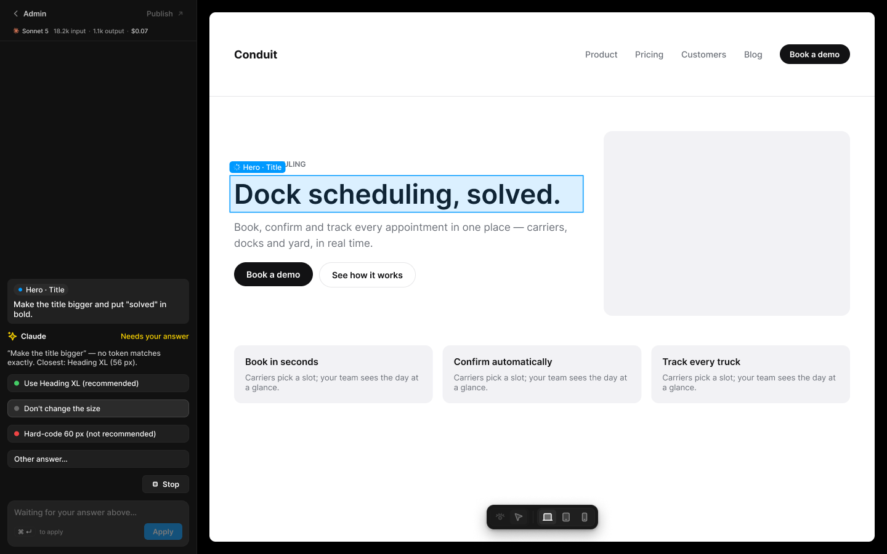
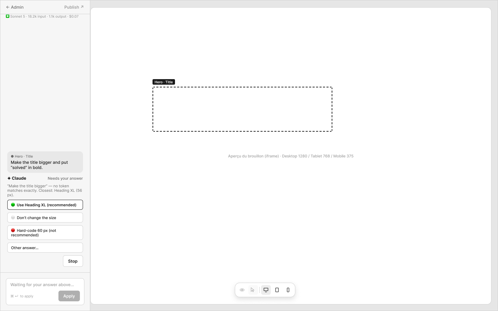

# D2 · Éditeur IA — Claude pose une question

Extraction Figma du fichier « Kuartz — Carte système » (fileKey `wvr98llwHnMufQ88qUp4Ih`). Notation des arbres et conventions : voir [../README.md](../README.md).

| Champ | Valeur |
|---|---|
| Route | — (pas de ligne « Route : … » dans l’en-tête du LLM context, qui indique « Même écran que D1, pendant une demande » ; voir [D1](./D1.md)) |
| Accès | Kuartz et client admin (barres d’accès wireframe et UI : « KUARTZ » bleu #1f70eb et « CLIENT ADMIN » vert #1f9e57, 718px chacun) |
| Seul Kuartz voit | rien de spécifique à cet écran |
| Wireframe | `215:1102` · caption `215:1099` · accès `227:1738` |
| LLM context | `506:1821` |
| UI | `359:1631` · caption `359:1628` · accès `359:1750` |
| Captures | [UI](./D2.ui.png) · [Wireframe](./D2.wf.png) |





## Caption et barre d’accès

- Caption wireframe (`215:1099`) : D2 · Éditeur IA — Claude pose une question
- Barre d’accès wireframe (`227:1738`, 1440px) : "KUARTZ" 718px fill=#1f70eb | "CLIENT ADMIN" 718px fill=#1f9e57
- Caption UI (`359:1628`) : D2 · Éditeur IA — Claude pose une question
- Barre d’accès UI (`359:1750`, 1440px) : "KUARTZ" 718px fill=#1f70eb | "CLIENT ADMIN" 718px fill=#1f9e57

## LLM context

Bloc Figma `506:1821` (page Wireframe), texte verbatim.

> LLM CONTEXT
>
> D2 · AI editor — Claude asks
>
> Éditeur IA — Claude travaille, puis pose une question
>
> Même écran que D1, pendant une demande

<!-- col 1 -->

### ENVOI

• Après Apply, le message quitte le champ et s’affiche en bulle en haut du fil (avec la puce de l’élément), au-dessus des étapes de Claude, comme dans une messagerie. Le champ se vide.
• Claude affiche son état (« Working… ») et ses étapes (« Reading Hero.module.css », « Title → Heading XL »).
• La ligne de consommation de l’en-tête se met à jour (« 18.2k input · 1.1k output · $0.07 »).

### PENDANT QUE CLAUDE TRAVAILLE

• Tout est bloqué : sélection, View / Select, saisie, Publish (grisés). Restent actifs : Stop, et Desktop / Tablet / Mobile pour vérifier les autres tailles.
• Curseur flèche, sans contour au survol. Le label de l’élément montre un indicateur de travail.
• Le champ affiche « Claude is working… ».

<!-- col 2 -->

### QUESTION DE CLAUDE

• Si la demande ne tombe pas pile sur un token, Claude demande (« Needs your answer »), par ex. « "Make the title bigger" — no token matches exactly. Closest: Heading XL (56 px). »
• Options : 🟢 le token le plus proche (recommandé), ⚪ ne rien changer, 🔴 une valeur en dur (déconseillée), « Other answer… » (rouvre le champ pour répondre).
• Un clic sur une option relance Claude. En attendant : « Waiting for your answer above… », Apply grisé.

### STOP ET ERREURS

• Stop : Claude s’arrête, rien n’est modifié, la demande revient dans le champ (G2, état 9).
• Erreur (Claude ou runner) : « Couldn’t apply — nothing was changed. », la demande revient dans le champ.

## Wireframe

Écran wireframe `215:1102` — textes et annotations dans l’ordre de lecture (▸ = conteneur, [Composant {propriétés}], « (libre) » = conteneur sans auto-layout, enfants triés haut→bas puis gauche→droite).

- ▸ D2 · AI editor — Claude asks
  - ▸ sidebar · Claude
    - ▸ top-line
      - "← Admin"
      - "Publish ↗"
    - ▸ usage-line
      - "✳ Sonnet 5 · 18.2k input · 1.1k output · $0.07" (usage)
    - ▸ claude-log
      - ▸ user-message
        - "● Hero · Title"
        - "Make the title bigger and put “solved” in bold."
      - ▸ Frame
        - "✦ Claude"
        - "Needs your answer"
      - "“Make the title bigger” — no token matches exactly. Closest: Heading XL (56 px)."
      - ▸ Frame
        - "🟢  Use Heading XL (recommended)"
      - ▸ Frame
        - "⚪  Don’t change the size"
      - ▸ Frame
        - "🔴  Hard-code 60 px (not recommended)"
      - ▸ Frame
        - "Other answer…"
      - ▸ Frame
        - [wf/Button {Label="Stop", variant=secondary}] «btn/Stop»
    - ▸ input-area
      - ▸ input
        - "Waiting for your answer above…"
        - ▸ Frame
          - "⌘ ↵  to apply" (hint ⌘↵)
          - [wf/Button {Label="Apply", variant=primary}] «btn/Apply»
  - ▸ stage (libre)
    - [wf/Image {Label="Aperçu du brouillon (iframe) · Desktop 1280 / Tablet 768 / Mobile 375"}]
    - ▸ selection-label
      - "Hero · Title"

## UI — arbre

Écran UI `359:1631` (page UI). Légende : `AL H|V` auto-layout, `gap`, `pad` (1 valeur, [vertical, horizontal] ou [haut, droite, bas, gauche]), `align=principal/secondaire`, `size=largeur/hauteur` (fixed|hug|fill), `@x,y` position libre, `abs@x,y` position absolue dans un auto-layout, `fill/stroke/radius` = variable liée (valeur brute en hex/px si aucune variable), `effect` = style d’effet, `TEXT … · <style de texte> · <couleur>` puis `:: "texte"`, `INST "calque" → Composant {propriétés}` ; sous une instance : `T "texte"` = texte interne non déjà donné par une propriété.

```text
FRAME "D2 · AI editor — Claude asks" 1440×900 · AL H gap=0 align=MIN/MIN · fill=bg/app
  FRAME "ai-sidebar" 320×900 · AL V gap=0 align=MIN/MIN · size=fixed/fill · fill=bg/primary · stroke=border/subtle sides[T0 R1 B0 L0]
    INST "Editor header" 319×67 → Editor header {state=locked} · AL V gap=0 align=MIN/MIN · size=fill/hug · fill=bg/primary · stroke=border/subtle sides[T0 R0 B1 L0]
      INST "back" 84×27 → Button {Show icon right=false, Icon left=Icon/chevron-left, Icon right=Icon/chevron-down, Show icon left=true, Label="Admin", variant=ghost, state=default, size=small}
      INST "publish" 89×27 → Button {Icon left=Icon/plus, Show icon right=true, Icon right=Icon/external, Show icon left=false, Label="Publish", variant=ghost, state=disabled, size=small}
      INST "usage" 221×12 → Model usage {Show usage=true, Cost="$0.07", Output="1.1k output", Input="18.2k input", Show model=true, Model="Sonnet 5", size=small}
        INST "mark" 12×12 → Icon/claude {size=12}
        T "·"
        T "·"
    FRAME "thread" 319×746 · AL V gap=space/12 pad=[space/16, space/12, space/12, space/12] align=MAX/MIN · size=fill/fill
      INST "Message" 295×73 → Message {type=request} · AL V gap=space/6 pad=[space/8, space/10] align=MIN/MIN · size=fill/hug · fill=bg/subtle · radius=radius/md
        INST "element" 89×19 → Element chip {Show remove=false, Label="Hero · Title"}
        T "Make the title bigger and put \"solved\" in bold."
      INST "Claude header" 295×16 → Claude header {state=asking} · AL V gap=space/4 align=MIN/MIN · size=fill/hug
        INST "icon" 16×16 → Icon/ai {size=18}
        T "Claude"
        T "Needs your answer"
      TEXT "question" 295×30 · Body Small · text/secondary · size=fill/hug :: "“Make the title bigger” — no token matches exactly. Closest: Heading XL (56 px)."
      INST "Answer option" 295×29 → Answer option {kind=recommended, state=default} · AL H gap=space/8 pad=[space/6, space/10] align=MIN/CENTER · size=fill/hug · fill=bg/input · stroke=border/default 1 · radius=radius/md
        T "Use Heading XL (recommended)"
      INST "Answer option" 295×29 → Answer option {kind=neutral, state=hover} · AL H gap=space/8 pad=[space/6, space/10] align=MIN/CENTER · size=fill/hug · fill=bg/input-hover · stroke=border/strong 1 · radius=radius/md
        T "Don't change the size"
      INST "Answer option" 295×29 → Answer option {kind=risky, state=default} · AL H gap=space/8 pad=[space/6, space/10] align=MIN/CENTER · size=fill/hug · fill=bg/input · stroke=border/default 1 · radius=radius/md
        T "Hard-code 60 px (not recommended)"
      INST "Answer option" 295×29 → Answer option {kind=other, state=default} · AL H gap=space/8 pad=[space/6, space/10] align=MIN/CENTER · size=fill/hug · fill=bg/input · stroke=border/default 1 · radius=radius/md
        T "Other answer…"
      FRAME "stop-row" 295×29 · AL H gap=0 align=MAX/CENTER · size=fill/hug
        INST "Button" 76×29 → Button {Icon left=Icon/stop, Show icon left=true, Icon right=Icon/chevron-down, Show icon right=false, Label="Stop", variant=secondary, state=default, size=small} · AL H gap=space/6 pad=[space/6, 14] align=CENTER/CENTER · size=hug/hug · fill=bg/input · stroke=border/default 1 · radius=6
    FRAME "composer-wrap" 319×87 · AL V gap=0 pad=[0, space/12, space/12, space/12] align=MIN/CENTER · size=fill/hug
      INST "Composer" 295×75 → Composer {state=waiting} · AL V gap=space/10 pad=space/10 align=MIN/MIN · size=fill/hug · fill=bg/subtle · stroke=border/default 1 · radius=radius/lg
        T "Waiting for your answer above…"
        INST "shortcut" 35×16 → Kbd {Label="⌘ ↵"}
        T "to apply"
        INST "apply" 62×27 → Button {Icon right=Icon/chevron-down, Icon left=Icon/plus, Show icon right=false, Show icon left=false, Label="Apply", variant=primary, state=disabled, size=small}
  FRAME "canvas" 1120×900 · size=fill/fill · fill=bg/app
    FRAME "preview" 1080×860 · AL V gap=0 align=MIN/MIN · @20,20
      FRAME "site-draft (conduit.com)" 1080×860 · AL V gap=0 align=MIN/MIN · size=fill/fill · fill=#ffffff · radius=10 · effect=drop_shadow(40)
        FRAME "nav" 1080×137 · AL H gap=28 pad=[18, 40] align=MIN/CENTER · size=fill/hug · stroke=#e5e5e8 sides[T0 R0 B1 L0]
          TEXT "logo" 71×22 · Inter Bold 18 · #121214 · size=hug/hug :: "Conduit"
          FRAME "Frame" 443×100 · AL H gap=0 align=MIN/MIN · size=fill/hug
          TEXT "Product" 53×17 · Inter Medium 14 · #6b7078 · size=hug/hug :: "Product"
          TEXT "Pricing" 47×17 · Inter Medium 14 · #6b7078 · size=hug/hug :: "Pricing"
          TEXT "Customers" 74×17 · Inter Medium 14 · #6b7078 · size=hug/hug :: "Customers"
          TEXT "Blog" 30×17 · Inter Medium 14 · #6b7078 · size=hug/hug :: "Blog"
          FRAME "cta" 114×32 · AL H gap=0 pad=[8, 16] align=MIN/MIN · size=hug/hug · fill=#121214 · radius=999
            TEXT "Book a demo" 82×16 · Inter Semi Bold 13 · #ffffff · size=hug/hug :: "Book a demo"
        FRAME "hero" 1080×404 · AL H gap=40 pad=[56, 40, 48, 40] align=MIN/CENTER · size=fill/hug
          FRAME "copy" 560×208 · AL V gap=18 align=MIN/MIN · size=fill/hug
            TEXT "eyebrow" 117×15 · Inter Semi Bold 12 · #6b7078 · size=hug/hug :: "DOCK SCHEDULING"
            TEXT "hero-title" 560×46 · Inter Semi Bold 44 · #121214 · size=fill/hug :: "Dock scheduling, solved."
            TEXT "subtitle" 560×52 · Inter Regular 17 · #6b7078 · size=fill/hug :: "Book, confirm and track every appointment in one place — carriers, docks and yard, in real time."
            FRAME "buttons" 295×41 · AL H gap=10 align=MIN/MIN · size=hug/hug
              FRAME "Frame" 128×39 · AL H gap=0 pad=[11, 20] align=MIN/MIN · size=hug/hug · fill=#121214 · radius=999
                TEXT "Book a demo" 88×17 · Inter Semi Bold 14 · #ffffff · size=hug/hug :: "Book a demo"
              FRAME "Frame" 157×41 · AL H gap=0 pad=[11, 20] align=MIN/MIN · size=hug/hug · stroke=#e5e5e8 1 · radius=999
                TEXT "See how it works" 115×17 · Inter Semi Bold 14 · #121214 · size=hug/hug :: "See how it works"
          RECTANGLE "hero-image" 400×300 · size=fixed/fixed · fill=#f2f2f5 · radius=14
        FRAME "features" 1080×94 · AL H gap=16 pad=[0, 40] align=MIN/MIN · size=fill/hug
          FRAME "Frame" 323×94 · AL V gap=8 pad=18 align=MIN/MIN · size=fill/hug · fill=#f2f2f5 · radius=12
            TEXT "Book in seconds" 119×18 · Inter Semi Bold 15 · #121214 · size=hug/hug :: "Book in seconds"
            TEXT "Carriers pick a slot" 287×32 · Inter Regular 13 · #6b7078 · size=fill/hug :: "Carriers pick a slot; your team sees the day at a glance."
          FRAME "Frame" 323×94 · AL V gap=8 pad=18 align=MIN/MIN · size=fill/hug · fill=#f2f2f5 · radius=12
            TEXT "Confirm automaticall" 161×18 · Inter Semi Bold 15 · #121214 · size=hug/hug :: "Confirm automatically"
            TEXT "Carriers pick a slot" 287×32 · Inter Regular 13 · #6b7078 · size=fill/hug :: "Carriers pick a slot; your team sees the day at a glance."
          FRAME "Frame" 323×94 · AL V gap=8 pad=18 align=MIN/MIN · size=fill/hug · fill=#f2f2f5 · radius=12
            TEXT "Track every truck" 127×18 · Inter Semi Bold 15 · #121214 · size=hug/hug :: "Track every truck"
            TEXT "Carriers pick a slot" 287×32 · Inter Regular 13 · #6b7078 · size=fill/hug :: "Carriers pick a slot; your team sees the day at a glance."
    INST "Canvas selection" 572×58 → Canvas selection {Name="Hero · Title", state=working} · @54,286 · fill=bg/tint/info@14% · stroke=interactive/primary 1.5
      INST "icon" 12×12 → Icon/loader {size=12}
    INST "Editor toolbar" 181×40 → Editor toolbar {state=locked} · AL H gap=space/6 pad=space/4 align=MIN/CENTER · @470,820 · fill=bg/elevated · stroke=border/default 1 · radius=radius/lg · effect=Elevation/Popover
      INST "mode" 64×30 → Segmented control {count=2, content=icon}
        INST "segment 1" 28×24 → Segment {Label="Desktop", Icon=Icon/eye, type=icon, state=default}
        INST "segment 2" 28×24 → Segment {Label="Desktop", Icon=Icon/select, type=icon, state=selected}
      INST "device" 94×30 → Segmented control {count=3, content=icon}
        INST "segment 1" 28×24 → Segment {Label="Desktop", Icon=Icon/desktop, type=icon, state=selected}
        INST "segment 2" 28×24 → Segment {Label="Desktop", Icon=Icon/tablet, type=icon, state=default}
        INST "segment 3" 28×24 → Segment {Label="Desktop", Icon=Icon/mobile, type=icon, state=default}
```

## Notes d’extraction

- Le bloc LLM context de D2 ne contient ni ligne « Route : … » ni ligne « Accès : … » (en-tête : « Même écran que D1, pendant une demande ») ; la ligne Accès est déduite des barres d’accès.
