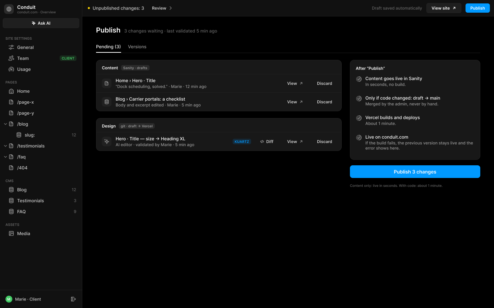
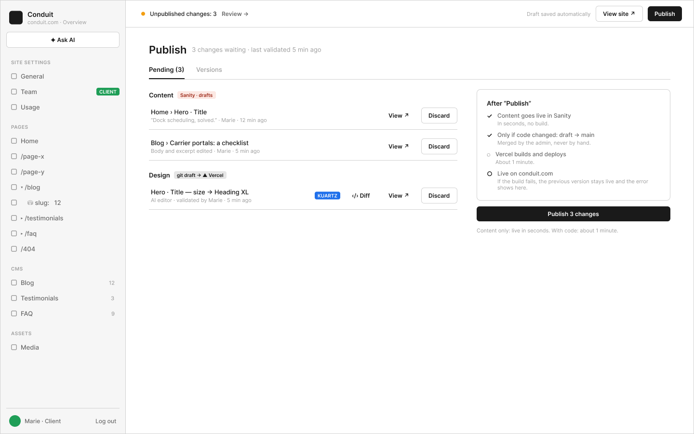

# E1 · Publish — changements en attente

Extraction Figma du fichier « Kuartz — Carte système » (fileKey `wvr98llwHnMufQ88qUp4Ih`). Notation des arbres et conventions : voir [../README.md](../README.md).

| Champ | Valeur |
|---|---|
| Route | `/admin/publish` |
| Accès | Kuartz et client admin (barres d’accès wireframe et UI : « KUARTZ » bleu #1f70eb et « CLIENT ADMIN » vert #1f9e57, 718px chacun ; ligne « Accès : Kuartz et client (le diff de code est réservé à Kuartz) ») |
| Seul Kuartz voit | le bouton « ‹/› Diff » (« ‹/› Diff (Kuartz seulement) : le diff du code de la modification »), signalé par le tag « KUARTZ » sur la ligne de modification Design (« Hero · Title — size → Heading XL ») |
| Wireframe | `216:1062` · caption `216:1059` · accès `227:1748` |
| LLM context | `507:1755` |
| UI | `359:1822` · caption `359:1819` · accès `359:1970` |
| Captures | [UI](./E1.ui.png) · [Wireframe](./E1.wf.png) |

Voir aussi : [Publish : 5 états → G3](../states/G3.md)





## Caption et barre d’accès

- Caption wireframe (`216:1059`) : E1 · Publish — changements en attente
- Barre d’accès wireframe (`227:1748`, 1440px) : "KUARTZ" 718px fill=#1f70eb | "CLIENT ADMIN" 718px fill=#1f9e57
- Caption UI (`359:1819`) : E1 · Publish — changements en attente
- Barre d’accès UI (`359:1970`, 1440px) : "KUARTZ" 718px fill=#1f70eb | "CLIENT ADMIN" 718px fill=#1f9e57

## LLM context

Bloc Figma `507:1755` (page Wireframe), texte verbatim.

> LLM CONTEXT
>
> E1 · Publish — pending changes
>
> Tout ce qui attend d’être mis en ligne
>
> Route : /admin/publish · Accès : Kuartz et client (le diff de code est réservé à Kuartz)

<!-- col 1 -->

### EN BREF

Regroupe les brouillons de contenu et les modifications validées de l’éditeur IA, puis les met en ligne en un clic. Il n’y a pas d’autre façon de publier (proposé, question 3).

### OUVERTURE

« Review › » dans la Top bar, « Publish ↗ » dans l’éditeur IA, la carte Content de B1. Onglets : Pending (N) | Versions (E2).

### DONNÉES

• Content (Sanity · drafts) : chaque document qui a un brouillon : chemin (« Home › Hero · Title », « Blog › Carrier portals: a checklist »), résumé (nouvelle valeur, ou « Body and excerpt edited »), auteur, heure.
• Design (git · draft → Vercel) : chaque modification validée de l’éditeur IA = un commit sur la branche draft pas encore dans main (« Hero · Title — size → Heading XL », « AI editor · validated by Marie · 5 min ago »).
• En-tête : « 3 changes waiting · last validated 5 min ago ».

### COMPOSANTS

Page header, Tabs, List item (icône, chemin, résumé, actions), Tag KUARTZ, Button « ‹/› Diff », « View ↗ », « Discard », carte « After “Publish” » (Step × 4), Publish button.

<!-- col 2 -->

### ACTIONS

• View ↗ : aperçu du brouillon à l’endroit modifié. Discard : supprime ce brouillon (contenu) ou annule le commit (design), avec confirmation.
• ‹/› Diff (Kuartz seulement) : le diff du code de la modification.
• « Publish 3 changes » : met tout en ligne ; « Content only: live in seconds. With code: about 1 minute. »

### PUBLICATION (CÔTÉ SERVEUR, DANS L’ORDRE)

1. Content goes live in Sanity : publication des documents (document.publish avec ifDraftRevisionId, pour ne pas écraser une modification plus récente). En quelques secondes, sans build.
2. Only if code changed: draft → main : fusion en avance rapide (merge --ff-only), tag publication-N, push. Faite par l’admin, jamais à la main.
3. Vercel builds and deploys : environ 1 minute.
4. Live on conduit.com.
• Progression dans la Top bar : « Publishing… step 2 / 4 » (G3). L’ensemble n’est pas atomique : le contenu part d’abord.

### ÉTATS ET CAS LIMITES

• Échec du build : l’ancienne version reste en ligne ; la Top bar affiche l’échec, « See error » (le log du build) et Retry.
• Rien en attente : « Everything is published. », Publish grisé.
• Le bouton Publish natif du Studio Sanity publierait un texte sans le code qui va avec : il ne doit pas être proposé au client.

### À TRANCHER

• Question 3 : publication élément par élément ?

## Wireframe

Écran wireframe `216:1062` — textes et annotations dans l’ordre de lecture (▸ = conteneur, [Composant {propriétés}], « (libre) » = conteneur sans auto-layout, enfants triés haut→bas puis gauche→droite).

- ▸ E1 · Publish — pending changes
  - [wf/Sidebar · Projet {role=Client admin}]
    - "Conduit"
    - "conduit.com · Overview"
    - [wf/Button {Label="✦ Ask AI", variant=secondary}]
    - "SITE SETTINGS"
    - [wf/Nav item {Show icon=true, Count="12", Show count=false, Label="General", state=default}]
    - [wf/Nav item {Show icon=true, Count="12", Show count=false, Label="Team", state=default}]
    - [wf/Tag ]
      - "CLIENT"
    - [wf/Nav item {Show icon=true, Count="12", Show count=false, Label="Usage", state=default}]
    - "PAGES"
    - [wf/Nav item {Show icon=true, Count="12", Show count=false, Label="Home", state=default}]
    - [wf/Nav item {Show icon=true, Count="12", Show count=false, Label="/page-x", state=default}]
    - [wf/Nav item {Show icon=true, Count="12", Show count=false, Label="/page-y", state=default}]
    - [wf/Nav item {Show icon=true, Count="12", Show count=false, Label="▾ /blog", state=default}]
    - [wf/Nav item {Show icon=true, Count="12", Show count=false, Label="    ⛁ slug:   12", state=default}]
    - [wf/Nav item {Show icon=true, Count="12", Show count=false, Label="▸ /testimonials", state=default}]
    - [wf/Nav item {Show icon=true, Count="12", Show count=false, Label="▸ /faq", state=default}]
    - [wf/Nav item {Show icon=true, Count="12", Show count=false, Label="/404", state=default}]
    - "CMS"
    - [wf/Nav item {Show icon=true, Count="12", Show count=true, Label="Blog", state=default}]
    - [wf/Nav item {Show icon=true, Count="3", Show count=true, Label="Testimonials", state=default}]
    - [wf/Nav item {Show icon=true, Count="9", Show count=true, Label="FAQ", state=default}]
    - "ASSETS"
    - [wf/Nav item {Show icon=true, Count="12", Show count=false, Label="Media", state=default}]
    - "Marie · Client"
    - "Log out"
  - ▸ main
    - [wf/Top bar {Status="Unpublished changes: 3"}]
      - "Review →"
      - "Draft saved automatically"
      - [wf/Button {Label="View site ↗", variant=secondary}]
      - [wf/Button {Label="Publish", variant=primary}]
    - ▸ content
      - ▸ Frame
        - "Publish"
        - "3 changes waiting · last validated 5 min ago"
      - ▸ tabs
        - ▸ tab/Pending (3)
          - "Pending (3)"
        - ▸ tab/Versions
          - "Versions"
      - ▸ cols
        - ▸ changes
          - ▸ Frame
            - "Content"
            - [wf/Tag ] «tag/Sanity · drafts»
              - "Sanity · drafts"
          - ▸ change
            - ▸ Frame
              - "Home › Hero · Title"
              - "“Dock scheduling, solved.” · Marie · 12 min ago"
            - [wf/Button {Label="View ↗", variant=ghost}] «btn/View»
            - [wf/Button {Label="Discard", variant=secondary}] «btn/Discard»
          - ▸ change
            - ▸ Frame
              - "Blog › Carrier portals: a checklist"
              - "Body and excerpt edited · Marie · 5 min ago"
            - [wf/Button {Label="View ↗", variant=ghost}] «btn/View»
            - [wf/Button {Label="Discard", variant=secondary}] «btn/Discard»
          - ▸ Frame
            - "Design"
            - [wf/Tag ]
              - "git draft → ▲ Vercel"
          - ▸ change
            - ▸ Frame
              - "Hero · Title — size → Heading XL"
              - "AI editor · validated by Marie · 5 min ago"
            - [wf/Tag ] «tag/KUARTZ»
              - "KUARTZ"
            - [wf/Button {Label="‹/› Diff", variant=ghost}] «btn/‹/› Diff»
            - [wf/Button {Label="View ↗", variant=ghost}] «btn/View»
            - [wf/Button {Label="Discard", variant=secondary}] «btn/Discard»
        - ▸ right
          - ▸ after-publish
            - "After “Publish”"
            - ▸ Frame
              - "✓"
              - ▸ step
                - "Content goes live in Sanity"
                - "In seconds, no build."
            - ▸ Frame
              - "✓"
              - ▸ step
                - "Only if code changed: draft → main"
                - "Merged by the admin, never by hand."
            - ▸ Frame
              - "◌"
              - ▸ step
                - "Vercel builds and deploys"
                - "About 1 minute."
            - ▸ Frame
              - "○"
              - ▸ step
                - "Live on conduit.com"
                - "If the build fails, the previous version stays live and the error shows here."
          - [wf/Button {Label="Publish 3 changes", variant=primary}] «btn/Publish 3 changes»
          - "Content only: live in seconds. With code: about 1 minute."

## UI — arbre

Écran UI `359:1822` (page UI). Légende : `AL H|V` auto-layout, `gap`, `pad` (1 valeur, [vertical, horizontal] ou [haut, droite, bas, gauche]), `align=principal/secondaire`, `size=largeur/hauteur` (fixed|hug|fill), `@x,y` position libre, `abs@x,y` position absolue dans un auto-layout, `fill/stroke/radius` = variable liée (valeur brute en hex/px si aucune variable), `effect` = style d’effet, `TEXT … · <style de texte> · <couleur>` puis `:: "texte"`, `INST "calque" → Composant {propriétés}` ; sous une instance : `T "texte"` = texte interne non déjà donné par une propriété.

```text
FRAME "E1 · Publish — pending changes" 1440×900 · AL H gap=0 align=MIN/MIN · fill=bg/app
  INST "Sidebar" 240×900 → Sidebar {role=client} · AL V gap=0 align=MIN/MIN · size=fixed/fill · fill=bg/primary · stroke=border/subtle sides[T0 R1 B0 L0]
    INST "icon" 16×16 → Icon/globe {size=18}
    T "Conduit"
    T "conduit.com · Overview"
    INST "ask-ai" 223×29 → Button {Icon left=Icon/ai, Show icon left=true, Icon right=Icon/chevron-down, Show icon right=false, Label="Ask AI", variant=secondary, state=default, size=small}
    INST "section/SITE SETTINGS" 223×32 → Nav section {Show action=false, Label="SITE SETTINGS"}
    INST "nav/General" 223×32 → Nav item {Show tag=false, Show count=false, Count="12", Show chevron=false, Icon=Icon/sliders, Show icon=true, Label="General", state=default}
    INST "nav/Team" 223×32 → Nav item {Show tag=true, Show count=false, Count="12", Show chevron=false, Icon=Icon/team, Show icon=true, Label="Team", state=default}
      INST "tag" 49×16 → Tag {Icon=Icon/close, Show icon=false, Show dot=false, Label="CLIENT", tone=success}
    INST "nav/Usage" 223×32 → Nav item {Show tag=false, Show count=false, Count="12", Show chevron=false, Icon=Icon/usage, Show icon=true, Label="Usage", state=default}
    INST "section/PAGES" 223×32 → Nav section {Show action=false, Label="PAGES"}
    INST "nav/Home" 223×32 → Nav item {Show tag=false, Show count=false, Count="12", Show chevron=false, Icon=Icon/house, Show icon=true, Label="Home", state=default}
    INST "nav//page-x" 223×32 → Nav item {Show tag=false, Show count=false, Count="12", Show chevron=false, Icon=Icon/page, Show icon=true, Label="/page-x", state=default}
    INST "nav//page-y" 223×32 → Nav item {Show tag=false, Show count=false, Count="12", Show chevron=false, Icon=Icon/page, Show icon=true, Label="/page-y", state=default}
    INST "nav//blog" 223×32 → Nav item {Show tag=false, Show count=false, Count="12", Show chevron=true, Icon=Icon/page, Show icon=true, Label="/blog", state=default}
      INST "chevron" 10×10 → Icon/chevron-down {size=12}
    INST "nav//blog/:slug" 223×32 → Nav item {Show tag=false, Show count=true, Count="12", Show chevron=false, Icon=Icon/database, Show icon=true, Label="slug:", state=default}
    INST "nav//testimonials" 223×32 → Nav item {Show tag=false, Show count=false, Count="12", Show chevron=true, Icon=Icon/page, Show icon=true, Label="/testimonials", state=default}
      INST "chevron" 10×10 → Icon/chevron-down {size=12}
    INST "nav//faq" 223×32 → Nav item {Show tag=false, Show count=false, Count="12", Show chevron=true, Icon=Icon/page, Show icon=true, Label="/faq", state=default}
      INST "chevron" 10×10 → Icon/chevron-down {size=12}
    INST "nav//404" 223×32 → Nav item {Show tag=false, Show count=false, Count="12", Show chevron=false, Icon=Icon/page, Show icon=true, Label="/404", state=default}
    INST "section/CMS" 223×32 → Nav section {Show action=false, Label="CMS"}
    INST "nav/Blog" 223×32 → Nav item {Show tag=false, Show count=true, Count="12", Show chevron=false, Icon=Icon/database, Show icon=true, Label="Blog", state=default}
    INST "nav/Testimonials" 223×32 → Nav item {Show tag=false, Show count=true, Count="3", Show chevron=false, Icon=Icon/database, Show icon=true, Label="Testimonials", state=default}
    INST "nav/FAQ" 223×32 → Nav item {Show tag=false, Show count=true, Count="9", Show chevron=false, Icon=Icon/database, Show icon=true, Label="FAQ", state=default}
    INST "section/ASSETS" 223×32 → Nav section {Show action=false, Label="ASSETS"}
    INST "nav/Media" 223×32 → Nav item {Show tag=false, Show count=false, Count="12", Show chevron=false, Icon=Icon/image, Show icon=true, Label="Media", state=default}
    INST "avatar" 20×20 → Avatar {Initials="M", size=20, tone=green}
    T "Marie · Client"
    INST "logout" 28×28 → Icon button {Icon=Icon/logout, style=ghost, state=default, size=small}
  FRAME "main" 1200×900 · AL V gap=0 align=MIN/MIN · size=fill/fill
    INST "Top bar" 1200×48 → Top bar {state=pending} · AL H gap=space/12 pad=[0, space/12, 0, space/16] align=MIN/CENTER · size=fill/fixed · fill=bg/primary · stroke=border/subtle sides[T0 R0 B1 L0]
      T "Unpublished changes: 3"
      INST "review" 88×27 → Button {Icon left=Icon/plus, Show icon right=true, Icon right=Icon/chevron-right, Show icon left=false, Label="Review", variant=ghost, state=default, size=small}
      T "Draft saved automatically"
      INST "view-site" 102×29 → Button {Icon left=Icon/plus, Show icon left=false, Icon right=Icon/external, Show icon right=true, Label="View site", variant=secondary, state=default, size=small}
      INST "publish" 71×27 → Publish button {state=pending}
        INST "button" 71×27 → Button {Icon left=Icon/plus, Icon right=Icon/chevron-down, Show icon right=false, Show icon left=false, Label="Publish", variant=primary, state=default, size=small}
    FRAME "content" 1200×852 · AL V gap=space/20 pad=[28, space/40, space/40, space/40] align=MIN/MIN · size=fill/fill
      INST "Page header" 1120×24 → Page header {Show description=false, Description="Images, videos and files used on the site. A file that is in use cannot be deleted.", Show meta=true, Meta="3 changes waiting · last validated 5 min ago", Title="Publish"} · AL V gap=space/4 align=MIN/MIN · size=fill/hug
      INST "Tabs" 1120×35 → Tabs {count=2} · AL H gap=space/20 align=MIN/MAX · size=fill/hug · stroke=border/subtle sides[T0 R0 B1 L0]
        INST "tab 1" 73×34 → Tab {Label="Pending (3)", state=active}
        INST "tab 2" 54×34 → Tab {Label="Versions", state=default}
      FRAME "body" 1120×373 · AL H gap=space/24 align=MIN/MIN · size=fill/hug
        FRAME "changes" 716×266 · AL V gap=space/20 align=MIN/MIN · size=fill/hug
          FRAME "group/Content" 716×150 · AL V gap=0 align=MIN/MIN · size=fill/hug · fill=bg/elevated · stroke=border/default 1 · radius=radius/lg
            FRAME "header" 714×40 · AL H gap=space/8 pad=[14, space/16, space/10, space/16] align=MIN/CENTER · size=fill/hug
              TEXT "title" 48×15 · Label · text/primary · size=hug/hug :: "Content"
              INST "where" 83×16 → Tag {Icon=Icon/close, Show icon=false, Show dot=false, Label="Sanity · drafts", tone=neutral} · AL H gap=space/4 pad=[space/2, space/6] align=MIN/CENTER · size=hug/hug · fill=bg/tint/neutral@8% · radius=radius/sm
              FRAME "sp" 535×1 · AL H gap=0 align=MIN/CENTER · size=fill/fixed
            FRAME "change" 714×54 · AL H gap=space/12 pad=[space/10, space/12, space/10, space/16] align=MIN/CENTER · size=fill/hug · stroke=border/subtle sides[T1 R0 B0 L0]
              FRAME "icon-wrap" 28×28 · AL H gap=0 align=CENTER/CENTER · size=fixed/fixed · fill=bg/subtle · radius=radius/md
              FRAME "text" 474×33 · AL V gap=space/2 align=MIN/MIN · size=fill/hug
                TEXT "title" 117×16 · Body · text/primary · size=hug/hug :: "Home › Hero · Title"
                TEXT "meta" 265×15 · Body Small · text/tertiary · size=hug/hug :: "“Dock scheduling, solved.” · Marie · 12 min ago"
              INST "Button" 75×27 → Button {Icon left=Icon/plus, Show icon right=true, Icon right=Icon/external, Show icon left=false, Label="View", variant=ghost, state=default, size=small} · AL H gap=space/6 pad=[space/6, 14] align=CENTER/CENTER · size=hug/hug · radius=6
              INST "Button" 73×27 → Button {Icon left=Icon/plus, Show icon right=false, Icon right=Icon/chevron-down, Show icon left=false, Label="Discard", variant=ghost, state=default, size=small} · AL H gap=space/6 pad=[space/6, 14] align=CENTER/CENTER · size=hug/hug · radius=6
            FRAME "change" 714×54 · AL H gap=space/12 pad=[space/10, space/12, space/10, space/16] align=MIN/CENTER · size=fill/hug · stroke=border/subtle sides[T1 R0 B0 L0]
              FRAME "icon-wrap" 28×28 · AL H gap=0 align=CENTER/CENTER · size=fixed/fixed · fill=bg/subtle · radius=radius/md
              FRAME "text" 474×33 · AL V gap=space/2 align=MIN/MIN · size=fill/hug
                TEXT "title" 203×16 · Body · text/primary · size=hug/hug :: "Blog › Carrier portals: a checklist"
                TEXT "meta" 249×15 · Body Small · text/tertiary · size=hug/hug :: "Body and excerpt edited · Marie · 5 min ago"
              INST "Button" 75×27 → Button {Icon left=Icon/plus, Show icon right=true, Icon right=Icon/external, Show icon left=false, Label="View", variant=ghost, state=default, size=small} · AL H gap=space/6 pad=[space/6, 14] align=CENTER/CENTER · size=hug/hug · radius=6
              INST "Button" 73×27 → Button {Icon left=Icon/plus, Show icon right=false, Icon right=Icon/chevron-down, Show icon left=false, Label="Discard", variant=ghost, state=default, size=small} · AL H gap=space/6 pad=[space/6, 14] align=CENTER/CENTER · size=hug/hug · radius=6
          FRAME "group/Design" 716×96 · AL V gap=0 align=MIN/MIN · size=fill/hug · fill=bg/elevated · stroke=border/default 1 · radius=radius/lg
            FRAME "header" 714×40 · AL H gap=space/8 pad=[14, space/16, space/10, space/16] align=MIN/CENTER · size=fill/hug
              TEXT "title" 41×15 · Label · text/primary · size=hug/hug :: "Design"
              INST "where" 105×16 → Tag {Icon=Icon/close, Show icon=false, Show dot=false, Label="git · draft → Vercel", tone=neutral} · AL H gap=space/4 pad=[space/2, space/6] align=MIN/CENTER · size=hug/hug · fill=bg/tint/neutral@8% · radius=radius/sm
              FRAME "sp" 520×1 · AL H gap=0 align=MIN/CENTER · size=fill/fixed
            FRAME "change" 714×54 · AL H gap=space/12 pad=[space/10, space/12, space/10, space/16] align=MIN/CENTER · size=fill/hug · stroke=border/subtle sides[T1 R0 B0 L0]
              FRAME "icon-wrap" 28×28 · AL H gap=0 align=CENTER/CENTER · size=fixed/fixed · fill=bg/subtle · radius=radius/md
              FRAME "text" 329×33 · AL V gap=space/2 align=MIN/MIN · size=fill/hug
                TEXT "title" 204×16 · Body · text/primary · size=hug/hug :: "Hero · Title — size → Heading XL"
                TEXT "meta" 230×15 · Body Small · text/tertiary · size=hug/hug :: "AI editor · validated by Marie · 5 min ago"
              INST "kuartz" 54×16 → Tag {Icon=Icon/close, Show icon=false, Show dot=false, Label="KUARTZ", tone=info} · AL H gap=space/4 pad=[space/2, space/6] align=MIN/CENTER · size=hug/hug · fill=bg/tint/info@14% · radius=radius/sm
              INST "Button" 67×27 → Button {Show icon right=false, Icon left=Icon/code, Icon right=Icon/chevron-down, Show icon left=true, Label="Diff", variant=ghost, state=default, size=small} · AL H gap=space/6 pad=[space/6, 14] align=CENTER/CENTER · size=hug/hug · radius=6
              INST "Button" 75×27 → Button {Icon left=Icon/plus, Show icon right=true, Icon right=Icon/external, Show icon left=false, Label="View", variant=ghost, state=default, size=small} · AL H gap=space/6 pad=[space/6, 14] align=CENTER/CENTER · size=hug/hug · radius=6
              INST "Button" 73×27 → Button {Icon left=Icon/plus, Show icon right=false, Icon right=Icon/chevron-down, Show icon left=false, Label="Discard", variant=ghost, state=default, size=small} · AL H gap=space/6 pad=[space/6, 14] align=CENTER/CENTER · size=hug/hug · radius=6
        FRAME "aside" 380×373 · AL V gap=space/16 align=MIN/MIN · size=fixed/hug
          FRAME "after-publish" 380×292 · AL V gap=space/4 pad=space/16 align=MIN/MIN · size=fill/hug · fill=bg/elevated · stroke=border/default 1 · radius=radius/lg
            TEXT "title" 86×15 · Label · text/primary · size=hug/hug :: "After “Publish”"
            INST "Checklist item" 346×53 → Checklist item {Show action=false, state=todo} · AL H gap=space/10 pad=[space/10, 0] align=MIN/MIN · size=fill/hug
              INST "icon" 18×18 → Icon/pending {size=18}
              T "Content goes live in Sanity"
              T "In seconds, no build."
            INST "Checklist item" 346×53 → Checklist item {Show action=false, state=todo} · AL H gap=space/10 pad=[space/10, 0] align=MIN/MIN · size=fill/hug
              INST "icon" 18×18 → Icon/pending {size=18}
              T "Only if code changed: draft → main"
              T "Merged by the admin, never by hand."
            INST "Checklist item" 346×53 → Checklist item {Show action=false, state=todo} · AL H gap=space/10 pad=[space/10, 0] align=MIN/MIN · size=fill/hug
              INST "icon" 18×18 → Icon/pending {size=18}
              T "Vercel builds and deploys"
              T "About 1 minute."
            INST "Checklist item" 346×68 → Checklist item {Show action=false, state=todo} · AL H gap=space/10 pad=[space/10, 0] align=MIN/MIN · size=fill/hug
              INST "icon" 18×18 → Icon/pending {size=18}
              T "Live on conduit.com"
              T "If the build fails, the previous version stays live and the error shows here."
          INST "publish" 380×37 → Button {Icon right=Icon/chevron-down, Icon left=Icon/plus, Show icon right=false, Show icon left=false, Label="Publish 3 changes", variant=primary, state=default, size=medium} · AL H gap=space/8 pad=[space/10, space/20] align=CENTER/CENTER · size=fill/hug · fill=interactive/primary · radius=radius/md
          TEXT "note" 271×12 · Caption · text/muted · size=hug/hug :: "Content only: live in seconds. With code: about 1 minute."
```
