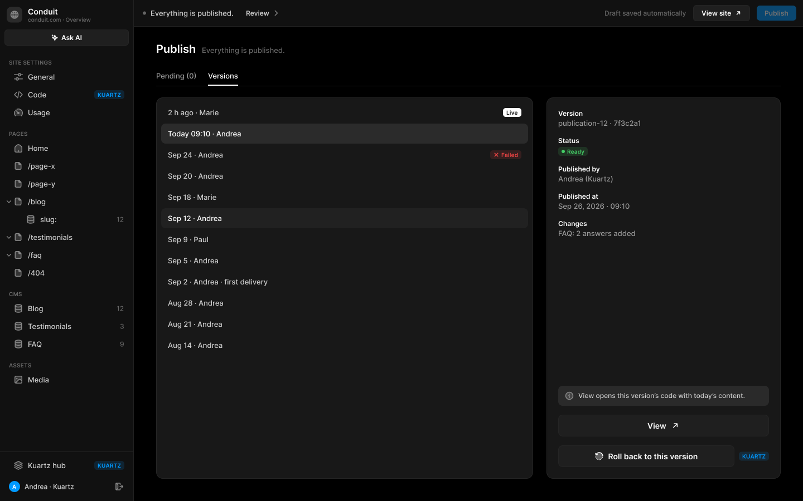
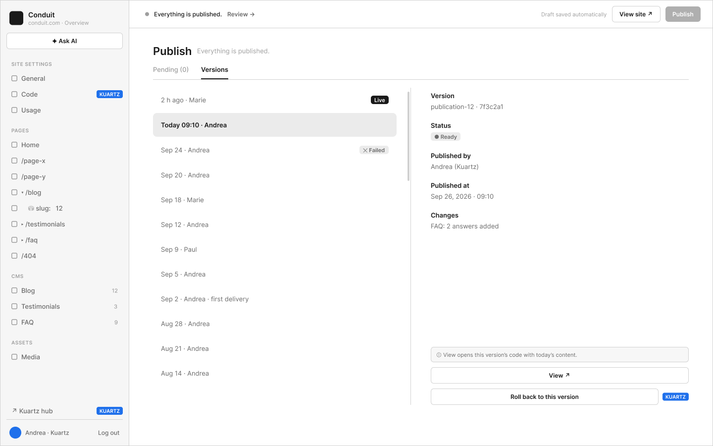

# E2 · Publish — versions

Extraction Figma du fichier « Kuartz — Carte système » (fileKey `wvr98llwHnMufQ88qUp4Ih`). Notation des arbres et conventions : voir [../README.md](../README.md).

| Champ | Valeur |
|---|---|
| Route | `/admin/publish/versions` |
| Accès | Kuartz et client admin (barres d’accès wireframe et UI : « KUARTZ » bleu #1f70eb et « CLIENT ADMIN » vert #1f9e57, 718px chacun ; ligne « Accès : Kuartz et client · « Roll back » : Kuartz seulement (proposé) ») |
| Seul Kuartz voit | le bouton « Roll back to this version » (tag « KUARTZ » ; « Roll back to this version (Kuartz) : Instant Rollback de Vercel pour le code […] Confirmation obligatoire », proposé, question 5) ; dans la sidebar affichée en rôle Kuartz, les entrées « Code » et « Kuartz hub » portent aussi le tag « KUARTZ » |
| Wireframe | `216:1223` · caption `216:1220` · accès `227:1821` |
| LLM context | `507:1790` |
| UI | `359:1887` · caption `359:1884` · accès `359:1975` |
| Captures | [UI](./E2.ui.png) · [Wireframe](./E2.wf.png) |





## Caption et barre d’accès

- Caption wireframe (`216:1220`) : E2 · Publish — versions
- Barre d’accès wireframe (`227:1821`, 1440px) : "KUARTZ" 718px fill=#1f70eb | "CLIENT ADMIN" 718px fill=#1f9e57
- Caption UI (`359:1884`) : E2 · Publish — versions
- Barre d’accès UI (`359:1975`, 1440px) : "KUARTZ" 718px fill=#1f70eb | "CLIENT ADMIN" 718px fill=#1f9e57

## LLM context

Bloc Figma `507:1790` (page Wireframe), texte verbatim.

> LLM CONTEXT
>
> E2 · Publish — versions
>
> L’historique des publications, comme les versions de Framer
>
> Route : /admin/publish/versions · Accès : Kuartz et client · « Roll back » : Kuartz seulement (proposé)

<!-- col 1 -->

### EN BREF

À gauche, la liste défilante de toutes les publications ; à droite, la fiche de celle choisie. Une version = un déploiement Vercel + les contenus Sanity publiés en même temps.

### DONNÉES

• Par version : numéro (tag publication-N), commit (7f3c2a1), déploiement Vercel (URL, état), auteur, date, statut (Live, Ready, Failed), résumé des changements (« FAQ: 2 answers added »).
• La première : « Sep 2 · Andrea · first delivery ».

### COMPOSANTS

Tabs, Version item (badge Live, ✕ Failed), Detail row, Callout, Button « View ↗ », Button « Roll back to this version » + Tag KUARTZ.

<!-- col 2 -->

### COMPORTEMENT

• Liste : la plus récente en haut ; badge Live sur la version en ligne ; ✕ Failed sur un build raté ; clic → fiche.
• Fiche : Version, Status, Published by, Published at, Changes.
• « View opens this version’s code with today’s content. » : View ↗ ouvre l’URL du déploiement Vercel de cette version ; on y voit le code de l’époque avec le contenu Sanity d’aujourd’hui (le site lit Sanity en direct). Pour revoir un contenu d’époque : l’historique de Sanity.
• Roll back to this version (Kuartz) : Instant Rollback de Vercel pour le code ; les textes passent par l’historique Sanity, séparément. Confirmation obligatoire.
• La Top bar affiche « Everything is published. », Publish grisé.

### À TRANCHER

• Question 5 : le client admin peut-il revenir en arrière ?
• Code et textes ensemble ou séparément ?

## Wireframe

Écran wireframe `216:1223` — textes et annotations dans l’ordre de lecture (▸ = conteneur, [Composant {propriétés}], « (libre) » = conteneur sans auto-layout, enfants triés haut→bas puis gauche→droite).

- ▸ E2 · Publish — versions
  - [wf/Sidebar · Projet {role=Kuartz}]
    - "Conduit"
    - "conduit.com · Overview"
    - [wf/Button {Label="✦ Ask AI", variant=secondary}]
    - "SITE SETTINGS"
    - [wf/Nav item {Show icon=true, Count="12", Show count=false, Label="General", state=default}]
    - [wf/Nav item {Show icon=true, Count="12", Show count=false, Label="Code", state=default}]
    - [wf/Tag ]
      - "KUARTZ"
    - [wf/Nav item {Show icon=true, Count="12", Show count=false, Label="Usage", state=default}]
    - "PAGES"
    - [wf/Nav item {Show icon=true, Count="12", Show count=false, Label="Home", state=default}]
    - [wf/Nav item {Show icon=true, Count="12", Show count=false, Label="/page-x", state=default}]
    - [wf/Nav item {Show icon=true, Count="12", Show count=false, Label="/page-y", state=default}]
    - [wf/Nav item {Show icon=true, Count="12", Show count=false, Label="▾ /blog", state=default}]
    - [wf/Nav item {Show icon=true, Count="12", Show count=false, Label="    ⛁ slug:   12", state=default}]
    - [wf/Nav item {Show icon=true, Count="12", Show count=false, Label="▸ /testimonials", state=default}]
    - [wf/Nav item {Show icon=true, Count="12", Show count=false, Label="▸ /faq", state=default}]
    - [wf/Nav item {Show icon=true, Count="12", Show count=false, Label="/404", state=default}]
    - "CMS"
    - [wf/Nav item {Show icon=true, Count="12", Show count=true, Label="Blog", state=default}]
    - [wf/Nav item {Show icon=true, Count="3", Show count=true, Label="Testimonials", state=default}]
    - [wf/Nav item {Show icon=true, Count="9", Show count=true, Label="FAQ", state=default}]
    - "ASSETS"
    - [wf/Nav item {Show icon=true, Count="12", Show count=false, Label="Media", state=default}]
    - [wf/Nav item {Show icon=false, Count="12", Show count=false, Label="↗ Kuartz hub", state=default}]
    - [wf/Tag ]
      - "KUARTZ"
    - "Andrea · Kuartz"
    - "Log out"
  - ▸ main
    - [wf/Top bar {Status="Everything is published."}]
      - "Review →"
      - "Draft saved automatically"
      - [wf/Button {Label="View site ↗", variant=secondary}]
      - [wf/Button {Label="Publish", variant=primary}]
    - ▸ content
      - ▸ Frame
        - "Publish"
        - "Everything is published."
      - ▸ tabs
        - ▸ tab/Pending (0)
          - "Pending (0)"
        - ▸ tab/Versions
          - "Versions"
      - ▸ cols
        - ▸ versions-list (scroll) (libre)
          - ▸ list
            - ▸ version
              - "2 h ago · Marie"
              - ▸ Frame
                - "Live"
            - ▸ version
              - "Today 09:10 · Andrea"
            - ▸ version
              - "Sep 24 · Andrea"
              - ▸ Frame
                - "✕ Failed"
            - ▸ version
              - "Sep 20 · Andrea"
            - ▸ version
              - "Sep 18 · Marie"
            - ▸ version
              - "Sep 12 · Andrea"
            - ▸ version
              - "Sep 9 · Paul"
            - ▸ version
              - "Sep 5 · Andrea"
            - ▸ version
              - "Sep 2 · Andrea · first delivery"
            - ▸ version
              - "Aug 28 · Andrea"
            - ▸ version
              - "Aug 21 · Andrea"
            - ▸ version
              - "Aug 14 · Andrea"
        - ▸ details
          - ▸ Frame
            - "Version"
            - "publication-12 · 7f3c2a1"
          - ▸ Frame
            - "Status"
            - ▸ Frame
              - "● Ready"
          - ▸ Frame
            - "Published by"
            - "Andrea (Kuartz)"
          - ▸ Frame
            - "Published at"
            - "Sep 26, 2026 · 09:10"
          - ▸ Frame
            - "Changes"
            - "FAQ: 2 answers added"
          - ▸ Frame
            - ▸ info · View
              - "ⓘ View opens this version’s code with today’s content."
            - [wf/Button {Label="View ↗", variant=secondary}] «btn/View»
            - ▸ Frame
              - [wf/Button {Label="Roll back to this version", variant=secondary}] «btn/Roll back to this version»
              - [wf/Tag ]
                - "KUARTZ"

## UI — arbre

Écran UI `359:1887` (page UI). Légende : `AL H|V` auto-layout, `gap`, `pad` (1 valeur, [vertical, horizontal] ou [haut, droite, bas, gauche]), `align=principal/secondaire`, `size=largeur/hauteur` (fixed|hug|fill), `@x,y` position libre, `abs@x,y` position absolue dans un auto-layout, `fill/stroke/radius` = variable liée (valeur brute en hex/px si aucune variable), `effect` = style d’effet, `TEXT … · <style de texte> · <couleur>` puis `:: "texte"`, `INST "calque" → Composant {propriétés}` ; sous une instance : `T "texte"` = texte interne non déjà donné par une propriété.

```text
FRAME "E2 · Publish — versions" 1440×900 · AL H gap=0 align=MIN/MIN · fill=bg/app
  INST "Sidebar" 240×900 → Sidebar {role=kuartz} · AL V gap=0 align=MIN/MIN · size=fixed/fill · fill=bg/primary · stroke=border/subtle sides[T0 R1 B0 L0]
    INST "icon" 16×16 → Icon/globe {size=18}
    T "Conduit"
    T "conduit.com · Overview"
    INST "ask-ai" 223×29 → Button {Icon left=Icon/ai, Show icon left=true, Icon right=Icon/chevron-down, Show icon right=false, Label="Ask AI", variant=secondary, state=default, size=small}
    INST "section/SITE SETTINGS" 223×32 → Nav section {Show action=false, Label="SITE SETTINGS"}
    INST "nav/General" 223×32 → Nav item {Show tag=false, Show count=false, Count="12", Show chevron=false, Icon=Icon/sliders, Show icon=true, Label="General", state=default}
    INST "nav/Code" 223×32 → Nav item {Show tag=true, Show count=false, Count="12", Show chevron=false, Icon=Icon/code, Show icon=true, Label="Code", state=default}
      INST "tag" 54×16 → Tag {Icon=Icon/close, Show icon=false, Show dot=false, Label="KUARTZ", tone=info}
    INST "nav/Usage" 223×32 → Nav item {Show tag=false, Show count=false, Count="12", Show chevron=false, Icon=Icon/usage, Show icon=true, Label="Usage", state=default}
    INST "section/PAGES" 223×32 → Nav section {Show action=false, Label="PAGES"}
    INST "nav/Home" 223×32 → Nav item {Show tag=false, Show count=false, Count="12", Show chevron=false, Icon=Icon/house, Show icon=true, Label="Home", state=default}
    INST "nav//page-x" 223×32 → Nav item {Show tag=false, Show count=false, Count="12", Show chevron=false, Icon=Icon/page, Show icon=true, Label="/page-x", state=default}
    INST "nav//page-y" 223×32 → Nav item {Show tag=false, Show count=false, Count="12", Show chevron=false, Icon=Icon/page, Show icon=true, Label="/page-y", state=default}
    INST "nav//blog" 223×32 → Nav item {Show tag=false, Show count=false, Count="12", Show chevron=true, Icon=Icon/page, Show icon=true, Label="/blog", state=default}
      INST "chevron" 10×10 → Icon/chevron-down {size=12}
    INST "nav//blog/:slug" 223×32 → Nav item {Show tag=false, Show count=true, Count="12", Show chevron=false, Icon=Icon/database, Show icon=true, Label="slug:", state=default}
    INST "nav//testimonials" 223×32 → Nav item {Show tag=false, Show count=false, Count="12", Show chevron=true, Icon=Icon/page, Show icon=true, Label="/testimonials", state=default}
      INST "chevron" 10×10 → Icon/chevron-down {size=12}
    INST "nav//faq" 223×32 → Nav item {Show tag=false, Show count=false, Count="12", Show chevron=true, Icon=Icon/page, Show icon=true, Label="/faq", state=default}
      INST "chevron" 10×10 → Icon/chevron-down {size=12}
    INST "nav//404" 223×32 → Nav item {Show tag=false, Show count=false, Count="12", Show chevron=false, Icon=Icon/page, Show icon=true, Label="/404", state=default}
    INST "section/CMS" 223×32 → Nav section {Show action=false, Label="CMS"}
    INST "nav/Blog" 223×32 → Nav item {Show tag=false, Show count=true, Count="12", Show chevron=false, Icon=Icon/database, Show icon=true, Label="Blog", state=default}
    INST "nav/Testimonials" 223×32 → Nav item {Show tag=false, Show count=true, Count="3", Show chevron=false, Icon=Icon/database, Show icon=true, Label="Testimonials", state=default}
    INST "nav/FAQ" 223×32 → Nav item {Show tag=false, Show count=true, Count="9", Show chevron=false, Icon=Icon/database, Show icon=true, Label="FAQ", state=default}
    INST "section/ASSETS" 223×32 → Nav section {Show action=false, Label="ASSETS"}
    INST "nav/Media" 223×32 → Nav item {Show tag=false, Show count=false, Count="12", Show chevron=false, Icon=Icon/image, Show icon=true, Label="Media", state=default}
    INST "nav/Kuartz hub" 223×32 → Nav item {Show tag=true, Show count=false, Count="12", Show chevron=false, Icon=Icon/hub, Show icon=true, Label="Kuartz hub", state=default}
      INST "tag" 54×16 → Tag {Icon=Icon/close, Show icon=false, Show dot=false, Label="KUARTZ", tone=info}
    INST "avatar" 20×20 → Avatar {Initials="A", size=20, tone=blue}
    T "Andrea · Kuartz"
    INST "logout" 28×28 → Icon button {Icon=Icon/logout, style=ghost, state=default, size=small}
  FRAME "main" 1200×900 · AL V gap=0 align=MIN/MIN · size=fill/fill
    INST "Top bar" 1200×48 → Top bar {state=up-to-date} · AL H gap=space/12 pad=[0, space/12, 0, space/16] align=MIN/CENTER · size=fill/fixed · fill=bg/primary · stroke=border/subtle sides[T0 R0 B1 L0]
      T "Everything is published."
      INST "review" 88×27 → Button {Icon left=Icon/plus, Show icon right=true, Icon right=Icon/chevron-right, Show icon left=false, Label="Review", variant=ghost, state=default, size=small}
      T "Draft saved automatically"
      INST "view-site" 102×29 → Button {Icon left=Icon/plus, Show icon left=false, Icon right=Icon/external, Show icon right=true, Label="View site", variant=secondary, state=default, size=small}
      INST "publish" 71×27 → Publish button {state=idle}
        INST "button" 71×27 → Button {Icon right=Icon/chevron-down, Icon left=Icon/plus, Show icon right=false, Show icon left=false, Label="Publish", variant=primary, state=disabled, size=small}
    FRAME "content" 1200×852 · AL V gap=space/20 pad=[28, space/40, space/40, space/40] align=MIN/MIN · size=fill/fill
      INST "Page header" 1120×24 → Page header {Show description=false, Description="Images, videos and files used on the site. A file that is in use cannot be deleted.", Show meta=true, Meta="Everything is published.", Title="Publish"} · AL V gap=space/4 align=MIN/MIN · size=fill/hug
      INST "Tabs" 1120×35 → Tabs {count=2} · AL H gap=space/20 align=MIN/MAX · size=fill/hug · stroke=border/subtle sides[T0 R0 B1 L0]
        INST "tab 1" 73×34 → Tab {Label="Pending (0)", state=default}
        INST "tab 2" 54×34 → Tab {Label="Versions", state=active}
      FRAME "body" 1120×685 · AL H gap=space/24 align=MIN/MIN · size=fill/fill
        FRAME "versions" 676×685 · AL V gap=space/2 pad=space/8 align=MIN/MIN · size=fill/fill · fill=bg/elevated · stroke=border/default 1 · radius=radius/lg
          INST "Version item" 658×36 → Version item {Show tag=true, Label="2 h ago · Marie", state=default} · AL H gap=space/8 pad=[space/10, space/12] align=MIN/CENTER · size=fill/hug · radius=radius/md
            INST "tag" 33×16 → Tag {Icon=Icon/close, Show icon=false, Show dot=false, Label="Live", tone=inverse}
          INST "Version item" 658×36 → Version item {Show tag=false, Label="Today 09:10 · Andrea", state=selected} · AL H gap=space/8 pad=[space/10, space/12] align=MIN/CENTER · size=fill/hug · fill=bg/input-hover · radius=radius/md
          INST "Version item" 658×36 → Version item {Show tag=true, Label="Sep 24 · Andrea", state=default} · AL H gap=space/8 pad=[space/10, space/12] align=MIN/CENTER · size=fill/hug · radius=radius/md
            INST "tag" 56×16 → Tag {Icon=Icon/close, Show icon=true, Show dot=false, Label="Failed", tone=error}
          INST "Version item" 658×36 → Version item {Show tag=false, Label="Sep 20 · Andrea", state=default} · AL H gap=space/8 pad=[space/10, space/12] align=MIN/CENTER · size=fill/hug · radius=radius/md
          INST "Version item" 658×36 → Version item {Show tag=false, Label="Sep 18 · Marie", state=default} · AL H gap=space/8 pad=[space/10, space/12] align=MIN/CENTER · size=fill/hug · radius=radius/md
          INST "Version item" 658×36 → Version item {Show tag=false, Label="Sep 12 · Andrea", state=hover} · AL H gap=space/8 pad=[space/10, space/12] align=MIN/CENTER · size=fill/hug · fill=bg/subtle · radius=radius/md
          INST "Version item" 658×36 → Version item {Show tag=false, Label="Sep 9 · Paul", state=default} · AL H gap=space/8 pad=[space/10, space/12] align=MIN/CENTER · size=fill/hug · radius=radius/md
          INST "Version item" 658×36 → Version item {Show tag=false, Label="Sep 5 · Andrea", state=default} · AL H gap=space/8 pad=[space/10, space/12] align=MIN/CENTER · size=fill/hug · radius=radius/md
          INST "Version item" 658×36 → Version item {Show tag=false, Label="Sep 2 · Andrea · first delivery", state=default} · AL H gap=space/8 pad=[space/10, space/12] align=MIN/CENTER · size=fill/hug · radius=radius/md
          INST "Version item" 658×36 → Version item {Show tag=false, Label="Aug 28 · Andrea", state=default} · AL H gap=space/8 pad=[space/10, space/12] align=MIN/CENTER · size=fill/hug · radius=radius/md
          INST "Version item" 658×36 → Version item {Show tag=false, Label="Aug 21 · Andrea", state=default} · AL H gap=space/8 pad=[space/10, space/12] align=MIN/CENTER · size=fill/hug · radius=radius/md
          INST "Version item" 658×36 → Version item {Show tag=false, Label="Aug 14 · Andrea", state=default} · AL H gap=space/8 pad=[space/10, space/12] align=MIN/CENTER · size=fill/hug · radius=radius/md
        FRAME "details" 420×685 · AL V gap=space/16 pad=space/20 align=MIN/MIN · size=fixed/fill · fill=bg/elevated · stroke=border/default 1 · radius=radius/lg
          INST "Detail row" 378×33 → Detail row {Value="publication-12 · 7f3c2a1", Label="Version", layout=stacked} · AL V gap=space/2 align=MIN/MIN · size=fill/hug
          FRAME "status" 378×35 · AL V gap=space/4 align=MIN/MIN · size=fill/hug
            TEXT "label" 38×15 · Label · text/primary · size=hug/hug :: "Status"
            INST "Tag" 53×16 → Tag {Icon=Icon/close, Show icon=false, Show dot=true, Label="Ready", tone=success} · AL H gap=space/4 pad=[space/2, space/6] align=MIN/CENTER · size=hug/hug · fill=bg/tint/success@14% · radius=radius/sm
          INST "Detail row" 378×33 → Detail row {Value="Andrea (Kuartz)", Label="Published by", layout=stacked} · AL V gap=space/2 align=MIN/MIN · size=fill/hug
          INST "Detail row" 378×33 → Detail row {Value="Sep 26, 2026 · 09:10", Label="Published at", layout=stacked} · AL V gap=space/2 align=MIN/MIN · size=fill/hug
          INST "Detail row" 378×33 → Detail row {Value="FAQ: 2 answers added", Label="Changes", layout=stacked} · AL V gap=space/2 align=MIN/MIN · size=fill/hug
          FRAME "spacer" 378×234 · AL V gap=0 align=MIN/CENTER · size=fill/fill
          INST "Callout" 378×36 → Callout {Show action=false, Text="View opens this version’s code with today’s content.", tone=neutral} · AL H gap=space/8 pad=[space/10, space/12] align=MIN/MIN · size=fill/hug · fill=bg/tint/neutral@8% · radius=radius/md
            INST "icon" 16×16 → Icon/info {size=18}
          INST "Button" 378×39 → Button {Icon left=Icon/plus, Show icon right=true, Show icon left=false, Icon right=Icon/external, Label="View", variant=secondary, state=default, size=medium} · AL H gap=space/8 pad=[space/10, space/20] align=CENTER/CENTER · size=fill/hug · fill=bg/input · stroke=border/default 1 · radius=radius/md
          FRAME "rollback" 378×39 · AL H gap=space/8 align=MIN/CENTER · size=fill/hug
            INST "Button" 316×39 → Button {Icon left=Icon/history, Show icon right=false, Show icon left=true, Icon right=Icon/chevron-down, Label="Roll back to this version", variant=secondary, state=default, size=medium} · AL H gap=space/8 pad=[space/10, space/20] align=CENTER/CENTER · size=fill/hug · fill=bg/input · stroke=border/default 1 · radius=radius/md
            INST "Tag" 54×16 → Tag {Icon=Icon/close, Show icon=false, Show dot=false, Label="KUARTZ", tone=info} · AL H gap=space/4 pad=[space/2, space/6] align=MIN/CENTER · size=hug/hug · fill=bg/tint/info@14% · radius=radius/sm
```
