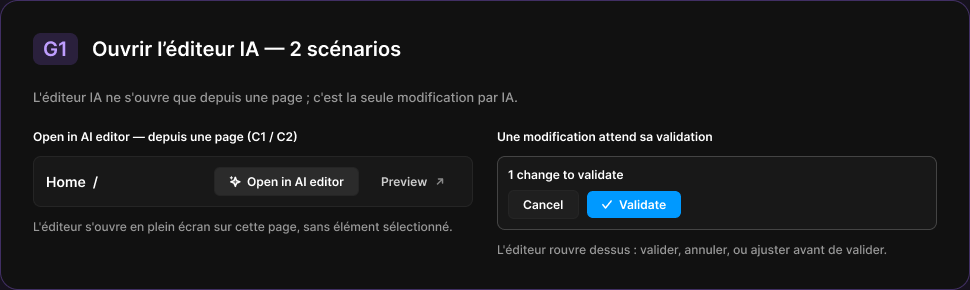
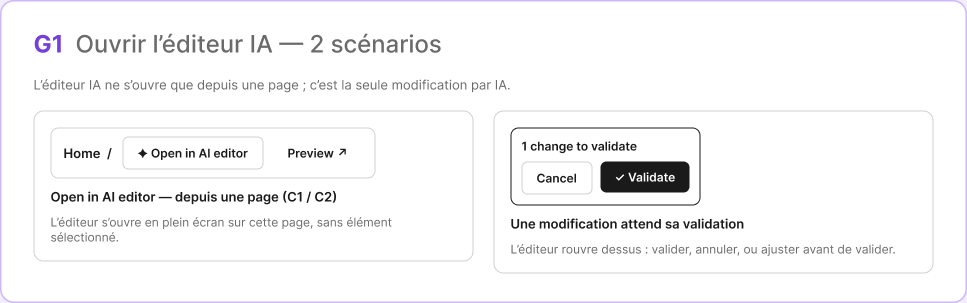

# G1 · Ouvrir l’éditeur IA — 2 scénarios

Extraction Figma du fichier « Kuartz — Carte système » (fileKey `wvr98llwHnMufQ88qUp4Ih`). Notation des arbres et conventions : voir [../README.md](../README.md).

| Champ | Valeur |
|---|---|
| Route | — (état / scénario, pas de route propre) |
| Accès | — (état sans barre d’accès ; voir l’écran d’origine [C1](../screens/C1.md)) |
| Seul Kuartz voit | rien de spécifique à cet état |
| Wireframe | `263:1321` |
| LLM context | `507:1816` |
| UI | `359:1984` |
| Déclenché depuis | C1 (flèche « Open in AI editor → G1 »), voir [../screens/C1.md](../screens/C1.md) ; aussi D0 |
| Captures | [UI](./G1.ui.png) · [Wireframe](./G1.wf.png) |





Déclenché depuis : C1 (flèche « Open in AI editor → G1 »), voir [../screens/C1.md](../screens/C1.md) ; aussi D0.

## LLM context

Bloc Figma `507:1816` (page Wireframe), texte verbatim.

> LLM CONTEXT
>
> G1 · Ouvrir l’éditeur IA — 2 scénarios
>
> Zone violette · reliée à C1
>
> L’éditeur IA ne s’ouvre que depuis une page ; c’est la seule modification par IA.

<!-- col 1 -->

### SCÉNARIO 1 — DEPUIS UNE PAGE (C1, C2, C6)

• « ✦ Open in AI editor » dans l’en-tête de la page.
• L’éditeur s’ouvre en plein écran sur cette page, sans élément sélectionné (D1).
• « ← Admin » ramène sur cette même page, au même onglet.

<!-- col 2 -->

### SCÉNARIO 2 — UNE MODIFICATION ATTEND SA VALIDATION

• Si une modification de l’éditeur n’a été ni validée ni annulée (ex. l’utilisateur est parti), l’éditeur rouvre dessus : l’encadré « 1 change to validate » avec Cancel et ✓ Validate, et le champ « Adjust this change… ».
• On peut valider, annuler, ou ajuster avant de valider (D3).
• Proposé : la modification en attente est gardée côté serveur (état de la conversation + brouillon), pour survivre à un rechargement.

### HORS PÉRIMÈTRE

Pas de bouton global « Edit with AI » ni d’ouverture depuis l’Overview (question 9 pour le site public).

## Wireframe

Écran wireframe `263:1321` — textes et annotations dans l’ordre de lecture (▸ = conteneur, [Composant {propriétés}], « (libre) » = conteneur sans auto-layout, enfants triés haut→bas puis gauche→droite).

- ▸ G1 · Ouvrir l’éditeur IA — 2 scénarios
  - ▸ Frame
    - "G1"
    - "Ouvrir l’éditeur IA — 2 scénarios"
  - "L’éditeur IA ne s’ouvre que depuis une page ; c’est la seule modification par IA." (intro)
  - ▸ Frame
    - ▸ Frame
      - ▸ page-bar (C1 / C2)
        - "Home  /"
        - [wf/Button {Label="✦ Open in AI editor", variant=secondary}] «btn/✦ Open in AI editor»
        - [wf/Button {Label="Preview ↗", variant=ghost}] «btn/Preview ↗»
      - "Open in AI editor — depuis une page (C1 / C2)"
      - "L’éditeur s’ouvre en plein écran sur cette page, sans élément sélectionné."
    - ▸ Frame
      - ▸ validation box
        - "1 change to validate"
        - ▸ actions
          - [wf/Button {Label="Cancel", variant=secondary}] «btn/Cancel»
          - [wf/Button {Label="✓ Validate", variant=primary}] «btn/✓ Validate»
      - "Une modification attend sa validation"
      - "L’éditeur rouvre dessus : valider, annuler, ou ajuster avant de valider."

## UI — arbre

Écran UI `359:1984` (page UI). Légende : `AL H|V` auto-layout, `gap`, `pad` (1 valeur, [vertical, horizontal] ou [haut, droite, bas, gauche]), `align=principal/secondaire`, `size=largeur/hauteur` (fixed|hug|fill), `@x,y` position libre, `abs@x,y` position absolue dans un auto-layout, `fill/stroke/radius` = variable liée (valeur brute en hex/px si aucune variable), `effect` = style d’effet, `TEXT … · <style de texte> · <couleur>` puis `:: "texte"`, `INST "calque" → Composant {propriétés}` ; sous une instance : `T "texte"` = texte interne non déjà donné par une propriété.

```text
FRAME "G1 · Ouvrir l’éditeur IA — 2 scénarios" 970×290 · AL V gap=24 pad=32 align=MIN/MIN · fill=bg/primary · stroke=#9966ff@35% 1 · radius=18
  FRAME "header" 369×32 · AL H gap=14 align=MIN/CENTER · size=hug/hug
    FRAME "code" 45×32 · AL H gap=0 pad=[space/4, space/10] align=MIN/CENTER · size=hug/hug · fill=#9966ff@18% · radius=radius/md
      TEXT "code" 25×24 · Heading 3 · #bf9eff · size=hug/hug :: "G1"
    TEXT "title" 310×24 · Heading 3 · text/primary · size=hug/hug :: "Ouvrir l’éditeur IA — 2 scénarios"
  TEXT "description" 880×16 · Body · text/tertiary · size=fixed/hug :: "L'éditeur IA ne s'ouvre que depuis une page ; c'est la seule modification par IA."
  FRAME "scenarios" 904×128 · AL H gap=space/24 align=MIN/MIN · size=hug/hug
    FRAME "col/Open in AI editor — depuis une page (C1 / C2)" 440×105 · AL V gap=space/12 align=MIN/MIN · size=fixed/hug
      TEXT "title" 265×15 · Label · text/primary · size=hug/hug :: "Open in AI editor — depuis une page (C1 / C2)"
      FRAME "page-bar" 440×51 · AL H gap=space/8 pad=[space/10, space/12] align=MIN/CENTER · size=fill/hug · fill=bg/elevated · stroke=border/default 1 · radius=radius/md
        TEXT "page" 160×17 · Label Large · text/primary · size=fill/hug :: "Home  /"
        INST "Button" 145×29 → Button {Show icon right=false, Icon left=Icon/ai, Show icon left=true, Icon right=Icon/chevron-down, Label="Open in AI editor", variant=secondary, state=hover, size=small} · AL H gap=space/6 pad=[space/6, 14] align=CENTER/CENTER · size=hug/hug · fill=bg/input-hover · stroke=border/default 1 · radius=6
        INST "Button" 93×27 → Button {Icon left=Icon/plus, Show icon right=true, Icon right=Icon/external, Show icon left=false, Label="Preview", variant=ghost, state=default, size=small} · AL H gap=space/6 pad=[space/6, 14] align=CENTER/CENTER · size=hug/hug · radius=6
      TEXT "caption" 440×15 · Body Small · text/tertiary · size=fill/hug :: "L'éditeur s'ouvre en plein écran sur cette page, sans élément sélectionné."
    FRAME "col/Une modification attend sa validation" 440×128 · AL V gap=space/12 align=MIN/MIN · size=fixed/hug
      TEXT "title" 216×15 · Label · text/primary · size=hug/hug :: "Une modification attend sa validation"
      INST "Review card" 440×74 → Review card {state=pending} · AL V gap=space/8 pad=space/10 align=MIN/MIN · size=fill/hug · fill=bg/elevated · stroke=border/strong 1 · radius=radius/md
        T "1 change to validate"
        INST "cancel" 71×29 → Button {Icon left=Icon/plus, Show icon left=false, Icon right=Icon/chevron-down, Show icon right=false, Label="Cancel", variant=secondary, state=default, size=small}
        INST "validate" 94×27 → Button {Icon left=Icon/check, Icon right=Icon/chevron-down, Show icon right=false, Show icon left=true, Label="Validate", variant=primary, state=default, size=small}
      TEXT "caption" 440×15 · Body Small · text/tertiary · size=fill/hug :: "L'éditeur rouvre dessus : valider, annuler, ou ajuster avant de valider."
```
