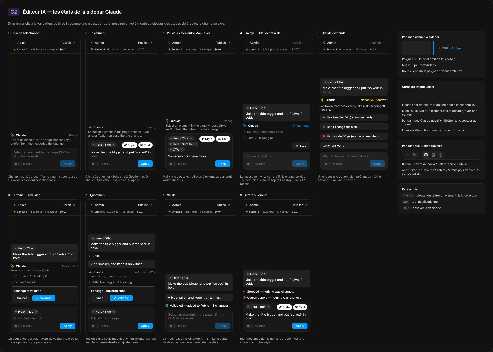
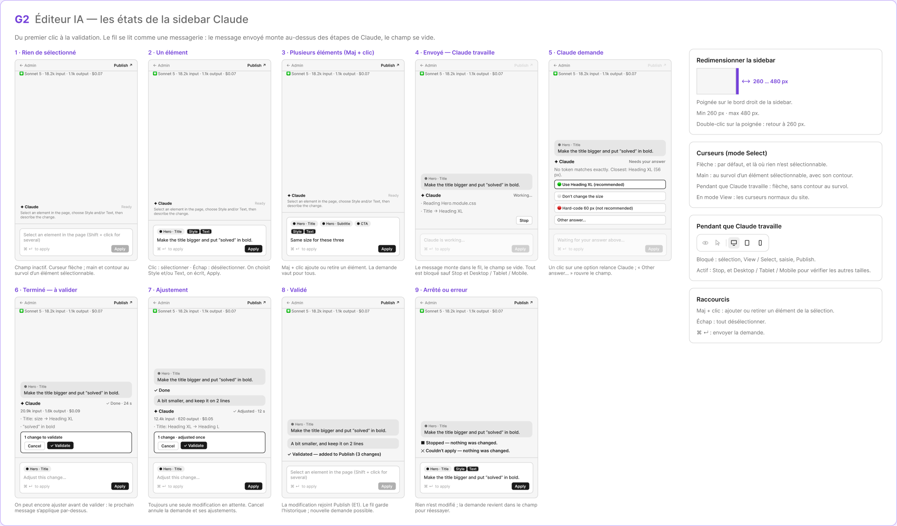

# G2 · Éditeur IA — les états de la sidebar Claude

Extraction Figma du fichier « Kuartz — Carte système » (fileKey `wvr98llwHnMufQ88qUp4Ih`). Notation des arbres et conventions : voir [../README.md](../README.md).

| Champ | Valeur |
|---|---|
| Route | — (état / scénario, pas de route propre) |
| Accès | — (état sans barre d’accès ; voir l’écran d’origine [D1](../screens/D1.md)) |
| Seul Kuartz voit | rien de spécifique à cet état |
| Wireframe | `263:1406` |
| LLM context | `508:1748` |
| UI | `359:2059` |
| Déclenché depuis | D1 (« Sidebar Claude : 9 états → G2 »), voir [../screens/D1.md](../screens/D1.md) |
| Captures | [UI](./G2.ui.png) · [Wireframe](./G2.wf.png) |





Déclenché depuis : D1 (« Sidebar Claude : 9 états → G2 »), voir [../screens/D1.md](../screens/D1.md).

## LLM context

Bloc Figma `508:1748` (page Wireframe), texte verbatim.

> LLM CONTEXT
>
> G2 · Éditeur IA — les états de la sidebar Claude
>
> Zone violette · reliée à D1
>
> Du premier clic à la validation. Le fil se lit comme une messagerie : le message envoyé monte au-dessus des étapes de Claude, le champ se vide.

<!-- col 1 -->

### MACHINE À ÉTATS

1. Rien de sélectionné : champ inactif ; « Claude · Ready » + consigne.
2. Un élément : clic en mode Select → puce dans le champ ; Style / Text, texte, Apply.
3. Plusieurs éléments : Maj + clic ajoute ou retire ; la demande vaut pour tous.
4. Envoyé — Claude travaille : la bulle monte dans le fil, le champ se vide ; tout est bloqué sauf Stop et Desktop / Tablet / Mobile.
5. Claude demande : options (🟢 recommandé, ⚪ ne rien changer, 🔴 valeur en dur) ou « Other answer… » ; un clic relance Claude.
6. Terminé — à valider : « Done · 24 s », tokens et coût, résumé ; « 1 change to validate » (Cancel / ✓ Validate) ; champ « Adjust this change… ».
7. Ajustement : le message suivant s’applique par-dessus (« Adjusted · 12 s », « 1 change · adjusted once ») ; toujours une seule modification en attente ; Cancel annule la demande et ses ajustements.
8. Validé : « Validated — added to Publish (3 changes) » ; le fil garde l’historique ; nouvelle demande possible (retour à 1).
9. Arrêté ou erreur : « Stopped — nothing was changed. » ou « Couldn’t apply — nothing was changed. » ; la demande revient dans le champ pour réessayer.

<!-- col 2 -->

### RÈGLES DE LA SIDEBAR

• Redimensionner : poignée sur le bord droit ; 260 px minimum, 480 px maximum ; double-clic sur la poignée → 260 px (valeurs proposées, question 14).
• Curseurs en mode Select : flèche par défaut et là où rien n’est sélectionnable ; main + contour au survol d’un élément sélectionnable ; pendant que Claude travaille : flèche, sans contour. En mode View : les curseurs normaux du site.
• Pendant que Claude travaille : bloqués → sélection, View / Select, saisie, Publish ; actifs → Stop, et Desktop / Tablet / Mobile.
• Raccourcis : Maj + clic = ajouter ou retirer un élément ; Échap = tout désélectionner ; ⌘ ↵ = envoyer.
• En-tête : « ← Admin », « Publish ↗ » (grisé pendant le travail), et la consommation cumulée de la conversation (modèle, input, output, coût).
• Chaque demande garde dans le fil sa durée, ses tokens et son coût.

### COMPOSANTS

Editor header, Model usage, Claude header, Message, Step, Answer option, Review card, Composer (6 états).

## Wireframe

Écran wireframe `263:1406` — textes et annotations dans l’ordre de lecture (▸ = conteneur, [Composant {propriétés}], « (libre) » = conteneur sans auto-layout, enfants triés haut→bas puis gauche→droite).

- ▸ G2 · Éditeur IA — les états de la sidebar Claude
  - ▸ Frame
    - "G2"
    - "Éditeur IA — les états de la sidebar Claude"
  - "Du premier clic à la validation. Le fil se lit comme une messagerie : le message envoyé monte au-dessus des étapes de Claude, le champ se vide."
  - ▸ g2-row
    - ▸ states-grid
      - ▸ state/1 · Rien de sélectionné
        - "1 · Rien de sélectionné"
        - ▸ mini-sidebar
          - ▸ Frame
            - "← Admin"
            - "Publish ↗"
          - ▸ usage-line
            - "✳ Sonnet 5 · 18.2k input · 1.1k output · $0.07"
          - ▸ thread
            - ▸ claude-ready
              - ▸ row
                - "✦ Claude"
                - "Ready"
              - "Select an element in the page, choose Style and/or Text, then describe the change."
          - ▸ Frame
            - ▸ Frame
              - "Select an element in the page (Shift + click for several)"
              - ▸ Frame
                - "⌘ ↵  to apply" (hint ⌘↵)
                - ▸ Frame
                  - "Apply"
        - "Champ inactif. Curseur flèche ; main et contour au survol d’un élément sélectionnable."
      - ▸ state/2 · Un élément
        - "2 · Un élément"
        - ▸ mini-sidebar
          - ▸ Frame
            - "← Admin"
            - "Publish ↗"
          - ▸ usage-line
            - "✳ Sonnet 5 · 18.2k input · 1.1k output · $0.07"
          - ▸ thread
            - ▸ claude-ready
              - ▸ row
                - "✦ Claude"
                - "Ready"
              - "Select an element in the page, choose Style and/or Text, then describe the change."
          - ▸ Frame
            - ▸ Frame
              - ▸ Frame
                - ▸ Frame
                  - "● Hero · Title"
                - ▸ Frame
                  - ▸ Frame
                    - "Style"
                  - ▸ Frame
                    - "Text"
              - "Make the title bigger and put “solved” in bold."
              - ▸ Frame
                - "⌘ ↵  to apply" (hint ⌘↵)
                - ▸ Frame
                  - "Apply"
        - "Clic : sélectionner · Échap : désélectionner. On choisit Style et/ou Text, on écrit, Apply."
      - ▸ state/3 · Plusieurs éléments (Maj + clic)
        - "3 · Plusieurs éléments (Maj + clic)"
        - ▸ mini-sidebar
          - ▸ Frame
            - "← Admin"
            - "Publish ↗"
          - ▸ usage-line
            - "✳ Sonnet 5 · 18.2k input · 1.1k output · $0.07"
          - ▸ thread
            - ▸ claude-ready
              - ▸ row
                - "✦ Claude"
                - "Ready"
              - "Select an element in the page, choose Style and/or Text, then describe the change."
          - ▸ Frame
            - ▸ Frame
              - ▸ Frame
                - ▸ Frame
                  - "● Hero · Title"
                - ▸ Frame
                  - "● Hero · Subtitle"
                - ▸ Frame
                  - "● CTA"
                - ▸ Frame
                  - ▸ Frame
                    - "Style"
                  - ▸ Frame
                    - "Text"
              - "Same size for these three"
              - ▸ Frame
                - "⌘ ↵  to apply" (hint ⌘↵)
                - ▸ Frame
                  - "Apply"
        - "Maj + clic ajoute ou retire un élément. La demande vaut pour tous."
      - ▸ state/4 · Envoyé — Claude travaille
        - "4 · Envoyé — Claude travaille"
        - ▸ mini-sidebar
          - ▸ Frame
            - "← Admin"
            - "Publish ↗"
          - ▸ usage-line
            - "✳ Sonnet 5 · 18.2k input · 1.1k output · $0.07"
          - ▸ thread
            - ▸ Frame
              - "● Hero · Title"
              - "Make the title bigger and put “solved” in bold."
            - ▸ Frame
              - "✦ Claude"
              - "Working…"
            - "· Reading Hero.module.css"
            - "· Title → Heading XL"
            - ▸ Frame
              - ▸ Frame
                - "Stop"
          - ▸ Frame
            - ▸ Frame
              - "Claude is working…"
              - ▸ Frame
                - "⌘ ↵  to apply" (hint ⌘↵)
                - ▸ Frame
                  - "Apply"
        - "Le message monte dans le fil, le champ se vide. Tout est bloqué sauf Stop et Desktop / Tablet / Mobile."
      - ▸ state/5 · Claude demande
        - "5 · Claude demande"
        - ▸ mini-sidebar
          - ▸ Frame
            - "← Admin"
            - "Publish ↗"
          - ▸ usage-line
            - "✳ Sonnet 5 · 18.2k input · 1.1k output · $0.07"
          - ▸ thread
            - ▸ Frame
              - "● Hero · Title"
              - "Make the title bigger and put “solved” in bold."
            - ▸ Frame
              - "✦ Claude"
              - "Needs your answer"
            - "No token matches exactly. Closest: Heading XL (56 px)."
            - ▸ Frame
              - "🟢 Use Heading XL (recommended)"
            - ▸ Frame
              - "⚪ Don’t change the size"
            - ▸ Frame
              - "🔴 Hard-code 60 px (not recommended)"
            - ▸ Frame
              - "Other answer…"
          - ▸ Frame
            - ▸ Frame
              - "Waiting for your answer above…"
              - ▸ Frame
                - "⌘ ↵  to apply" (hint ⌘↵)
                - ▸ Frame
                  - "Apply"
        - "Un clic sur une option relance Claude ; « Other answer… » rouvre le champ."
      - ▸ state/6 · Terminé — à valider
        - "6 · Terminé — à valider"
        - ▸ mini-sidebar
          - ▸ Frame
            - "← Admin"
            - "Publish ↗"
          - ▸ usage-line
            - "✳ Sonnet 5 · 18.2k input · 1.1k output · $0.07"
          - ▸ thread
            - ▸ Frame
              - "● Hero · Title"
              - "Make the title bigger and put “solved” in bold."
            - ▸ Frame
              - "✦ Claude"
              - "✓ Done · 24 s"
            - "20.9k input · 1.6k output · $0.09" (usage)
            - "· Title: size → Heading XL"
            - "· “solved” in bold"
            - ▸ Frame
              - "1 change to validate"
              - ▸ Frame
                - ▸ Frame
                  - "Cancel"
                - ▸ Frame
                  - "✓ Validate"
          - ▸ Frame
            - ▸ Frame
              - ▸ Frame
                - ▸ Frame
                  - "● Hero · Title"
              - "Adjust this change…"
              - ▸ Frame
                - "⌘ ↵  to apply" (hint ⌘↵)
                - ▸ Frame
                  - "Apply"
        - "On peut encore ajuster avant de valider : le prochain message s’applique par-dessus."
      - ▸ state/7 · Ajustement
        - "7 · Ajustement"
        - ▸ mini-sidebar
          - ▸ Frame
            - "← Admin"
            - "Publish ↗"
          - ▸ usage-line
            - "✳ Sonnet 5 · 18.2k input · 1.1k output · $0.07"
          - ▸ thread
            - ▸ Frame
              - "● Hero · Title"
              - "Make the title bigger and put “solved” in bold."
            - "✓ Done"
            - ▸ Frame
              - "A bit smaller, and keep it on 2 lines"
            - ▸ Frame
              - "✦ Claude"
              - "✓ Adjusted · 12 s"
            - "12.4k input · 620 output · $0.05" (usage)
            - "· Title: Heading XL → Heading L"
            - ▸ Frame
              - "1 change · adjusted once"
              - ▸ Frame
                - ▸ Frame
                  - "Cancel"
                - ▸ Frame
                  - "✓ Validate"
          - ▸ Frame
            - ▸ Frame
              - ▸ Frame
                - ▸ Frame
                  - "● Hero · Title"
              - "Adjust this change…"
              - ▸ Frame
                - "⌘ ↵  to apply" (hint ⌘↵)
                - ▸ Frame
                  - "Apply"
        - "Toujours une seule modification en attente. Cancel annule la demande et ses ajustements."
      - ▸ state/8 · Validé
        - "8 · Validé"
        - ▸ mini-sidebar
          - ▸ Frame
            - "← Admin"
            - "Publish ↗"
          - ▸ usage-line
            - "✳ Sonnet 5 · 18.2k input · 1.1k output · $0.07"
          - ▸ thread
            - ▸ Frame
              - "● Hero · Title"
              - "Make the title bigger and put “solved” in bold."
            - ▸ Frame
              - "A bit smaller, and keep it on 2 lines"
            - "✓ Validated — added to Publish (3 changes)"
          - ▸ Frame
            - ▸ Frame
              - "Select an element in the page (Shift + click for several)"
              - ▸ Frame
                - "⌘ ↵  to apply" (hint ⌘↵)
                - ▸ Frame
                  - "Apply"
        - "La modification rejoint Publish (E1). Le fil garde l’historique ; nouvelle demande possible."
      - ▸ state/9 · Arrêté ou erreur
        - "9 · Arrêté ou erreur"
        - ▸ mini-sidebar
          - ▸ Frame
            - "← Admin"
            - "Publish ↗"
          - ▸ usage-line
            - "✳ Sonnet 5 · 18.2k input · 1.1k output · $0.07"
          - ▸ thread
            - ▸ Frame
              - "● Hero · Title"
              - "Make the title bigger and put “solved” in bold."
            - "■ Stopped — nothing was changed."
            - "✕ Couldn’t apply — nothing was changed."
          - ▸ Frame
            - ▸ Frame
              - ▸ Frame
                - ▸ Frame
                  - "● Hero · Title"
                - ▸ Frame
                  - ▸ Frame
                    - "Style"
                  - ▸ Frame
                    - "Text"
              - "Make the title bigger and put “solved” in bold."
              - ▸ Frame
                - "⌘ ↵  to apply" (hint ⌘↵)
                - ▸ Frame
                  - "Apply"
        - "Rien n’est modifié ; la demande revient dans le champ pour réessayer."
    - ▸ spec
      - ▸ Frame
        - "Redimensionner la sidebar"
        - ▸ Frame
          - "  ⟷  260 … 480 px"
        - "Poignée sur le bord droit de la sidebar."
        - "Min 260 px · max 480 px."
        - "Double-clic sur la poignée : retour à 260 px."
      - ▸ Frame
        - "Curseurs (mode Select)"
        - "Flèche : par défaut, et là où rien n’est sélectionnable."
        - "Main : au survol d’un élément sélectionnable, avec son contour."
        - "Pendant que Claude travaille : flèche, sans contour au survol."
        - "En mode View : les curseurs normaux du site."
      - ▸ Frame
        - "Pendant que Claude travaille"
        - "Bloqué : sélection, View / Select, saisie, Publish."
        - "Actif : Stop, et Desktop / Tablet / Mobile pour vérifier les autres tailles."
      - ▸ Frame
        - "Raccourcis"
        - "Maj + clic : ajouter ou retirer un élément de la sélection."
        - "Échap : tout désélectionner."
        - "⌘ ↵ : envoyer la demande."

## UI — arbre

Écran UI `359:2059` (page UI). Légende : `AL H|V` auto-layout, `gap`, `pad` (1 valeur, [vertical, horizontal] ou [haut, droite, bas, gauche]), `align=principal/secondaire`, `size=largeur/hauteur` (fixed|hug|fill), `@x,y` position libre, `abs@x,y` position absolue dans un auto-layout, `fill/stroke/radius` = variable liée (valeur brute en hex/px si aucune variable), `effect` = style d’effet, `TEXT … · <style de texte> · <couleur>` puis `:: "texte"`, `INST "calque" → Composant {propriétés}` ; sous une instance : `T "texte"` = texte interne non déjà donné par une propriété.

```text
FRAME "G2 · Éditeur IA — les états de la sidebar Claude" 2038×1459 · AL V gap=24 pad=32 align=MIN/MIN · fill=bg/primary · stroke=#9966ff@35% 1 · radius=18
  FRAME "header" 471×32 · AL H gap=14 align=MIN/CENTER · size=hug/hug
    FRAME "code" 48×32 · AL H gap=0 pad=[space/4, space/10] align=MIN/CENTER · size=hug/hug · fill=#9966ff@18% · radius=radius/md
      TEXT "code" 28×24 · Heading 3 · #bf9eff · size=hug/hug :: "G2"
    TEXT "title" 409×24 · Heading 3 · text/primary · size=hug/hug :: "Éditeur IA — les états de la sidebar Claude"
  TEXT "description" 1000×16 · Body · text/tertiary · size=fixed/hug :: "Du premier clic à la validation. Le fil se lit comme une messagerie : le message envoyé monte au-dessus des étapes de Claude, le champ se vide."
  FRAME "body" 1972×1297 · AL H gap=space/32 align=MIN/MIN · size=hug/hug
    FRAME "states" 1580×1297 · AL V gap=space/32 align=MIN/MIN · size=hug/hug
      FRAME "row-1" 1580×640 · AL H gap=space/20 align=MIN/MIN · size=hug/hug
        FRAME "state/1 · Rien de sélectionné" 300×625 · AL V gap=space/10 align=MIN/MIN · size=fixed/hug
          TEXT "title" 129×15 · Label · text/primary · size=hug/hug :: "1 · Rien de sélectionné"
          FRAME "sidebar" 300×560 · AL V gap=0 align=MIN/MIN · size=fill/fixed · fill=bg/primary · stroke=border/default 1 · radius=radius/lg
            INST "Editor header" 298×67 → Editor header {state=default} · AL V gap=0 align=MIN/MIN · size=fill/hug · fill=bg/primary · stroke=border/subtle sides[T0 R0 B1 L0]
              INST "back" 84×27 → Button {Show icon right=false, Icon left=Icon/chevron-left, Icon right=Icon/chevron-down, Show icon left=true, Label="Admin", variant=ghost, state=default, size=small}
              INST "publish" 89×27 → Button {Icon left=Icon/plus, Show icon right=true, Icon right=Icon/external, Show icon left=false, Label="Publish", variant=ghost, state=default, size=small}
              INST "usage" 221×12 → Model usage {Show usage=true, Cost="$0.07", Output="1.1k output", Input="18.2k input", Show model=true, Model="Sonnet 5", size=small}
                INST "mark" 12×12 → Icon/claude {size=12}
                T "·"
                T "·"
            FRAME "thread" 298×390 · AL V gap=space/10 pad=[space/12, space/10, space/10, space/10] align=MAX/MIN · size=fill/fill
              INST "Claude header" 278×50 → Claude header {state=ready} · AL V gap=space/4 align=MIN/MIN · size=fill/hug
                INST "icon" 16×16 → Icon/ai {size=18}
                T "Claude"
                T "Ready"
                T "Select an element in the page, choose Style and/or Text, then describe the change."
            FRAME "composer-wrap" 298×101 · AL V gap=0 pad=[0, space/10, space/10, space/10] align=MIN/CENTER · size=fill/hug
              INST "Composer" 278×91 → Composer {state=empty} · AL V gap=space/10 pad=space/10 align=MIN/MIN · size=fill/hug · fill=bg/elevated · stroke=border/default 1 · radius=radius/lg
                T "Select an element in the page (Shift + click for several)"
                INST "shortcut" 35×16 → Kbd {Label="⌘ ↵"}
                T "to apply"
                INST "apply" 62×27 → Button {Icon right=Icon/chevron-down, Icon left=Icon/plus, Show icon right=false, Show icon left=false, Label="Apply", variant=primary, state=disabled, size=small}
          TEXT "caption" 300×30 · Body Small · text/tertiary · size=fill/hug :: "Champ inactif. Curseur flèche ; main et contour au survol d’un élément sélectionnable."
        FRAME "state/2 · Un élément" 300×625 · AL V gap=space/10 align=MIN/MIN · size=fixed/hug
          TEXT "title" 84×15 · Label · text/primary · size=hug/hug :: "2 · Un élément"
          FRAME "sidebar" 300×560 · AL V gap=0 align=MIN/MIN · size=fill/fixed · fill=bg/primary · stroke=border/default 1 · radius=radius/lg
            INST "Editor header" 298×67 → Editor header {state=default} · AL V gap=0 align=MIN/MIN · size=fill/hug · fill=bg/primary · stroke=border/subtle sides[T0 R0 B1 L0]
              INST "back" 84×27 → Button {Show icon right=false, Icon left=Icon/chevron-left, Icon right=Icon/chevron-down, Show icon left=true, Label="Admin", variant=ghost, state=default, size=small}
              INST "publish" 89×27 → Button {Icon left=Icon/plus, Show icon right=true, Icon right=Icon/external, Show icon left=false, Label="Publish", variant=ghost, state=default, size=small}
              INST "usage" 221×12 → Model usage {Show usage=true, Cost="$0.07", Output="1.1k output", Input="18.2k input", Show model=true, Model="Sonnet 5", size=small}
                INST "mark" 12×12 → Icon/claude {size=12}
                T "·"
                T "·"
            FRAME "thread" 298×357 · AL V gap=space/10 pad=[space/12, space/10, space/10, space/10] align=MAX/MIN · size=fill/fill
              INST "Claude header" 278×50 → Claude header {state=ready} · AL V gap=space/4 align=MIN/MIN · size=fill/hug
                INST "icon" 16×16 → Icon/ai {size=18}
                T "Claude"
                T "Ready"
                T "Select an element in the page, choose Style and/or Text, then describe the change."
            FRAME "composer-wrap" 298×134 · AL V gap=0 pad=[0, space/10, space/10, space/10] align=MIN/CENTER · size=fill/hug
              INST "Composer" 278×124 → Composer {state=ready} · AL V gap=space/10 pad=space/10 align=MIN/MIN · size=fill/hug · fill=bg/elevated · stroke=border/default 1 · radius=radius/lg
                INST "element" 107×19 → Element chip {Show remove=true, Label="Hero · Title"}
                  INST "remove" 12×12 → Icon/close {size=12}
                INST "scope/Style" 64×23 → Chip {Icon=Icon/style, Show icon=true, Label="Style", state=on}
                INST "scope/Text" 59×23 → Chip {Icon=Icon/text, Show icon=true, Label="Text", state=on}
                T "Make the title bigger and put \"solved\" in bold."
                INST "shortcut" 35×16 → Kbd {Label="⌘ ↵"}
                T "to apply"
                INST "apply" 62×27 → Button {Icon left=Icon/plus, Icon right=Icon/chevron-down, Show icon right=false, Show icon left=false, Label="Apply", variant=primary, state=default, size=small}
          TEXT "caption" 300×30 · Body Small · text/tertiary · size=fill/hug :: "Clic : sélectionner · Échap : désélectionner. On choisit Style et/ou Text, on écrit, Apply."
        FRAME "state/3 · Plusieurs éléments (Maj + clic)" 300×625 · AL V gap=space/10 align=MIN/MIN · size=fixed/hug
          TEXT "title" 195×15 · Label · text/primary · size=hug/hug :: "3 · Plusieurs éléments (Maj + clic)"
          FRAME "sidebar" 300×560 · AL V gap=0 align=MIN/MIN · size=fill/fixed · fill=bg/primary · stroke=border/default 1 · radius=radius/lg
            INST "Editor header" 298×67 → Editor header {state=default} · AL V gap=0 align=MIN/MIN · size=fill/hug · fill=bg/primary · stroke=border/subtle sides[T0 R0 B1 L0]
              INST "back" 84×27 → Button {Show icon right=false, Icon left=Icon/chevron-left, Icon right=Icon/chevron-down, Show icon left=true, Label="Admin", variant=ghost, state=default, size=small}
              INST "publish" 89×27 → Button {Icon left=Icon/plus, Show icon right=true, Icon right=Icon/external, Show icon left=false, Label="Publish", variant=ghost, state=default, size=small}
              INST "usage" 221×12 → Model usage {Show usage=true, Cost="$0.07", Output="1.1k output", Input="18.2k input", Show model=true, Model="Sonnet 5", size=small}
                INST "mark" 12×12 → Icon/claude {size=12}
                T "·"
                T "·"
            FRAME "thread" 298×331 · AL V gap=space/10 pad=[space/12, space/10, space/10, space/10] align=MAX/MIN · size=fill/fill
              INST "Claude header" 278×50 → Claude header {state=ready} · AL V gap=space/4 align=MIN/MIN · size=fill/hug
                INST "icon" 16×16 → Icon/ai {size=18}
                T "Claude"
                T "Ready"
                T "Select an element in the page, choose Style and/or Text, then describe the change."
            FRAME "composer-wrap" 298×160 · AL V gap=0 pad=[0, space/10, space/10, space/10] align=MIN/CENTER · size=fill/hug
              INST "Composer" 278×150 → Composer {state=multi} · AL V gap=space/10 pad=space/10 align=MIN/MIN · size=fill/hug · fill=bg/elevated · stroke=border/default 1 · radius=radius/lg
                INST "element" 107×19 → Element chip {Show remove=true, Label="Hero · Title"}
                  INST "remove" 12×12 → Icon/close {size=12}
                INST "element" 126×19 → Element chip {Show remove=true, Label="Hero · Subtitle"}
                  INST "remove" 12×12 → Icon/close {size=12}
                INST "element" 69×19 → Element chip {Show remove=true, Label="CTA"}
                  INST "remove" 12×12 → Icon/close {size=12}
                INST "scope/Style" 64×23 → Chip {Icon=Icon/style, Show icon=true, Label="Style", state=on}
                INST "scope/Text" 59×23 → Chip {Icon=Icon/text, Show icon=true, Label="Text", state=on}
                T "Same size for these three."
                INST "shortcut" 35×16 → Kbd {Label="⌘ ↵"}
                T "to apply"
                INST "apply" 62×27 → Button {Icon left=Icon/plus, Icon right=Icon/chevron-down, Show icon right=false, Show icon left=false, Label="Apply", variant=primary, state=default, size=small}
          TEXT "caption" 300×30 · Body Small · text/tertiary · size=fill/hug :: "Maj + clic ajoute ou retire un élément. La demande vaut pour tous."
        FRAME "state/4 · Envoyé — Claude travaille" 300×640 · AL V gap=space/10 align=MIN/MIN · size=fixed/hug
          TEXT "title" 168×15 · Label · text/primary · size=hug/hug :: "4 · Envoyé — Claude travaille"
          FRAME "sidebar" 300×560 · AL V gap=0 align=MIN/MIN · size=fill/fixed · fill=bg/primary · stroke=border/default 1 · radius=radius/lg
            INST "Editor header" 298×67 → Editor header {state=locked} · AL V gap=0 align=MIN/MIN · size=fill/hug · fill=bg/primary · stroke=border/subtle sides[T0 R0 B1 L0]
              INST "back" 84×27 → Button {Show icon right=false, Icon left=Icon/chevron-left, Icon right=Icon/chevron-down, Show icon left=true, Label="Admin", variant=ghost, state=default, size=small}
              INST "publish" 89×27 → Button {Icon left=Icon/plus, Show icon right=true, Icon right=Icon/external, Show icon left=false, Label="Publish", variant=ghost, state=disabled, size=small}
              INST "usage" 221×12 → Model usage {Show usage=true, Cost="$0.07", Output="1.1k output", Input="18.2k input", Show model=true, Model="Sonnet 5", size=small}
                INST "mark" 12×12 → Icon/claude {size=12}
                T "·"
                T "·"
            FRAME "thread" 298×406 · AL V gap=space/10 pad=[space/12, space/10, space/10, space/10] align=MAX/MIN · size=fill/fill
              INST "Message" 278×73 → Message {type=request} · AL V gap=space/6 pad=[space/8, space/10] align=MIN/MIN · size=fill/hug · fill=bg/subtle · radius=radius/md
                INST "element" 89×19 → Element chip {Show remove=false, Label="Hero · Title"}
                T "Make the title bigger and put \"solved\" in bold."
              INST "Claude header" 278×16 → Claude header {state=working} · AL V gap=space/4 align=MIN/MIN · size=fill/hug
                INST "icon" 16×16 → Icon/ai {size=18}
                T "Claude"
                INST "spinner" 12×12 → Icon/loader {size=12}
                T "Working…"
              INST "Step" 278×15 → Step  · AL H gap=space/6 align=MIN/CENTER · size=fill/hug
                T "Reading Hero.module.css"
              INST "Step" 278×15 → Step  · AL H gap=space/6 align=MIN/CENTER · size=fill/hug
                T "Title → Heading XL"
              FRAME "stop-row" 278×29 · AL H gap=0 align=MAX/CENTER · size=fill/hug
                INST "Button" 76×29 → Button {Icon left=Icon/stop, Show icon left=true, Icon right=Icon/chevron-down, Show icon right=false, Label="Stop", variant=secondary, state=default, size=small} · AL H gap=space/6 pad=[space/6, 14] align=CENTER/CENTER · size=hug/hug · fill=bg/input · stroke=border/default 1 · radius=6
            FRAME "composer-wrap" 298×85 · AL V gap=0 pad=[0, space/10, space/10, space/10] align=MIN/CENTER · size=fill/hug
              INST "Composer" 278×75 → Composer {state=working} · AL V gap=space/10 pad=space/10 align=MIN/MIN · size=fill/hug · fill=bg/subtle · stroke=border/default 1 · radius=radius/lg
                T "Claude is working…"
                INST "shortcut" 35×16 → Kbd {Label="⌘ ↵"}
                T "to apply"
                INST "apply" 62×27 → Button {Icon right=Icon/chevron-down, Icon left=Icon/plus, Show icon right=false, Show icon left=false, Label="Apply", variant=primary, state=disabled, size=small}
          TEXT "caption" 300×45 · Body Small · text/tertiary · size=fill/hug :: "Le message monte dans le fil, le champ se vide. Tout est bloqué sauf Stop et Desktop / Tablet / Mobile."
        FRAME "state/5 · Claude demande" 300×625 · AL V gap=space/10 align=MIN/MIN · size=fixed/hug
          TEXT "title" 116×15 · Label · text/primary · size=hug/hug :: "5 · Claude demande"
          FRAME "sidebar" 300×560 · AL V gap=0 align=MIN/MIN · size=fill/fixed · fill=bg/primary · stroke=border/default 1 · radius=radius/lg
            INST "Editor header" 298×67 → Editor header {state=locked} · AL V gap=0 align=MIN/MIN · size=fill/hug · fill=bg/primary · stroke=border/subtle sides[T0 R0 B1 L0]
              INST "back" 84×27 → Button {Show icon right=false, Icon left=Icon/chevron-left, Icon right=Icon/chevron-down, Show icon left=true, Label="Admin", variant=ghost, state=default, size=small}
              INST "publish" 89×27 → Button {Icon left=Icon/plus, Show icon right=true, Icon right=Icon/external, Show icon left=false, Label="Publish", variant=ghost, state=disabled, size=small}
              INST "usage" 221×12 → Model usage {Show usage=true, Cost="$0.07", Output="1.1k output", Input="18.2k input", Show model=true, Model="Sonnet 5", size=small}
                INST "mark" 12×12 → Icon/claude {size=12}
                T "·"
                T "·"
            FRAME "thread" 298×406 · AL V gap=space/10 pad=[space/12, space/10, space/10, space/10] align=MAX/MIN · size=fill/fill
              INST "Message" 278×73 → Message {type=request} · AL V gap=space/6 pad=[space/8, space/10] align=MIN/MIN · size=fill/hug · fill=bg/subtle · radius=radius/md
                INST "element" 89×19 → Element chip {Show remove=false, Label="Hero · Title"}
                T "Make the title bigger and put \"solved\" in bold."
              INST "Claude header" 278×16 → Claude header {state=asking} · AL V gap=space/4 align=MIN/MIN · size=fill/hug
                INST "icon" 16×16 → Icon/ai {size=18}
                T "Claude"
                T "Needs your answer"
              TEXT "question" 278×30 · Body Small · text/secondary · size=fill/hug :: "No token matches exactly. Closest: Heading XL (56 px)."
              INST "Answer option" 278×29 → Answer option {kind=recommended, state=default} · AL H gap=space/8 pad=[space/6, space/10] align=MIN/CENTER · size=fill/hug · fill=bg/input · stroke=border/default 1 · radius=radius/md
                T "Use Heading XL (recommended)"
              INST "Answer option" 278×29 → Answer option {kind=neutral, state=default} · AL H gap=space/8 pad=[space/6, space/10] align=MIN/CENTER · size=fill/hug · fill=bg/input · stroke=border/default 1 · radius=radius/md
                T "Don't change the size"
              INST "Answer option" 278×29 → Answer option {kind=risky, state=default} · AL H gap=space/8 pad=[space/6, space/10] align=MIN/CENTER · size=fill/hug · fill=bg/input · stroke=border/default 1 · radius=radius/md
                T "Hard-code 60 px (not recommended)"
              INST "Answer option" 278×29 → Answer option {kind=other, state=default} · AL H gap=space/8 pad=[space/6, space/10] align=MIN/CENTER · size=fill/hug · fill=bg/input · stroke=border/default 1 · radius=radius/md
                T "Other answer…"
            FRAME "composer-wrap" 298×85 · AL V gap=0 pad=[0, space/10, space/10, space/10] align=MIN/CENTER · size=fill/hug
              INST "Composer" 278×75 → Composer {state=waiting} · AL V gap=space/10 pad=space/10 align=MIN/MIN · size=fill/hug · fill=bg/subtle · stroke=border/default 1 · radius=radius/lg
                T "Waiting for your answer above…"
                INST "shortcut" 35×16 → Kbd {Label="⌘ ↵"}
                T "to apply"
                INST "apply" 62×27 → Button {Icon right=Icon/chevron-down, Icon left=Icon/plus, Show icon right=false, Show icon left=false, Label="Apply", variant=primary, state=disabled, size=small}
          TEXT "caption" 300×30 · Body Small · text/tertiary · size=fill/hug :: "Un clic sur une option relance Claude ; « Other answer… » rouvre le champ."
      FRAME "row-2" 1260×625 · AL H gap=space/20 align=MIN/MIN · size=hug/hug
        FRAME "state/6 · Terminé — à valider" 300×625 · AL V gap=space/10 align=MIN/MIN · size=fixed/hug
          TEXT "title" 132×15 · Label · text/primary · size=hug/hug :: "6 · Terminé — à valider"
          FRAME "sidebar" 300×560 · AL V gap=0 align=MIN/MIN · size=fill/fixed · fill=bg/primary · stroke=border/default 1 · radius=radius/lg
            INST "Editor header" 298×67 → Editor header {state=default} · AL V gap=0 align=MIN/MIN · size=fill/hug · fill=bg/primary · stroke=border/subtle sides[T0 R0 B1 L0]
              INST "back" 84×27 → Button {Show icon right=false, Icon left=Icon/chevron-left, Icon right=Icon/chevron-down, Show icon left=true, Label="Admin", variant=ghost, state=default, size=small}
              INST "publish" 89×27 → Button {Icon left=Icon/plus, Show icon right=true, Icon right=Icon/external, Show icon left=false, Label="Publish", variant=ghost, state=default, size=small}
              INST "usage" 221×12 → Model usage {Show usage=true, Cost="$0.07", Output="1.1k output", Input="18.2k input", Show model=true, Model="Sonnet 5", size=small}
                INST "mark" 12×12 → Icon/claude {size=12}
                T "·"
                T "·"
            FRAME "thread" 298×377 · AL V gap=space/10 pad=[space/12, space/10, space/10, space/10] align=MAX/MIN · size=fill/fill
              INST "Message" 278×73 → Message {type=request} · AL V gap=space/6 pad=[space/8, space/10] align=MIN/MIN · size=fill/hug · fill=bg/subtle · radius=radius/md
                INST "element" 89×19 → Element chip {Show remove=false, Label="Hero · Title"}
                T "Make the title bigger and put \"solved\" in bold."
              INST "Claude header" 278×32 → Claude header {state=done} · AL V gap=space/4 align=MIN/MIN · size=fill/hug
                INST "icon" 16×16 → Icon/ai {size=18}
                T "Claude"
                T "Done · 24 s"
                INST "usage" 158×12 → Model usage {Model="Sonnet 5", Show usage=true, Show model=false, Cost="$0.09", Output="1.6k output", Input="20.9k input", size=small}
                  T "·"
                  T "·"
              INST "Step" 278×15 → Step  · AL H gap=space/6 align=MIN/CENTER · size=fill/hug
                T "Title: size → Heading XL"
              INST "Step" 278×15 → Step  · AL H gap=space/6 align=MIN/CENTER · size=fill/hug
                T "“solved” in bold"
              INST "Review card" 278×74 → Review card {state=pending} · AL V gap=space/8 pad=space/10 align=MIN/MIN · size=fill/hug · fill=bg/elevated · stroke=border/strong 1 · radius=radius/md
                T "1 change to validate"
                INST "cancel" 71×29 → Button {Icon left=Icon/plus, Show icon left=false, Icon right=Icon/chevron-down, Show icon right=false, Label="Cancel", variant=secondary, state=default, size=small}
                INST "validate" 94×27 → Button {Icon left=Icon/check, Icon right=Icon/chevron-down, Show icon right=false, Show icon left=true, Label="Validate", variant=primary, state=default, size=small}
            FRAME "composer-wrap" 298×114 · AL V gap=0 pad=[0, space/10, space/10, space/10] align=MIN/CENTER · size=fill/hug
              INST "Composer" 278×104 → Composer {state=adjust} · AL V gap=space/10 pad=space/10 align=MIN/MIN · size=fill/hug · fill=bg/elevated · stroke=border/default 1 · radius=radius/lg
                INST "element" 107×19 → Element chip {Show remove=true, Label="Hero · Title"}
                  INST "remove" 12×12 → Icon/close {size=12}
                T "Adjust this change…"
                INST "shortcut" 35×16 → Kbd {Label="⌘ ↵"}
                T "to apply"
                INST "apply" 62×27 → Button {Icon left=Icon/plus, Icon right=Icon/chevron-down, Show icon right=false, Show icon left=false, Label="Apply", variant=primary, state=default, size=small}
          TEXT "caption" 300×30 · Body Small · text/tertiary · size=fill/hug :: "On peut encore ajuster avant de valider : le prochain message s’applique par-dessus."
        FRAME "state/7 · Ajustement" 300×625 · AL V gap=space/10 align=MIN/MIN · size=fixed/hug
          TEXT "title" 84×15 · Label · text/primary · size=hug/hug :: "7 · Ajustement"
          FRAME "sidebar" 300×560 · AL V gap=0 align=MIN/MIN · size=fill/fixed · fill=bg/primary · stroke=border/default 1 · radius=radius/lg
            INST "Editor header" 298×67 → Editor header {state=default} · AL V gap=0 align=MIN/MIN · size=fill/hug · fill=bg/primary · stroke=border/subtle sides[T0 R0 B1 L0]
              INST "back" 84×27 → Button {Show icon right=false, Icon left=Icon/chevron-left, Icon right=Icon/chevron-down, Show icon left=true, Label="Admin", variant=ghost, state=default, size=small}
              INST "publish" 89×27 → Button {Icon left=Icon/plus, Show icon right=true, Icon right=Icon/external, Show icon left=false, Label="Publish", variant=ghost, state=default, size=small}
              INST "usage" 221×12 → Model usage {Show usage=true, Cost="$0.07", Output="1.1k output", Input="18.2k input", Show model=true, Model="Sonnet 5", size=small}
                INST "mark" 12×12 → Icon/claude {size=12}
                T "·"
                T "·"
            FRAME "thread" 298×377 · AL V gap=space/10 pad=[space/12, space/10, space/10, space/10] align=MAX/MIN · size=fill/fill
              INST "Message" 278×73 → Message {type=request} · AL V gap=space/6 pad=[space/8, space/10] align=MIN/MIN · size=fill/hug · fill=bg/subtle · radius=radius/md
                INST "element" 89×19 → Element chip {Show remove=false, Label="Hero · Title"}
                T "Make the title bigger and put \"solved\" in bold."
              INST "Step" 278×15 → Step  · AL H gap=space/6 align=MIN/CENTER · size=fill/hug
                INST "icon" 12×12 → Icon/check {size=12}
                T "Done"
              INST "Message" 278×32 → Message {type=adjustment} · AL V gap=space/6 pad=[space/8, space/10] align=MIN/MIN · size=fill/hug · fill=bg/subtle · radius=radius/md
                T "A bit smaller, and keep it on 2 lines."
              INST "Claude header" 278×32 → Claude header {state=done} · AL V gap=space/4 align=MIN/MIN · size=fill/hug
                INST "icon" 16×16 → Icon/ai {size=18}
                T "Claude"
                T "Adjusted · 12 s"
                INST "usage" 157×12 → Model usage {Model="Sonnet 5", Show usage=true, Show model=false, Cost="$0.05", Output="620 output", Input="12.4k input", size=small}
                  T "·"
                  T "·"
              INST "Step" 278×15 → Step  · AL H gap=space/6 align=MIN/CENTER · size=fill/hug
                T "Title: Heading XL → Heading L"
              INST "Review card" 278×74 → Review card {state=adjusted} · AL V gap=space/8 pad=space/10 align=MIN/MIN · size=fill/hug · fill=bg/elevated · stroke=border/strong 1 · radius=radius/md
                T "1 change · adjusted once"
                INST "cancel" 71×29 → Button {Icon left=Icon/plus, Show icon left=false, Icon right=Icon/chevron-down, Show icon right=false, Label="Cancel", variant=secondary, state=default, size=small}
                INST "validate" 94×27 → Button {Icon left=Icon/check, Icon right=Icon/chevron-down, Show icon right=false, Show icon left=true, Label="Validate", variant=primary, state=default, size=small}
            FRAME "composer-wrap" 298×114 · AL V gap=0 pad=[0, space/10, space/10, space/10] align=MIN/CENTER · size=fill/hug
              INST "Composer" 278×104 → Composer {state=adjust} · AL V gap=space/10 pad=space/10 align=MIN/MIN · size=fill/hug · fill=bg/elevated · stroke=border/default 1 · radius=radius/lg
                INST "element" 107×19 → Element chip {Show remove=true, Label="Hero · Title"}
                  INST "remove" 12×12 → Icon/close {size=12}
                T "Adjust this change…"
                INST "shortcut" 35×16 → Kbd {Label="⌘ ↵"}
                T "to apply"
                INST "apply" 62×27 → Button {Icon left=Icon/plus, Icon right=Icon/chevron-down, Show icon right=false, Show icon left=false, Label="Apply", variant=primary, state=default, size=small}
          TEXT "caption" 300×30 · Body Small · text/tertiary · size=fill/hug :: "Toujours une seule modification en attente. Cancel annule la demande et ses ajustements."
        FRAME "state/8 · Validé" 300×625 · AL V gap=space/10 align=MIN/MIN · size=fixed/hug
          TEXT "title" 54×15 · Label · text/primary · size=hug/hug :: "8 · Validé"
          FRAME "sidebar" 300×560 · AL V gap=0 align=MIN/MIN · size=fill/fixed · fill=bg/primary · stroke=border/default 1 · radius=radius/lg
            INST "Editor header" 298×67 → Editor header {state=default} · AL V gap=0 align=MIN/MIN · size=fill/hug · fill=bg/primary · stroke=border/subtle sides[T0 R0 B1 L0]
              INST "back" 84×27 → Button {Show icon right=false, Icon left=Icon/chevron-left, Icon right=Icon/chevron-down, Show icon left=true, Label="Admin", variant=ghost, state=default, size=small}
              INST "publish" 89×27 → Button {Icon left=Icon/plus, Show icon right=true, Icon right=Icon/external, Show icon left=false, Label="Publish", variant=ghost, state=default, size=small}
              INST "usage" 221×12 → Model usage {Show usage=true, Cost="$0.07", Output="1.1k output", Input="18.2k input", Show model=true, Model="Sonnet 5", size=small}
                INST "mark" 12×12 → Icon/claude {size=12}
                T "·"
                T "·"
            FRAME "thread" 298×390 · AL V gap=space/10 pad=[space/12, space/10, space/10, space/10] align=MAX/MIN · size=fill/fill
              INST "Message" 278×73 → Message {type=request} · AL V gap=space/6 pad=[space/8, space/10] align=MIN/MIN · size=fill/hug · fill=bg/subtle · radius=radius/md
                INST "element" 89×19 → Element chip {Show remove=false, Label="Hero · Title"}
                T "Make the title bigger and put \"solved\" in bold."
              INST "Message" 278×32 → Message {type=adjustment} · AL V gap=space/6 pad=[space/8, space/10] align=MIN/MIN · size=fill/hug · fill=bg/subtle · radius=radius/md
                T "A bit smaller, and keep it on 2 lines."
              INST "Step" 278×15 → Step  · AL H gap=space/6 align=MIN/CENTER · size=fill/hug
                INST "icon" 12×12 → Icon/success {size=12}
                T "Validated — added to Publish (3 changes)"
            FRAME "composer-wrap" 298×101 · AL V gap=0 pad=[0, space/10, space/10, space/10] align=MIN/CENTER · size=fill/hug
              INST "Composer" 278×91 → Composer {state=empty} · AL V gap=space/10 pad=space/10 align=MIN/MIN · size=fill/hug · fill=bg/elevated · stroke=border/default 1 · radius=radius/lg
                T "Select an element in the page (Shift + click for several)"
                INST "shortcut" 35×16 → Kbd {Label="⌘ ↵"}
                T "to apply"
                INST "apply" 62×27 → Button {Icon right=Icon/chevron-down, Icon left=Icon/plus, Show icon right=false, Show icon left=false, Label="Apply", variant=primary, state=disabled, size=small}
          TEXT "caption" 300×30 · Body Small · text/tertiary · size=fill/hug :: "La modification rejoint Publish (E1). Le fil garde l’historique ; nouvelle demande possible."
        FRAME "state/9 · Arrêté ou erreur" 300×625 · AL V gap=space/10 align=MIN/MIN · size=fixed/hug
          TEXT "title" 110×15 · Label · text/primary · size=hug/hug :: "9 · Arrêté ou erreur"
          FRAME "sidebar" 300×560 · AL V gap=0 align=MIN/MIN · size=fill/fixed · fill=bg/primary · stroke=border/default 1 · radius=radius/lg
            INST "Editor header" 298×67 → Editor header {state=default} · AL V gap=0 align=MIN/MIN · size=fill/hug · fill=bg/primary · stroke=border/subtle sides[T0 R0 B1 L0]
              INST "back" 84×27 → Button {Show icon right=false, Icon left=Icon/chevron-left, Icon right=Icon/chevron-down, Show icon left=true, Label="Admin", variant=ghost, state=default, size=small}
              INST "publish" 89×27 → Button {Icon left=Icon/plus, Show icon right=true, Icon right=Icon/external, Show icon left=false, Label="Publish", variant=ghost, state=default, size=small}
              INST "usage" 221×12 → Model usage {Show usage=true, Cost="$0.07", Output="1.1k output", Input="18.2k input", Show model=true, Model="Sonnet 5", size=small}
                INST "mark" 12×12 → Icon/claude {size=12}
                T "·"
                T "·"
            FRAME "thread" 298×357 · AL V gap=space/10 pad=[space/12, space/10, space/10, space/10] align=MAX/MIN · size=fill/fill
              INST "Message" 278×73 → Message {type=request} · AL V gap=space/6 pad=[space/8, space/10] align=MIN/MIN · size=fill/hug · fill=bg/subtle · radius=radius/md
                INST "element" 89×19 → Element chip {Show remove=false, Label="Hero · Title"}
                T "Make the title bigger and put \"solved\" in bold."
              INST "Step" 278×15 → Step  · AL H gap=space/6 align=MIN/CENTER · size=fill/hug
                INST "icon" 12×12 → Icon/stop {size=12}
                T "Stopped — nothing was changed."
              INST "Step" 278×15 → Step  · AL H gap=space/6 align=MIN/CENTER · size=fill/hug
                INST "icon" 12×12 → Icon/error {size=12}
                T "Couldn’t apply — nothing was changed."
            FRAME "composer-wrap" 298×134 · AL V gap=0 pad=[0, space/10, space/10, space/10] align=MIN/CENTER · size=fill/hug
              INST "Composer" 278×124 → Composer {state=ready} · AL V gap=space/10 pad=space/10 align=MIN/MIN · size=fill/hug · fill=bg/elevated · stroke=border/default 1 · radius=radius/lg
                INST "element" 107×19 → Element chip {Show remove=true, Label="Hero · Title"}
                  INST "remove" 12×12 → Icon/close {size=12}
                INST "scope/Style" 64×23 → Chip {Icon=Icon/style, Show icon=true, Label="Style", state=on}
                INST "scope/Text" 59×23 → Chip {Icon=Icon/text, Show icon=true, Label="Text", state=on}
                T "Make the title bigger and put \"solved\" in bold."
                INST "shortcut" 35×16 → Kbd {Label="⌘ ↵"}
                T "to apply"
                INST "apply" 62×27 → Button {Icon left=Icon/plus, Icon right=Icon/chevron-down, Show icon right=false, Show icon left=false, Label="Apply", variant=primary, state=default, size=small}
          TEXT "caption" 300×30 · Body Small · text/tertiary · size=fill/hug :: "Rien n’est modifié ; la demande revient dans le champ pour réessayer."
    FRAME "rules" 360×758 · AL V gap=space/16 align=MIN/MIN · size=fixed/hug
      FRAME "rule/Redimensionner la sidebar" 360×190 · AL V gap=space/10 pad=space/16 align=MIN/MIN · size=fill/hug · fill=bg/elevated · stroke=border/default 1 · radius=radius/lg
        TEXT "title" 154×15 · Label · text/primary · size=hug/hug :: "Redimensionner la sidebar"
        FRAME "resize-visual" 326×56 · AL H gap=space/10 align=MIN/CENTER · size=fill/hug
          RECTANGLE "sidebar" 120×56 · size=fixed/fixed · fill=bg/subtle · radius=6
          RECTANGLE "handle" 4×56 · size=fixed/fixed · fill=interactive/primary · radius=2
          TEXT "range" 102×15 · Label · text/link · size=hug/hug :: "↔  260 … 480 px"
        TEXT "line" 326×15 · Body Small · text/secondary · size=fill/hug :: "Poignée sur le bord droit de la sidebar."
        TEXT "line" 326×15 · Body Small · text/secondary · size=fill/hug :: "Min 260 px · max 480 px."
        TEXT "line" 326×15 · Body Small · text/secondary · size=fill/hug :: "Double-clic sur la poignée : retour à 260 px."
      FRAME "rule/Curseurs (mode Select)" 360×229 · AL V gap=space/10 pad=space/16 align=MIN/MIN · size=fill/hug · fill=bg/elevated · stroke=border/default 1 · radius=radius/lg
        TEXT "title" 139×15 · Label · text/primary · size=hug/hug :: "Curseurs (mode Select)"
        INST "Canvas selection" 326×40 → Canvas selection {Name="Hero · Title", state=hover} · size=fill/fixed · stroke=interactive/primary 1
        TEXT "line" 326×15 · Body Small · text/secondary · size=fill/hug :: "Flèche : par défaut, et là où rien n’est sélectionnable."
        TEXT "line" 326×30 · Body Small · text/secondary · size=fill/hug :: "Main : au survol d’un élément sélectionnable, avec son contour."
        TEXT "line" 326×30 · Body Small · text/secondary · size=fill/hug :: "Pendant que Claude travaille : flèche, sans contour au survol."
        TEXT "line" 326×15 · Body Small · text/secondary · size=fill/hug :: "En mode View : les curseurs normaux du site."
      FRAME "rule/Pendant que Claude travaille" 360×164 · AL V gap=space/10 pad=space/16 align=MIN/MIN · size=fill/hug · fill=bg/elevated · stroke=border/default 1 · radius=radius/lg
        TEXT "title" 167×15 · Label · text/primary · size=hug/hug :: "Pendant que Claude travaille"
        INST "Editor toolbar" 326×40 → Editor toolbar {state=locked} · AL H gap=space/6 pad=space/4 align=MIN/CENTER · size=fill/hug · fill=bg/elevated · stroke=border/default 1 · radius=radius/lg · effect=Elevation/Popover
          INST "mode" 64×30 → Segmented control {count=2, content=icon}
            INST "segment 1" 28×24 → Segment {Label="Desktop", Icon=Icon/eye, type=icon, state=default}
            INST "segment 2" 28×24 → Segment {Label="Desktop", Icon=Icon/select, type=icon, state=selected}
          INST "device" 94×30 → Segmented control {count=3, content=icon}
            INST "segment 1" 28×24 → Segment {Label="Desktop", Icon=Icon/desktop, type=icon, state=selected}
            INST "segment 2" 28×24 → Segment {Label="Desktop", Icon=Icon/tablet, type=icon, state=default}
            INST "segment 3" 28×24 → Segment {Label="Desktop", Icon=Icon/mobile, type=icon, state=default}
        TEXT "line" 326×15 · Body Small · text/secondary · size=fill/hug :: "Bloqué : sélection, View / Select, saisie, Publish."
        TEXT "line" 326×30 · Body Small · text/secondary · size=fill/hug :: "Actif : Stop, et Desktop / Tablet / Mobile pour vérifier les autres tailles."
      FRAME "rule/Raccourcis" 360×127 · AL V gap=space/10 pad=space/16 align=MIN/MIN · size=fill/hug · fill=bg/elevated · stroke=border/default 1 · radius=radius/lg
        TEXT "title" 65×15 · Label · text/primary · size=hug/hug :: "Raccourcis"
        FRAME "shortcut" 326×16 · AL H gap=space/10 align=MIN/CENTER · size=fill/hug
          INST "Kbd" 51×16 → Kbd {Label="⇧ + clic"} · AL H gap=0 pad=[1, 5] align=CENTER/CENTER · size=hug/hug · fill=bg/subtle · stroke=border/default 1 · radius=radius/sm
          TEXT "label" 265×15 · Body Small · text/secondary · size=fill/hug :: "ajouter ou retirer un élément de la sélection"
        FRAME "shortcut" 326×16 · AL H gap=space/10 align=MIN/CENTER · size=fill/hug
          INST "Kbd" 30×16 → Kbd {Label="Esc"} · AL H gap=0 pad=[1, 5] align=CENTER/CENTER · size=hug/hug · fill=bg/subtle · stroke=border/default 1 · radius=radius/sm
          TEXT "label" 286×15 · Body Small · text/secondary · size=fill/hug :: "tout désélectionner"
        FRAME "shortcut" 326×16 · AL H gap=space/10 align=MIN/CENTER · size=fill/hug
          INST "Kbd" 35×16 → Kbd {Label="⌘ ↵"} · AL H gap=0 pad=[1, 5] align=CENTER/CENTER · size=hug/hug · fill=bg/subtle · stroke=border/default 1 · radius=radius/sm
          TEXT "label" 281×15 · Body Small · text/secondary · size=fill/hug :: "envoyer la demande"
```

## Notes d’extraction

- Arbre UI paginé par le script en 2 parties (PART 1/2 et 2/2), concaténées dans l’ordre ; plan du wireframe en 1 partie.
- Captures demandées avec `maxDimension: 4096` : l’outil les rend à la taille native du frame (UI 2038×1459, wireframe 2043×1201), texte lisible.
