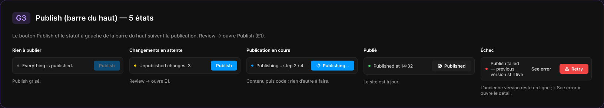
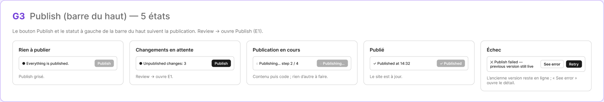

# G3 · Publish (barre du haut) — 5 états

Extraction Figma du fichier « Kuartz — Carte système » (fileKey `wvr98llwHnMufQ88qUp4Ih`). Notation des arbres et conventions : voir [../README.md](../README.md).

| Champ | Valeur |
|---|---|
| Route | — (état / scénario, pas de route propre) |
| Accès | — (état sans barre d’accès ; voir l’écran d’origine [E1](../screens/E1.md)) |
| Seul Kuartz voit | rien de spécifique à cet état |
| Wireframe | `263:1356` |
| LLM context | `507:1836` |
| UI | `359:2009` |
| Déclenché depuis | E1 (« Publish : 5 états → G3 »), voir [../screens/E1.md](../screens/E1.md) |
| Captures | [UI](./G3.ui.png) · [Wireframe](./G3.wf.png) |





Déclenché depuis : E1 (« Publish : 5 états → G3 »), voir [../screens/E1.md](../screens/E1.md).

## LLM context

Bloc Figma `507:1836` (page Wireframe), texte verbatim.

> LLM CONTEXT
>
> G3 · Publish (barre du haut) — 5 états
>
> Zone violette · reliée à E1
>
> Le bouton Publish et le statut à gauche de la Top bar suivent la publication.

<!-- col 1 -->

### ÉTATS

1. Rien à publier : « ● Everything is published. », Publish grisé.
2. Changements en attente : « ● Unpublished changes: 3 » ; Publish actif ; « Review › » ouvre E1.
3. Publication en cours : « Publishing… step 2 / 4 », bouton « Publishing… » (indicateur), tout clic ignoré ; contenu puis code, rien d’autre à faire.
4. Publié : « Published at 14:32 », bouton « ✓ Published » ; le site est à jour. Retour à l’état 1 (ou 2 si de nouveaux brouillons arrivent).
5. Échec : « Publish failed — previous version still live », « See error » (le détail du build) et « Retry » (rouge).

<!-- col 2 -->

### RÈGLES

• Le compteur N = brouillons de contenu + modifications IA validées (même liste qu’en E1).
• Publish dans la Top bar publie tout, comme « Publish N changes » en E1.
• Les étapes 1 à 4 sont celles de E1 ; « step x / 4 » suit l’étape en cours.
• Pendant la publication, les autres utilisateurs voient le même état (proposé : état partagé côté serveur).

### COMPOSANTS

Top bar (5 états), Publish button.

## Wireframe

Écran wireframe `263:1356` — textes et annotations dans l’ordre de lecture (▸ = conteneur, [Composant {propriétés}], « (libre) » = conteneur sans auto-layout, enfants triés haut→bas puis gauche→droite).

- ▸ G3 · Publish (barre du haut) — 5 états
  - ▸ Frame
    - "G3"
    - "Publish (barre du haut) — 5 états"
  - "Le bouton Publish et le statut à gauche de la barre du haut suivent la publication. Review → ouvre Publish (E1)." (intro)
  - ▸ Frame
    - ▸ Frame
      - "Rien à publier"
      - ▸ Frame
        - "● Everything is published."
        - ▸ Frame
          - "Publish"
      - "Publish grisé."
    - ▸ Frame
      - "Changements en attente"
      - ▸ Frame
        - "● Unpublished changes: 3"
        - ▸ Frame
          - "Publish"
      - "Review → ouvre E1."
    - ▸ Frame
      - "Publication en cours"
      - ▸ Frame
        - "◌ Publishing… step 2 / 4"
        - ▸ Frame
          - "◌ Publishing…"
      - "Contenu puis code ; rien d’autre à faire."
    - ▸ Frame
      - "Publié"
      - ▸ Frame
        - "✓ Published at 14:32"
        - ▸ Frame
          - "✓ Published"
      - "Le site est à jour."
    - ▸ Frame
      - "Échec"
      - ▸ Frame
        - "✕ Publish failed — previous version still live"
        - ▸ Frame
          - "See error"
        - ▸ Frame
          - "Retry"
      - "L’ancienne version reste en ligne ; « See error » ouvre le détail."

## UI — arbre

Écran UI `359:2009` (page UI). Légende : `AL H|V` auto-layout, `gap`, `pad` (1 valeur, [vertical, horizontal] ou [haut, droite, bas, gauche]), `align=principal/secondaire`, `size=largeur/hauteur` (fixed|hug|fill), `@x,y` position libre, `abs@x,y` position absolue dans un auto-layout, `fill/stroke/radius` = variable liée (valeur brute en hex/px si aucune variable), `effect` = style d’effet, `TEXT … · <style de texte> · <couleur>` puis `:: "texte"`, `INST "calque" → Composant {propriétés}` ; sous une instance : `T "texte"` = texte interne non déjà donné par une propriété.

```text
FRAME "G3 · Publish (barre du haut) — 5 états" 1630×294 · AL V gap=24 pad=32 align=MIN/MIN · fill=bg/primary · stroke=#9966ff@35% 1 · radius=18
  FRAME "header" 382×32 · AL H gap=14 align=MIN/CENTER · size=hug/hug
    FRAME "code" 49×32 · AL H gap=0 pad=[space/4, space/10] align=MIN/CENTER · size=hug/hug · fill=#9966ff@18% · radius=radius/md
      TEXT "code" 29×24 · Heading 3 · #bf9eff · size=hug/hug :: "G3"
    TEXT "title" 319×24 · Heading 3 · text/primary · size=hug/hug :: "Publish (barre du haut) — 5 états"
  TEXT "description" 880×16 · Body · text/tertiary · size=fixed/hug :: "Le bouton Publish et le statut à gauche de la barre du haut suivent la publication. Review → ouvre Publish (E1)."
  FRAME "states" 1564×132 · AL H gap=space/16 align=MIN/MIN · size=hug/hug
    FRAME "col/Rien à publier" 300×99 · AL V gap=space/12 align=MIN/MIN · size=fixed/hug
      TEXT "title" 79×15 · Label · text/primary · size=hug/hug :: "Rien à publier"
      FRAME "bar" 300×45 · AL H gap=space/8 pad=[space/8, space/8, space/8, space/12] align=MIN/CENTER · size=fill/hug · fill=bg/elevated · stroke=border/default 1 · radius=radius/md
        ELLIPSE "dot" 6×6 · size=fixed/fixed · fill=text/muted
        TEXT "status" 185×15 · Body Small · text/secondary · size=fill/hug :: "Everything is published."
        INST "Publish button" 71×27 → Publish button {state=idle} · AL H gap=0 align=MIN/CENTER · size=hug/hug
          INST "button" 71×27 → Button {Icon right=Icon/chevron-down, Icon left=Icon/plus, Show icon right=false, Show icon left=false, Label="Publish", variant=primary, state=disabled, size=small}
      TEXT "caption" 300×15 · Body Small · text/tertiary · size=fill/hug :: "Publish grisé."
    FRAME "col/Changements en attente" 300×99 · AL V gap=space/12 align=MIN/MIN · size=fixed/hug
      TEXT "title" 144×15 · Label · text/primary · size=hug/hug :: "Changements en attente"
      FRAME "bar" 300×45 · AL H gap=space/8 pad=[space/8, space/8, space/8, space/12] align=MIN/CENTER · size=fill/hug · fill=bg/elevated · stroke=border/default 1 · radius=radius/md
        ELLIPSE "dot" 6×6 · size=fixed/fixed · fill=interactive/warning
        TEXT "status" 185×15 · Body Small · text/secondary · size=fill/hug :: "Unpublished changes: 3"
        INST "Publish button" 71×27 → Publish button {state=pending} · AL H gap=0 align=MIN/CENTER · size=hug/hug
          INST "button" 71×27 → Button {Icon left=Icon/plus, Icon right=Icon/chevron-down, Show icon right=false, Show icon left=false, Label="Publish", variant=primary, state=default, size=small}
      TEXT "caption" 300×15 · Body Small · text/tertiary · size=fill/hug :: "Review → ouvre E1."
    FRAME "col/Publication en cours" 300×99 · AL V gap=space/12 align=MIN/MIN · size=fixed/hug
      TEXT "title" 119×15 · Label · text/primary · size=hug/hug :: "Publication en cours"
      FRAME "bar" 300×45 · AL H gap=space/8 pad=[space/8, space/8, space/8, space/12] align=MIN/CENTER · size=fill/hug · fill=bg/elevated · stroke=border/default 1 · radius=radius/md
        ELLIPSE "dot" 6×6 · size=fixed/fixed · fill=interactive/primary
        TEXT "status" 139×15 · Body Small · text/secondary · size=fill/hug :: "Publishing… step 2 / 4"
        INST "Publish button" 117×27 → Publish button {state=publishing} · AL H gap=0 align=MIN/CENTER · size=hug/hug
          INST "button" 117×27 → Button {Icon left=Icon/loader, Icon right=Icon/chevron-down, Show icon right=false, Show icon left=true, Label="Publishing…", variant=primary, state=default, size=small}
      TEXT "caption" 300×15 · Body Small · text/tertiary · size=fill/hug :: "Contenu puis code ; rien d’autre à faire."
    FRAME "col/Publié" 300×101 · AL V gap=space/12 align=MIN/MIN · size=fixed/hug
      TEXT "title" 36×15 · Label · text/primary · size=hug/hug :: "Publié"
      FRAME "bar" 300×47 · AL H gap=space/8 pad=[space/8, space/8, space/8, space/12] align=MIN/CENTER · size=fill/hug · fill=bg/elevated · stroke=border/default 1 · radius=radius/md
        ELLIPSE "dot" 6×6 · size=fixed/fixed · fill=interactive/success
        TEXT "status" 150×15 · Body Small · text/secondary · size=fill/hug :: "Published at 14:32"
        INST "Publish button" 106×29 → Publish button {state=published} · AL H gap=0 align=MIN/CENTER · size=hug/hug
          INST "button" 106×29 → Button {Icon left=Icon/success, Show icon left=true, Icon right=Icon/chevron-down, Show icon right=false, Label="Published", variant=secondary, state=default, size=small}
      TEXT "caption" 300×15 · Body Small · text/tertiary · size=fill/hug :: "Le site est à jour."
    FRAME "col/Échec" 300×132 · AL V gap=space/12 align=MIN/MIN · size=fixed/hug
      TEXT "title" 36×15 · Label · text/primary · size=hug/hug :: "Échec"
      FRAME "bar" 300×63 · AL H gap=space/8 pad=[space/8, space/8, space/8, space/12] align=MIN/CENTER · size=fill/hug · fill=bg/elevated · stroke=border/default 1 · radius=radius/md
        ELLIPSE "dot" 6×6 · size=fixed/fixed · fill=interactive/danger
        TEXT "status" 88×45 · Body Small · text/secondary · size=fill/hug :: "Publish failed — previous version still live"
        INST "Button" 82×27 → Button {Icon left=Icon/plus, Show icon right=false, Icon right=Icon/chevron-down, Show icon left=false, Label="See error", variant=ghost, state=default, size=small} · AL H gap=space/6 pad=[space/6, 14] align=CENTER/CENTER · size=hug/hug · radius=6
        INST "Publish button" 78×27 → Publish button {state=error} · AL H gap=0 align=MIN/CENTER · size=hug/hug
          INST "button" 78×27 → Button {Show icon right=false, Icon right=Icon/chevron-down, Icon left=Icon/warning, Show icon left=true, Label="Retry", variant=danger, state=default, size=small}
      TEXT "caption" 300×30 · Body Small · text/tertiary · size=fill/hug :: "L’ancienne version reste en ligne ; « See error » ouvre le détail."
```
