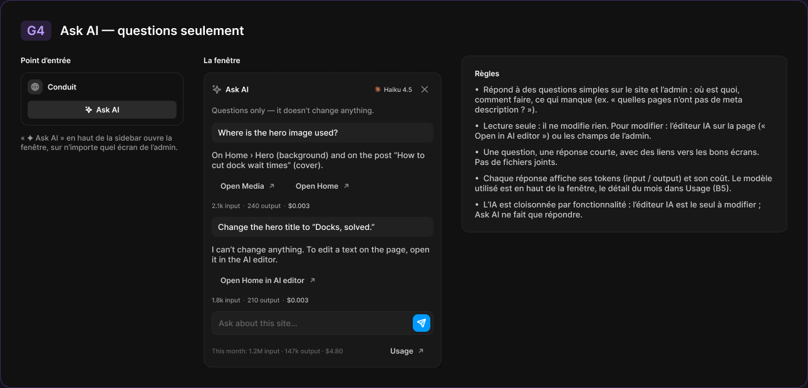
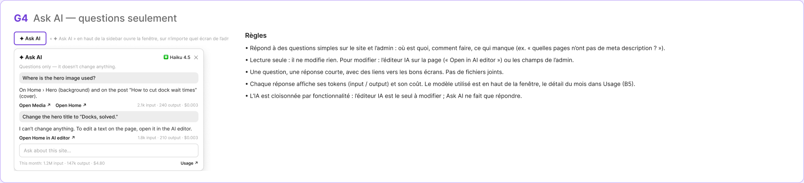

# G4 · Ask AI — questions seulement

Extraction Figma du fichier « Kuartz — Carte système » (fileKey `wvr98llwHnMufQ88qUp4Ih`). Notation des arbres et conventions : voir [../README.md](../README.md).

| Champ | Valeur |
|---|---|
| Route | — (état / scénario, pas de route propre) |
| Accès | Kuartz et client admin (pas de barre d’accès ; ligne « Accès : Kuartz et client, depuis n’importe quel écran de l’admin ») |
| Seul Kuartz voit | rien de spécifique à cet état |
| Wireframe | `275:1408` |
| LLM context | `508:1768` |
| UI | `359:2358` |
| Déclenché depuis | B1 (« ✦ Ask AI : questions seulement → G4 »), voir [../screens/B1.md](../screens/B1.md) |
| Captures | [UI](./G4.ui.png) · [Wireframe](./G4.wf.png) |





Déclenché depuis : B1 (« ✦ Ask AI : questions seulement → G4 »), voir [../screens/B1.md](../screens/B1.md).

## LLM context

Bloc Figma `508:1768` (page Wireframe), texte verbatim.

> LLM CONTEXT
>
> G4 · Ask AI — questions seulement
>
> Zone violette · reliée à B1 (bouton de la sidebar)
>
> Accès : Kuartz et client, depuis n’importe quel écran de l’admin

<!-- col 1 -->

### EN BREF

Un assistant qui répond à des questions simples sur le site et l’admin (où est quoi, comment faire, ce qui manque), en lecture seule. Il ne modifie rien et ne prend pas de fichiers.

### COMPORTEMENT

• « ✦ Ask AI » en haut de la sidebar ouvre la fenêtre (panneau flottant), sur n’importe quel écran ; ✕ ou Échap la ferme ; la conversation est gardée pendant la session (proposé).
• En-tête : « Ask AI », le modèle utilisé (logo Claude + « Haiku 4.5 »), ✕ ; sous-titre « Questions only — it doesn’t change anything. »
• Réponses courtes, avec des liens vers les bons écrans (« Open Media ↗ », « Open Home ↗ ») ; sous chaque réponse : tokens et coût (« 2.1k input · 240 output · $0.003 »).
• Demande de modification (« Change the hero title to “Docks, solved.” ») : « I can’t change anything. To edit a text on the page, open it in the AI editor. » + « Open Home in AI editor ↗ ».
• Champ « Ask about this site… » + envoyer (⌘ ↵).
• Pied : « This month: 1.2M input · 147k output · $4.80 » (toute l’IA du site) + « Usage ↗ » (B5).

<!-- col 2 -->

### DONNÉES ET INTÉGRATION

• Contexte donné au modèle : structure du site (pages, sections, collections et nombres d’éléments), réglages, statut SEO, médias et leurs utilisations — en lecture seule (jeton de lecture Sanity côté serveur).
• Chaque réponse est journalisée comme une demande « Ask AI » (B5).
• Modèle montré : Claude Haiku 4.5 (hypothèse, configurable).

### RÈGLES

• Lecture seule : pour modifier, l’éditeur IA sur la page (« Open in AI editor ») ou les champs de l’admin.
• Une question, une réponse courte ; pas de fichiers joints.
• L’IA est cloisonnée par fonctionnalité : l’éditeur IA est le seul à modifier ; Ask AI ne fait que répondre.

### HORS PÉRIMÈTRE

Pas d’assistant qui modifie le CMS ou accepte des fichiers.

### COMPOSANTS

Ask AI panel, Model usage (small), Button link, Search field.

## Wireframe

Écran wireframe `275:1408` — textes et annotations dans l’ordre de lecture (▸ = conteneur, [Composant {propriétés}], « (libre) » = conteneur sans auto-layout, enfants triés haut→bas puis gauche→droite).

- ▸ G4 · Ask AI — questions seulement
  - ▸ Frame
    - "G4"
    - "Ask AI — questions seulement"
  - ▸ Frame
    - ▸ Frame
      - ▸ Frame
        - ▸ Frame
          - "✦ Ask AI"
        - "« ✦ Ask AI » en haut de la sidebar ouvre la fenêtre, sur n’importe quel écran de l’admin."
      - ▸ Frame
        - ▸ Frame
          - "✦ Ask AI"
          - ▸ model · Haiku 4.5
            - "✳"
            - "Haiku 4.5"
          - "✕"
        - "Questions only — it doesn’t change anything."
        - ▸ Frame
          - "Where is the hero image used?"
        - "On Home › Hero (background) and on the post “How to cut dock wait times” (cover)."
        - ▸ Frame
          - "Open Media ↗"
          - "Open Home ↗"
          - "2.1k input · 240 output · $0.003"
        - ▸ Frame
          - "Change the hero title to “Docks, solved.”"
        - "I can’t change anything. To edit a text on the page, open it in the AI editor."
        - ▸ Frame
          - "Open Home in AI editor ↗"
          - "1.8k input · 210 output · $0.003"
        - ▸ Frame
          - "Ask about this site…"
        - ▸ Frame
          - "This month: 1.2M input · 147k output · $4.80"
          - "Usage ↗"
    - ▸ Frame
      - "Règles"
      - "• Répond à des questions simples sur le site et l’admin : où est quoi, comment faire, ce qui manque (ex. « quelles pages n’ont pas de meta description ? »)."
      - "• Lecture seule : il ne modifie rien. Pour modifier : l’éditeur IA sur la page (« Open in AI editor ») ou les champs de l’admin."
      - "• Une question, une réponse courte, avec des liens vers les bons écrans. Pas de fichiers joints."
      - "• Chaque réponse affiche ses tokens (input / output) et son coût. Le modèle utilisé est en haut de la fenêtre, le détail du mois dans Usage (B5)."
      - "• L’IA est cloisonnée par fonctionnalité : l’éditeur IA est le seul à modifier ; Ask AI ne fait que répondre."

## UI — arbre

Écran UI `359:2358` (page UI). Légende : `AL H|V` auto-layout, `gap`, `pad` (1 valeur, [vertical, horizontal] ou [haut, droite, bas, gauche]), `align=principal/secondaire`, `size=largeur/hauteur` (fixed|hug|fill), `@x,y` position libre, `abs@x,y` position absolue dans un auto-layout, `fill/stroke/radius` = variable liée (valeur brute en hex/px si aucune variable), `effect` = style d’effet, `TEXT … · <style de texte> · <couleur>` puis `:: "texte"`, `INST "calque" → Composant {propriétés}` ; sous une instance : `T "texte"` = texte interne non déjà donné par une propriété.

```text
FRAME "G4 · Ask AI — questions seulement" 1290×621 · AL V gap=24 pad=32 align=MIN/MIN · fill=bg/primary · stroke=#9966ff@35% 1 · radius=18
  FRAME "header" 357×32 · AL H gap=14 align=MIN/CENTER · size=hug/hug
    FRAME "code" 49×32 · AL H gap=0 pad=[space/4, space/10] align=MIN/CENTER · size=hug/hug · fill=#9966ff@18% · radius=radius/md
      TEXT "code" 29×24 · Heading 3 · #bf9eff · size=hug/hug :: "G4"
    TEXT "title" 294×24 · Heading 3 · text/primary · size=hug/hug :: "Ask AI — questions seulement"
  FRAME "body" 1224×499 · AL H gap=space/32 align=MIN/MIN · size=hug/hug
    FRAME "entry" 260×154 · AL V gap=space/12 align=MIN/MIN · size=fixed/hug
      TEXT "title" 80×15 · Label · text/primary · size=hug/hug :: "Point d’entrée"
      FRAME "sidebar-header" 260×85 · AL V gap=space/10 pad=space/10 align=MIN/MIN · size=fill/hug · fill=bg/primary · stroke=border/default 1 · radius=radius/lg
        FRAME "site" 238×24 · AL H gap=space/8 align=MIN/CENTER · size=fill/hug
          FRAME "logo" 24×24 · AL H gap=0 align=CENTER/CENTER · size=fixed/fixed · fill=bg/input-hover · radius=radius/md
            INST "icon" 14×14 → Icon/globe {size=18} · size=fixed/fixed
          TEXT "name" 47×15 · Label · text/primary · size=hug/hug :: "Conduit"
        INST "Button" 238×29 → Button {Show icon right=false, Icon left=Icon/ai, Show icon left=true, Icon right=Icon/chevron-down, Label="Ask AI", variant=secondary, state=hover, size=small} · AL H gap=space/6 pad=[space/6, 14] align=CENTER/CENTER · size=fill/hug · fill=bg/input-hover · stroke=border/default 1 · radius=6
      TEXT "caption" 260×30 · Body Small · text/tertiary · size=fill/hug :: "« ✦ Ask AI » en haut de la sidebar ouvre la fenêtre, sur n’importe quel écran de l’admin."
    FRAME "conversation" 380×499 · AL V gap=space/12 align=MIN/MIN · size=fixed/hug
      TEXT "title" 59×15 · Label · text/primary · size=hug/hug :: "La fenêtre"
      FRAME "ask-ai" 380×472 · AL V gap=space/12 pad=space/12 align=MIN/MIN · size=fill/hug · fill=bg/elevated · stroke=border/default 1 · radius=radius/lg · effect=Elevation/Popover
        FRAME "header" 354×28 · AL H gap=space/6 align=MIN/CENTER · size=fill/hug
          INST "icon" 16×16 → Icon/ai {size=18} · size=fixed/fixed
          TEXT "title" 231×15 · Label · text/primary · size=fill/hug :: "Ask AI"
          INST "model" 61×12 → Model usage {Cost="$0.07", Output="1.1k output", Input="18.2k input", Show usage=false, Show model=true, Model="Haiku 4.5", size=small} · AL H gap=space/8 align=MIN/CENTER · size=hug/hug
            INST "mark" 12×12 → Icon/claude {size=12}
          INST "Icon button" 28×28 → Icon button {Icon=Icon/close, style=ghost, state=default, size=small} · AL H gap=0 align=CENTER/CENTER · size=fixed/fixed · radius=radius/md
        TEXT "help" 354×15 · Body Small · text/tertiary · size=fill/hug :: "Questions only — it doesn’t change anything."
        INST "Message" 354×32 → Message {type=adjustment} · AL V gap=space/6 pad=[space/8, space/10] align=MIN/MIN · size=fill/hug · fill=bg/subtle · radius=radius/md
          T "Where is the hero image used?"
        TEXT "answer" 354×32 · Body · text/secondary · size=fill/hug :: "On Home › Hero (background) and on the post “How to cut dock wait times” (cover)."
        FRAME "links" 354×27 · AL H gap=space/4 align=MIN/CENTER · size=fill/hug
          INST "Button" 116×27 → Button {Icon left=Icon/plus, Show icon right=true, Icon right=Icon/external, Show icon left=false, Label="Open Media", variant=ghost, state=default, size=small} · AL H gap=space/6 pad=[space/6, 14] align=CENTER/CENTER · size=hug/hug · radius=6
          INST "Button" 115×27 → Button {Icon left=Icon/plus, Show icon right=true, Icon right=Icon/external, Show icon left=false, Label="Open Home", variant=ghost, state=default, size=small} · AL H gap=space/6 pad=[space/6, 14] align=CENTER/CENTER · size=hug/hug · radius=6
          FRAME "sp" 115×1 · AL H gap=0 align=MIN/CENTER · size=fill/fixed
        INST "cost" 157×12 → Model usage {Model="Sonnet 5", Show usage=true, Show model=false, Cost="$0.003", Output="240 output", Input="2.1k input", size=small} · AL H gap=space/8 align=MIN/CENTER · size=hug/hug
          T "·"
          T "·"
        INST "Message" 354×32 → Message {type=adjustment} · AL V gap=space/6 pad=[space/8, space/10] align=MIN/MIN · size=fill/hug · fill=bg/subtle · radius=radius/md
          T "Change the hero title to “Docks, solved.”"
        TEXT "answer" 354×32 · Body · text/secondary · size=fill/hug :: "I can’t change anything. To edit a text on the page, open it in the AI editor."
        FRAME "links" 354×27 · AL H gap=space/4 align=MIN/CENTER · size=fill/hug
          INST "Button" 181×27 → Button {Icon left=Icon/plus, Show icon right=true, Icon right=Icon/external, Show icon left=false, Label="Open Home in AI editor", variant=ghost, state=default, size=small} · AL H gap=space/6 pad=[space/6, 14] align=CENTER/CENTER · size=hug/hug · radius=6
          FRAME "sp" 169×1 · AL H gap=0 align=MIN/CENTER · size=fill/fixed
        INST "cost" 155×12 → Model usage {Model="Sonnet 5", Show usage=true, Show model=false, Cost="$0.003", Output="210 output", Input="1.8k input", size=small} · AL H gap=space/8 align=MIN/CENTER · size=hug/hug
          T "·"
          T "·"
        FRAME "input" 354×38 · AL H gap=space/6 pad=[space/4, space/4, space/4, space/10] align=MIN/CENTER · size=fill/hug · fill=bg/input · stroke=border/default 1 · radius=radius/md
          TEXT "placeholder" 304×16 · Body · text/muted · size=fill/hug :: "Ask about this site…"
          INST "Icon button" 28×28 → Icon button {Icon=Icon/send, style=primary, state=default, size=small} · AL H gap=0 align=CENTER/CENTER · size=fixed/fixed · fill=interactive/primary · radius=radius/md
        FRAME "footer" 354×27 · AL H gap=space/6 align=MIN/CENTER · size=fill/hug
          TEXT "usage" 265×12 · Caption · text/muted · size=fill/hug :: "This month: 1.2M input · 147k output · $4.80"
          INST "Button" 83×27 → Button {Icon left=Icon/plus, Show icon right=true, Icon right=Icon/external, Show icon left=false, Label="Usage", variant=ghost, state=default, size=small} · AL H gap=space/6 pad=[space/6, 14] align=CENTER/CENTER · size=hug/hug · radius=6
    FRAME "rules" 520×283 · AL V gap=space/10 pad=space/20 align=MIN/MIN · size=fixed/hug · fill=bg/elevated · stroke=border/default 1 · radius=radius/lg
      TEXT "title" 40×15 · Label · text/primary · size=hug/hug :: "Règles"
      TEXT "rule" 478×48 · Body · text/secondary · size=fill/hug :: "•  Répond à des questions simples sur le site et l’admin : où est quoi, comment faire, ce qui manque (ex. « quelles pages n’ont pas de meta description ? »)."
      TEXT "rule" 478×32 · Body · text/secondary · size=fill/hug :: "•  Lecture seule : il ne modifie rien. Pour modifier : l’éditeur IA sur la page (« Open in AI editor ») ou les champs de l’admin."
      TEXT "rule" 478×32 · Body · text/secondary · size=fill/hug :: "•  Une question, une réponse courte, avec des liens vers les bons écrans. Pas de fichiers joints."
      TEXT "rule" 478×32 · Body · text/secondary · size=fill/hug :: "•  Chaque réponse affiche ses tokens (input / output) et son coût. Le modèle utilisé est en haut de la fenêtre, le détail du mois dans Usage (B5)."
      TEXT "rule" 478×32 · Body · text/secondary · size=fill/hug :: "•  L’IA est cloisonnée par fonctionnalité : l’éditeur IA est le seul à modifier ; Ask AI ne fait que répondre."
```
