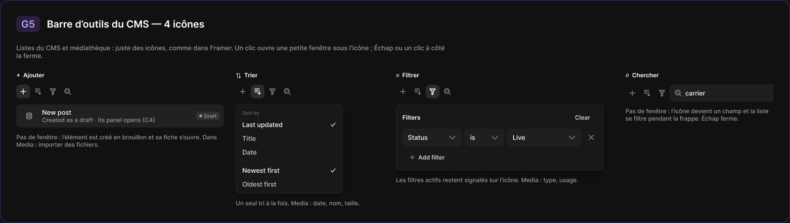
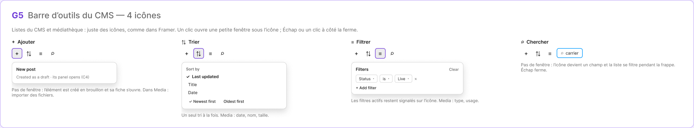

# G5 · Barre d’outils du CMS — 4 icônes

Extraction Figma du fichier « Kuartz — Carte système » (fileKey `wvr98llwHnMufQ88qUp4Ih`). Notation des arbres et conventions : voir [../README.md](../README.md).

| Champ | Valeur |
|---|---|
| Route | — (état / scénario, pas de route propre) |
| Accès | — (état sans barre d’accès ; voir les écrans d’origine [C3](../screens/C3.md) et C5) |
| Seul Kuartz voit | rien de spécifique à cet état |
| Wireframe | `275:1452` |
| LLM context | `508:1797` |
| UI | `359:2402` |
| Déclenché depuis | C3 (« Icônes du CMS : + ⇅ ≡ ⌕ → G5 »), voir [../screens/C3.md](../screens/C3.md) |
| Captures | [UI](./G5.ui.png) · [Wireframe](./G5.wf.png) |





Déclenché depuis : C3 (« Icônes du CMS : + ⇅ ≡ ⌕ → G5 »), voir [../screens/C3.md](../screens/C3.md).

## LLM context

Bloc Figma `508:1797` (page Wireframe), texte verbatim.

> LLM CONTEXT
>
> G5 · Barre d’outils du CMS — 4 icônes
>
> Zone violette · reliée à C3 (et C5)
>
> Listes du CMS et médiathèque : juste des icônes, comme dans Framer.

<!-- col 1 -->

### LES 4 ICÔNES

• + Ajouter : pas de fenêtre ; crée l’élément en brouillon et ouvre sa fiche (C4) ; dans Media : importer des fichiers.
• Trier : petite fenêtre sous l’icône : « Sort by » Last updated ✓ / Title / Date, puis Newest first ✓ / Oldest first. Un seul tri à la fois. Media : date, nom, taille.
• Filtrer : fenêtre « Filters » avec des lignes « champ · is · valeur » (ex. Status is Live) et ×, « + Add filter », « Clear ». Les filtres actifs restent signalés sur l’icône (point). Media : type, usage.
• Chercher : pas de fenêtre ; l’icône devient un champ dans la barre, la liste se filtre pendant la frappe ; Échap ferme et vide.

### RÈGLES

• Échap ou un clic à côté ferme une fenêtre.
• Tri, filtres et recherche sont gardés par collection pendant la session (proposé).
• Valeurs de statut : Live, Draft, Changed (les mêmes que la pastille de C3).

<!-- col 2 -->

### COMPOSANTS

Icon button × 4, Menu (Sort by), Filter popover (lignes de filtre + Select), Search field (inline).

### VOIR AUSSI

C3 (liste du Blog), C4 (fiche), C5 (médiathèque).

## Wireframe

Écran wireframe `275:1452` — textes et annotations dans l’ordre de lecture (▸ = conteneur, [Composant {propriétés}], « (libre) » = conteneur sans auto-layout, enfants triés haut→bas puis gauche→droite).

- ▸ G5 · Barre d’outils du CMS — 4 icônes
  - ▸ Frame
    - "G5"
    - "Barre d’outils du CMS — 4 icônes"
  - "Listes du CMS et médiathèque : juste des icônes, comme dans Framer. Un clic ouvre une petite fenêtre sous l’icône ; Échap ou un clic à côté la ferme."
  - ▸ Frame
    - ▸ Frame
      - "+  Ajouter"
      - ▸ Frame
        - ▸ Frame
          - "+"
        - ▸ Frame
          - "⇅"
        - ▸ Frame
          - "≡"
        - ▸ Frame
          - "⌕"
      - ▸ Frame
        - "New post"
        - "Created as a draft · its panel opens (C4)"
      - "Pas de fenêtre : l’élément est créé en brouillon et sa fiche s’ouvre. Dans Media : importer des fichiers."
    - ▸ Frame
      - "⇅  Trier"
      - ▸ Frame
        - ▸ Frame
          - "+"
        - ▸ Frame
          - "⇅"
        - ▸ Frame
          - "≡"
        - ▸ Frame
          - "⌕"
      - ▸ Frame
        - "Sort by"
        - ▸ Frame
          - "✓"
          - "Last updated"
        - ▸ Frame
          - " "
          - "Title"
        - ▸ Frame
          - " "
          - "Date"
        - ▸ Frame
          - ▸ Frame
            - "✓ Newest first"
          - ▸ Frame
            - "Oldest first"
      - "Un seul tri à la fois. Media : date, nom, taille."
    - ▸ Frame
      - "≡  Filtrer"
      - ▸ Frame
        - ▸ Frame
          - "+"
        - ▸ Frame
          - "⇅"
        - ▸ Frame
          - "≡"
        - ▸ Frame
          - "⌕"
      - ▸ Frame
        - ▸ header
          - "Filters"
          - "Clear"
        - ▸ filter row
          - ▸ select · Status
            - "Status"
            - "▾"
          - ▸ select · is
            - "is"
            - "▾"
          - ▸ select · Live
            - "Live"
            - "▾"
          - "×"
        - "+ Add filter"
      - "Les filtres actifs restent signalés sur l’icône. Media : type, usage."
    - ▸ Frame
      - "⌕  Chercher"
      - ▸ Frame
        - ▸ Frame
          - "+"
        - ▸ Frame
          - "⇅"
        - ▸ Frame
          - "≡"
        - ▸ search field (inline)
          - "⌕"
          - "carrier"
      - "Pas de fenêtre : l’icône devient un champ et la liste se filtre pendant la frappe. Échap ferme."

## UI — arbre

Écran UI `359:2402` (page UI). Légende : `AL H|V` auto-layout, `gap`, `pad` (1 valeur, [vertical, horizontal] ou [haut, droite, bas, gauche]), `align=principal/secondaire`, `size=largeur/hauteur` (fixed|hug|fill), `@x,y` position libre, `abs@x,y` position absolue dans un auto-layout, `fill/stroke/radius` = variable liée (valeur brute en hex/px si aucune variable), `effect` = style d’effet, `TEXT … · <style de texte> · <couleur>` puis `:: "texte"`, `INST "calque" → Composant {propriétés}` ; sous une instance : `T "texte"` = texte interne non déjà donné par une propriété.

```text
FRAME "G5 · Barre d’outils du CMS — 4 icônes" 1598×453 · AL V gap=24 pad=32 align=MIN/MIN · fill=bg/primary · stroke=#9966ff@35% 1 · radius=18
  FRAME "header" 381×32 · AL H gap=14 align=MIN/CENTER · size=hug/hug
    FRAME "code" 48×32 · AL H gap=0 pad=[space/4, space/10] align=MIN/CENTER · size=hug/hug · fill=#9966ff@18% · radius=radius/md
      TEXT "code" 28×24 · Heading 3 · #bf9eff · size=hug/hug :: "G5"
    TEXT "title" 319×24 · Heading 3 · text/primary · size=hug/hug :: "Barre d’outils du CMS — 4 icônes"
  TEXT "description" 880×32 · Body · text/tertiary · size=fixed/hug :: "Listes du CMS et médiathèque : juste des icônes, comme dans Framer. Un clic ouvre une petite fenêtre sous l'icône ; Échap ou un clic à côté la ferme."
  FRAME "tools" 1532×275 · AL H gap=space/24 align=MIN/MIN · size=hug/hug
    FRAME "col/+  Ajouter" 420×156 · AL V gap=space/12 align=MIN/MIN · size=fixed/hug
      TEXT "title" 57×15 · Label · text/primary · size=hug/hug :: "+  Ajouter"
      FRAME "toolbar" 118×28 · AL H gap=space/2 align=MIN/CENTER · size=hug/hug
        INST "tool/plus" 28×28 → Icon button {Icon=Icon/plus, style=ghost, state=active, size=small} · AL H gap=0 align=CENTER/CENTER · size=fixed/fixed · fill=bg/input-hover · radius=radius/md
        INST "tool/sort" 28×28 → Icon button {Icon=Icon/sort, style=ghost, state=default, size=small} · AL H gap=0 align=CENTER/CENTER · size=fixed/fixed · radius=radius/md
        INST "tool/filter" 28×28 → Icon button {Icon=Icon/filter, style=ghost, state=default, size=small} · AL H gap=0 align=CENTER/CENTER · size=fixed/fixed · radius=radius/md
        INST "tool/search" 28×28 → Icon button {Icon=Icon/search, style=ghost, state=default, size=small} · AL H gap=0 align=CENTER/CENTER · size=fixed/fixed · radius=radius/md
      INST "List item" 420×47 → List item {Icon=Icon/database, Show tag=true, Title="New post", Show meta=false, Show subtitle=true, Show action=false, Meta="Editor", Subtitle="Created as a draft · its panel opens (C4)", leading=icon, state=hover} · AL H gap=space/12 pad=[space/8, space/8, space/8, space/12] align=MIN/CENTER · size=fill/hug · fill=bg/subtle · radius=radius/md
        INST "tag" 48×16 → Tag {Icon=Icon/close, Show icon=false, Show dot=true, Label="Draft", tone=neutral}
      TEXT "caption" 420×30 · Body Small · text/tertiary · size=fill/hug :: "Pas de fenêtre : l’élément est créé en brouillon et sa fiche s’ouvre. Dans Media : importer des fichiers."
    FRAME "col/⇅  Trier" 300×275 · AL V gap=space/12 align=MIN/MIN · size=fixed/hug
      TEXT "title" 44×15 · Label · text/primary · size=hug/hug :: "⇅  Trier"
      FRAME "toolbar" 118×28 · AL H gap=space/2 align=MIN/CENTER · size=hug/hug
        INST "tool/plus" 28×28 → Icon button {Icon=Icon/plus, style=ghost, state=default, size=small} · AL H gap=0 align=CENTER/CENTER · size=fixed/fixed · radius=radius/md
        INST "tool/sort" 28×28 → Icon button {Icon=Icon/sort, style=ghost, state=active, size=small} · AL H gap=0 align=CENTER/CENTER · size=fixed/fixed · fill=bg/input-hover · radius=radius/md
        INST "tool/filter" 28×28 → Icon button {Icon=Icon/filter, style=ghost, state=default, size=small} · AL H gap=0 align=CENTER/CENTER · size=fixed/fixed · radius=radius/md
        INST "tool/search" 28×28 → Icon button {Icon=Icon/search, style=ghost, state=default, size=small} · AL H gap=0 align=CENTER/CENTER · size=fixed/fixed · radius=radius/md
      INST "Menu" 216×181 → Menu · AL V gap=0 pad=space/4 align=MIN/MIN · size=fixed/hug · fill=bg/elevated · stroke=border/default 1 · radius=radius/md · effect=Elevation/Popover
        T "Sort by"
        INST "item 1" 206×28 → Menu item {Icon=Icon/calendar, Show shortcut=false, Show icon=false, Label="Last updated", state=selected}
          INST "check" 12×12 → Icon/check {size=12}
        INST "item 2" 206×28 → Menu item {Icon=Icon/calendar, Show shortcut=false, Show icon=false, Label="Title", state=default}
          INST "check" 12×12 → Icon/check {size=12}
        INST "item 3" 206×28 → Menu item {Icon=Icon/calendar, Show shortcut=false, Show icon=false, Label="Date", state=default}
          INST "check" 12×12 → Icon/check {size=12}
        INST "item 4" 206×28 → Menu item {Icon=Icon/calendar, Show shortcut=false, Show icon=false, Label="Newest first", state=selected}
          INST "check" 12×12 → Icon/check {size=12}
        INST "item 5" 206×28 → Menu item {Icon=Icon/calendar, Show shortcut=false, Show icon=false, Label="Oldest first", state=default}
          INST "check" 12×12 → Icon/check {size=12}
      TEXT "caption" 300×15 · Body Small · text/tertiary · size=fill/hug :: "Un seul tri à la fois. Media : date, nom, taille."
    FRAME "col/≡  Filtrer" 440×228 · AL V gap=space/12 align=MIN/MIN · size=fixed/hug
      TEXT "title" 48×15 · Label · text/primary · size=hug/hug :: "≡  Filtrer"
      FRAME "toolbar" 118×28 · AL H gap=space/2 align=MIN/CENTER · size=hug/hug
        INST "tool/plus" 28×28 → Icon button {Icon=Icon/plus, style=ghost, state=default, size=small} · AL H gap=0 align=CENTER/CENTER · size=fixed/fixed · radius=radius/md
        INST "tool/sort" 28×28 → Icon button {Icon=Icon/sort, style=ghost, state=default, size=small} · AL H gap=0 align=CENTER/CENTER · size=fixed/fixed · radius=radius/md
        INST "tool/filter" 28×28 → Icon button {Icon=Icon/filter, style=ghost, state=active, size=small} · AL H gap=0 align=CENTER/CENTER · size=fixed/fixed · fill=bg/input-hover · radius=radius/md
        INST "tool/search" 28×28 → Icon button {Icon=Icon/search, style=ghost, state=default, size=small} · AL H gap=0 align=CENTER/CENTER · size=fixed/fixed · radius=radius/md
      INST "Filter popover" 420×134 → Filter popover · AL V gap=space/10 pad=space/12 align=MIN/MIN · size=fixed/hug · fill=bg/elevated · stroke=border/default 1 · radius=radius/md · effect=Elevation/Popover
        T "Filters"
        INST "clear" 59×27 → Button {Icon left=Icon/plus, Show icon right=false, Icon right=Icon/chevron-down, Show icon left=false, Label="Clear", variant=ghost, state=default, size=small}
        INST "Select" 120×34 → Select {Label="Label", Show helper=false, Placeholder="Select…", Helper="Shown in browser tabs and search results.", Value="Status", Show label=false, state=filled, layout=stacked}
          INST "chevron" 16×16 → Icon/chevron-down {size=18}
        INST "Select" 80×34 → Select {Label="Label", Show helper=false, Placeholder="Select…", Helper="Shown in browser tabs and search results.", Value="is", Show label=false, state=filled, layout=stacked}
          INST "chevron" 16×16 → Icon/chevron-down {size=18}
        INST "Select" 150×34 → Select {Label="Label", Show helper=false, Placeholder="Select…", Helper="Shown in browser tabs and search results.", Value="Live", Show label=false, state=filled, layout=stacked}
          INST "chevron" 16×16 → Icon/chevron-down {size=18}
        INST "icon-button" 28×28 → Icon button {Icon=Icon/close, style=ghost, state=default, size=small}
        INST "add" 100×27 → Button {Show icon right=false, Icon left=Icon/plus, Icon right=Icon/chevron-down, Show icon left=true, Label="Add filter", variant=ghost, state=default, size=small}
      TEXT "caption" 440×15 · Body Small · text/tertiary · size=fill/hug :: "Les filtres actifs restent signalés sur l’icône. Media : type, usage."
    FRAME "col/⌕  Chercher" 300×103 · AL V gap=space/12 align=MIN/MIN · size=fixed/hug
      TEXT "title" 68×15 · Label · text/primary · size=hug/hug :: "⌕  Chercher"
      FRAME "toolbar" 330×34 · AL H gap=space/2 align=MIN/CENTER · size=hug/hug
        INST "tool/plus" 28×28 → Icon button {Icon=Icon/plus, style=ghost, state=default, size=small} · AL H gap=0 align=CENTER/CENTER · size=fixed/fixed · radius=radius/md
        INST "tool/sort" 28×28 → Icon button {Icon=Icon/sort, style=ghost, state=default, size=small} · AL H gap=0 align=CENTER/CENTER · size=fixed/fixed · radius=radius/md
        INST "tool/filter" 28×28 → Icon button {Icon=Icon/filter, style=ghost, state=default, size=small} · AL H gap=0 align=CENTER/CENTER · size=fixed/fixed · radius=radius/md
        INST "Search field" 240×34 → Search field {Show shortcut=true, Placeholder="Search…", Value="carrier", state=filled} · AL H gap=space/6 pad=[space/6, space/6, space/6, space/8] align=MIN/CENTER · size=fixed/hug · fill=bg/input · stroke=border/default 1 · radius=radius/md
          INST "icon" 16×16 → Icon/search {size=18}
          INST "icon-button" 20×20 → Icon button {Icon=Icon/close, style=ghost, state=default, size=xsmall}
      TEXT "caption" 300×30 · Body Small · text/tertiary · size=fill/hug :: "Pas de fenêtre : l’icône devient un champ et la liste se filtre pendant la frappe. Échap ferme."
```
