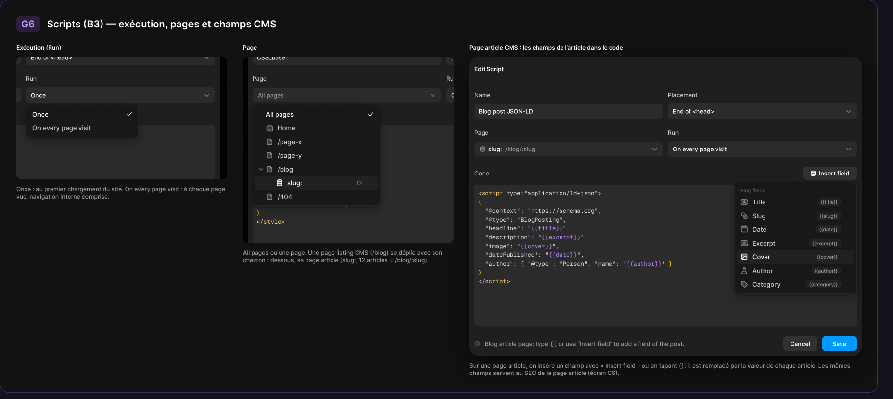
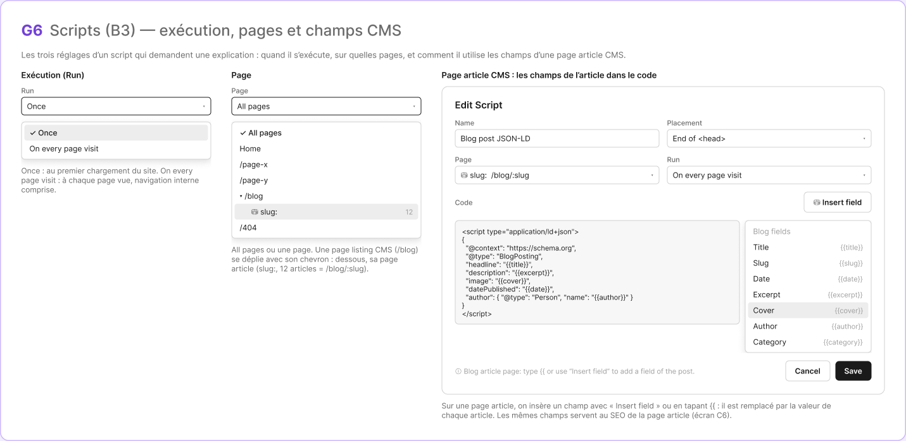

# G6 · Scripts — pages, exécution et champs CMS

Extraction Figma du fichier « Kuartz — Carte système » (fileKey `wvr98llwHnMufQ88qUp4Ih`). Notation des arbres et conventions : voir [../README.md](../README.md).

| Champ | Valeur |
|---|---|
| Route | — (état / scénario, pas de route propre) |
| Accès | — (état sans barre d’accès ; voir l’écran d’origine [B3](../screens/B3.md)) |
| Seul Kuartz voit | rien de spécifique à cet état (le LLM context ne précise pas ; voir [B3](../screens/B3.md)) |
| Wireframe | `498:1688` |
| LLM context | `508:1820` |
| UI | `452:7973` |
| Déclenché depuis | B3 (« Scripts : Run, Page, champs CMS → G6 »), voir [../screens/B3.md](../screens/B3.md) |
| Captures | [UI](./G6.ui.png) · [Wireframe](./G6.wf.png) |





Déclenché depuis : B3 (« Scripts : Run, Page, champs CMS → G6 »), voir [../screens/B3.md](../screens/B3.md).

## LLM context

Bloc Figma `508:1820` (page Wireframe), texte verbatim.

> LLM CONTEXT
>
> G6 · Scripts — pages, exécution et champs CMS
>
> Zone violette · reliée à B3
>
> Les trois réglages d’un script qui demandent une explication.

<!-- col 1 -->

### EXÉCUTION (RUN)

• Once : le script s’exécute une fois, au premier chargement du site.
• On every page visit : à chaque page vue, navigation interne comprise (changement de route côté client).

### PAGE

• « All pages » ou une page précise. Même liste que PAGES dans la sidebar : Home, /page-x, /page-y, /blog, sa page article « slug: » (12 articles = /blog/:slug), /404.
• Une page listing CMS se déplie avec son chevron ; dessous, sa page article.

<!-- col 2 -->

### PAGE ARTICLE CMS : LES CHAMPS DANS LE CODE

• Quand Page = une page article (ex. « slug: /blog/:slug »), le bouton « Insert field » ouvre la liste des champs de la collection (« Blog fields » : Title {{title}}, Slug {{slug}}, Date {{date}}, Excerpt {{excerpt}}, Cover {{cover}}, Author {{author}}, Category {{category}}) ; taper {{ ouvre la même liste.
• Chaque {{champ}} est remplacé par la valeur de l’article affiché. Exemple : un JSON-LD BlogPosting avec headline {{title}}, description {{excerpt}}, image {{cover}}, datePublished {{date}}, author {{author}}.
• Pied de la modale : « Blog article page: type {{ or use “Insert field” to add a field of the post. »
• Les mêmes champs servent au SEO de la page article (C6).

### À TRANCHER

• Question 15 : /testimonials et /faq dans cette liste.

## Wireframe

Écran wireframe `498:1688` — textes et annotations dans l’ordre de lecture (▸ = conteneur, [Composant {propriétés}], « (libre) » = conteneur sans auto-layout, enfants triés haut→bas puis gauche→droite).

- ▸ G6 · Scripts — pages, exécution et champs CMS
  - ▸ header
    - "G6"
    - "Scripts (B3) — exécution, pages et champs CMS"
  - "Les trois réglages d’un script qui demandent une explication : quand il s’exécute, sur quelles pages, et comment il utilise les champs d’une page article CMS."
  - ▸ body
    - ▸ col · Run
      - "Exécution (Run)"
      - ▸ field · Run
        - "Run"
        - ▸ input
          - "Once"
          - "▾"
      - ▸ menu · Run
        - ▸ item · ✓ Once
          - "✓ Once"
          - ""
        - ▸ item · On every page visit
          - "On every page visit"
          - ""
      - "Once : au premier chargement du site. On every page visit : à chaque page vue, navigation interne comprise."
    - ▸ col · Page
      - "Page"
      - ▸ field · Page
        - "Page"
        - ▸ input
          - "All pages"
          - "▾"
      - ▸ menu · Page
        - ▸ item · ✓ All pages
          - "✓ All pages"
          - ""
        - ▸ item · Home
          - "Home"
          - ""
        - ▸ item · /page-x
          - "/page-x"
          - ""
        - ▸ item · /page-y
          - "/page-y"
          - ""
        - ▸ item · ▾ /blog
          - "▾ /blog"
          - ""
        - ▸ item · ⛁ slug:
          - "⛁ slug:"
          - "12"
        - ▸ item · /404
          - "/404"
          - ""
      - "All pages ou une page. Une page listing CMS (/blog) se déplie avec son chevron : dessous, sa page article (slug:, 12 articles = /blog/:slug)."
    - ▸ col · Page article CMS
      - "Page article CMS : les champs de l’article dans le code"
      - ▸ modal · Edit Script (article page)
        - "Edit Script"
        - ▸ row
          - ▸ field · Name
            - "Name"
            - ▸ input
              - "Blog post JSON-LD"
              - ""
          - ▸ field · Placement
            - "Placement"
            - ▸ input
              - "End of <head>"
              - "▾"
        - ▸ row
          - ▸ field · Page
            - "Page"
            - ▸ input
              - "⛁ slug:  /blog/:slug"
              - "▾"
          - ▸ field · Run
            - "Run"
            - ▸ input
              - "On every page visit"
              - "▾"
        - ▸ code header
          - "Code"
          - [wf/Button {Label="⛁ Insert field", variant=secondary}] «btn/⛁ Insert field»
        - ▸ code + fields menu
          - ▸ code
            - "<script type=\"application/ld+json\">\n{\n  \"@context\": \"https://schema.org\",\n  \"@type\": \"BlogPosting\",\n  \"headline\": \"{{title}}\",\n  \"description\": \"{{excerpt}}\",\n  \"image\": \"{{cover}}\",\n  \"datePublished\": \"{{date}}\",\n  \"author\": { \"@type\": \"Person\", \"name\": \"{{author}}\" }\n}\n</script>"
          - ▸ menu · Insert field
            - ▸ item · Blog fields
              - "Blog fields"
              - ""
            - ▸ item · Title
              - "Title"
              - "{{title}}"
            - ▸ item · Slug
              - "Slug"
              - "{{slug}}"
            - ▸ item · Date
              - "Date"
              - "{{date}}"
            - ▸ item · Excerpt
              - "Excerpt"
              - "{{excerpt}}"
            - ▸ item · Cover
              - "Cover"
              - "{{cover}}"
            - ▸ item · Author
              - "Author"
              - "{{author}}"
            - ▸ item · Category
              - "Category"
              - "{{category}}"
        - ▸ footer
          - "ⓘ Blog article page: type {{ or use “Insert field” to add a field of the post."
          - [wf/Button {Label="Cancel", variant=secondary}] «btn/Cancel»
          - [wf/Button {Label="Save", variant=primary}] «btn/Save»
      - "Sur une page article, on insère un champ avec « Insert field » ou en tapant {{ : il est remplacé par la valeur de chaque article. Les mêmes champs servent au SEO de la page article (écran C6)."

## UI — arbre

Écran UI `452:7973` (page UI). Légende : `AL H|V` auto-layout, `gap`, `pad` (1 valeur, [vertical, horizontal] ou [haut, droite, bas, gauche]), `align=principal/secondaire`, `size=largeur/hauteur` (fixed|hug|fill), `@x,y` position libre, `abs@x,y` position absolue dans un auto-layout, `fill/stroke/radius` = variable liée (valeur brute en hex/px si aucune variable), `effect` = style d’effet, `TEXT … · <style de texte> · <couleur>` puis `:: "texte"`, `INST "calque" → Composant {propriétés}` ; sous une instance : `T "texte"` = texte interne non déjà donné par une propriété.

```text
FRAME "G6 · Scripts — pages, exécution et champs CMS" 1790×801 · AL V gap=24 pad=32 align=MIN/MIN · fill=bg/primary · stroke=#9966ff@35% 1 · radius=18
  FRAME "header" 531×32 · AL H gap=14 align=MIN/CENTER · size=hug/hug
    FRAME "code" 49×32 · AL H gap=0 pad=[space/4, space/10] align=MIN/CENTER · size=hug/hug · fill=#9966ff@18% · radius=radius/md
      TEXT "code" 29×24 · Heading 3 · #bf9eff · size=hug/hug :: "G6"
    TEXT "title" 468×24 · Heading 3 · text/primary · size=hug/hug :: "Scripts (B3) — exécution, pages et champs CMS"
  FRAME "body" 1724×679 · AL H gap=32 align=MIN/MIN · size=hug/hug
    FRAME "col" 430×319 · AL V gap=12 align=MIN/MIN · size=hug/hug
      TEXT "title" 93×15 · Label · text/primary · size=hug/hug :: "Exécution (Run)"
      FRAME "crop" 430×250 · size=fixed/fixed · fill=bg/app · radius=12
        INST "Script dialog" 800×598 → Script dialog {Title="Edit Script", page=all} · AL V gap=0 pad=[0, 10] align=MIN/MIN · @-385,-110 · fill=bg/input · radius=radius/xl · effect=Elevation/Modal
          T "Name"
          T "CSS_base"
          T "Placement"
          T "End of <head>"
          INST "chevron" 12×12 → Icon/chevron-down {size=12}
          T "Page"
          T "All pages"
          INST "chevron" 12×12 → Icon/chevron-down {size=12}
          T "Run"
          T "Once"
          INST "chevron" 12×12 → Icon/chevron-down {size=12}
          T "Code"
          T "<style>\nimg {\nuser-select: none;\n-webkit-user-select: none;\n-webkit-user-drag: none;\n}\n\nhtml {\noverscroll-behavior: none;\n}\n</style>"
          INST "icon" 12×12 → Icon/info {size=12}
          T "Place <script> tags in “End of <body>” for faster page loading."
          INST "cancel" 70×30 → Button {Icon left=Icon/plus, Show icon right=false, Icon right=Icon/chevron-down, Show icon left=false, Label="Cancel", variant=subtle, state=default, size=small}
          INST "save" 70×30 → Button {Icon left=Icon/plus, Icon right=Icon/chevron-down, Show icon right=false, Show icon left=false, Label="Save", variant=primary, state=default, size=small}
        FRAME "menu" 230×66 · AL V gap=0 pad=4 align=MIN/MIN · @20,98 · fill=bg/elevated · stroke=border/default 1 · radius=8 · effect=drop_shadow(24)+drop_shadow(6)
          INST "Menu item" 220×28 → Menu item {Icon=Icon/calendar, Show shortcut=false, Show icon=false, Label="Once", state=selected} · AL H gap=space/8 pad=[0, space/8] align=MIN/CENTER · size=fill/fixed · radius=radius/sm
            INST "check" 12×12 → Icon/check {size=12}
          INST "Menu item" 220×28 → Menu item {Icon=Icon/calendar, Show shortcut=false, Show icon=false, Label="On every page visit", state=default} · AL H gap=space/8 pad=[0, space/8] align=MIN/CENTER · size=fill/fixed · radius=radius/sm
            INST "check" 12×12 → Icon/check {size=12}
      TEXT "caption" 430×30 · Body Small · text/tertiary · size=fixed/hug :: "Once : au premier chargement du site. On every page visit : à chaque page vue, navigation interne comprise."
    FRAME "col" 430×449 · AL V gap=12 align=MIN/MIN · size=hug/hug
      TEXT "title" 30×15 · Label · text/primary · size=hug/hug :: "Page"
      FRAME "crop" 430×380 · size=fixed/fixed · fill=bg/app · radius=12
        INST "Script dialog" 800×598 → Script dialog {Title="Edit Script", page=all} · AL V gap=0 pad=[0, 10] align=MIN/MIN · @10,-110 · fill=bg/input · radius=radius/xl · effect=Elevation/Modal
          T "Name"
          T "CSS_base"
          T "Placement"
          T "End of <head>"
          INST "chevron" 12×12 → Icon/chevron-down {size=12}
          T "Page"
          T "All pages"
          INST "chevron" 12×12 → Icon/chevron-down {size=12}
          T "Run"
          T "Once"
          INST "chevron" 12×12 → Icon/chevron-down {size=12}
          T "Code"
          T "<style>\nimg {\nuser-select: none;\n-webkit-user-select: none;\n-webkit-user-drag: none;\n}\n\nhtml {\noverscroll-behavior: none;\n}\n</style>"
          INST "icon" 12×12 → Icon/info {size=12}
          T "Place <script> tags in “End of <body>” for faster page loading."
          INST "cancel" 70×30 → Button {Icon left=Icon/plus, Show icon right=false, Icon right=Icon/chevron-down, Show icon left=false, Label="Cancel", variant=subtle, state=default, size=small}
          INST "save" 70×30 → Button {Icon left=Icon/plus, Icon right=Icon/chevron-down, Show icon right=false, Show icon left=false, Label="Save", variant=primary, state=default, size=small}
        FRAME "menu" 260×206 · AL V gap=0 pad=4 align=MIN/MIN · @20,98 · fill=bg/elevated · stroke=border/default 1 · radius=8 · effect=drop_shadow(24)+drop_shadow(6)
          INST "Menu item" 250×28 → Menu item {Icon=Icon/calendar, Show shortcut=false, Show icon=false, Label="All pages", state=selected} · AL H gap=space/8 pad=[0, space/8, 0, 22] align=MIN/CENTER · size=fill/fixed · radius=radius/sm
            INST "check" 12×12 → Icon/check {size=12}
          INST "Menu item" 250×28 → Menu item {Show shortcut=false, Icon=Icon/house, Show icon=true, Label="Home", state=default} · AL H gap=space/8 pad=[0, space/8, 0, 22] align=MIN/CENTER · size=fill/fixed · radius=radius/sm
            INST "check" 12×12 → Icon/check {size=12}
          INST "Menu item" 250×28 → Menu item {Show shortcut=false, Icon=Icon/page, Show icon=true, Label="/page-x", state=default} · AL H gap=space/8 pad=[0, space/8, 0, 22] align=MIN/CENTER · size=fill/fixed · radius=radius/sm
            INST "check" 12×12 → Icon/check {size=12}
          INST "Menu item" 250×28 → Menu item {Show shortcut=false, Icon=Icon/page, Show icon=true, Label="/page-y", state=default} · AL H gap=space/8 pad=[0, space/8, 0, 22] align=MIN/CENTER · size=fill/fixed · radius=radius/sm
            INST "check" 12×12 → Icon/check {size=12}
          INST "Menu item" 250×28 → Menu item {Show shortcut=false, Icon=Icon/page, Show icon=true, Label="/blog", state=default} · AL H gap=space/8 pad=[0, space/8, 0, 22] align=MIN/CENTER · size=fill/fixed · radius=radius/sm
            INST "check" 12×12 → Icon/check {size=12}
          INST "Menu item" 250×28 → Menu item {Show shortcut=false, Show icon=true, Icon=Icon/database, Label="slug:", state=hover} · AL H gap=space/8 pad=[0, space/8, 0, 42] align=MIN/CENTER · size=fill/fixed · fill=bg/subtle · radius=radius/sm
            INST "check" 12×12 → Icon/check {size=12}
          INST "chevron" 10×10 → Icon/chevron-down {size=12} · abs@13,126
          INST "Menu item" 250×28 → Menu item {Show shortcut=false, Icon=Icon/page, Show icon=true, Label="/404", state=default} · AL H gap=space/8 pad=[0, space/8, 0, 22] align=MIN/CENTER · size=fill/fixed · radius=radius/sm
            INST "check" 12×12 → Icon/check {size=12}
          TEXT "count" 14×15 · Body Small · text/muted · abs@211,152 :: "12"
      TEXT "caption" 430×30 · Body Small · text/tertiary · size=fixed/hug :: "All pages ou une page. Une page listing CMS (/blog) se déplie avec son chevron : dessous, sa page article (slug:, 12 articles = /blog/:slug)."
    FRAME "col" 800×679 · AL V gap=12 align=MIN/MIN · size=hug/hug
      TEXT "title" 314×15 · Label · text/primary · size=hug/hug :: "Page article CMS : les champs de l’article dans le code"
      FRAME "dialog" 800×610 · size=fixed/fixed
        INST "Script dialog" 800×610 → Script dialog {Title="Edit Script", page=cms} · AL V gap=0 pad=[0, 10] align=MIN/MIN · @0,0 · fill=bg/input · radius=radius/xl · effect=Elevation/Modal
          T "Name"
          T "Blog post JSON-LD"
          T "Placement"
          T "End of <head>"
          INST "chevron" 12×12 → Icon/chevron-down {size=12}
          T "Page"
          INST "icon" 12×12 → Icon/database {size=12}
          T "slug:"
          T "/blog/:slug"
          INST "chevron" 12×12 → Icon/chevron-down {size=12}
          T "Run"
          T "On every page visit"
          INST "chevron" 12×12 → Icon/chevron-down {size=12}
          T "Code"
          INST "insert-field" 109×27 → Button {Show icon right=false, Icon left=Icon/database, Icon right=Icon/chevron-down, Show icon left=true, Label="Insert field", variant=subtle, state=default, size=small}
          T "<script type=\"application/ld+json\">\n{\n  \"@context\": \"https://schema.org\",\n  \"@type\": \"BlogPosting\",\n  \"headline\": \"{{title}}\",\n  \"description\": \"{{excerpt}}\",\n  \"image\": \"{{cover}}\",\n  \"datePublished\": \"{{date}}\",\n  \"author\": { \"@type\": \"Person\", \"name\": \"{{author}}\" }\n}\n</script>"
          INST "icon" 12×12 → Icon/info {size=12}
          T "Blog article page: type {{ or use “Insert field” to add a field of the post."
          INST "cancel" 70×30 → Button {Icon left=Icon/plus, Show icon right=false, Icon right=Icon/chevron-down, Show icon left=false, Label="Cancel", variant=subtle, state=default, size=small}
          INST "save" 70×30 → Button {Icon left=Icon/plus, Icon right=Icon/chevron-down, Show icon right=false, Show icon left=false, Label="Save", variant=primary, state=default, size=small}
        FRAME "menu" 250×228 · AL V gap=0 pad=4 align=MIN/MIN · @540,255 · fill=bg/elevated · stroke=border/default 1 · radius=8 · effect=drop_shadow(24)+drop_shadow(6)
          FRAME "section-label" 240×22 · AL H gap=0 pad=[space/6, space/8, space/4, space/8] align=MIN/CENTER · size=fill/hug
            TEXT "label" 51×12 · Caption · text/muted · size=hug/hug :: "Blog fields"
          INST "Menu item" 240×28 → Menu item {Show shortcut=true, Icon=Icon/text, Show icon=true, Label="Title", state=default} · AL H gap=space/8 pad=[0, space/8] align=MIN/CENTER · size=fill/fixed · radius=radius/sm
            INST "shortcut" 46×16 → Kbd {Label="{{title}}"}
            INST "check" 12×12 → Icon/check {size=12}
          INST "Menu item" 240×28 → Menu item {Show shortcut=true, Icon=Icon/link, Show icon=true, Label="Slug", state=default} · AL H gap=space/8 pad=[0, space/8] align=MIN/CENTER · size=fill/fixed · radius=radius/sm
            INST "shortcut" 48×16 → Kbd {Label="{{slug}}"}
            INST "check" 12×12 → Icon/check {size=12}
          INST "Menu item" 240×28 → Menu item {Show shortcut=true, Icon=Icon/calendar, Show icon=true, Label="Date", state=default} · AL H gap=space/8 pad=[0, space/8] align=MIN/CENTER · size=fill/fixed · radius=radius/sm
            INST "shortcut" 49×16 → Kbd {Label="{{date}}"}
            INST "check" 12×12 → Icon/check {size=12}
          INST "Menu item" 240×28 → Menu item {Show shortcut=true, Icon=Icon/text, Show icon=true, Label="Excerpt", state=default} · AL H gap=space/8 pad=[0, space/8] align=MIN/CENTER · size=fill/fixed · radius=radius/sm
            INST "shortcut" 64×16 → Kbd {Label="{{excerpt}}"}
            INST "check" 12×12 → Icon/check {size=12}
          INST "Menu item" 240×28 → Menu item {Show shortcut=true, Show icon=true, Icon=Icon/image, Label="Cover", state=hover} · AL H gap=space/8 pad=[0, space/8] align=MIN/CENTER · size=fill/fixed · fill=bg/subtle · radius=radius/sm
            INST "shortcut" 54×16 → Kbd {Label="{{cover}}"}
            INST "check" 12×12 → Icon/check {size=12}
          INST "Menu item" 240×28 → Menu item {Show shortcut=true, Icon=Icon/user, Show icon=true, Label="Author", state=default} · AL H gap=space/8 pad=[0, space/8] align=MIN/CENTER · size=fill/fixed · radius=radius/sm
            INST "shortcut" 59×16 → Kbd {Label="{{author}}"}
            INST "check" 12×12 → Icon/check {size=12}
          INST "Menu item" 240×28 → Menu item {Show shortcut=true, Icon=Icon/tag, Show icon=true, Label="Category", state=default} · AL H gap=space/8 pad=[0, space/8] align=MIN/CENTER · size=fill/fixed · radius=radius/sm
            INST "shortcut" 70×16 → Kbd {Label="{{category}}"}
            INST "check" 12×12 → Icon/check {size=12}
      TEXT "caption" 800×30 · Body Small · text/tertiary · size=fixed/hug :: "Sur une page article, on insère un champ avec « Insert field » ou en tapant {{ : il est remplacé par la valeur de chaque article. Les mêmes champs servent au SEO de la page article (écran C6)."
```

## Notes d’extraction

- La capture UI fait 1821×814 alors que le frame `452:7973` mesure 1790×801 : le rendu inclut du contenu de la page qui chevauche le frame.
- Le titre affiché dans le wireframe et l’UI (« Scripts (B3) — exécution, pages et champs CMS ») diffère du nom du frame (« G6 · Scripts — pages, exécution et champs CMS »), repris en titre du fichier.
