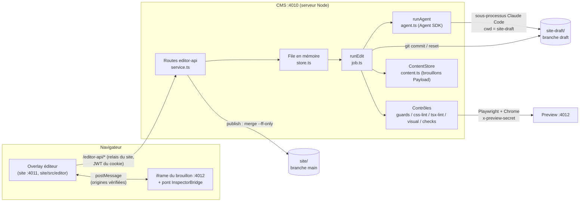
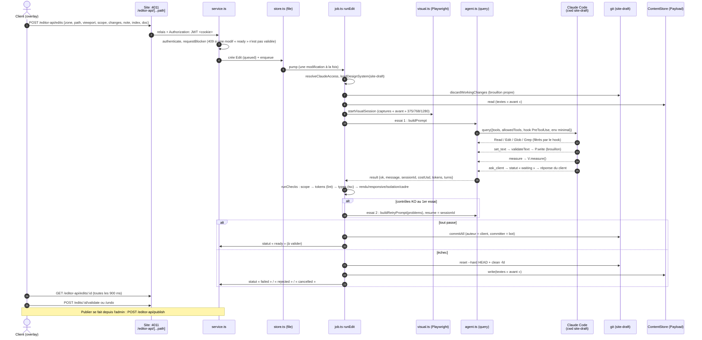
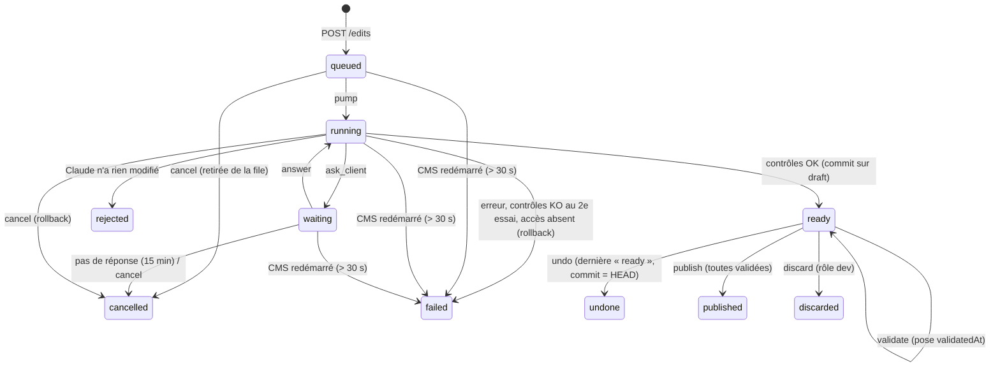
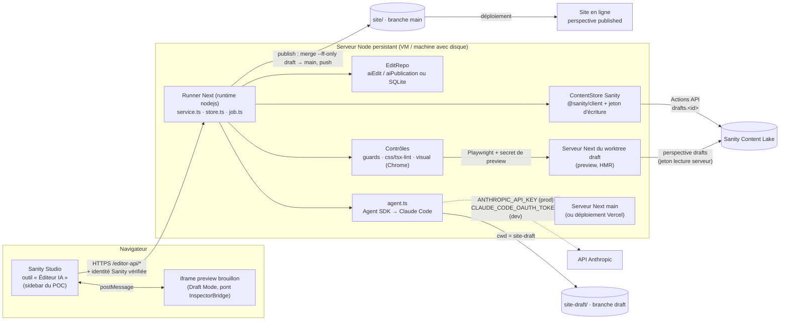

# 01 · Architecture de l’éditeur IA

> État au 2026-09-25, 21:05. POC : `payload-ai-editor-test`, branche `batterie-tests`, tête `888d165`. Site : `site/` sur `main@3a0af03`.
> Les chemins `cms/…` sont relatifs à `/Users/andreagauvreau/Tools/payloadjs-test/payload-ai-editor-test`. Les chemins `site main:…` se lisent avec `git -C site show main:<chemin>`.
> Pastilles : ✅ validé en passage réel · 🟡 approuvé, pas encore repassé · 🔧 en cours · 📋 prévu · 📚 documentation Sanity ou Anthropic (ou registre npm), non testée dans le POC · 💡 proposition du dossier, sans équivalent dans le POC.

## 1. Vue d’ensemble du POC

Trois processus Next.js tournent en local, tous sur `127.0.0.1`, et se lancent ensemble avec `npm run dev` à la racine (concurrently). ✅ Sources : `package.json` (racine), `README.md:9-34`, `scripts/setup.mjs:48-62`.

| Processus | Dossier | Port | Rôle |
|---|---|---|---|
| CMS + runner | `cms/` (Payload 3.90.1, Next 16.3.3) | 4010 | Admin Payload, textes en brouillon, **runner Claude** (Agent SDK), routes `/editor-api/*`, collections `edits` et `publications`. |
| Site publié | `site/` (dépôt git, branche `main`) | 4011 | Site en ligne ; bouton « Éditer le site » qui ouvre l’overlay de l’éditeur. |
| Brouillon | `site-draft/` (`git worktree` de `site/` sur la branche `draft`) | 4012 | Preview privée : le code modifié par Claude (rechargement à chaud) et les textes en brouillon. |

Utilisez `127.0.0.1` partout : le cookie de session `payload-token` est lié au nom d’hôte, pas au port. ✅ (`README.md`)



## 2. Cycle d’une demande

### 2.1 Schéma



Sources : `cms/src/editor/service.ts:225-264`, `cms/src/editor/job.ts:304-595`, `cms/src/editor/agent.ts:262-418`, `site main:src/app/editor-api/[...path]/route.ts`. ✅

### 2.2 Étapes de `runEdit` (`cms/src/editor/job.ts:304-595`) ✅

1. Statut `running`. L’accès à Claude est résolu (`resolveClaudeAccess`) et enregistré dans `Edit.access` (`api-key` ou `subscription`). Sans accès, l’échec (`failed`) arrive **avant** tout appel à Claude.
2. `loadDesignSystem(draftDir)` : relit `src/styles/tokens.json`, `src/editor/zones.json` et `src/editor/RULES.md` **dans site-draft** (`cms/src/editor/design-system.ts:45-57`).
3. Les changements non commités qui traînent dans le brouillon sont retirés (`discardWorkingChanges`).
4. Les textes CMS « avant » sont lus.
5. Playwright prend les captures « avant ». Si la preview ou Chrome ne répond pas, l’échec (`failed`) arrive avant l’appel à Claude (`job.ts:453-470`).
6. Au plus **2 essais** (`MAX_ATTEMPTS = 2`, `job.ts:68`) :
   - `runAgent` ;
   - si un arrêt est demandé → rollback, statut `cancelled` ;
   - si `!ok` → rollback, statut `failed` ;
   - si rien n’a changé → statut `rejected` ;
   - sinon, les textes proposés partent en brouillon CMS, puis `runChecks`.
7. Contrôles OK → `commitAll` (seulement si des fichiers ont changé), captures enregistrées, statut `ready`. Contrôles KO au 1er essai → 2e essai dans la **même session** (`resume`). KO au 2e essai → rollback, statut `failed` (« Rien n’a été changé »).
8. Toute exception → rollback et statut `failed` (« Erreur interne du runner »). Le bloc `finally` ferme le navigateur.

### 2.3 Ordre des contrôles (`runChecks`, `cms/src/editor/job.ts:195-302`)

| # | Contrôle | Ce qu’il vérifie | État |
|---|---|---|---|
| 1 | `scope` | Aucun fichier modifié hors `access.files` (`git status --porcelain=v1 -z --untracked-files=all`). | ✅ |
| 2 | `tokens` | `lintChanges` sur les **fichiers entiers** (HEAD contre copie de travail) : CSS avec postcss et liste blanche, TSX avec l’arbre TypeScript, tout autre type refusé. | 🟡 (le lint ligne à ligne de `main` était ✅ mais faillible) |
| 3 | `types` | `tsc --noEmit -p tsconfig.json` dans site-draft si un `.ts`/`.tsx` a changé (délai 120 s). | ✅ |
| 4 | `texts` | Trace seulement. | ✅ |
| 5 | Visuels | Seulement si tout passe déjà : attente de 1 200 ms (HMR), puis `render`, `responsive`, `isolation`, `placement` (signalé, sans refus). | ✅ rendu/responsive · 🟡 isolation enrichie |
| 6 | `frame` | Cadre du parent, zone réduite à rien, contenu hors page, décalage relatif (**bloquants**) ; texte recouvert = **avertissement non bloquant**, sans 2e essai (décision 17) ; relevé de toutes les occurrences d’une zone répétée, 12 au plus (décision 18). | 🔧 tâche 12 non approuvée à `888d165` ; essai 3 en cours (`wf_35953d2a-7a5`) avec les décisions 17 et 18 |
| — | Lignes gagnées, contraste | Pas encore branchés. | 📋 tâches 13 et 14 |

Le champ `problem` (consigne destinée à Claude) est retiré avant l’envoi au navigateur (`publicChecks`, `cms/src/editor/job.ts:302`). ✅

## 3. Rôles des modules

### 3.1 Runner (CMS) — `cms/src/editor/`

| Fichier | Rôle | Dépend de Payload ? | État |
|---|---|---|---|
| `config.ts` | Lit les variables d’environnement ; `resolveClaudeAccess`. | Non | ✅ |
| `agent.ts` | Appelle `query()` de l’Agent SDK : options, serveur MCP en mémoire `lyondrive` (`set_text`, `measure`, `ask_client`), hook `PreToolUse`, délai avec `pauseClock`, erreurs fatales, lecture du coût. | Non | ✅ (🟡 `AskResult`/`isError`, commit `1d66b35`) |
| `guards.ts` | `checkToolUse` (ce que Claude peut lire, chercher, éditer) et `lintChanges` (aiguillage CSS/TSX). | Non | ✅ hook · 🟡 lint |
| `css-policy.ts`, `css-lint.ts` | Liste blanche des propriétés et des valeurs, sélecteurs par zone, masquage, états. | Non | 🟡 (🔧 règles d’état) |
| `tsx-lint.ts` | Squelette TSX figé, `className` figées, texte seulement dans la zone. | Non | 🟡 |
| `visual.ts`, `measure.ts`, `contrast.ts`, `checks.ts` | Playwright : captures, relevé `READ_ZONE`, isolation, contraste, cadre. | Non | ✅ base · 🟡 mesure/contraste · 🔧 cadre |
| `prompt.ts` | `systemAppend(ds)`, `buildPrompt`, `buildRetryPrompt`. | **Oui, indirectement** : `fieldLabel` importé de `content.ts` (`prompt.ts:1`), qui importe `payload`. Déplacer `fieldLabel` dans un module neutre. Mots « CMS », « LyonDrive » à adapter. | ✅ / 🟡 |
| `questions.ts` | `questionProblems`, `prepareQuestions`, `parseAnswers`, `describeAnswers`. | Non | 🟡 |
| `review.ts` | `requestBlocker`, `publishBlocker`, `awaitsValidation`. | **Types seulement** : `Edit` de `../payload-types` (`review.ts:1`). Remplacer par un type local `{ status, validatedAt, zone, zoneLabel }`. | ✅ |
| `store.ts` | File en mémoire sur `globalThis.__lyondriveEditor` (jobs, queue, running, locked). | Non | ✅ |
| `git.ts` | `changedFiles`, `fileVersions`, `workingDiff`, `commitAll`, `discardWorkingChanges`. | Non | ✅ (🟡 `fileVersions`) |
| `job.ts` | `runEdit` : le cycle complet ; `validateText` ; `toolAccessFor`. | Oui (`payload.update` sur `edits`) | ✅ |
| `service.ts` | `requestEdit`, `answerEdit`, `cancelEdit`, `validateEdit`, `undoEdit`, `publishDraft`, `discardDraft`, `draftState`, `recoverInterrupted`. | Oui | ✅ |
| `content.ts` | `ContentStore` Payload (`read`, `context`, `write`, `publish`, `restorePublished`). | **Oui : à réécrire** | ✅ |
| `design-system.ts` | `loadDesignSystem`, `parseEditRequest`, `resolveTextTarget` (id numérique). | En partie (cibles `globals/home`, `posts/{doc}`) | ✅ / 🟡 |
| `http.ts` | `authenticate` (`payload.auth` + rôle), `route()`, `parseId` (entier). | **Oui : à réécrire** | ✅ |

Routes Next (`cms/src/app/(editor)/editor-api/**/route.ts`) : `GET state`, `POST edits`, `GET edits/[id]`, `POST edits/[id]/{cancel,answer,validate,undo}`, `GET edits/[id]/shots/[file]`, `POST publish`, `POST discard` (rôle `dev`). ✅

### 3.2 Site — `site main:src/…`

| Fichier | Rôle | État |
|---|---|---|
| `src/editor/zones.json` | Déclaration des zones modifiables (fichiers, sélecteurs, réglages, source du texte). | ✅ (🟡 champs de la tâche 7) |
| `src/styles/tokens.json`, `tokens.ts` | Design system, seule source des variables `--groupe-nom`. | ✅ |
| `src/editor/RULES.md` | Règles données à Claude (ancienne version sur `main`). | ✅ ancienne · 📋 tâche 22 |
| `src/editor/Editor.tsx`, `Canvas.tsx`, `sidebar/*`, `ReviewBar.tsx`, `EditorLauncher.tsx` | Interface de l’éditeur. | ✅ commitée · 🔧 refonte non commitée |
| `src/editor/bridge/*`, `protocol.ts` | Pont dans l’iframe du brouillon (survol, sélection, aperçu, `router.refresh()`). | ✅ |
| `src/editor/session.ts` | `getEditorUser` (cookie Payload), `canViewDraft`. | ✅ (à remplacer pour Sanity) |
| `src/app/editor-api/[...path]/route.ts` | Relais vers le CMS. | ✅ |
| `src/lib/cms.ts` | Lecture du CMS (`?draft=true` + `x-preview-secret` en mode brouillon). | ✅ (à remplacer pour Sanity) |
| `src/lib/accent.tsx` | `withAccent` : `*mots*` → `<em className={styles.accent}>` (classe hachée du CSS Module, passée en 2e argument). | ✅ |

## 4. Données échangées

### 4.1 Demande du client → CMS ✅

`POST /editor-api/edits` reçoit `{ zone, path, viewport, scope[], changes (si 🖌), note, index, doc }` (`site main:src/editor/api.ts:93-104`). `parseEditRequest` la transforme en (`cms/src/editor/design-system.ts:81-91`) :

```ts
export type EditRequest = {
  zone: string
  path: string
  viewport: number
  scope: Scope
  changes: ResolvedChange[]
  note: string
  /** Rang de l'instance sélectionnée (cartes répétées). */
  index: number
  /** Texte stocké dans Payload : où l'écrire. */
  textTarget: TextTarget | null
  // …
}

export type TextTarget = {
  kind: 'global' | 'collection'
  slug: string
  id: number | null
  /** `accent` : le champ accepte des mots mis en avant (*…*). */
  fields: { path: string; max: number; accent?: true }[]
}
```

Validations : zone connue, `path` qui commence par `/` (200 caractères au plus), `index` dans [0, 100), `viewport` dans [320, 2560] (sinon 1280), note de 600 caractères au plus ; T exige une zone avec `text` ; des réglages exigent 🖌 ; T seul exige une précision (`cms/src/editor/design-system.ts:150-206`).

### 4.2 Runner → Claude ✅

- **Prompt système** : le preset `claude_code` + `append: systemAppend(ds)`, c’est-à-dire 4 lignes fixes suivies de `RULES.md` (`cms/src/editor/prompt.ts:5-14`).
- **Message** : `buildPrompt(ds, request, texts)`, puis `buildRetryPrompt(problems)` au 2e essai (`cms/src/editor/prompt.ts:133-171`).
- **Outils MCP** (`cms/src/editor/agent.ts:169-258`) : `set_text { field, value }`, `measure {}` et `ask_client { questions }`. Les schémas sont dans `02-installation-claude.md` § 3.

### 4.3 Claude → runner ✅

`AgentResult` (`cms/src/editor/agent.ts:70-84`) :

```ts
export type AgentResult = {
  ok: boolean
  /** Dernier message de Claude, destiné au client. */
  message: string
  sessionId: string | null
  /** Coût estimé et jetons de la session : une session reprise (2e essai) rapporte le cumul depuis son début. */
  costUsd: number
  tokens: Tokens
  /** Allers-retours avec le modèle pendant cet appel. */
  turns: number
  error: string | null
}
```

### 4.4 Enregistrement d’une modification (collection `edits`) ✅

Champs (`cms/src/collections/Edits.ts:18-115`) : `summary`, `status`, `validatedAt`, `zone`, `zoneLabel`, `path`, `viewport`, `instance`, `scope`, `changes`, `question`, `dialog`, `hardcoded`, `note`, `textTarget`, `texts` (avant/après), `author`, `commit`, `files`, `diff`, `checks`, `shots`, `claudeMessage`, `steps` (journal), `sessionId`, `access`, `costUsd`, `tokens` `{ input, output, cacheRead, cacheWrite, turns }`, `durationMs`, `error`, `publication`. Seul le runner écrit (create/update : `nobody`).

Collection `publications` : `title`, `number`, `publishedBy`, `commit`, `edits`, `summary` (`cms/src/collections/Publications.ts`). ✅

### 4.5 Questions et réponses ✅ / 🟡

- Claude appelle `ask_client`. `questionProblems` peut refuser la question **sans rien montrer au client** (🟡, `cms/src/editor/questions.ts:41-78`). Sinon, `prepareQuestions` attribue les identifiants (`q1`, `q1o1`…), la modification passe à `waiting` et la question est enregistrée dans `Edit.question`.
- Le client répond : `POST /edits/:id/answer` avec `{ questionsId, answers: [{ questionId, optionId? | other? }] }` (`parseAnswers`).
- Claude reçoit `describeAnswers`. La valeur 🔴 choisie devient la **seule** exemption accordée (`Edit.hardcoded`).
- Le temps d’attente (15 min au plus) ne compte pas dans le délai de Claude (`pauseClock`, `cms/src/editor/agent.ts:266-284`).

## 5. États d’une modification



Sources : `cms/src/collections/Edits.ts:5-16`, `cms/src/editor/service.ts:166-399`, `cms/src/editor/review.ts:10-28`. ✅

Règles de passage :

- **Une seule modification tourne à la fois** (`store.ts`). Une nouvelle demande est refusée (409) si une publication tient le verrou, si le runner est occupé ou si une modification `ready` n’est pas validée (`service.ts:225-231`, `review.ts:15-18`). ✅
- **Annuler** : seulement la dernière `ready`, et seulement si son commit est encore le HEAD du brouillon. Les textes ne sont restaurés que s’ils valent encore la valeur « après » (sinon 409). Ensuite `git reset --hard HEAD~1` (`service.ts:296-324`). ✅
- **Publier** (sous verrou) : toutes les `ready` doivent être validées, `site/` doit être propre et `tsc` du brouillon vert. Puis `git merge --ff-only draft` dans `site/`, publication Payload des documents touchés, `git tag --force publication-N`, document `publications`, et les modifications passent à `published` (`service.ts:326-386`). ✅ La publication **n’est pas atomique** entre git et le CMS.
- **Redémarrage** : à chaque `GET /state`, `recoverInterrupted` passe en `failed` les modifications `queued`, `running` ou `waiting` absentes de la mémoire depuis plus de 30 s (`service.ts:166-189`). ✅

## 6. Sécurité par construction

La leçon du passage de référence : **une consigne ne garantit rien, seul un contrôle déterministe le fait** (L05 et R09 sont passés malgré RULES.md). Les couches suivantes s’empilent.

| Couche | Mécanisme | Source | État |
|---|---|---|---|
| Identifiant Claude | Clé API prioritaire ; jeton d’abonnement seulement en dev ; un `sk-ant-oat…` dans `ANTHROPIC_API_KEY` est refusé. | `cms/src/editor/config.ts:37-72` | ✅ |
| Isolation du sous-processus | `env` **remplace** `process.env` : seuls `PATH`, `HOME`, **un** identifiant, `CLAUDE_CONFIG_DIR`, `CLAUDE_AGENT_SDK_CLIENT_APP` et `MCP_TOOL_TIMEOUT` passent. Aucun secret du serveur n’atteint Claude. | `cms/src/editor/agent.ts:323-334` | ✅ |
| Isolation de la configuration | `settingSources: []`, `strictMcpConfig: true` : ni CLAUDE.md, ni réglages, ni plugins, ni serveurs MCP de la machine. | `cms/src/editor/agent.ts:314-316` | ✅ |
| Outils | `tools = ['Read','Edit','Glob','Grep']` + 3 outils MCP ; `permissionMode: 'dontAsk'` (tout le reste est refusé). Pas de Bash, pas de Write, pas de Web. | `cms/src/editor/agent.ts:99, 301-313` | ✅ |
| Hook `PreToolUse` | Lecture sous `src/` (+ 3 fichiers racine), jamais `node_modules`, `.git`, `.next`, `.env*` ; Glob/Grep sous `src` ; Edit seulement sur `access.files` ; `set_text` seulement si la demande vise un texte CMS. | `cms/src/editor/guards.ts:27-86` | ✅ |
| Périmètre des fichiers | 🖌 seul → `.css` de la zone ; T → `.tsx` seulement si le texte est dans le code. | `cms/src/editor/job.ts:97-105` | 🟡 |
| Texte CMS | `validateText` : champ autorisé, longueur sans astérisques, pas de `<` ni `>`, mise en avant encadrée. | `cms/src/editor/job.ts:107-152` | ✅ |
| Questions | Option 🔴 seule à porter une valeur en dur ; jamais de police, `url()`, `@import`, négatif, `calc()`, propriété non exemptable. | `cms/src/editor/questions.ts` | 🟡 |
| Contrôle du résultat | Périmètre git, liste blanche CSS sur le fichier entier, arbre TSX figé, `tsc`, rendu, isolation, cadre. | `cms/src/editor/job.ts:195-302` | ✅ / 🟡 / 🔧 |
| Retour arrière | Tout échec : `git reset --hard HEAD` + `git clean -fd` + textes d’avant réécrits. | `cms/src/editor/job.ts:338-346`, `git.ts` | ✅ |
| Revue humaine | Toute modification réussie passe « à valider » ; rien n’est en ligne sans publication explicite. | `cms/src/editor/review.ts` | ✅ |
| Droits | Le CMS reste seul juge (`authenticate` + rôles `dev`/`client`) ; le relais du site ne fait que transmettre. | `cms/src/editor/http.ts:16-21` | ✅ |
| Budget | `maxTurns` 24, `maxBudgetUsd` 1,5 **par appel** de `query()`, délai 300 s. | `cms/src/editor/config.ts` | ✅ |

Points faibles connus :

- La garde du brouillon est placée seulement dans le layout du site (`canViewDraft` dans `layout.tsx`). À vérifier au scan de sécurité : 📋. Pour Sanity, placez-la dans `proxy.ts`/middleware ou dans chaque lecture.
- La route `publish` n’a pas de contrôle de rôle : un client peut publier. ✅ (constat)
- Le contraste et les lignes gagnées ne sont pas encore contrôlés. 📋

## 7. La même architecture dans Sanity

### 7.1 Ce qui change, ce qui reste

| Pièce du POC | Dans le projet Sanity | Remarque |
|---|---|---|
| `site/` (main) + `site-draft/` (worktree `draft`) | **Identique** : dépôt git du front Next, worktree `draft` servi par un 2e serveur Next en preview privée. | Publier = `merge --ff-only`, puis le push de `main` déclenche le déploiement. |
| `agent.ts`, `config.ts`, `guards.ts`, lints, `visual.ts`, `measure.ts`, `contrast.ts`, `checks.ts`, `prompt.ts`, `questions.ts`, `review.ts`, `store.ts`, `git.ts` | **Copiés** depuis `batterie-tests`, en notant la tête copiée. | Remplacez « Payload » par « Sanity » dans les textes de `prompt.ts`/RULES.md. Deux adaptations obligatoires : `review.ts` (type `Edit` de payload-types → type local) et `prompt.ts` (`fieldLabel` sorti de `content.ts`). |
| `content.ts` (brouillons Payload) | **Réécrit** : `ContentStore` Sanity sur `drafts.<id>` (Actions API `sanity.action.document.edit`, `…publish` avec `ifDraftRevisionId`, `…version.discard`). 📚 | Même interface ; à vérifier dans la doc Sanity de l’`apiVersion` retenue. |
| Collections `edits`, `publications` | Documents Sanity `aiEdit`, `aiPublication` (lecture seule dans le Studio, écrits par le runner) **ou** SQLite du runner. | Isoler derrière une interface de dépôt (`EditRepo`). |
| `http.ts` (`payload.auth`, `parseId` entier) | Authentification propre : jeton de l’utilisateur Sanity vérifié côté serveur, ou compte éditeur à cookie HttpOnly. Identifiants en chaîne (`_id`). | Point à concevoir : pas de transposition directe. |
| `design-system.ts` (`globals/home`, `posts/{doc}`) | Cibles `{ type, id }` Sanity ; chemins par `_key` pour les tableaux. | `data-edit-doc` porte l’`_id` publié (`stegaClean`). |
| `site/src/lib/cms.ts` | `next-sanity` : perspective `published` en ligne, `drafts` en preview (jeton de lecture serveur). 📚 | |
| `session.ts`, `canViewDraft` | Draft Mode Next + secret serveur pour Playwright ; garde dans `proxy.ts`. | |
| Tableau de bord Payload (`Dashboard.tsx`, `DraftActions.tsx`) | Outil personnalisé du Studio « Éditeur IA ». 📚 | |
| `EDITOR_AUTOLOGIN` | Supprimé (jamais hors local). | |

### 7.2 Schéma cible



### 7.3 Contraintes qui ne bougent pas

- **Le runner est un processus Node long** : jusqu’à 5 min de travail, plus 15 min d’attente d’une réponse. Il a besoin d’un dépôt git sur disque, du binaire natif Claude Code et de Chrome. Il ne peut tourner **ni dans le Studio** (navigateur), **ni dans une Sanity Function** (900 s au plus, pas de worktree persistant, 📚), **ni en serverless**.
- **Une seule instance** : file, verrou et réponses attendues vivent en mémoire (`globalThis`). Pas de répartiteur de charge devant plusieurs instances.
- **Aucun secret dans le navigateur** : jeton d’écriture Sanity, clé Anthropic et secret de preview restent côté runner. Le jeton Sanity n’est **jamais** transmis à Claude (l’`env` minimal de `agent.ts` le garantit si vous ne faites jamais `...process.env`).
- **Les zones se déclarent dans le code du front** (`data-edit`, `zones.json`, CSS Modules, `tokens.json`) : c’est ce que lisent les contrôles. Les attributs `data-sanity`/stega de Visual Editing désignent des champs de contenu et coexistent avec `data-edit`. 📚
