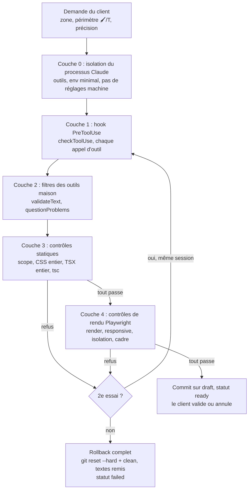

# 03 — Garde-fous et contrôles automatiques

> État relevé le 2026-09-25 vers 21:05. Dépôt du POC : `/Users/andreagauvreau/Tools/payloadjs-test/payload-ai-editor-test`, branche `batterie-tests`, tête `888d165`. `main` du POC = `9c58ce2` (état validé en passage réel). Site : `site/` main = `3a0af03`.
> **Mise à jour 21:35 :** la tâche 12 n'est **pas approuvée** à `888d165` ; un essai 3 est en cours (`wf_35953d2a-7a5`) avec les décisions 17 et 18 (§4). Journal : `.superpowers/sdd/progress.md` (21:21).
> Chemins relatifs à la racine du POC. Le code de `site/` est cité dans sa version commitée (`git -C site show main:<chemin>`) : une refonte de l'interface est en cours, non commitée, dans `site/src/editor`.

Légende des états :

| Marque | Sens |
|---|---|
| ✅ | validé en passage réel (Claude réel, runs/1-reference ou parcours du 2026-09-24) |
| 🟡 | approuvé par relecture et tests, **pas encore repassé** avec Claude réel |
| 🔧 | en cours (tâche 12 non approuvée à `888d165`, essai 3 en cours avec les décisions 17 et 18) |
| 📋 | prévu dans le plan, non codé |
| 📚 | documentation Sanity ou Anthropic, non testée dans le POC |
| 💡 | proposition du dossier, sans équivalent dans le POC |

**Principe à retenir.** Le passage de référence l'a montré : les consignes données à Claude ne suffisent pas. L'ancien contrôle, qui lisait le diff ligne à ligne avec une liste d'interdits, a laissé passer un `@import` de Google Fonts (cas L05) et une marge négative (R09). La sûreté ne tient que par des **contrôles déterministes côté serveur** : analyse du fichier entier, liste blanche de valeurs et de sélecteurs, puis mesure du rendu réel. Source : `.superpowers/sdd/progress.md` (constat L05, 01:04), `scripts/bench/runs/1-reference/analyse.json` (`revised.causes[0..1]`).

---

## 1. Vue d'ensemble : 4 couches



Sources : `cms/src/editor/agent.ts:287-335`, `cms/src/editor/guards.ts:35-115`, `cms/src/editor/job.ts:195-302, 489-586`, `cms/src/editor/visual.ts`, `cms/src/editor/checks.ts`.

Tous les modules sont en TypeScript pur, côté serveur, dans `cms/src/editor/`. Les modules sans entrée-sortie (`css-policy.ts`, `css-lint.ts`, `tsx-lint.ts`, `contrast.ts`, `measure.ts`, `checks.ts`, `questions.ts`, `guards.ts`) ne dépendent que de `postcss` 8.5.23, de `typescript` 5.7.3 (en `dependencies`, car importé à l'exécution) et des types `ZoneDef`, `Scope`, `TokenGroup`.

---

## 2. Tableau récapitulatif

| # | Garde-fou | Règle exacte (résumé) | Pourquoi | État | Module à reprendre |
|---|---|---|---|---|---|
| 0.1 | Outils intégrés limités | `tools = ['Read','Edit','Glob','Grep']` + 3 outils MCP, `permissionMode: 'dontAsk'` | Pas de Bash, pas d'écriture libre, pas de réseau | ✅ | `cms/src/editor/agent.ts:99, 301-335` |
| 0.2 | Aucun réglage de la machine | `settingSources: []`, `strictMcpConfig: true` | Ni CLAUDE.md, ni plugins, ni serveurs MCP de la machine ne fuient dans l'agent | ✅ | `agent.ts:301-335` |
| 0.3 | Environnement minimal | `env` = PATH, HOME, **un seul** identifiant Claude, `CLAUDE_CONFIG_DIR`, `CLAUDE_AGENT_SDK_CLIENT_APP`, `MCP_TOOL_TIMEOUT` | L'option `env` du SDK **remplace** `process.env` : aucun secret du serveur (jeton CMS…) n'arrive chez Claude | ✅ | `agent.ts:323-334` |
| 0.4 | Accès à Claude | `ANTHROPIC_API_KEY` prioritaire ; valeur `sk-ant-oat…` dans cette variable refusée ; `CLAUDE_CODE_OAUTH_TOKEN` seulement si `NODE_ENV=development` | Un produit pour des tiers ne doit pas tourner sur un abonnement claude.ai | ✅ | `cms/src/editor/config.ts:37-72` |
| 1.1 | Hook PreToolUse | Read sous `src/` (+ `package.json`, `tsconfig.json`, `next.config.ts`), jamais `node_modules`, `.git`, `.next`, `.env*` ; Glob/Grep avec `path` sous `src`, motif sans `..` ni `/` initial ; Edit seulement `access.files` ; set_text seulement si `textTool` ; tout autre outil refusé | Empêcher la lecture de secrets et l'écriture hors périmètre | ✅ | `cms/src/editor/guards.ts:35-86` |
| 1.2 | Périmètre de fichiers | 🖌 seul : `.css` de la zone ; T : en plus les fichiers de texte de la zone si `text.source === 'code'` | 🖌 seul n'ouvre plus aucun `.tsx` (commit `2e591fd`) | 🟡 | `cms/src/editor/job.ts:97-105` |
| 2.1 | `validateText` (texte CMS) | champ permis, non vide, longueur ≤ max **sans astérisques**, pas de `<` `>`, `*` seulement en champ accent, ≤ 2 groupes, mots inchangés sans T, pas de nouvelle mise en avant sans 🖌 | La validation de schéma du CMS ne protège pas une écriture par API | ✅ | `job.ts:107-152` |
| 2.2 | `questionProblems` (questions 🔴) | refuse, sans rien montrer au client : `hardcoded` hors option discouraged, `font-family`, valeur > 200 car., ressource externe, propriété non exemptable, négatif ou fonction | Cas L05 : Claude avait proposé une police Google puis injecté `@import` | 🟡 | `cms/src/editor/questions.ts:37-94` |
| 3.1 | Scope git | aucun fichier modifié hors `access.files` (`git status --porcelain=v1 -z --untracked-files=all`) | Filet sous le hook | ✅ | `job.ts:208-300`, `cms/src/editor/git.ts` |
| 3.2 | Lint CSS du fichier entier | postcss, liste blanche propriété par propriété, sélecteurs permis par zone | Cas L05, R09 et les sondes de la synthèse | 🟡 | `cms/src/editor/css-policy.ts`, `cms/src/editor/css-lint.ts` |
| 3.3 | Lint TSX du fichier entier | arbre TypeScript, squelette figé, aucune `className` ne change, texte seulement dans la zone | Sondes : `process.env.PREVIEW_SECRET` dans un `<span>`, `<script src>`, `dangerouslySetInnerHTML`… | 🟡 | `cms/src/editor/tsx-lint.ts` |
| 3.4 | Typecheck | `tsc --noEmit -p tsconfig.json` dans site-draft si un `.ts`/`.tsx` a changé (120 s, 12 lignes) | Ne jamais committer un brouillon qui ne compile pas | ✅ | `job.ts:195-302` |
| 4.1 | Rendu | HTTP ≥ 400, `pageerror`, panneau d'erreur Next dans `nextjs-portal` | Page cassée | ✅ | `cms/src/editor/visual.ts:619-708` |
| 4.2 | Responsive | `scrollWidth - innerWidth > 1` et plus qu'avant | Débordement horizontal | ✅ | `visual.ts` |
| 4.3 | Isolation | les autres zones ne bougent pas (taille, 42 styles calculés, pixels) ; zones enfants : placement seulement ; ancêtres : aucun style | Cas L05 : `.title`, `.subtitle`, `.cta` touchées depuis `hero` | 🟡 | `visual.ts:52-170, 644-689` |
| 4.4 | Cadre du parent (`frameCheck`) | **bloquants** : zone réduite à rien, sortie du parent, marge négative calculée, contenu hors page, décalage relatif. **Non bloquant** (décision 17) : texte recouvert = avertissement visible dans l'activité et phrase obligatoire dans le message final, sans échec ni 2e essai. Toutes les occurrences d'une zone répétée, 12 au plus (décision 18) | Cas R09 | 🔧 | `cms/src/editor/checks.ts:24-179`, `measure.ts:203-242`, `visual.ts` |
| 4.5 | Lignes gagnées à 375 px | refus sauf accord client (`effect: 'texte-plus-long'`) | Cas T08 (échec silencieux) | 📋 tâche 13 | — |
| 4.6 | Contraste avant/après | refus si le ratio passe sous le seuil ou baisse sous le seuil ; états forcés `:hover`/`:focus-visible` | Cas C02 (échec silencieux) | 📋 tâche 14 (calcul 🟡 dans `contrast.ts`, seulement affiché) | `cms/src/editor/contrast.ts` |
| 5 | 2e essai puis rollback | `MAX_ATTEMPTS = 2`, reprise de la même session ; échec → `git reset --hard HEAD` + `git clean -fd`, textes remis | Aucun état intermédiaire ne reste dans le brouillon | ✅ | `job.ts:68, 338-346, 489-586` |
| 6 | Validation obligatoire | une modification `ready` non validée bloque toute nouvelle demande et la publication (409) | Le client voit chaque changement avant le suivant | ✅ | `cms/src/editor/review.ts:10-28` |
| 7 | Délais et budget | `EDITOR_TIMEOUT_MS=300000`, `EDITOR_MAX_TURNS=24`, `EDITOR_MAX_BUDGET_USD=1.5` par appel de `query()`, erreurs d'API fatales arrêtées tout de suite | Ne pas laisser tourner un agent bloqué | ✅ | `config.ts:12-35`, `agent.ts:103-139, 266-284, 356-418` |

---

## 3. Détail par couche

### 3.0 Isolation du processus Claude ✅

Options passées à `query()` (`cms/src/editor/agent.ts:301-335`) :

- `cwd` = site-draft ; `model` = `EDITOR_MODEL` (défaut `claude-opus-5-5`) ; `effort` = `medium` ; `maxTurns` 24 ; `maxBudgetUsd` 1,5 ;
- `tools: ['Read','Edit','Glob','Grep']` ; `allowedTools` = ces 4 outils + `mcp__lyondrive__set_text`, `mcp__lyondrive__measure`, `mcp__lyondrive__ask_client` (chacun seulement s'il est fourni) ;
- `permissionMode: 'dontAsk'` : tout ce qui n'est pas pré-autorisé est refusé ;
- `settingSources: []`, `strictMcpConfig: true` ;
- `systemPrompt: { type: 'preset', preset: 'claude_code', append: systemAppend(ds) }` ;
- `hooks.PreToolUse` = garde (`checkToolUse`) ; `abortController` ; `resume` = `sessionId` du 1er essai.

Environnement du sous-processus (`agent.ts:323-334`) : `PATH`, `HOME`, **un seul** identifiant selon `access.kind` (`ANTHROPIC_API_KEY` ou `CLAUDE_CODE_OAUTH_TOKEN`), `CLAUDE_CONFIG_DIR=cms/.editor/claude`, `CLAUDE_AGENT_SDK_CLIENT_APP='lyondrive-visual-editor/0.1'`, `MCP_TOOL_TIMEOUT = questionTimeoutMs + 60000`.

> ⚠️ Ne jamais écrire `env: { ...process.env }` : le jeton d'écriture Sanity arriverait chez Claude. Documentation du SDK : l'option `env` remplace `process.env` (`cms/node_modules/@anthropic-ai/claude-agent-sdk/sdk.d.ts:1578-1600`).

Accès (`cms/src/editor/config.ts:37-72`), dans l'ordre :

1. `ANTHROPIC_API_KEY` qui commence par `sk-ant-oat` → refus, avec un message qui demande de la mettre dans `CLAUDE_CODE_OAUTH_TOKEN` ;
2. clé API présente → `{ kind: 'api-key' }` (prioritaire) ;
3. jeton OAuth seul → `{ kind: 'subscription' }` si `NODE_ENV === 'development'`, sinon erreur « réservé aux tests locaux sous npm run dev » ;
4. rien → erreur qui explique les deux options. La tentative échoue avant tout appel à Claude.

Erreurs fatales, arrêtées sans attendre le délai (`agent.ts:103-139, 356-418`) : `authentication_failed`, `billing_error`, `model_not_found`, `account_on_hold`, `oauth_org_not_allowed`, `verification_required`, `invalid_request`, `cloud_credential_error`, et `rate_limit` seulement en abonnement. Les autres (`overloaded`, `server_error`, `rate_limit` avec une clé API) sont réessayées par le SDK et journalisées.

### 3.1 Hook PreToolUse (`checkToolUse`) ✅

Source : `cms/src/editor/guards.ts:27-86`, branché dans `agent.ts:287-299`. Un refus devient `permissionDecision: 'deny'` avec sa raison, et une étape `warn` dans le journal.

| Outil | Permis si |
|---|---|
| `Read` | chemin sous `src/`, ou `package.json`, `tsconfig.json`, `next.config.ts` à la racine ; aucun segment `node_modules`, `.git`, `.next`, ni commençant par `.env` |
| `Glob`, `Grep` | `path` obligatoire et sous `src` ; motif sans `..` ni `/` initial |
| `Edit` | fichier dans `access.files` (chemin relatif au dépôt) |
| `mcp__lyondrive__set_text` | `access.textTool` |
| `mcp__lyondrive__measure`, `mcp__lyondrive__ask_client` | toujours |
| tout autre | refus : « Outil non autorisé dans l'éditeur visuel » |

Constantes des noms complets : `guards.ts:18-22` (`TEXT_TOOL`, `MEASURE_TOOL`, `ASK_TOOL`). Si le serveur MCP est renommé, ces constantes et `allowedTools` doivent suivre.

### 3.2 Périmètre de fichiers 🟡

`toolAccessFor` (`cms/src/editor/job.ts:97-105`) :

- 🖌 Style : seulement les `.css` de `zone.files` ;
- T Texte : en plus `zone.text.files` quand `zone.text.source === 'code'` ;
- `textTool` = `request.textTarget !== null`.

Depuis `2e591fd` (tâche 6), 🖌 seul n'ouvre aucun `.tsx`. Le style passe uniquement par le CSS Module de la zone.

### 3.3 Filtres des outils maison

**`validateText`** ✅ (`job.ts:107-152`), dans l'ordre : champ hors liste ; blancs réduits et trim ; vide ; longueur **sans les astérisques** > `max` (« Trop long : X caractères pour N au maximum. Raccourcis. ») ; `<` ou `>` ; `*` hors champ accent ; astérisques non appariés ; plus de `MAX_ACCENTS = 2` groupes ; sans T, texte sans astérisques différent de l'avant ; sans 🖌, groupe `*…*` nouveau. Un texte accepté est écrit **aussitôt** en brouillon CMS (`content.write`), pour que `measure` et les contrôles le voient.

**`questionProblems`** 🟡 (`cms/src/editor/questions.ts:37-94`, commit `1d66b35`, tâche 4). L'erreur revient à Claude (`isError: true`, « Reformule ta question »), le client ne voit rien. Refus de :

- `hardcoded` sur une option qui n'est pas `discouraged` ;
- propriété `font-family` ;
- valeur de plus de `MAX_VALUE_LENGTH = 200` caractères (testé avant toute regex, contre le ReDoS) ;
- ressource externe (`url(`, `image(`, `image-set(`, `src(`, `element(`, `http`, `//`, `javascript:`, `@import`, barre oblique inverse) ;
- propriété non exemptable ou absente de la table ;
- nombre négatif ou fonction autre que `rgb`/`rgba`/`hsl`/`hsla`/`var` ;
- ressource externe dans un libellé ou une description (`TEXT_EXTERNAL_RESOURCE` : une fonction précédée d'une lettre, d'un chiffre, d'un tiret ou d'une apostrophe n'est pas vue comme une ressource, pour « l'image(s) », décision 11).

`prepareQuestions` retire aussi `hardcoded` de toute option non `discouraged`.

### 3.4 Contrôles statiques : `runChecks` 🟡

Ordre (`cms/src/editor/job.ts:195-302`) :

1. `scope` : aucun fichier hors `access.files` ;
2. `tokens` : `lintChanges` sur les **fichiers entiers** (`git show HEAD:<fichier>` contre la copie de travail, via `fileVersions`, `cms/src/editor/git.ts:34-46`) ;
3. `types` : `tsc` si un `.ts`/`.tsx` a changé ;
4. `texts` : trace seulement ;
5. contrôles visuels, **seulement si tout passe déjà** : attente HMR 1 200 ms, `visual.verify()` → `render`, `responsive`, `isolation`, `placement` (signalé, sans refus), puis `frameCheck`.

Le champ `problem` (consigne destinée à Claude) est retiré avant l'envoi au navigateur (`publicChecks`, `cms/src/editor/job.ts:302`). Le diff textuel ne sert plus qu'à l'affichage.

Aiguillage de `lintChanges` (`cms/src/editor/guards.ts:101-115`) : `.css` → `checkCssFiles` ; `.tsx`/`.ts`/`.jsx`/`.js` → `lintTsxFiles(…, tsxZone(zone))` ; autre type → violation `file-type`. Il renvoie aussi `granted`, les valeurs en dur accordées qui ont réellement servi.

#### 3.4.1 Liste blanche CSS (`css-policy.ts`) 🟡

Table `RULES` (`cms/src/editor/css-policy.ts:290-496`). Un token s'écrit `var(--groupe-nom)`. La comparaison porte sur la **valeur entière normalisée**, jamais sur une sous-chaîne.

| Famille | Valeurs permises |
|---|---|
| Couleurs (`color`, `background-color`, `border-color` et côtés, `outline-color`, `text-decoration-color`) | token color, `transparent`, `inherit`, `currentColor` |
| `background` | token color, `transparent` ; `background-image` = `none` |
| Typo | `font-family`/`font-size`/`font-weight` = token ou `inherit` ; `font-style` normal/italic ; `line-height` normal ou nombre sans unité de 0.9 à 2.5 ; `text-transform`, `text-wrap` (wrap/balance/pretty), `text-align`, `text-decoration(-line)` none/underline |
| Espacements | `padding`/`margin` 1 à 4 valeurs parmi token space, `var(--layout-section)`, `var(--layout-gutter)`, `0` (+ `auto` pour margin) ; `gap` 1-2 ; `row-gap`/`column-gap` 1 |
| Bords | `border-radius` token radius ou 0 ; `border`/`outline` = none, 0, ou exactement `1px solid <couleur>` ; `border-width` 0/1px ; `border-style` solid/none ; `outline-offset` token space ou 0 ; `box-shadow` token shadow ou none |
| Mouvement | `transition` none ou liste « propriété durée [courbe] » (propriétés de peinture et `transform`, 1 ms à 1 s, 5 courbes) ; `transform` none ou LIFT |
| Mise en page | `display` block/inline-block/inline/flex/inline-flex/grid/none ; flex et alignements (13 mots-clés) ; `flex` none/auto/1/`0 0 auto`/`1 1 0` ; `order` -9 à 9 ; `grid-template-columns` none, `repeat(1–6, 1fr|minmax(0, 1fr))`, 1 à 6 fractions ; `grid-column/row` `span 1–6` ou `1 / -1` |
| Tailles | `width` auto/100%/fit-content ; `max-width` none/100%/`var(--layout-container)`/`var(--layout-measure)` ; `min-width` 0/auto ; `height` auto |
| Divers | `opacity` = 1 seulement ; `position` static/relative ; `top/right/bottom/left/inset` = 0 ou auto |

Toute autre propriété → règle `property` ; une propriété personnalisée `--x` → `custom-property`.

**LIFT** (soulèvement au survol) : exactement `translateY(calc(var(--space-1) * -1))` ou `translateY(calc(var(--space-2) * -1))`, seulement si le **sujet** du sélecteur porte `:hover` ou `:focus-visible` (sinon `hover-only`). Jamais accepté comme valeur en dur. Source : `css-policy.ts:222, 442-445, 547-549`.

Ordre de `checkValue` (`css-policy.ts:502-559`), qui compte pour la sûreté :

1. caractère non ASCII dans le nom, **avant** `toLowerCase` (piège KELVIN SIGN U+212A qui devient `k`) → `property` ;
2. `--x` → `custom-property` ;
3. longueur normalisée > 200 → `value`, **avant toute regex** (anti-ReDoS) ;
4. caractère non ASCII dans la valeur → `value` ;
5. `EXTERNAL_RESOURCE` → `external` ;
6. propriété hors table (`Object.hasOwn`) → `property` ;
7. `var(--nom)` inconnu, y compris avec repli → `unknown-token` ;
8. LIFT hors état → `hover-only` ;
9. grammaire → `value`, ou `case` si seule la casse d'un mot-clé est fausse (`currentColor` seul à casse libre).

```ts
// cms/src/editor/css-policy.ts:85 — jamais exemptable
EXTERNAL_RESOURCE = /url\(|image\(|image-set\(|src\(|element\(|https?:|\/\/|expression\(|javascript:|@import|\\/i
```

Toute barre oblique inverse est refusée : un échappement CSS peut déguiser `url(` ou `transparent`.

#### 3.4.2 Valeurs en dur accordées (🔴) 🟡

Sources : `css-policy.ts:209-216, 230-251, 562-578` ; `css-lint.ts:618-678`.

- Une paire `{property, value}` accordée par le client n'exempte **que** le refus de règle `value` d'une déclaration de même propriété (casse ignorée) et de même valeur normalisée (`grantsOf`).
- Il faut aussi `isExemptable(prop)` et `isGrantableValue(value)`.
- `NOT_EXEMPTABLE` : `font-family`, `opacity`, `display`, `position`, `transform`, `background-image`, `top`, `right`, `bottom`, `left`, `inset`, `inset-*` ; et depuis `4f0b9a8` (tâche 12, 🔧) `outline`, `outline-offset`, `box-shadow`.
- `isGrantableValue` refuse : plus de 200 caractères, non ASCII, `NEGATIVE_OR_CALC` (toute parenthèse sauf `rgb`/`rgba`/`hsl`/`hsla`/`var`, tout nombre négatif même collé à un opérateur, toute barre oblique inverse), et tout `var(` qui n'ouvre pas un token existant sans repli.
- Les règles `case`, `state`, `min-width`, `selector`, `display-none`, `important`, `at-rule` ne sont **jamais** exemptées.

#### 3.4.3 Analyse du fichier CSS entier (`css-lint.ts`) 🟡

`checkCssFiles` (`cms/src/editor/css-lint.ts:463-502, 504-560, 686-753`) :

- mode T seul : tout octet changé dans un `.css` → `style-change` ;
- fichier supprimé → `file-deleted` ; après illisible pour postcss → `css-parse` ; avant illisible = vide ;
- clé de déclaration = `media|sélecteur|propriété|valeur|important`, différence en **multiensemble** : les ajoutées et modifiées sont jugées en entier (`judgeDeclaration`), les retirées sur leur seul sélecteur (`ownershipProblem`) ;
- règle d'une autre zone déplacée → refus (`movedForeign`) : la cascade dépend de l'ordre, un simple multiensemble ne le voit pas ;
- règle `@` ajoutée autre que `@media (min-width: 48rem|64rem)` → `at-rule` ;
- règle dans une règle, `@media` dans `@media`, déclaration hors règle → `nesting` ;
- point-virgule libre entre deux règles → `css-parse` ;
- `!important` → `important`.

Normalisations anti-contournement (`css-lint.ts:71-166, 398-426, 480-500`) :

- seuls les blancs CSS (espace, `\t`, `\n`, `\r`, `\f`) sont réduits. **Jamais** `\s` ni `trim()` : U+00A0, U+FEFF et `\v` ne sont pas des blancs CSS ;
- le nom de propriété est reconstruit tel que le lit le navigateur (`writtenName` : `raws.before + prop + raws.between` avant `:`, commentaires retirés). Ainsi `*display`, `_display` et `display !` deviennent des propriétés inconnues ;
- minuscules ASCII seulement ;
- liste de sélecteurs découpée à la main (`selectorList`) : `rule.selectors` de postcss retire un élément vide ;
- `normalizeSelector` injective : un combinateur pendant reste dans la clé.

#### 3.4.4 Sélecteurs 🟡

Génériques (`selectorProblem`, `css-lint.ts:246-316`, décisions 4, 5, 6) — refus de :

- non ASCII, barre oblique inverse, élément vide de liste ;
- sélecteur mal formé (combinateur en tête, en queue ou doublé, parenthèses déséquilibrées, `.1x`, `%`, `&`, balise après une classe) ;
- combinateurs `+` et `~` (seuls l'espace et `>` sont permis) ;
- `*`, `#id`, `[attribut]`, tout pseudo-élément ;
- pseudo-classes hors {`hover`, `focus-visible`, `focus`, `active`, `first-child`, `last-child`, `first-of-type`, `last-of-type`, `nth-child`, `nth-of-type`} ;
- `:nth-*` autrement qu'en An+B (jamais « of S ») ;
- `:global(x)` sauf balise seule hors du premier morceau (`.content :global(h2)`) ;
- premier morceau sans classe.

Par zone (`ownershipProblem`, `css-lint.ts:318-396`, tâche 8) — `zoneSelectors` lit `zones.json` :

- `own` = `selectors` de la zone (la 1re = racine, portée par `data-edit`) ;
- `childClasses` = classes des zones `children` écrites dans le même CSS Module ;
- premier morceau et intermédiaires : classes toutes dans `own` ; sujet dans `own` → permis ;
- sujet = classe d'une zone intérieure → seules les `PLACEMENT_PROPERTIES` (margin et variantes, `text-align`, `order`, `align-self`, `justify-self`, `place-self`) par sélecteur descendant (`.hero .title`) ;
- règle propre d'une zone intérieure (`.title` seul depuis `hero`) → refus ;
- balise en sujet permise seulement si la zone n'a pas de `children` ;
- zone inconnue ou fichier hors `zone.files` → aucune classe permise.

#### 3.4.5 Masquage, états, min-width 🟡 / 🔧

- **`display-none`** 🟡 (`css-lint.ts:598-609, 672-676, 745-751`) : `display: none` ajouté permis seulement hors `@media`, sur le sélecteur exact `.<racine>` d'une zone `hideable`, et si le dernier `display` du même sélecteur (hors media ou en 48rem/64rem) n'est pas `none` (`isRestored`). Retirer ou recouvrir le rétablissement d'un masquage existant est refusé. Zones masquables : `hero.subtitle`, `page.intro` ; jamais `header.nav` ni `hero.cta`.
- **`state`** 🔧 (`css-policy.ts:112-192`, `css-lint.ts:568-592, 656-665`, commits `7e108d6`, `82bda8e`, décision 16) : dans un sélecteur dont un morceau porte `:hover`, `:focus-visible`, `:focus` ou `:active`, seules les `STATE_PROPERTIES` sont permises (couleurs, fond, bordures, `outline*`, `box-shadow`, `text-decoration*`, `transition*`, `transform`). `color`, `background-color` et `background` y refusent `transparent`, `inherit`, `currentColor`, `initial`, `unset`, `revert`, `revert-layer`, toute couleur d'alpha nul, et `background: none`. **Raison** : la capture Playwright ne survole ni ne sélectionne rien, donc tout ce qui est permis dans un état doit être sûr sans mesure.
- **`min-width`** 🔧 (`css-lint.ts:594-596, 666-670`, commit `7e108d6`) : `min-width` autre que `auto` seulement sur `.<racine>` exact (sinon un élément intérieur de flex/grid peut être écrasé à largeur nulle).

#### 3.4.6 Arbre TSX (`tsx-lint.ts`) 🟡

Source : `cms/src/editor/tsx-lint.ts:53-65, 85-98, 125-261, 277-336`.

| Règle | Déclencheur |
|---|---|
| `file-deleted`, `file-created`, `tsx-parse` | fichier supprimé, créé, ou erreur de syntaxe |
| `script` | ajout de `script`, `iframe`, `link`, `style`, `object`, `embed` |
| `dangerous-html`, `event-handler`, `inline-style` | ajout de `dangerouslySetInnerHTML`, d'un attribut `on[A-Z]…`, de `style` |
| `process-env`, `import`, `javascript-url` | identifiant `process`, `import`/`import()`, chaîne `javascript:` ajoutés |
| `data-edit` | multiensemble des `data-edit` changé |
| `classname-change` | toute `className` ajoutée, retirée ou modifiée, **dans les 3 modes** (décision 14) |
| `structure-change` | squelette différent (tous les nœuds `forEachChild`, identifiants, littéraux, opérateurs, `let`/`const`, commentaires) ; texte vidé = `#texte-vide` (décision 12) |
| `text-change` | squelettes égaux mais texte changé sans T |
| `text-zone` | texte changé hors du sous-arbre `data-edit` de la zone, sauf attribut de texte (`title`, `intro`, `alt`, `aria-label`) d'un fichier de `zone.text.files` qui ne contient pas la zone (cas `<PageTitle title intro>` de `src/app/blog/page.tsx`, décision 13) |

### 3.5 Contrôles de rendu (Playwright)

Contexte : `chromium.launch({ channel: EDITOR_BROWSER_CHANNEL, headless: true })`, repli sur le Chromium de Playwright ; contexte neuf, viewport largeur × 900, `deviceScaleFactor` 1, en-tête `x-preview-secret` si `PREVIEW_SECRET`, `waitUntil: 'networkidle'`, `document.fonts.ready`. Largeurs figées : 375, 768, 1280. Source : `visual.ts:172-186, 619-770, 787-855`. Si la capture « avant » échoue, statut `failed` (« preview … ou Chrome indisponible »).

- **Rendu, responsive** ✅ : voir le tableau §2.
- **Isolation** 🟡 (`compareZones`, `visual.ts:52-170, 644-689`, tâche 9, commit `5c87a23`). Relevé de chaque `[data-edit]` (clé `id#rang`) avec relation `self`/`child`/`ancestor`/`other` :
  - `self` ignorée ;
  - `other` : disparue → `missing` ; taille ±1 px → `resized` ; empreinte de 42 propriétés calculées (`FINGERPRINT_PROPERTIES`, sur la zone et 300 descendants) → `styles` ; puis pixels si la zone n'a pas bougé (pixelmatch `threshold 0.1`, tolérance 0,2 %) ;
  - `child` : styles propres seulement ; différences toutes dans `margin-*`, `text-align`, `order`, `align-self`, `justify-self` → `placement` (signalé, ok), sinon refus ;
  - `ancestor` : toute différence de style propre → refus.
  - `-webkit-text-decorations-in-effect` et `text-wrap` sont dans l'empreinte (soulignement propagé, `text-wrap` hérité par un conteneur).
- **Mesure unique** 🟡 (tâche 11, `645fac7`) : un seul callback `READ_ZONE` (`visual.ts:188-617`) sert à la capture avant, à la capture après et à l'outil `measure`. Calculs purs côté Node (`measure.ts:150-285`). Jusqu'à `MAX_TEXTS = 10` textes par zone.
- **Cadre du parent `frameCheck`** 🔧 (`checks.ts:24-179`, id `frame`, libellé « La zone reste dans le cadre de son parent »), par largeur, par rapport à l'avant :
  - `collapse` : zone rendue avant, largeur ou hauteur arrondie à 0 après, sans `display: none` ;
  - `text` : texte lisible avant devenu `collapsed`, sans ligne, recouvert en tout ou en partie (ligne par ligne), ou masqué. **Décision 17 (essai 3 en cours)** : le cas « recouvert » devient un **avertissement non bloquant** (étape d'avertissement, phrase obligatoire dans le message final, ni échec ni 2e essai) ; ne le portez pas comme motif de refus ;
  - `escape` : dépassement gauche/droite de la boîte de contenu du parent de plus de 1 px de plus qu'avant, ou nouvelle marge calculée < -0,5 px ;
  - `outside` : contenu sorti de la page à gauche, en haut ou à droite de plus de 1 px ;
  - `offset` : décalage relatif nouveau.
  - Zone masquée voulue (`display: none`, cas R03) ou absente avant : pas de cadre.
  - **Décision 18 (essai 3 en cours)** : le cadre (bloquant) et le texte recouvert (avertissement) s'appliquent à **chaque occurrence** d'une zone répétée, 12 au plus dans l'ordre du document ; au-delà, l'avertissement dit que le relevé est partiel.
- **Lignes recouvertes** 🔧 (décision 15 durcie, **rendue non bloquante par la décision 17** : avertissement seulement ; les deux faux positifs connus, fragment qui chevauche la ligne de moins de 1 px et hauteur bornée à la boîte propre, sont à corriger dans l'essai 3 ; `visual.ts:209-279, 340-398, 481-583`) : pour chaque nœud de texte propre et chaque ligne (`getClientRects`, ≤ 200), grille de points (quart, centre, trois-quarts, un point tous les demi-corps ≤ 256, bords et milieu des éléments qui peignent) × hauteurs (mi-hauteur + 5 à 95 % de la bande). Un point est « vu » si `elementFromPoint` renvoie l'élément du texte (ou un descendant en ligne qui ne peint rien) **et** si `caretPositionFromPoint`/`caretRangeFromPoint` retombe dans le nœud. Coût mesuré : 3 à 18 ms par relevé. Sondes : 1 178 lignes sur 60 zones × 6 pages × 3 largeurs, 0 recouverte ; 910 lignes des 41 cas réussis de référence, 0 recouverte (`.superpowers/sdd/corr-12-report.md`, « Sondes »).

> Piège de code : dans un callback `page.evaluate`, aucune fonction nommée ni `const f = () =>`. tsx/esbuild y injecte `__name`, absent du navigateur. Tous les calculs testables sont faits côté Node.

### 3.6 Boucle d'essai et retour arrière ✅

`job.ts:68, 304-595` : `MAX_ATTEMPTS = 2`, `HMR_SETTLE_MS = 1200`. Avant de lancer Claude, tout changement non commité du brouillon est effacé. Après chaque essai : `changedFiles` → `runChecks`. En cas de refus, `buildRetryPrompt(problems)` reprend la même session (`resume: sessionId`). Au 2e échec, à un arrêt ou à une exception : `git reset --quiet --hard HEAD` + `git clean --quiet -fd` (`git.ts:59-65`), puis réécriture de `textsBefore` dans le brouillon CMS. Rien modifié → `rejected`.

---

## 4. Décisions du contrôleur 1 à 18 (résumé)

Source : `docs/superpowers/plans/2026-09-25-corrections-batterie.md`, section des décisions du contrôleur (décisions 1 à 16 commitées, lisibles par `git show 888d165:docs/superpowers/plans/2026-09-25-corrections-batterie.md` ; décisions 17 et 18 ajoutées dans la copie de travail du plan, **non commitées**, section « Décision du contrôleur après la 8e relecture de la tâche 12 »). Elles durcissent le plan sans changer les règles validées par l'utilisatrice, et **priment sur le texte des tâches**.

| # | Décision | Contournement qui l'a justifiée | État |
|---|---|---|---|
| 1 | Valeurs en dur : liste blanche. Toute fonction autre que `rgb`, `rgba`, `hsl`, `hsla`, `var` refusée ; tout nombre négatif refusé, même collé à un opérateur (`*-1`) | `round(1px - 9rem, 1px)`, `mod()`, trigonométrie : marge négative déguisée | 🟡 |
| 2 | Mots-clés CSS en minuscules (sauf `currentColor`) | `display: None`/`NONE` échappait aux comparaisons exactes | 🟡 |
| 3 | `background-image` non exemptable ; `image(`, `image-set(`, `src(`, `element(` = ressources externes | image distante accordée en 🔴 | 🟡 |
| 4 | Sélecteurs bien formés (pas de combinateur pendant ni doublé), barre oblique inverse refusée | `.subtitle >` et `> .subtitle` déjouaient le rétablissement d'un masquage | 🟡 |
| 5 | `:nth-*` seulement An+B ; autres pseudo-classes à parenthèses refusées sauf `:global(<balise>)` | `:nth-child(n of *)` pour viser hors zone | 🟡 |
| 6 | Combinateurs `+` et `~` refusés | viser un élément frère hors de la zone | 🟡 |
| 7 | `top`, `right`, `bottom`, `left`, `inset*` non exemptables ; le cadre doit voir un décalage relatif | décalage en dur, puis en token dans `:hover` (`ba063aa`) | 🟡 / 🔧 (cadre) |
| 8 | Valeur > 200 caractères refusée avant toute regex | ReDoS : valeur de 100 000 caractères | 🟡 |
| 9 | `var(--nom` suivi de `)` ou `,` vérifié par son nom ; en dur, `var(` sans repli | `var(--x, <repli arbitraire>)` | 🟡 |
| 10 | Refus de casse = règle `case`, jamais exemptée | casse exemptée par un accord 🔴 | 🟡 |
| 11 | Dans les libellés d'options, une fonction précédée d'une lettre/chiffre/tiret/apostrophe n'est pas une ressource | faux positif sur « l'image(s) » | 🟡 |
| 12 | Texte TSX vidé (blancs, `&nbsp;`, U+200B…) = `structure-change` | `{intro && <p>}` : faire disparaître une zone en vidant son texte | 🟡 |
| 13 | Le lint TSX connaît la zone : texte seulement dans le sous-arbre `data-edit` (ou attribut de texte d'un fichier de la zone) | texte modifié hors zone | 🟡 |
| 14 | **Aucune `className` ne change dans les `.tsx`, quel que soit le mode** | emprunt de classe entre zones, libération puis reprise en plusieurs demandes, nom haché de CSS Module écrit en littéral | 🟡 |
| 15 | Texte recouvert relevé par nœud de texte et par ligne, avec `caretPositionFromPoint` | fond d'un mot mis en avant agrandi par `padding-block` qui recouvre une ligne | 🔧 (rendue non bloquante par la décision 17) |
| 16 | Dans un état, `transparent`, `inherit`, `currentColor`, `initial`, `unset`, `revert*` refusés pour la couleur et le fond ; tâche 14 : contraste mesuré aussi en états forcés | texte rendu invisible au survol, que la capture ne voit pas | 🔧 (règle) / 📋 (contraste) |
| 17 | **Texte recouvert = avertissement non bloquant** : étape visible dans l'activité et phrase obligatoire dans le message final, ni échec ni 2e essai. Restent bloquants : le cadre (sortie du parent, marges négatives, décalages relatifs) et la peinture dans les états (décision 16). Soulèvement au survol (8 px au plus) = limite connue | refus à tort (arrondis sous-pixel, interligne < 1, pastille inline-block) sur la demande la plus courante (fond sur le mot mis en avant) | 🔧 (essai 3, `wf_35953d2a-7a5`) |
| 18 | **Toutes les occurrences** d'une zone répétée relevées (12 au plus) ; cadre et texte recouvert appliqués à chacune | `.card:last-child .date { … }` touchait une autre occurrence sans être vue | 🔧 (essai 3) |

Autres contournements fermés hors décisions numérotées (`corr-1/2/5/8/9/12-report.md` dans `.superpowers/sdd/`) : U+00A0, U+FEFF, `\v` et KELVIN SIGN pris pour un blanc ou une lettre (`6b504a6`) ; virgule vide retirée par postcss (`6b504a6`) ; point-virgule libre et `*display`/`_display` (`7000012`) ; règle d'une autre zone déplacée (`a4ad9bd`) ; zone de taille nulle prise pour masquée, contenu poussé hors page (`ba063aa`) ; élément intérieur écrasé par flex/`min-width: 0` (`7e108d6`) ; contour et ombre énormes accordés en dur (`4f0b9a8`).

---

## 5. Les 14 règles adoptées par l'utilisatrice (2026-09-25)

Adoptées « telles que recommandées » après le passage de référence. Source : `scripts/bench/runs/1-reference/analyse.json` (`revised.rules[0..13]`) ; plan `2026-09-25-corrections-batterie.md:36-40, 167-184`. L'élément `[14]` de l'analyse est une liste de pistes non retenues.

| # | Règle | Où elle est tenue | État |
|---|---|---|---|
| 1 | Classes internes déclarées dans `zones.json` | `css-lint.ts` (`ownershipProblem`) | 🟡 |
| 2 | Un conteneur n'applique que du placement à ses zones enfants | `css-lint.ts` + isolation `child` | 🟡 |
| 3 | Police hors design system : jamais, même en 🔴 | `questions.ts`, `css-policy.ts` (`font-family` non exemptable) | 🟡 |
| 4 | Soulèvement au survol : `translateY(calc(var(--space-1\|2) * -1))`, seulement dans `:hover`/`:focus-visible` | `css-policy.ts` (LIFT) | 🟡 |
| 5 | Masquage : zone déclarée masquable, mobile-first, affichage rétabli et annoncé au client | `css-lint.ts` (`display-none`) + consigne du prompt | 🟡 |
| 6 | Mise en avant bloquée en mode Texte seul | `validateText` | ✅ |
| 7 | Aucune ligne gagnée à 375 px sans accord du client (`effect: 'texte-plus-long'`) | tâche 13 | 📋 |
| 8 | Aucun ajout, suppression ou déplacement d'élément, quel que soit le mode : renvoi vers un développeur | `tsx-lint.ts` (`structure-change`) ; consigne tâche 18 | 🟡 / 📋 |
| 9 | Texte dicté trompeur ou fait absent : question avant tout `set_text` | tâche 17 (ask_client élargi) | 📋 |
| 10 | R09 compté comme violation annoncée | banc, tâche 25 (`analyse.js`) | 📋 |
| 11 | Media query seulement si la demande touche un écran | tâche 22 (RULES.md) | 📋 |
| 12 | Retouches non demandées : en tokens, nécessaires et annoncées au client | tâche 22 | 📋 |
| 13 | Informations retirées citées dans le message final | tâche 22 | 📋 |
| 14 | `opacity < 1` interdite sur un élément qui porte du texte | `css-policy.ts` (`opacity` = 1 seulement, non exemptable) | 🟡 |

> ⚠️ Le `RULES.md` commité dans `site/` (main `3a0af03`, 57 lignes) est encore l'**ancienne** version (liste d'interdits). La tâche 22 le remplacera. Voir `04-consignes-outils-dialogue.md` §3.

---

## 6. Limites connues

| Limite | Conséquence | Piste / tâche | Source |
|---|---|---|---|
| Aucun garde-fou 1 à 12 n'a tourné avec Claude réel | seuls tests unitaires, sondes Chrome et non-régression sur les 29 CSS de référence (seuls L05 et R09 refusés) | phase 6 | `progress.md` (« LOT 1 COMPLETE ») |
| Tâche 12 non approuvée à `888d165` ; essai 3 en cours (`wf_35953d2a-7a5`), décisions 17 et 18 | la grille de `READ_ZONE` a changé à chaque tour et le texte recouvert passe en avertissement : ne rien figer | attendre l'approbation | `progress.md` (21:21), `corr-12-report.md` |
| Contraste non contrôlé (seulement affiché à Claude), jamais dans les états | `.nav a:hover { color: var(--color-night) }` sur fond nuit passe | tâche 14 (CDP `CSS.forcePseudoState`) | plan :440-448 |
| Lignes gagnées à 375 px non contrôlées | cas T08 non couvert | tâche 13 | plan :77-80 |
| `rgb(225 29 72 / none)` et `rgb(from var(--color-rose) r g b / 0)` accordés en 🔴 échappent à la règle `state` | fond ou texte invisible au survol | signalé au contrôleur | `corr-12-report.md:1053-1056` |
| `grid-template-columns` accepte `Nfr` sans borne (`999fr 1fr`) | cartes écrasées ; vu seulement par la mesure, et pour 10 textes | à borner | `css-policy.ts:377` |
| Soulèvement au survol non lu par le relevé des règles d'état | au survol seulement, un mot mis en avant avec fond peut mordre sur la ligne du dessus | compter le soulèvement dans les fragments, ou le limiter à la racine | `corr-12-report.md:1212-1216` |
| Contour et ombre jamais vus au rendu | d'où leur exclusion des valeurs en dur | tâche 14 pour le contraste | `corr-12-report.md:1217-1218` |
| Plafonds du relevé : 10 textes, 200 lignes, 350 abscisses et 60 hauteurs par ligne, 50 éléments et 200 fragments peints | recouvrement de moins de 5 % de la bande ou plus étroit qu'un demi-corps non vu ; contenu glissé sous `overflow: hidden` sans sortir de la page non vu | — | `corr-12-report.md:1224-1225` |
| Faux refus documentés (à 888d165 ; avec la décision 17, ceux qui relèvent du texte recouvert deviennent de simples avertissements) | `padding-block` de quelques px sur un mot mis en avant avec fond ; ligne déjà recouverte avant dont le rang se décale ; fragments comptés comme lignes (`article.meta`) ; grand mot mis en avant avec fond au survol refusé à 1280 px | — | `corr-12-report.md:1221-1223` |
| Feuilles d'une autre origine ignorées par le relevé des règles d'état | — | — | `corr-12-report.md:1219-1220` |
| `MAX_ATTEMPTS = 2` | un seul essai de correction ; un refus de rendu coûte une recapture complète | — | `job.ts:68` |
| `maxBudgetUsd` traité par le POC comme un plafond par appel de `query()` | une demande peut coûter jusqu'à ~2 × 1,5 $ ; le SDK dit seulement « for the query » : non vérifié pour une session reprise | mesurer, ou plafond du cumul par demande côté runner (« en réserve », tâche 24) | `sdk.d.ts:1870-1874`, plan 2026-09-24 (« Point de départ ») |
| Coût du 1er essai écrasé si le 2e essai repris échoue | coût sous-estimé dans l'Edit | tâche 24 | plan, section « ### Tâche 24 : Coût d’un essai en échec gardé… » |
| Cache du prompt cassé d'une zone à l'autre | définition de `set_text` variable | tâche 23 | plan, section « ### Tâche 23 : Outils à définition fixe… » |
| `RULES.md` du site = ancienne version ; texte cible du plan contredit la décision 14 (« avec 🖌, la className d'un élément existant ») | ne pas recopier tel quel | tâche 22 | `corr-22-brief.md:73` |

---

## 7. Pour le projet Sanity

1. **Copier tels quels**, depuis `batterie-tests` (noter la tête copiée, `888d165`, pour reporter les tâches 12 à 25) : `guards.ts`, `css-policy.ts`, `css-lint.ts`, `tsx-lint.ts`, `contrast.ts`, `measure.ts`, `measure-fixtures.ts`, `checks.ts`, `questions.ts`, `git.ts`, `visual.ts`, avec leurs `*.test.ts` et `cms/src/editor/fixtures/reference-1.json`, qui sert de filet de non-régression. **Avec une adaptation** : `review.ts` et `review.test.ts` importent le type `Edit` de `../payload-types` (`review.ts:1`) → le remplacer par un type local `{ status, validatedAt, zone, zoneLabel }` ; `prompt.ts` importe `fieldLabel` de `content.ts`, qui dépend de Payload → sortir `fieldLabel` dans un module neutre. `checks.ts` et `visual.ts` ne se figent qu'après l'approbation de la tâche 12.
2. **Garder les conventions du front** sans lesquelles les contrôles ne marchent pas : CSS Modules, `data-edit="<zone>"` sur la racine de chaque zone, tokens en `var(--groupe-nom)` depuis un `tokens.json` de même forme, points de rupture 48rem/64rem (sinon adapter `ALLOWED_MEDIA`).
3. **`validateText` reste dans le runner** : les mutations par l'API Sanity ne passent pas par la validation du schéma 📚 (https://www.sanity.io/docs/apis-and-sdks/js-client-mutations).
4. **Isolation de l'agent à l'identique** (§3.0). Le jeton d'écriture Sanity vit dans l'environnement du runner et n'est **jamais** transmis à `query()`.
5. **Ne rien porter de « prévu » dans la consigne sans le contrôle correspondant** : une consigne qui promet un contrôle absent trompe Claude.
6. Prévoir dans `runChecks`, après `frameCheck`, les emplacements de `linesCheck` (tâche 13) et `contrastCheck` (tâche 14).
7. **Stega** (Visual Editing) 📚 : les caractères invisibles faussent la longueur, les comparaisons et peut-être `measure`. Servir au runner une preview sans stega, ou appliquer `stegaClean()`. Non testé (https://www.sanity.io/docs/visual-editing/visual-editing-client-stega).
