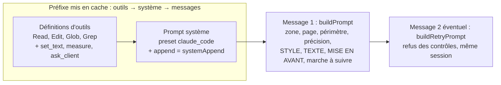
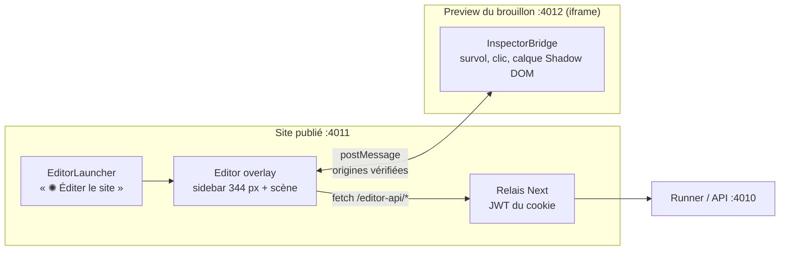

# 04 — Consignes, outils et dialogue

> État relevé le 2026-09-25 vers 21:05. POC : `/Users/andreagauvreau/Tools/payloadjs-test/payload-ai-editor-test`, branche `batterie-tests`, tête `888d165`. Site : version commitée `main` = `3a0af03` (`git -C site show main:<chemin>`). Une refonte de l'interface de l'éditeur est en cours dans `site/src/editor`, **non commitée**, par une autre session : elle n'est pas décrite ici.
> Légende : ✅ validé en passage réel · 🟡 approuvé, pas encore repassé · 🔧 en cours · 📋 prévu · 📚 documentation Sanity ou Anthropic, non testée dans le POC · 💡 proposition du dossier.
> Références au plan des corrections : les sections sont citées par leur titre. Les numéros de ligne ne valent que pour la version commitée (`git show 888d165:docs/superpowers/plans/2026-09-25-corrections-batterie.md`) ; la copie de travail du plan a 7 lignes de plus (décisions 17 et 18, non commitées).

Ce document décrit ce que Claude reçoit (prompt système, message, règles), les outils qu'il peut appeler, le dialogue avec le client (questions 🟢⚪🔴), la déclaration des zones, le design system et l'interface de l'éditeur.

---

## 1. Ce que Claude reçoit



Assemblage (`cms/src/editor/agent.ts:319`, `cms/src/editor/job.ts:68, 489-504`) ✅ :

- prompt système = `{ type: 'preset', preset: 'claude_code', append: systemAppend(ds) }` ;
- message du 1er essai = `buildPrompt(ds, request, textContext)` ;
- message du 2e essai = `buildRetryPrompt(problems)`, envoyé dans la même session (`resume: sessionId`). `MAX_ATTEMPTS = 2`.

### 1.1 Prompt système : `systemAppend(ds)` ✅

Source : `cms/src/editor/prompt.ts:5-14`. Quatre lignes fixes, une ligne vide, puis `RULES.md` entier (relu dans site-draft à chaque demande) :

```ts
// cms/src/editor/prompt.ts (extrait réel)
'Tu es lancé par l’éditeur visuel du site. Le client ne lit que tes questions posées avec ask_client et ton message final : ne pose jamais de question dans ton texte.',
'Écris toujours en français, y compris tes messages pendant la tâche.',
'Outils disponibles : Read, Edit, Glob, Grep (pour Glob/Grep, passe toujours path: "src"), measure (rendu réel de l’élément dans la preview du brouillon, à 375, 768 et 1280 px : lignes, taille, couleur, fond et contraste de chaque texte), ask_client (question au client, avec options), et set_text quand le texte vient du CMS.',
'Tu ne vois pas la page. N’affirme jamais un résultat visuel (nombre de lignes, taille ou couleur rendue) sans l’avoir mesuré avec measure.',
'',
ds.rules.trim(),
```

La précision sur `measure` (« lignes, taille, couleur, fond et contraste de chaque texte ») vient du commit `645fac7` (tâche 11) : 🟡.

**Fixe ou variable ?** Le texte d'ajout ne dépend que de `RULES.md` : il est fixe. Mais le preset `claude_code` ajoute l'état git du `cwd` (`site-draft`), qui change à chaque commit sur `draft` (« l'état git entre dans le prompt système », `docs/superpowers/plans/2026-09-24-batterie-tests-editeur-ia.md:66`) : **le préfixe système n'est pas garanti stable** d'une demande à l'autre. À mesurer par `cacheCreationInputTokens`.

### 1.2 Message de demande : `buildPrompt` ✅ (sections 🟡 signalées)

Source : `cms/src/editor/prompt.ts:31-161`. Sections jointes par une ligne vide, toujours dans cet ordre :

| # | Section | Présente si | Contenu | État |
|---|---|---|---|---|
| 1 | En-tête | toujours | « Demande du client, depuis l’éditeur visuel. » ; `Élément : « <label> » — l’élément qui porte data-edit="<zone>"` (+ « (occurrence n°N) ») ; page et largeur ; `À savoir : <hint>` ; périmètre ; `Précision du client : « … »` ou « aucune. » | ✅ |
| 1b | Périmètre | toujours | `Périmètre autorisé par le client : 🖌 Style OUI\|NON · T Texte OUI\|NON.` + interdiction explicite de ce qui est à NON, et renvoi vers le bouton à activer | ✅ |
| 2 | STYLE | 🖌 | fichiers `.css` de la zone seulement ; sélecteurs de la zone ; zones intérieures (placement seulement) ; consigne de masquage si `hideable` ; « Réglages demandés » ; « Tokens disponibles » | ✅ (lignes sélecteurs, zones intérieures, masquage, `.css` seul : 🟡 `2e591fd`, `6f1ae47`) |
| 3 | TEXTE | T | texte CMS : `set_text` une fois par champ, liste des champs avec longueur max et valeur actuelle, autres textes du document ; texte du code : fichiers et « Change uniquement le texte visible » ; consigne de rédaction | ✅ |
| 4 | MISE EN AVANT | un champ visé a `accent` | exemple « Une voiture *choisie avec soin*, prête à Lyon », rendu dans un `<em>` portant la classe `accent` du CSS Module de la zone (`prompt.ts:126` ; dans le HTML, classe hachée), 1 ou 2 groupes, astérisques par `set_text` | ✅ |
| 5 | Marche à suivre | toujours | 5 étapes | ✅ (ajouts 🟡 / 🔧 ci-dessous) |

Extrait réel de la section STYLE (`prompt.ts:48-87`) :

```text
STYLE
Fichiers de style que tu peux modifier :
- src/components/Hero/Hero.module.css
Règles de cette zone dans le CSS Module : .hero (et leurs états :hover, :focus-visible). Ne touche à aucune autre classe.
Zones intérieures (placement seulement : margin, text-align, order, align-self, justify-self, par un sélecteur descendant comme .hero .title) : .title (Titre principal), .subtitle (Sous-titre), .cta (…).

Réglages demandés :
- Fond (`background-color`) → `var(--color-night)` (Nuit)

Tokens disponibles (variables CSS) :
- Couleurs : --color-night (Nuit), --color-night-soft (Nuit claire), …
```

(Mise en forme reconstituée à partir du gabarit de `styleSection` et de `zones.json` ; le libellé exact de `hero.cta` n'est pas recopié ici.)

`tokenCatalog` (`prompt.ts:16-26`) ne donne que les **libellés**, jamais les valeurs, et exclut les groupes `locked` (`layout`). Conséquence : Claude ne peut pas juger un contraste ni une couleur « proche ». La tâche 14 📋 ajoutera la valeur, le ton clair/sombre et le ratio sur Nuit.

Consigne de rédaction (`prompt.ts:89-116`), à adapter à la marque du projet Sanity :

> « Rédaction : en français, dans le ton de LyonDrive (location de voiture à Lyon : concret, chaleureux, crédible, sans superlatifs creux). Pas d’emoji, pas de HTML ni de Markdown (seuls les astérisques de MISE EN AVANT, là où elle est possible), et respecte la longueur maximale. »

**Marche à suivre** (`prompt.ts:149-159`), résumé fidèle :

1. Ouvrir le composant et repérer `data-edit="<zone>"`.
2. Confronter chaque point aux tokens. S'il correspond exactement, l'appliquer. Sinon, **un seul** appel `ask_client` pour tous les écarts : `recommended` (variante la plus proche, avec l'effet obtenu), `neutral` (ne pas modifier), `discouraged` (valeur exacte en dur dans `hardcoded`). 🟡 Ajout `1d66b35` : « Jamais de police hors design system, d’url(), d’@import ni d’adresse web, même en 🔴 : aucune ressource externe. »
3. Si la demande fixe un résultat visible, le vérifier avec `measure` à 375, 768 et 1280 px et ajuster. Si c'est impossible avec les tokens, poser la question. 🔧 Ajout `aa5739c` (tâche 12) : « Si la largeur dépend d’un conteneur hors de la zone, ne modifie rien et explique-le. »
4. N'appliquer que le périmètre et les choix du client.
5. Message final en français, texte simple, sans Markdown, sans nom de fichier ni de classe : ce qui est fait (avec la mesure, par exemple « 2 lignes sur ordinateur et tablette, 3 sur mobile »), puis ce qui ne l'est pas et pourquoi. Ne parler ni des essais ni des contrôles.

Le message final est nettoyé par `clientMessage` (`job.ts:155-159`), qui retire le gras `**` et les puces.

### 1.3 Deuxième essai : `buildRetryPrompt` ✅

Source : `prompt.ts:164-171`.

```text
Les contrôles automatiques ont refusé ta modification :
- <problème 1>
- <problème 2>

Corrige ta modification pour lever ces problèmes, sans sortir du périmètre ni des règles. Si la correction t’oblige à t’écarter des tokens, pose d’abord la question avec ask_client.
Si c’est impossible, remets les fichiers dans leur état d’origine.
Termine par le message au client sur l’ensemble de sa demande (ce qui est fait, ce qui ne l’est pas et pourquoi), sans parler de ce refus ni de la correction.
```

Les problèmes sont les champs `problem` des contrôles, des consignes écrites pour Claude. Ils sont retirés de la vue envoyée au navigateur (`publicChecks`, `cms/src/editor/job.ts:302`).

### 1.4 Pourquoi cet ordre compte pour le cache

Le cache de prompt est un **préfixe exact**, dans l'ordre outils → système → messages (skill `claude-api`, section Prompt Caching). Écriture de cache ≈ 1,25 × le prix d'entrée (durée de vie 5 min), lecture 0,20 $ par million de jetons pour Opus 5.5.

| Partie | Fixe ? | Remarque |
|---|---|---|
| Outils intégrés (Read, Edit, Glob, Grep) | oui | |
| Outils MCP | **non aujourd'hui** | `set_text` a un `z.enum` des champs de la zone et une description qui liste les limites ; les 3 outils ne sont déclarés que si la demande les permet (`agent.ts:197-258`). Le préfixe change donc d'une zone à l'autre et le cache se casse. |
| Prompt système (preset + `systemAppend`) | **en partie** : l'état git du brouillon varie | `systemAppend` est fixe tant que `RULES.md` ne change pas, mais le preset `claude_code` injecte l'état git de `site-draft` (branche, commits récents), qui change à chaque commit sur `draft`. La tâche 23 seule ne garantit donc pas le cache : mesurer `cacheCreationInputTokens` sur deux demandes successives. |
| Message 1 | non | propre à la demande, en fin de préfixe |

Mesure réelle (runs/1-reference, 50 cas) : médiane de 4 737 jetons écrits en cache et 32 412 lus par demande. D'après le plan de la batterie, 30 à 70 % du prix d'une demande part dans l'écriture du cache (`docs/superpowers/plans/2026-09-24-batterie-tests-editeur-ia.md:61, 66`). Environ 0,39 $ perdus sur le passage (`analyse.json`, correction `outils-definition-fixe`).

**Tâche 23 📋** (`docs/superpowers/plans/2026-09-25-corrections-batterie.md`, section « ### Tâche 23 : Outils à définition fixe pour garder le cache entre demandes rapprochées ») :

- `lyondriveTools()` déclare **toujours** les 3 outils avec une définition fixe : `set_text { field: z.string(), value: z.string() }`, description sans liste de champs ; `measure` et `ask_client` en constantes ;
- un outil indisponible répond une erreur claire : « Texte non coché : aucun texte modifiable pour cette demande. », « Mesure indisponible : les contrôles visuels sont coupés. », « Questions indisponibles. » ;
- `ALLOWED_TOOLS` devient fixe. Le filtrage reste assuré par le hook et `validateText` ;
- cible : moins de 6 000 jetons écrits en cache.

➡️ **Pour Sanity : écrire directement la version de la tâche 23.** La liste des champs et leurs limites passent alors dans le message (section TEXTE, déjà présente).

---

## 2. Les outils

### 2.1 Outils intégrés ✅

`tools = ['Read','Edit','Glob','Grep']` (`agent.ts:99`), filtrés par le hook `checkToolUse` (`cms/src/editor/guards.ts:35-86`) : voir `03-garde-fous.md` §3.1.

### 2.2 Serveur MCP en mémoire `lyondrive` ✅

`createSdkMcpServer({ name: 'lyondrive', version: '1.0.0', tools })` (`agent.ts:197-258`). Noms complets vus par le SDK et le hook : `mcp__lyondrive__set_text`, `mcp__lyondrive__measure`, `mcp__lyondrive__ask_client` (`guards.ts:18-22`).

#### `set_text` ✅

```ts
// cms/src/editor/agent.ts (extrait réel, version actuelle — définition variable)
tool(
  'set_text',
  `Enregistre le nouveau texte d’un champ du CMS pour l’élément sélectionné, dans le brouillon. Champs : ${limits}. ` +
    'Texte brut, sans HTML ni Markdown. Rappelle l’outil pour corriger un texte refusé.',
  { field: z.enum(paths), value: z.string() },
  async ({ field, value }) => {
    const error = await textTool.onSet(field, value)
    return {
      content: [{ type: 'text', text: error ?? `Texte enregistré dans le brouillon pour « ${field} ».` }],
      isError: error !== null,
    }
  },
)
```

`limits` a la forme `title (90 caractères max, mise en avant *…* possible)`. `onSet` appelle `validateText` (`job.ts:107-152`), puis écrit **aussitôt** en brouillon CMS (`job.ts:390-412`), pour que `measure` et les contrôles voient le nouveau texte. Un refus revient à Claude avec `isError: true` ; il doit rappeler l'outil.

#### `measure` ✅ (contenu enrichi 🟡)

Schéma `{}`. Description réelle : « Mesure l’élément sélectionné tel qu’il s’affiche maintenant dans la preview du brouillon, à 375, 768 et 1280 px : lignes, taille, graisse, couleur, fond effectif et contraste WCAG de chaque texte (10 au plus), largeur, mots mis en avant. Appelle-le après tes modifications pour vérifier un résultat demandé. »

Il renvoie un relevé en texte (`describeMeasures`), produit par le même callback `READ_ZONE` que les contrôles (tâche 11, `645fac7`, 🟡). Le contraste y est **affiché**, pas contrôlé (tâche 14 📋). La tâche 16 📋 prévoit de l'enrichir.

#### `ask_client` ✅ (filtre 🟡)

```ts
// cms/src/editor/agent.ts:171-195 (extrait réel)
const QUESTIONS_SCHEMA = {
  questions: z
    .array(
      z.object({
        topic: z.string().max(30).optional().describe('Sujet court : « Couleur », « Taille »…'),
        question: z.string().min(1).max(300),
        options: z
          .array(
            z.object({
              label: z.string().min(1).max(80),
              description: z.string().max(300).optional(),
              tone: z.enum(['recommended', 'neutral', 'discouraged']),
              hardcoded: z
                .object({ property: z.string().min(1).max(60), value: z.string().min(1).max(120) })
                .optional()
                .describe('Option discouraged uniquement : la propriété CSS et la valeur exacte écrite en dur.'),
            }),
          )
          .min(2)
          .max(4),
      }),
    )
    .min(1)
    .max(3),
}
```

Description réelle de l'outil : « Pose une ou plusieurs questions au client et attend sa réponse. À utiliser quand une partie de la demande ne correspond pas exactement au design system (couleur, transparence, taille, arrondi, espacement…). Pour chaque question, 2 à 4 options : tone "recommended" (vert) = la variante la plus proche parmi les tokens ; "neutral" = ne pas modifier ce point ; "discouraged" (rouge) = la valeur exacte écrite en dur, hors design system, avec hardcoded { property, value }. Regroupe toutes tes questions en un seul appel, avant de modifier les points concernés. »

Le gestionnaire passe par `pauseClock` (`agent.ts:266-284`) : le délai de Claude (`EDITOR_TIMEOUT_MS`, 300 s) est **suspendu** pendant l'attente, puis relancé pour au moins 60 s (`MIN_RESUME_MS`). Le délai de réponse du client est `EDITOR_QUESTION_TIMEOUT_MS` (15 min). Passé ce délai, la modification est arrêtée (`cancelled`) et le brouillon reste intact. `MCP_TOOL_TIMEOUT` vaut ce délai + 60 s.

**Tâche 17 📋** : élargir `ask_client` aux informations manquantes (texte dicté trompeur, fait absent : règle 9). **Tâche 13 📋** : champ `effect: z.enum(['texte-plus-long'])` sur les options.

---

## 3. Règles données à Claude : `RULES.md`

Fichier versionné avec le site : `site/src/editor/RULES.md`, relu dans site-draft à chaque demande (`loadDesignSystem(config.draftDir)`, `cms/src/editor/design-system.ts:45-57`).

**Version commitée (main `3a0af03`, dernier commit `8f434d8` du 2026-09-24, 57 lignes)** ✅ — sections :

1. Périmètre : 🖌 Style / T Texte
2. Texte
3. Mise en avant de mots
4. Design system (pas de valeur brute sauf 0, 1px de bordure, nombres sans unité, %, durées, auto, mots-clés)
5. Écart au design system : la question au client
6. Responsive (points de rupture 48rem et 64rem seulement ; pas de largeur ni de hauteur fixe ; pas d'`absolute`, `fixed` ni `!important`)
7. Vérifier le rendu
8. Périmètre technique
9. Fin de tâche

Extrait réel de la section 5 :

```markdown
## Écart au design system : la question au client
- Si un point de la demande correspond exactement à un token (ou à une combinaison de tokens), applique-le directement.
- S'il s'en écarte (…), ne tranche pas seul. Avant de modifier ce point, pose la question avec `ask_client`, en un seul appel pour tous les écarts, avec pour chacun :
  - 🟢 `recommended` : la ou les variantes les plus proches parmi les tokens, en disant l'effet obtenu ;
  - ⚪ `neutral` : ne pas modifier ce point ;
  - 🔴 `discouraged` : la valeur exacte écrite en dur (`hardcoded`), en disant qu'elle sort du design system et qu'elle sera plus difficile à maintenir.
- Une valeur en dur n'est permise que si le client a choisi l'option 🔴, et seulement celle-là, écrite exactement.
```

> ⚠️ C'est encore l'**ancienne** version (liste d'interdits). Ne pas la recopier comme cible.

**Texte cible (tâche 22)** 📋 : `docs/superpowers/plans/2026-09-25-corrections-batterie.md`, section « ### 2. RULES.md — texte exact (tâche 22, dépôt site) » (lignes 186-296 dans `git show 888d165:…` ; la copie de travail la décale à 193). Il reprend la version de main et ajoute :

- « Quel que soit le mode, aucune balise ni aucun attribut ne se modifie » ;
- n'inventer aucun fait ; aucune ligne gagnée à 375 px ; aucune ressource externe ni `@font-face` ; pas d'`opacity < 1` ;
- une table des valeurs permises propriété par propriété ;
- contraste minimum 4,5:1 (3:1 pour un grand texte) ;
- sélecteurs globaux et pseudo-éléments interdits ;
- dire au client quand un texte ou un style apparaît ailleurs.

Corrections à reporter avant de l'utiliser (`corr-22-brief.md:73`, `corr-12-report.md`) :

- supprimer la phrase « avec 🖌, la className d’un élément existant, en styles.x », contraire à la décision 14 ;
- décalages `0`/`auto` seulement ;
- `outline`, `outline-offset`, `box-shadow` et décalages jamais en dur ;
- `padding-inline` (pas `padding-block`) pour le fond d'un mot mis en avant ;
- états = peinture seulement.

Nouvelles sections prévues dans `buildPrompt` 📋 : RENDU ACTUEL (mesure d'avant, tâche 15), PAGE (pages existantes et textes visibles, tâche 21), « Portée du style » (`reach`, tâche 20).

**Pour Sanity :** partir du texte cible corrigé, remplacer « contenus dans Payload » par Sanity, adapter la marque et les chemins (`src/styles/tokens.json`, `src/app/globals.css`, `src/editor/` interdits en écriture). Ne garder une règle « prévue » que si le contrôle correspondant est porté (voir `03-garde-fous.md` §5).

> Convention typographique : `prompt.ts` utilise l'apostrophe ’, `RULES.md` l'apostrophe droite '. Certains tests comparent des chaînes exactes.

---

## 4. Questions 🟢⚪🔴 et « Autre réponse »

```mermaid
sequenceDiagram
  participant C as Claude
  participant R as Runner (questions.ts)
  participant DB as Edit (collection edits)
  participant UI as Éditeur (QuestionCard)
  C->>R: ask_client({questions})
  R->>R: questionProblems()
  alt question refusée
    R-->>C: isError « Reformule ta question »
  else acceptée
    R->>R: prepareQuestions() ids q…, q1, q1o1 ; hardcoded retiré hors 🔴
    R->>DB: status waiting, question
    Note over R: pauseClock : délai de Claude suspendu (15 min max)
    UI->>DB: GET /edits/:id toutes les 900 ms
    UI->>R: POST /edits/:id/answer {questionsId, answers}
    R->>R: parseAnswers()
    R->>DB: dialog, hardcoded, status running
    R-->>C: describeAnswers()
  end
```

Côté serveur (`cms/src/editor/questions.ts`, `job.ts:414-451`, `service.ts:266-276`) :

- `questionProblems` 🟡 (`questions.ts:37-94`) : voir `03-garde-fous.md` §3.3.
- `prepareQuestions` ✅ : identifiants `q<horodatage base36>` pour la série, `q1`, `q2`… pour les questions, `q1o1`… pour les options. Retire `hardcoded` de toute option non `discouraged`.
- `parseAnswers` ✅ : corps `{ questionsId, answers: [{ questionId, optionId? | other? }] }`, une réponse par question, `other` en texte libre (blancs réduits, `OTHER_MAX = 300`). Message d'erreur : « Répondez à chaque question : choisissez une option ou écrivez votre réponse. »
- `describeAnswers` ✅ (`questions.ts:129-155`), texte renvoyé à Claude :

```text
Réponse du client :
- « <question> » → « <label> » (valeur en dur, hors design system). Écris exactement `font-size: 40px` : c’est la seule valeur en dur autorisée.
- « <question> » → « <label> » (ne pas modifier ce point).

Applique ces choix. Un point à ne pas modifier ne doit pas bouger ; signale-le dans ton message final.
```

  Notes selon le ton : `variante du design system`, `ne pas modifier ce point`, `valeur en dur, hors design system`, `réponse libre`. « Autre réponse » arrive avec le ton `other` et **n'accorde jamais** de valeur en dur.
- `hardcodedOf` alimente `Edit.hardcoded`, la **seule** liste d'exemptions que le lint CSS accepte (voir `03-garde-fous.md` §3.4.2).

Côté interface (`git -C site show main:src/editor/sidebar/QuestionCard.tsx`, lignes 5-107) ✅ :

- en-tête « Claude a besoin de votre avis pour continuer. » ;
- un `fieldset` par question, avec le `topic` en pastille ;
- un bouton radio par option, avec le badge « Recommandé » (🟢), aucun badge (⚪), ou « Déconseillé » (🔴, la valeur en dur affichée en `<code>`) ; couleur par `data-tone` ;
- dernière option « Autre réponse » : champ de 300 caractères au plus, placeholder « Votre réponse… » ;
- bouton « Répondre à Claude », actif seulement quand toutes les questions ont une réponse.

Exemple réel du banc (cas S05, `scripts/bench/cases/batterie-1.json`) : « mettez le titre en 40px » → 40 px tombe entre 2XL (36 px) et 3XL (56 px) ; attendu : un seul `ask_client` avec 🟢 2XL, ⚪ ne rien changer, 🔴 `40px` en dur ; le client choisit 🔴 ; Claude écrit exactement `40px` et rien d'autre en dur.

---

## 5. Déclaration des zones : `zones.json`

Fichier : `site/src/editor/zones.json` (main `3a0af03`). Lu dans site-draft par le runner à chaque demande (`design-system.ts:45-57`). Une zone ajoutée seulement sur `main` n'existe pas pour le runner tant que `draft` n'a pas avancé.

### 5.1 Structure

| Champ | Rôle | État |
|---|---|---|
| `label` | nom affiché au client et à Claude | ✅ |
| `files` | CSS Module + composant de la zone | ✅ |
| `controls` | réglages proposés dans l'inspecteur (clés de la section `controls`) | ✅ |
| `hint` | « À savoir » donné à Claude et affiché | ✅ |
| `text` | `{source:'cms', target, fields:{chemin: max}, accent?}` ou `{source:'code', files}` | ✅ |
| `selectors` | classes du CSS Module de la zone, **la 1re = celle de l'élément `data-edit`** | 🟡 (tâche 7, site `3a0af03`) |
| `children` | zones intérieures (placement seulement depuis le conteneur) | 🟡 |
| `hideable` | masquable selon l'écran (seulement `hero.subtitle`, `page.intro`) | 🟡 |
| `logotype` | exempté du futur contrôle de contraste (seulement `header.logo`) | 🟡 déclaré, lu par 📋 tâche 14 |
| `reach` | portée du style en clair (« la page d'accueil ») | 🟡 déclaré, lu par 📋 tâche 20 |

Invariants testés (`cms/src/editor/design-system.test.ts:29-124`) : classes présentes dans le CSS Module ; 1re classe = celle du `data-edit` ; une entrée par `data-edit` ; aucune classe partagée entre deux zones du même CSS Module ; toute zone préfixée par `<id>.` figure dans `children` ; `header.nav` et `hero.cta` jamais `hideable`.

### 5.2 Section `controls` (12 réglages, extrait réel) ✅

```json
"controls": {
  "color": { "label": "Couleur du texte", "property": "color", "group": "color" },
  "background": { "label": "Fond", "property": "background-color", "group": "color" },
  "fontFamily": { "label": "Police", "property": "font-family", "group": "font" },
  "fontSize": { "label": "Taille du texte", "property": "font-size", "group": "text" },
  "fontWeight": { "label": "Graisse", "property": "font-weight", "group": "weight" },
  "radius": { "label": "Arrondi", "property": "border-radius", "group": "radius" },
  "padding": { "label": "Marge intérieure", "property": "padding", "group": "space" },
  "paddingBlock": { "label": "Marge verticale", "property": "padding-block", "group": "space" },
  "paddingInline": { "label": "Marge horizontale", "property": "padding-inline", "group": "space" },
  "gap": { "label": "Espacement interne", "property": "gap", "group": "space" },
  "shadow": { "label": "Ombre", "property": "box-shadow", "group": "shadow" },
  "align": {
    "label": "Alignement",
    "property": "text-align",
    "options": { "left": "Gauche", "center": "Centre", "right": "Droite" }
  }
}
```

`resolveChange` convertit un choix en `var(--<groupe>-<token>)` et refuse un groupe verrouillé (`design-system.ts:101-120`).

### 5.3 Exemples réels de zones (main `3a0af03`)

```json
"hero": {
  "label": "Bandeau d'accueil",
  "files": ["src/components/Hero/Hero.module.css", "src/components/Hero/Hero.tsx"],
  "selectors": [".hero"],
  "children": ["hero.title", "hero.subtitle", "hero.cta"],
  "reach": "la page d'accueil",
  "controls": ["background", "paddingBlock", "align"]
},
"hero.title": {
  "label": "Titre principal",
  "files": ["src/components/Hero/Hero.module.css", "src/components/Hero/Hero.tsx"],
  "selectors": [".title", ".accent"],
  "reach": "la page d'accueil",
  "controls": ["color", "fontFamily", "fontSize", "fontWeight", "align"],
  "text": { "source": "cms", "target": "globals/home", "fields": { "title": 90 }, "accent": ["title"] }
},
"hero.subtitle": {
  "label": "Sous-titre",
  "files": ["src/components/Hero/Hero.module.css", "src/components/Hero/Hero.tsx"],
  "selectors": [".subtitle"],
  "hideable": true,
  "reach": "la page d'accueil",
  "controls": ["color", "fontFamily", "fontSize"],
  "text": { "source": "cms", "target": "globals/home", "fields": { "subtitle": 220 } }
},
"features.card": {
  "label": "Carte atout",
  "hint": "Le style s'applique à toutes les cartes atouts ; le texte, à la carte sélectionnée.",
  "files": ["src/components/Features/Features.module.css", "src/components/Features/Features.tsx"],
  "selectors": [".card", ".cardTitle", ".cardText"],
  "reach": "les trois cartes atouts de la page d'accueil",
  "controls": ["background", "color", "radius", "padding", "shadow"],
  "text": { "source": "cms", "target": "globals/home", "fields": { "features.{i}.title": 60, "features.{i}.text": 200 } }
},
"page.intro": {
  "label": "Introduction de page",
  "files": ["src/components/PageTitle/PageTitle.module.css", "src/components/PageTitle/PageTitle.tsx"],
  "selectors": [".intro"],
  "hideable": true,
  "reach": "toutes les pages avec un titre de page (aujourd'hui, la page Blog)",
  "controls": ["color", "fontFamily", "fontSize"],
  "text": { "source": "code", "files": ["src/app/blog/page.tsx"] }
},
"post.card": {
  "label": "Carte article",
  "hint": "Le style s'applique à toutes les cartes articles du site ; le texte, à l'article de la carte.",
  "files": ["src/components/PostCard/PostCard.module.css", "src/components/PostCard/PostCard.tsx"],
  "selectors": [".card", ".image", ".body", ".subtitle", ".date"],
  "children": ["post.card.title"],
  "reach": "toutes les cartes articles de la page Blog",
  "controls": ["background", "radius", "padding", "shadow", "gap"],
  "text": { "source": "cms", "target": "posts/{doc}", "fields": { "title": 90, "subtitle": 160 } }
}
```

Liste des zones, avec la source du texte :

- texte du code : `header.logo`, `header.nav`, `page.title`, `page.intro`, `footer` ;
- texte du CMS : `hero.title`, `hero.subtitle`, `hero.cta`, `features.title`, `features.card`, `post.card`, `post.card.title`, `article.title`, `article.subtitle` ;
- sans texte : `header`, `hero`, `features`, `blog.list`, `article.meta`, `article.content` (le corps de l'article se modifie dans l'admin, selon son `hint`).

Limites de texte : `globals/home` title 90 (accent), subtitle 220, buttonLabel 40, featuresTitle 70, `features.{i}.title` 60, `features.{i}.text` 200 ; `posts/{doc}` title 90, subtitle 160. La **longueur se compte sans les astérisques** : un titre de 90 caractères peut en contenir 94 avec deux groupes `*…*`. Le validateur Sanity doit suivre la même règle.

### 5.4 Marquage dans le JSX ✅

```tsx
// git -C site show main:src/components/Hero/Hero.tsx (lignes 13-23, résumé)
<section data-edit="hero" className={styles.hero}>
  <h1 data-edit="hero.title" className={styles.title}>{withAccent(title, styles.accent)}</h1>
  <p data-edit="hero.subtitle" className={styles.subtitle}>…</p>
  <Link data-edit="hero.cta" …>…</Link>
</section>
```

Un document répété porte `data-edit-doc={post.id}` (`PostCard.tsx`, sur le même élément que `data-edit="post.card"` ; `Article.tsx`, sur `<article>`). `withAccent(text, className)` (`src/lib/accent.tsx:1-14`) découpe sur `/\*([^*]+)\*/g` et rend les parties impaires dans `<em className={styles.accent}>`. Règle de base : `.accent { font-style: normal; }` (`Hero.module.css:16-19`).

Demande (`parseEditRequest`, `design-system.ts:150-206`) ✅ :

- T exige une zone avec `text` ;
- des réglages exigent 🖌 ;
- T seul exige une précision ;
- `index` de 0 à 99 ;
- `viewport` de 320 à 2560 (1280 par défaut) ;
- `path` commence par `/` et fait 200 caractères au plus ;
- `note` fait 600 caractères au plus (`NOTE_MAX`).

En 🖌 seul sur une zone CMS avec `accent`, un `textTarget` limité aux champs accent est ouvert : la mise en avant relève du style, et seuls les astérisques peuvent bouger.

### 5.5 Pour Sanity

- Garder `zones.json` dans le dépôt du front, au même format.
- Seul `text.target` change : `globals/home` → document singleton (par exemple `{type:'home', id:'home'}`) ; `posts/{doc}` → `{type:'post', id:'{doc}'}` avec `_id` en chaîne. `resolveTextTarget` (`design-system.ts:123-139`) n'accepte aujourd'hui qu'un id numérique (`/^\d+$/`) : à réécrire.
- Tableaux : préférer `features[_key=="…"].title` à `features.{i}.title` (un réordonnancement dans le Studio ferait écrire dans la mauvaise carte). Transmettre la `_key` par un attribut (par exemple `data-edit-key`) à côté de `data-edit-doc`.
- `data-edit-doc` = `_id` publié, sans préfixe `drafts.`, passé par `stegaClean()`.
- Garder les champs éditables en `string`/`text` simples, pas en Portable Text. Le corps d'article reste hors éditeur, comme `article.content`.
- `fieldLabel` est aujourd'hui en dur dans `content.ts`. Le remplacer par le `title` du schéma Sanity ou par un libellé dans `zones.json` (par exemple `"fields": { "title": { "max": 90, "label": "Titre" } }`, proposition non implémentée).

---

## 6. Design system : `tokens.json` ✅

Fichier : `site/src/styles/tokens.json` (main), seule source. Forme : `{ groupe: { label, locked?, tokens: { nom: { label, value } } } }`. `tokensCss` (`src/styles/tokens.ts:8-15`) déclare `--<groupe>-<nom>` sur `:root`, injecté par un `<style>` dans `layout.tsx`.

```json
"color": {
  "label": "Couleurs",
  "tokens": {
    "night": { "label": "Nuit", "value": "#0f172a" },
    "night-soft": { "label": "Nuit claire", "value": "#1e293b" },
    "ink": { "label": "Texte", "value": "#f8fafc" },
    "mist": { "label": "Brume", "value": "#94a3b8" },
    "slate": { "label": "Ardoise", "value": "#64748b" },
    "rose": { "label": "Rose", "value": "#e11d48" },
    "rose-deep": { "label": "Rose profond", "value": "#be123c" },
    "rose-light": { "label": "Rose clair", "value": "#fb7185" },
    "sand": { "label": "Sable", "value": "#fde68a" },
    "white": { "label": "Blanc", "value": "#ffffff" }
  }
}
```

| Groupe | Libellé | Tokens |
|---|---|---|
| `color` | Couleurs | night, night-soft, ink, mist, slate, rose, rose-deep, rose-light, sand, white |
| `font` | Polices | serif (Georgia…), sans (system-ui…) |
| `text` | Tailles de texte | xs 0.875rem, sm 1rem, md à 4xl en `clamp()` |
| `weight` | Graisses | regular 400, medium 500, semibold 600, bold 700 |
| `space` | Espacements | 0 à 9 (0,25 à 4rem, 9 en `clamp`) |
| `radius` | Arrondis | none, sm, md, lg, full = 999px (« Pilule ») |
| `shadow` | Ombres | none, sm, md, lg, glow (« Halo ») |
| `layout` | Mise en page, `locked: true` | container 68.75rem, measure 47.5rem, gutter, section : non proposé dans l'inspecteur ni dans le catalogue, mais utilisable en CSS pour `max-width`, `padding`, `margin` |

Le lint compare toujours la valeur entière `var(--groupe-nom)` (`css-policy.ts:11-20`). Pour Sanity : reprendre `tokens.json` et `tokens.ts` tels quels et y mettre les tokens du projet.

---

## 7. Interface de l'éditeur (version commitée `main 3a0af03`) ✅

Le code TSX de l'interface n'a pas changé depuis `4e4a6d5` : c'est celui que le banc a piloté pendant runs/1-reference. ⚠️ Une refonte non commitée touche `Canvas.tsx`, `Editor.tsx`, `ReviewBar.tsx`, `bridge/overlay.ts`, `bridge/runtime.ts`, `editor.module.css`, `launcher.module.css`, `protocol.ts`, `sidebar/Activity.tsx`, `sidebar/Composer.tsx` et un dossier `icons/` : **partir de `git -C site show main:<chemin>`**.



### 7.1 Lancement et vue

- **Lanceur** (`EditorLauncher.tsx`, `launcher.module.css`) : bouton fixe en bas à droite « ✺ Éditer le site », masqué sous 64rem, rendu seulement si une session éditeur valide existe (`getEditorUser()`, `session.ts:21-41`). L'éditeur est chargé en `next/dynamic` (`ssr: false`) au clic. `sessionStorage` `lyondrive-editor-open` le rouvre après un rechargement.
- **Overlay** (`editor.module.css:1-40`) : `.root { all: initial; position: fixed; inset: 0; z-index: 2147483000; grid 344px | 1fr }`, rôle `dialog` `aria-modal`. Sous 63.99rem : « L'éditeur s'utilise sur un écran d'au moins 1024 px ».
- **Scène** (`Canvas.tsx:7-139`) : iframe du brouillon (`title="Preview du brouillon"`) à sa vraie largeur 1280 / 768 / 375, réduite par `transform: scale(…)`. Barre d'outils : modes Sélectionner/Naviguer (groupe « Mode »), largeurs (groupe « Largeur d'écran »), chemin, « 1280 px · 100 % », recharger. Sans `ready` du pont au bout de 15 s : « La preview du brouillon ne répond pas… port 4012 ».

### 7.2 Sélection de zone

- **Pont** (`bridge/runtime.ts:130-159`, `bridge/dom.ts:6-21`) : en mode Sélectionner, un clic dans l'iframe (phase de capture, `preventDefault` + `stopPropagation`) prend la zone déclarée la plus proche (`closestZone` ignore un `data-edit` inconnu), avec `index` = rang parmi les occurrences.
- **Calque** (`bridge/overlay.ts:1-58, 96-125`) : hôte `div[data-lyondrive-overlay]` avec un Shadow DOM ouvert, couleur argile `#d97757`. Survol en tirets ; occurrence principale en trait plein 2 px ; autres occurrences en 1 px ; étiquette « Libellé · i/N ». Échap désélectionne.
- **Calques** (`sidebar/Layers.tsx`, `dom.ts:35-54`) : arbre des `[data-edit]` ; les instances répétées sont regroupées (×N) ; survol = surlignage de toutes les instances ; clic = `select {zone, index: 0}` avec défilement.
- **Objet `Selection`** (`protocol.ts:15-27`) : `{zone, index, count, ancestors, current, doc, text}`. `doc` = `data-edit-doc` ; `text` = `innerText` normalisé, 280 caractères au plus.

### 7.3 Inspecteur

`sidebar/Inspector.tsx:31-173` :

- fil d'Ariane des zones parentes (cliquable) ;
- groupe `color` : pastilles (radiogroup) ; groupe `space` : curseur (étiquette « 5 · 1.5rem », ou « fluide » pour un `clamp`) ; autres groupes : boutons segmentés ;
- lien « Rétablir » et delta « actuel → nouveau » par réglage ; choisir la valeur courante retire le changement ; « Personnalisé » si aucun token ne correspond ;
- toucher un réglage coche 🖌 tout seul ; changer de zone vide les réglages et le périmètre.

Détection du token courant (`dom.ts:56-91`) : `getComputedStyle` de l'élément comparé à une sonde invisible (Shadow DOM) qui reçoit chaque token. Les raccourcis sont lus sur une propriété longue (`padding` → `padding-top`, `gap` → `row-gap`…). Deux tokens de même valeur calculée sont indiscernables.

**Aperçu instantané** (`Editor.tsx:159-172`, `dom.ts:108-131`) : `preview` pose les styles `var(--token)` **en ligne sur toutes les instances** de la zone. `clear-preview` restaure. L'aperçu est effacé au passage en `ready`.

### 7.4 Périmètre 🖌/T et précision

`sidebar/Composer.tsx:26-137`, `Editor.tsx:245-279` :

- groupe « Ce que Claude peut modifier » : boutons **🖌 Style** et **T Texte**, **décochés par défaut**, chacun affiché seulement si la zone a la capacité (style = `controls` non vide ; texte = `text` présent, `design.ts:27-30`). Décocher 🖌 abandonne les réglages en cours.
- textarea « Précision pour Claude », 600 caractères au plus ; placeholder selon le périmètre ; ⌘/Ctrl+Entrée applique.
- `canApply` : une sélection, aucun job actif, aucune revue en cours, au moins un périmètre ; avec T seul, une précision obligatoire ; sinon au moins un réglage ou une précision.
- bouton « Appliquer avec Claude » → `POST /edits` `{zone, path, viewport, scope[], changes (si 🖌), note, index, doc}` (`api.ts:93-104`). Le serveur refait toutes les vérifications (`parseEditRequest`).

### 7.5 Suivi

`sidebar/Activity.tsx:6-152`, `Editor.tsx:45-46, 184-232` :

- `GET /editor-api/edits/:id` toutes les 900 ms tant que le statut vaut `queued`, `running` ou `waiting` ; `GET /editor-api/state` toutes les 6 s ;
- zone `aria-live="polite"` : statut, étapes (glyphe par type), message de Claude, textes avant/après, valeurs en dur accordées, contrôles ✓/✕, coût, jetons, durée, nombre de fichiers. En abonnement : « ≈ … (abonnement, non facturé) » ;
- une modification en cours ou à valider est reprise à la réouverture.

### 7.6 Question

Voir §4 : carte affichée quand `status === 'waiting'` et `job.question` existe.

### 7.7 À valider

- **Barre `ReviewBar`** (`ReviewBar.tsx`, `Editor.tsx:315-334, 429-439`) : affichée entre la barre d'outils et l'iframe quand `status === 'ready'` et que la modification n'est pas validée. Boutons « Annuler » (`POST /edits/:id/undo`, désactivé si `!canUndo`) et « ✓ Valider » (`POST /edits/:id/validate`), plus « Afficher la page <path> » si la vue montre une autre page. Pendant la revue, le composeur est bloqué, et le serveur refuse toute nouvelle demande (409, `review.ts:15-18`).
- **Anneau vert** (`runtime.ts:56-65`, `overlay.ts:6-9, 110-124`) : message `review` → anneau `#3f7d58` (écart 4 px), étiquette « Modifié par Claude · à valider », défilement jusqu'à l'élément ; seulement si `location.pathname === review.path`.
- **Rafraîchissement** (`Editor.tsx:48-49, 303-313`, `InspectorBridge.tsx:14-23`) : `refresh` 900 ms après une modification ou une annulation → `router.refresh()` dans l'iframe. Le rechargement à chaud ne suffit pas pour un texte CMS. Un `MutationObserver` (anti-rebond 250 ms) renvoie ensuite calques et sélection.
- La publication ne se fait pas depuis l'éditeur : lien « Publier depuis l'admin ↗ » (`sidebar/DraftList.tsx:43-45`).

### 7.8 Protocole et sécurité du pont

`protocol.ts:1-55` :

- messages de l'éditeur (`source: 'lyondrive-editor'`) : `init`, `mode`, `hover`, `select`, `preview`, `clear-preview`, `refresh`, `review` ;
- messages du pont (`source: 'lyondrive-bridge'`) : `hello` (sans donnée, `targetOrigin '*'`), `ready`/`zones`, `hovered`, `selected`.

L'éditeur n'accepte que l'origine de `DRAFT_URL`. Le pont n'accepte que `LIVE_ORIGINS`, mémorise `parentOrigin`, ne poste plus qu'à celle-ci, et ne démarre que dans une iframe.

Libellés ARIA stables, utilisés comme sélecteurs par le banc (`scripts/bench/run.mjs:48-50, 326-557`) : à **conserver** dans le projet Sanity (voir `05-banc-essai.md`).

### 7.9 Pour Sanity

- Le code client (Editor, Canvas, sidebar, bridge, protocol, api, design, accent, tokens) ne dépend pas de Payload : le copier depuis `main`, puis renommer `lyondrive` (`EDITOR_SOURCE`, `BRIDGE_SOURCE`, `data-lyondrive-overlay`, clé `sessionStorage`).
- Conflit avec les overlays Visual Editing de Sanity 📚 : les deux interceptent survol et clic. Désactiver `<VisualEditing/>` quand le pont est actif, ou l'inverse (https://www.sanity.io/docs/visual-editing/visual-editing-overlays).
- L'authentification (`session.ts`, relais `/editor-api/[...path]`) est à réécrire : il n'existe pas de cookie Sanity lisible par le site 📚. Le choix entre outil de Studio et overlay du site est traité dans les documents d'architecture du dossier.
