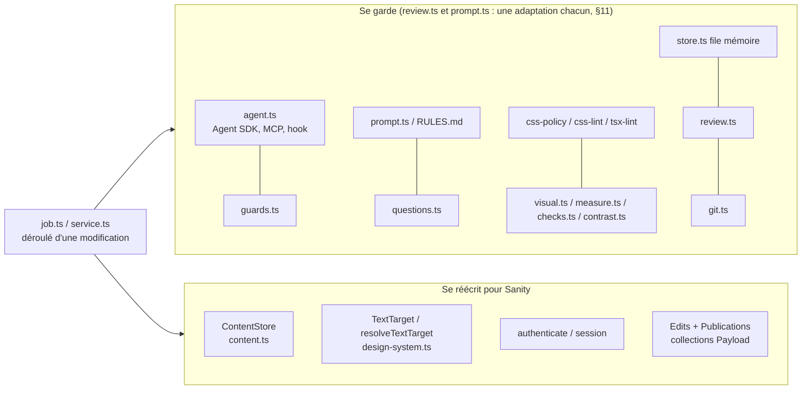
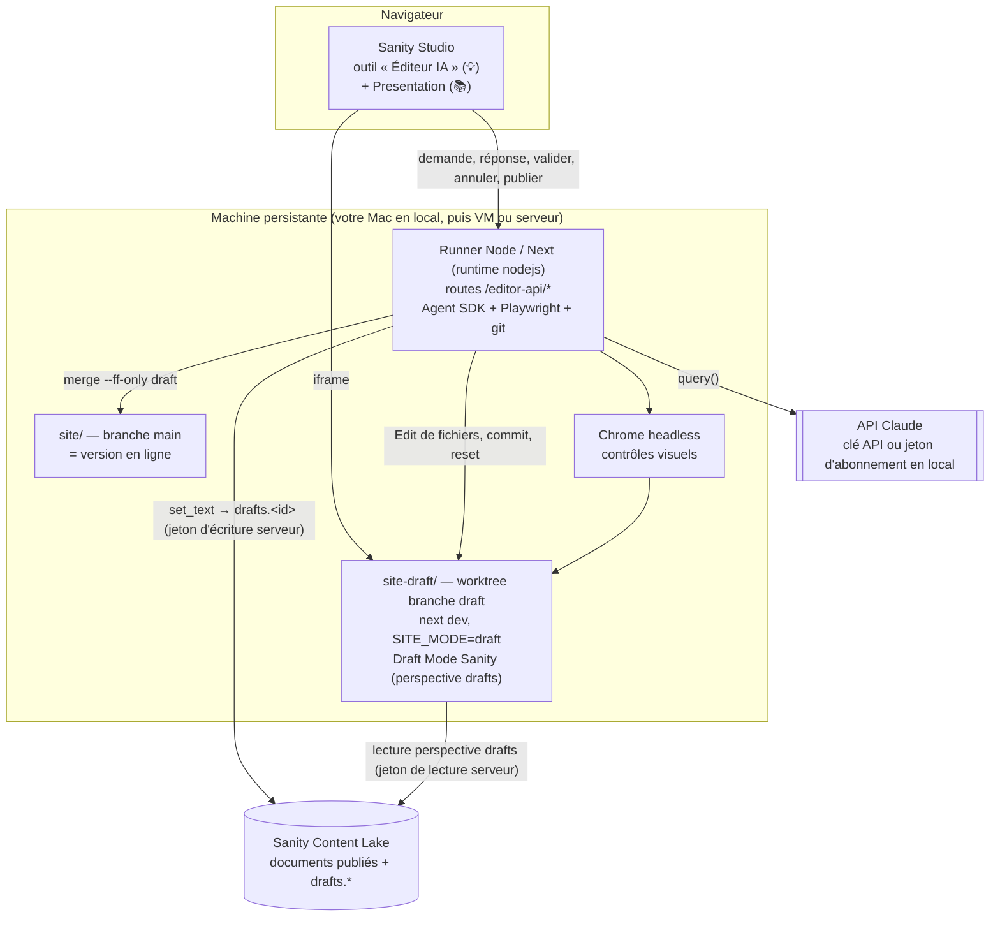
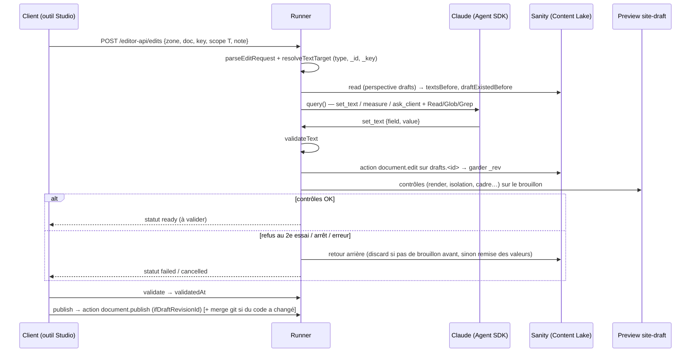

# 06 — Adapter l’éditeur IA à Sanity

> **Pour qui :** le développeur (vous) et l’instance de Claude Code qui construira l’intégration dans le projet Sanity.
> **Objet :** comment transposer dans Sanity l’éditeur IA du POC LyonDrive, bloc par bloc : ce qui se garde, ce qui se réécrit, dans quel ordre et avec quels pièges.
> **État du POC décrit :** dépôt `payload-ai-editor-test`, branche `batterie-tests`, tête `888d165` du 2026-09-25 à 21:05. Le site est décrit dans sa version commitée `site@main` = `3a0af03`.
> **Versions Sanity relevées sur npm le 2026-09-25 :** `next-sanity` 13.3.4, `sanity` 6.16.0, `@sanity/client` 8.7.0, `@sanity/visual-editing` 6.1.2.

## Légende

| Marque | Sens |
|---|---|
| ✅ | Validé en passage réel dans le POC : parcours du 2026-09-24, puis batterie de 50 cas du 2026-09-25 |
| 🟡 | Approuvé en relecture avec tests unitaires verts, mais **pas encore repassé** avec le vrai Claude |
| 🔧 | En cours dans le POC (la tâche 12 au moment de la rédaction) |
| 📋 | Prévu dans le plan de corrections, pas encore codé |
| 📚 | Tiré de la documentation officielle de Sanity ou d’Anthropic (ou du registre npm). **Jamais testé dans le POC**, à vérifier en le construisant |
| 💡 | Proposition du présent dossier pour Sanity : aucun équivalent dans le POC |

**Abréviations des sources :**

- `POC:` = `/Users/andreagauvreau/Tools/payloadjs-test/payload-ai-editor-test/` ;
- `site@main:` = un fichier lu par `git -C …/payload-ai-editor-test/site show main:<chemin>`. Le dossier `site/` contient une refonte de l’interface **non commitée**, qui n’est pas décrite ici.

---

## 1. En une page

Tout le lien entre l’éditeur et Payload passe par **quatre points**. Le reste ne dépend pas du CMS.

| Point de contact avec Payload | Où, dans le POC | Sous Sanity |
|---|---|---|
| Textes en brouillon : lire, écrire, publier, restaurer | `POC:cms/src/editor/content.ts:11-22` (interface `ContentStore`) | Réécrit : brouillon `drafts.<id>`, Actions API 📚 |
| Cible d’un texte : quel document, quels champs | `POC:cms/src/editor/design-system.ts:73-79, 123-139` (`TextTarget`, `resolveTextTarget`, id numérique) | Réécrit : `_id` de type chaîne, chemins par `_key` 💡 |
| Qui a le droit d’agir | `POC:cms/src/editor/http.ts:16-21` (`payload.auth` + rôle), `site@main:src/editor/session.ts` | À concevoir : pas de transposition directe |
| Stockage des modifications et des publications | `POC:cms/src/collections/Edits.ts`, `Publications.ts` ; appels `payload.update` dans `job.ts` et `service.ts` | Réécrit derrière une interface de dépôt 💡 |

Ce qui **ne change pas** :

- l’agent (Agent SDK, outils, hook) ;
- les consignes (à une adaptation près : `prompt.ts` importe `fieldLabel` de `content.ts`, qui dépend de Payload ; voir §11) ;
- les contrôles CSS, TSX et visuels ;
- le dialogue `ask_client` ;
- le brouillon de code dans un worktree git ;
- la règle « valider ou annuler avant de continuer » ;
- la publication par avance rapide.



---

## 2. Architecture cible



**Règles d’architecture** (sources : `POC:docs/superpowers/specs/2026-09-24-ai-live-editor-design.md` §10 et notes de lecture) :

1. **Le runner tourne sur une machine persistante.** ✅ Une modification dure jusqu’à 5 min, plus 15 min d’attente si Claude pose une question (`POC:cms/src/editor/config.ts:26-28`). Le runner a besoin :
   - d’un dépôt git sur disque ;
   - du binaire natif de Claude Code, installé par `npm install` sur la machine cible ;
   - de Chrome, pour les contrôles visuels.

   Il ne tourne donc **ni dans le Studio** (le navigateur), **ni dans une fonction serverless**, **ni dans une Sanity Function**. Une Sanity Function est limitée à 900 s et n’a ni worktree persistant ni Chrome 📚 (https://www.sanity.io/docs/compute-and-ai/functions-introduction).
2. **Un seul processus runner.** ✅ La file, les réponses attendues et le journal en direct vivent en mémoire, sur `globalThis.__lyondriveEditor` (`POC:cms/src/editor/store.ts:22-67`). Il ne faut pas plusieurs instances derrière un répartiteur de charge.
3. **Les secrets restent sur le serveur.** ✅ Le jeton d’écriture Sanity et l’identifiant Claude vivent uniquement dans l’environnement du runner.
   - Le sous-processus Claude Code ne reçoit que `PATH`, `HOME`, **un seul** identifiant Claude, `CLAUDE_CONFIG_DIR`, `CLAUDE_AGENT_SDK_CLIENT_APP` et `MCP_TOOL_TIMEOUT` (`POC:cms/src/editor/agent.ts:323-334`).
   - L’option `env` du SDK **remplace** `process.env`. Ne jamais écrire `...process.env`, sinon le jeton Sanity partirait chez Claude.

---

## 3. Où vit l’éditeur (interface)

| Option | Description | Pour | Contre | Avis |
|---|---|---|---|---|
| **A. Outil personnalisé du Studio** 💡📚 | `tools: [{ name: 'editeur-ia', title: 'Éditeur IA', component }]` dans `defineConfig` (https://www.sanity.io/docs/studio/custom-studio-tool). Il reprend l’éditeur du POC : barre latérale (`Editor.tsx`, `sidebar/*`), scène (`Canvas.tsx`), iframe de `site-draft`, et un onglet « Publication » qui remplace le tableau de bord de l’admin Payload (`POC:cms/src/components/Dashboard.tsx`). | L’utilisateur est déjà dans le Studio. Un seul endroit pour éditer, valider et publier. | Le runner doit quand même vérifier l’identité côté serveur (§9). | **Recommandé** |
| **B. Plugin d’overlay « exclusive » dans Presentation** 📚 | `defineOverlayPlugin` (`@sanity/visual-editing/unstable_overlay-components`), passé à `<VisualEditing plugins={…} />`. Ajoute « Modifier avec Claude » sur un élément survolé (https://www.sanity.io/docs/visual-editing/custom-overlay-components). | S’intègre à l’aperçu natif. | API **expérimentale** (`unstable_`). Aucune API documentée pour un panneau latéral personnalisé dans Presentation. | En complément de A, plus tard |
| **C. Overlay Next.js du POC** ✅ | Bouton « ✺ Éditer le site » sur le site en ligne, overlay plein écran (`site@main:src/editor/EditorLauncher.tsx`, `Editor.tsx`). | Déjà écrit et validé avec Payload. | Repose sur le cookie `payload-token` lu par le site (`site@main:src/editor/session.ts:13-41`). Sanity n’a **aucun cookie lisible par le site**, donc il faudrait une authentification propre (§9). | Seulement si l’on crée une authentification du site |

Le code client de l’éditeur (React, sans dépendance à Payload) se reprend dans les trois cas. Les fichiers sont listés en §11. Seul l’en-tête d’authentification envoyé au runner change.

---

## 4. Marquage des zones : `data-edit` et `data-sanity` coexistent

Les deux marquages ne servent pas à la même chose :

| Attribut | Rôle | Qui le lit | État |
|---|---|---|---|
| `data-edit="<zone>"` | Une **zone de code** : fichiers modifiables, sélecteurs CSS, réglages, source du texte (déclarée dans `zones.json`). | Pont de l’éditeur, runner, contrôles visuels, banc | ✅ `site@main:src/components/Hero/Hero.tsx:13-23` |
| `data-edit-doc="<_id>"` | Le document CMS d’une occurrence répétée (carte d’article…). | Pont (`el.closest('[data-edit-doc]')`), puis runner | ✅ `site@main:src/components/PostCard/PostCard.tsx:7`, `site@main:src/editor/bridge/dom.ts:103` |
| `data-edit-key="<_key>"` | L’élément d’un tableau Sanity (une carte « atout »), pour écrire au bon endroit. | Pont, puis runner | 💡 à ajouter |
| stega (caractères invisibles dans les chaînes) + `data-sanity` (`createDataAttribute`) | Un **champ de contenu**, pour « ouvrir ce champ dans le Studio ». | Overlays de Visual Editing et Presentation | 📚 https://www.sanity.io/docs/visual-editing/visual-editing-overlays |

**Règles pour le projet Sanity :**

- Garder `data-edit` sur l’élément racine de chaque zone, avec la **même convention** que le POC : une classe de CSS Module par zone, la 1re classe de `selectors` étant celle de l’élément `data-edit`. Les contrôles s’appuient dessus : cohérence vérifiée par `POC:cms/src/editor/design-system.test.ts:29-124` 🟡.
- `data-edit-doc={stegaClean(doc._id)}` : l’`_id` **publié**, sans `drafts.`, et **sans stega**. `stegaClean` vient de `@sanity/client/stega` 📚.
- Le stega ajoute des caractères invisibles au texte. Il fausse `Selection.text` (texte envoyé par le pont), les longueurs comptées et peut-être les mesures Playwright (`countRows`, texte recouvert). Deux solutions :
  - servir la preview **sans stega** quand l’éditeur IA est actif, ce que je recommande ;
  - appliquer `stegaClean` avant toute comparaison ou mesure.

  À vérifier : non testé 📚.
- Les overlays de `<VisualEditing/>` interceptent eux aussi le survol et le clic. Le pont du POC capture les clics avec `preventDefault` et `stopPropagation` en mode Sélectionner (`site@main:src/editor/bridge/runtime.ts:130-159`). **Un seul des deux systèmes doit être actif dans l’iframe de l’éditeur IA** : ne pas monter `<VisualEditing/>` quand le pont IA est actif.

Extrait réel de `zones.json` du POC (`site@main:src/editor/zones.json`, zone `hero.title`) 🟡 :

```json
"hero.title": {
  "label": "Titre principal",
  "files": ["src/components/Hero/Hero.module.css", "src/components/Hero/Hero.tsx"],
  "selectors": [".title", ".accent"],
  "reach": "la page d'accueil",
  "controls": ["color", "fontFamily", "fontSize", "fontWeight", "align"],
  "text": { "source": "cms", "target": "globals/home", "fields": { "title": 90 }, "accent": ["title"] }
}
```

Forme proposée pour Sanity 💡 : seul `text` change. Les autres clés gardent leur sens.

```jsonc
// hero.title — document singleton à _id fixe
"text": { "source": "cms", "type": "home", "id": "home", "fields": { "title": 90 }, "accent": ["title"] }

// features.card — élément d'un tableau, adressé par _key (lu dans data-edit-key)
"text": { "source": "cms", "type": "home", "id": "home",
          "fields": { "features[_key==\"{key}\"].title": 60, "features[_key==\"{key}\"].text": 200 } }

// post.card.title — document répété, _id lu dans data-edit-doc
"text": { "source": "cms", "type": "post", "id": "{doc}", "fields": { "title": 90 } }
```

> Pourquoi `_key` plutôt que `{i}` : le POC adresse un élément de tableau par son rang (`features.{i}.title`, `POC:cms/src/editor/design-system.ts:127-131`). Dans Sanity, un réordonnancement fait dans le Studio entre la sélection et l’écriture ferait écrire dans la mauvaise carte. Les chemins de patch Sanity acceptent `[_key=="…"]` 📚 (https://www.sanity.io/docs/content-lake/http-patches). Le runner doit vérifier que la `_key` existe dans le brouillon avant d’écrire.

---

## 5. Écrire les textes dans un brouillon Sanity

### 5.1 Ce qui se garde ✅

- **`validateText`** (`POC:cms/src/editor/job.ts:107-152`) se garde tel quel. Il vérifie :
  - que le champ est autorisé et que le texte n’est pas vide ;
  - la longueur maximale, comptée **sans les astérisques** ;
  - l’absence de `<` et de `>` ;
  - les astérisques : seulement dans un champ `accent`, au plus 2 groupes ;
  - sans T, que les mots ne changent pas ; sans 🖌, qu’aucune mise en avant nouvelle n’apparaît.

  **Il est indispensable, parce que les mutations passées par l’API Sanity ne sont pas validées par le schéma** : la validation du schéma ne tourne que dans le Studio 📚 (https://www.sanity.io/docs/apis-and-sdks/js-client-mutations).
- **Écriture immédiate en brouillon** dès que `set_text` accepte le texte : `measure` et les contrôles doivent voir le nouveau texte (`POC:cms/src/editor/job.ts:390-412`).
- **Retour arrière** en cas d’échec, d’arrêt ou d’erreur : les textes d’avant (`textsBefore`) sont réécrits (`POC:cms/src/editor/job.ts:338-346`).
- **Interface `ContentStore`** inchangée (`POC:cms/src/editor/content.ts:11-22`) :

```ts
// POC — cms/src/editor/content.ts:11-22 (extrait réel)
export type ContentStore = {
  read: (target: TextTarget) => Promise<Record<string, string>>
  context: (target: ContentRef) => Promise<Record<string, string>>
  write: (target: ContentRef, values: Record<string, string>) => Promise<void>
  publish: (target: ContentRef) => Promise<void>
  restorePublished: (target: ContentRef) => Promise<void>
}
```

### 5.2 Ce qui se réécrit

**Types.** Dans le POC, `ContentRef = { kind: 'global'|'collection', slug, id: number|null }` et `resolveTextTarget` n’accepte que `globals/home` et `posts/{doc}` avec `/^\d+$/` (`POC:cms/src/editor/design-system.ts:123-139`). Sous Sanity 💡 :

- `ContentRef = { type: string; id: string }`, où `id` est l’`_id` publié ;
- une liste blanche des types éditables (par exemple `home`, `post`) ;
- un motif pour l’`_id` (par exemple `^[A-Za-z0-9][A-Za-z0-9_-]{0,127}$`, sans point, donc jamais `drafts.`) ;
- une `_key` vérifiée dans le document.

**Esquisse de `createSanityContentStore`** 💡📚. Ce code est une **proposition non testée**, pas du code du POC. Les noms d’actions sont ceux de https://www.sanity.io/docs/http-reference/actions.

```ts
// PROPOSITION — à valider contre la doc de l'API Sanity et par des tests
import { createClient } from '@sanity/client'

const client = createClient({
  projectId, dataset,
  apiVersion: '2026-09-25',   // date statique
  useCdn: false,
  token: process.env.SANITY_API_WRITE_TOKEN, // robot token rôle Editor, runner seulement
})

// read : valeurs du brouillon s'il existe, sinon du publié
const doc = await client.fetch(`*[_id == $id][0]`, { id }, { perspective: 'drafts' })
// en perspective drafts, _originalId commence par "drafts." si un brouillon existe (📚 à vérifier)

// write : applique le patch au brouillon. La doc Actions décrit document.edit comme « Modifies an existing
// document using a patch » : son comportement quand drafts.<id> n'existe pas encore n'est PAS documenté.
// À couvrir par un test d'intégration ; sinon, créer d'abord le brouillon avec
// sanity.action.document.version.create (baseId = id publié), puis faire l'edit.
await client.action({
  actionType: 'sanity.action.document.edit',
  publishedId: id,
  versionId: `drafts.${id}`,
  patch: { set: values }, // clés = chemins JSONMatch, ex. 'features[_key=="k1"].title'
})

// publish : refuse si le brouillon a changé depuis le dernier set_text
await client.action({
  actionType: 'sanity.action.document.publish',
  publishedId: id,
  versionId: `drafts.${id}`,
  ifDraftRevisionId: revEnregistre,
})

// restorePublished : supprimer le brouillon plutôt que le réécrire
await client.action({ actionType: 'sanity.action.document.version.discard', versionId: `drafts.${id}` })
```

Points à trancher en le construisant :

- **Garder le `_rev` du brouillon** après chaque `set_text` (relire `drafts.<id>`) 💡. La publication pourra alors refuser, avec `ifDraftRevisionId`, un brouillon retouché à la main entre-temps. C’est une limite connue du POC : « Publier » publie **tout** le brouillon des documents touchés (`POC:README.md`, section Limites) ✅.
- **Noter `draftExistedBefore`** sur la modification 💡. Si aucun brouillon n’existait avant la demande, l’annulation fait `version.discard` au lieu de réécrire les anciennes valeurs. Cela évite le défaut « Mis à jour le » du POC : une annulation réécrit le brouillon et change `updatedAt` (correction 19 reportée, `POC:docs/superpowers/plans/2026-09-25-corrections-batterie.md:38`) ✅.
- **Ne jamais utiliser `createOrReplace`** pour `set_text` : il retire tous les champs absents 📚.
- **Coquille dans la doc du client.** Le README de `@sanity/client` écrit `draft.` dans certains exemples : le bon préfixe est `drafts.`. `draftId` est déprécié au profit de `versionId` 📚.
- **Version de l’API.** 📚 L’Actions API est apparue en `v2024-05-23` (changelog « Content Lake v2024-05-23: Actions API », cité par la page https://www.sanity.io/docs/http-reference/actions). La page ne donne **aucun minimum** : `v2025-02-19` n’y est que la **valeur par défaut** du paramètre `apiVersion` de l’URL. Les actions `version.*` et le champ `versionId` semblent liés aux API de Content Releases (changelog `v2025-02-19`) : à vérifier. Épingler une date récente, par exemple `2025-02-19` ou plus, et le vérifier par un test d’intégration sur un dataset de test.
- **Comportement de `document.edit` sans brouillon existant** 📚 : non documenté (la doc dit seulement « Modifies an existing document using a patch »). À couvrir par un test d’intégration ; sinon, `sanity.action.document.version.create` avec `baseId` = `_id` publié, avant l’edit.
- **Contexte donné à Claude.** Remplacer `CONTEXT_FIELDS` et `fieldLabel`, écrits en dur (`POC:cms/src/editor/content.ts:30-33` pour `CONTEXT_FIELDS` et `:52-62` pour `fieldLabel`), par :
  - une projection GROQ des textes courts du document ;
  - des libellés déclarés dans `zones.json` ou tirés du `title` des champs du schéma.

**Garder les champs éditables en `string` ou `text` simples.** Pas de Portable Text : `article.content` est hors éditeur dans le POC (hint de la zone), et `withAccent` (`site@main:src/lib/accent.tsx`) suppose un texte brut avec des `*…*`. Côté schéma Sanity, poser les mêmes maximums (`Rule.max(N)`) et, pour un champ `accent`, un validateur personnalisé qui compte **sans les astérisques** et refuse plus de 2 groupes. Sinon, le Studio et l’éditeur ne seront pas d’accord.

### 5.3 Déroulé d’une demande de texte sous Sanity



---

## 6. Le code de la zone : garder la branche et le worktree de brouillon

**Recommandation : garder exactement le modèle du POC** ✅.

- Un dépôt git du site : `site/` sur `main` (en ligne) et `site-draft/` en worktree sur `draft` (brouillon), créé par `git worktree add <site-draft> -b draft` (ou `git worktree add <site-draft> draft` si la branche existe déjà), **puis `npm install` dans le worktree** : `typecheck` appelle `<draftDir>/node_modules/.bin/tsc` (`POC:cms/src/editor/service.ts:26-34`). Source : `POC:scripts/setup.mjs:57-62`.
- **`site/` et `site-draft/` sont un clone dédié du dépôt du front**, distinct de la copie de travail du développeur (où l’on développe l’intégration) et du dossier du runner 💡. Le runner y fait `git reset --hard` et `git clean -fd` à chaque demande (`POC:cms/src/editor/git.ts:62-65`) : pointé sur une copie de travail, il détruirait le travail non commité. `SITE_LIVE_DIR` et `SITE_DRAFT_DIR` en chemins absolus, **jamais vides** (voir `02-installation-claude.md` § 4.3).
- **La publication vérifie la branche** 💡 : `git rev-parse --abbrev-ref HEAD` doit valoir `main` dans `liveDir` avant le merge. Le POC ne contrôle que `isClean` (`POC:cms/src/editor/service.ts:350-360`) : `merge --ff-only draft` fusionnerait sinon dans la branche courante, quelle qu’elle soit.
- Claude édite **uniquement** dans `site-draft/` (`cwd`, `POC:cms/src/editor/agent.ts:301-335`), et le hook limite l’édition aux fichiers de la zone (`POC:cms/src/editor/guards.ts:35-86`).
- Une modification réussie donne **un commit** sur `draft` : `git add --all` puis `commit --no-verify`. L’auteur est l’utilisateur, le committer est le bot (`POC:cms/src/editor/git.ts:55-59`). Une modification texte seule ne fait aucun commit.
- En cas d’échec : `git reset --hard HEAD` puis `git clean -fd` (`POC:cms/src/editor/git.ts:62-65`).
- Annuler = `git reset --hard HEAD~1`, seulement pour la dernière modification `ready` dont le commit est la tête du brouillon (`POC:cms/src/editor/service.ts:296-324`).
- Publier = `git merge --ff-only draft` dans `site/`, puis `git tag --force publication-N` (`POC:cms/src/editor/service.ts:326-386`). En production, le push de `main` déclenche le déploiement (spec §10).
- `site-draft` est servi par `next dev` (rechargement à chaud) : c’est ce qui permet de voir le CSS modifié par Claude **avant** de le publier.

**Alternatives écartées :**

| Alternative | Pourquoi non |
|---|---|
| Une branche et un déploiement de preview (Vercel) par modification | 1 à 3 min de build par demande au lieu du rechargement à chaud. Les contrôles visuels et `measure` attendraient le build. Le coût et le délai cassent l’objectif « 1 demande = 1 modification rapide ». |
| Styles stockés dans Sanity (CSS dans un document) | On perd les CSS Modules, les contrôles `postcss`/`typescript` sur fichiers entiers et la revue git. Surtout, une feuille de style qui vient du CMS rouvre les failles vues en passage réel (L05 `@import`, R09 marge négative). |
| Claude qui édite directement `site/` sur `main` | Aucun brouillon, aucune validation humaine avant la mise en ligne. |

---

## 7. Aperçu du brouillon (Presentation, Draft Mode, perspective drafts)

**Dans le POC** ✅ :

- `site-draft` tourne avec `SITE_MODE=draft`. Chaque lecture du CMS ajoute `?draft=true` et l’en-tête `x-preview-secret` (`site@main:src/lib/cms.ts:20-39`).
- La page refuse l’affichage sans session éditeur ni secret (`canViewDraft`, `site@main:src/editor/session.ts:43-48`).
- Playwright envoie ce secret dans `extraHTTPHeaders` (`POC:cms/src/editor/visual.ts:630`).

**Sous Sanity** 📚 (https://www.sanity.io/docs/visual-editing/visual-editing-with-next-js-app-router, https://www.sanity.io/docs/visual-editing/implementing-draft-mode) :

| Besoin | Mise en œuvre proposée |
|---|---|
| Lire les brouillons dans `site-draft` | `defineLive({ client, serverToken, browserToken })` depuis `next-sanity/live` (jetons **Viewer**), perspective `drafts`, `useCdn: false`. Depuis l’API `v2025-02-19`, la perspective par défaut est `published` : **sans jeton ni perspective, la preview affiche le publié sans aucune erreur**. |
| Activer le Draft Mode | Route `/api/draft-mode/enable` avec `defineEnableDraftMode({ client: client.withConfig({ token }) })` (`next-sanity/draft-mode`). Le secret généré par Presentation expire en 1 h. |
| Presentation dans le Studio | `presentationTool({ previewUrl: { initial: SITE_DRAFT_URL, previewMode: { enable: '/api/draft-mode/enable' } }, allowOrigins: [...] })` depuis `sanity/presentation`. |
| Accès des contrôles Playwright du runner | 💡 La route d’activation accepte aussi un en-tête `x-preview-secret` égal à `PREVIEW_SECRET` (secret serveur). `visual.ts` ouvre d’abord `/api/draft-mode/enable` dans son contexte pour recevoir le cookie. Autre voie : un secret de partage de `@sanity/preview-url-secret`. **À tester.** |
| Voir le texte après `set_text` | Garder le message `refresh` du pont, qui appelle `router.refresh()` (`site@main:src/editor/bridge/runtime.ts`) ✅. En Draft Mode, `<SanityLive/>` v13 appelle aussi `refresh()` 📚, mais ne pas en dépendre. |
| Garder la preview privée | Placer la garde dans `proxy.ts` (Next 16) ou dans chaque lecture de données, **pas seulement dans le layout**. Le POC la met dans `RootLayout`. Or une navigation client (requête RSC d’un seul segment) ne réexécute pas le layout : il y a un doute de sécurité, non vérifié, à trancher par le scan prévu. |
| Iframe dans le Studio | Cookie de Draft Mode `Partitioned` (CHIPS), sinon Safari 18.4+ le rejette 📚. Ajouter l’origine du Studio à `LIVE_ORIGINS` (liste des parents permis au pont) et l’origine du site aux CORS du projet Sanity. |

---

## 8. Validation et publication

### 8.1 Règles gardées ✅

Source : `POC:cms/src/editor/review.ts:10-28`, `service.ts:225-231, 288-294`.

- Une seule modification à la fois.
- Une modification `ready` doit être **validée** (`validatedAt`) ou **annulée** avant toute nouvelle demande et avant toute publication. Sinon, réponse 409 : « Validez ou annulez d’abord la modification… ».
- Statuts à conserver tels quels : `queued`, `running`, `waiting`, `ready`, `rejected`, `failed`, `cancelled`, `undone`, `published`, `discarded` (`POC:cms/src/collections/Edits.ts:5-16`).

### 8.2 Publier sous Sanity 💡

1. Refuser si une modification tourne, si l’une n’est pas validée, si `site/` n’est pas propre ou si `tsc --noEmit` échoue dans `site-draft` (mêmes contrôles que le POC).
2. **Publier d’abord les documents Sanity touchés** (`sanity.action.document.publish` avec `ifDraftRevisionId`) dans une seule requête `client.action([...])`. Plusieurs actions de document dans un même appel sont **atomiques** 📚 (doc Actions : « If any action fails, the entire transaction is rolled back »), mais on ne peut **pas y mélanger** des actions de release et de document. L’atomicité ne couvre pas git : voir la note ci-dessous.
3. Puis `git merge --ff-only draft` dans `site/`, `git tag publication-N` et la création de la trace de publication.
4. Numéroter par `max(number) + 1`, pas par « nombre de publications + 1 » comme le POC (`service.ts:367-368`).

> Dans le POC, la publication n’est **pas atomique** : si la publication des textes échoue après la fusion git, le code est en ligne sans ses textes (`POC:cms/src/editor/service.ts:357-383`). Il faut publier Sanity avant git, ou prévoir une reprise, et tout journaliser.

### 8.3 Content Releases

Content Releases n’est plus qu’une **option (add-on) des plans Enterprise** depuis le 2025-11-06 📚 (https://www.sanity.io/docs/studio/content-releases-configuration). **Ne pas en dépendre.** La publication document par document suffit. Si votre plan les inclut, `set_text` pourrait écrire dans `versions.<releaseId>.<id>`, et la publication deviendrait `sanity.action.release.publish`. C’est une évolution ultérieure, sans intérêt pour le socle.

### 8.4 Où déclencher « Publier »

- Un onglet « Publication » de l’outil du Studio, qui reprend le tableau de bord du POC (`POC:cms/src/components/Dashboard.tsx`, `DraftActions.tsx`) : textes avant/après, contrôles, captures, diff réservé au rôle dev ; ou
- une action de document personnalisée « Publier avec le code » (`document.actions`, https://www.sanity.io/docs/studio/document-actions) qui appelle `POST /editor-api/publish`.

**Attention :** le bouton Publier natif du Studio publie le texte **sans** le code du brouillon. Il faut le dire à l’utilisateur, ou masquer ce bouton sur les documents qui ont une modification IA en attente.

---

## 9. Rôles et accès

| Élément | POC | Sous Sanity |
|---|---|---|
| Identité de l’appelant | `payload.auth({ headers })` + rôle `dev` ou `client` (`POC:cms/src/editor/http.ts:16-21`) | **À concevoir.** Voir les options ci-dessous. |
| Rôle `dev` | Voit le diff, abandonne le brouillon (`POST /discard`, 403 sinon), supprime des modifications | Rôles Sanity *Administrator* / *Developer*, ou liste d’e-mails |
| Rôle `client` | Édite, valide, annule, publie (la route `publish` n’a **aucun** contrôle de rôle) | Rôle Sanity *Editor*, ou liste d’e-mails |
| Autologin de test | `EDITOR_AUTOLOGIN` / `EDITOR_DEV_AUTOLOGIN` : **toute** requête sans session devient ce compte, sous `NODE_ENV=development` seulement (`POC:cms/src/payload.config.ts:20-28`) | Un équivalent **local seulement**, gardé par `NODE_ENV === 'development'` et une écoute sur `127.0.0.1` |

**Options pour l’identité** (à trancher avec l’utilisateur) :

1. **Jeton de l’utilisateur Sanity transmis par l’outil du Studio**, vérifié côté serveur par l’API Sanity : `users/me`, qui exige une session utilisateur et pas un robot token, ou `GET /v2025-07-11/access/…/user-permissions/me/check` 📚 (https://www.sanity.io/docs/http-reference/access-api). **Point à vérifier :** comment le Studio expose ce jeton à une route externe. En mode cookie, le jeton n’est pas lisible par le code du Studio.
2. **Authentification propre à l’éditeur** : Auth.js ou équivalent, cookie httpOnly, rôles tirés d’une liste d’e-mails. Elle fonctionne partout et se vérifie simplement côté serveur.
3. **Pour le socle local seulement** : runner sur `127.0.0.1`, garde `NODE_ENV === 'development'`, aucune exposition réseau.

**Invariants, quelle que soit l’option :**

- le serveur reste **seul juge** des droits ;
- ne jamais faire confiance à un rôle envoyé par le navigateur (`useCurrentUser` est côté client) ;
- aucun jeton d’écriture Sanity ni aucune clé Anthropic dans le navigateur ;
- si un relais `/editor-api/[...path]` est gardé, n’y autoriser que les routes de l’interface. Le relais du POC valide les segments avec `/^[\w.-]+$/` (`site@main:src/app/editor-api/[...path]/route.ts`).

**Jetons Sanity** 📚 (https://www.sanity.io/docs/content-lake/http-auth). Les noms sont proposés : adaptez-les à ceux du projet existant.

| Variable | Rôle Sanity | Qui la lit | Jamais |
|---|---|---|---|
| `SANITY_API_READ_TOKEN` | Viewer | serveur `site-draft` (Draft Mode, `defineLive`) | dans le code client |
| `SANITY_API_WRITE_TOKEN` | Editor | **runner seulement** | dans le site, le Studio ou l’environnement de Claude |

**Accès à Claude** ✅ (`POC:cms/src/editor/config.ts:37-72`) :

- `ANTHROPIC_API_KEY` est prioritaire. Une valeur qui commence par `sk-ant-oat` y est refusée exprès.
- `CLAUDE_CODE_OAUTH_TOKEN` (jeton d’abonnement obtenu par `claude setup-token`) n’est accepté que si `NODE_ENV === 'development'`, donc sous `next dev`.
- Dès que des clients utilisent l’éditeur, une clé API est **obligatoire** : Anthropic n’autorise pas un produit utilisé par des tiers à reposer sur un abonnement claude.ai (spec §5).
- Pour le nouveau projet, l’utilisateur **copie lui-même** la valeur depuis `POC:cms/.env` vers le fichier d’environnement du runner (ignoré par git). Aucune valeur n’est écrite dans ce dossier.

---

## 10. Correspondance Payload → Sanity

| Payload (POC) | Source POC | Sanity | État cible |
|---|---|---|---|
| `versions: { drafts: true }` sur le global `home` et la collection `posts` | `cms/src/globals/Home.ts:8`, `collections/Posts.ts:13` | Brouillons natifs `drafts.<id>` | 📚 |
| Global `home` | `cms/src/globals/Home.ts` | Document singleton à `_id` fixe (ex. `home`) | 💡 |
| Collection `posts`, id numérique | `cms/src/collections/Posts.ts` | Type `post`, `_id` chaîne | 💡 |
| Chemin `features.1.title` | `design-system.ts:127-131`, `content.ts` (`setByPath`) | `features[_key=="…"].title` | 💡📚 |
| `payload.updateGlobal/update` avec `_status: 'draft'` et document complet | `cms/src/editor/content.ts:64-115` | `sanity.action.document.edit` (patch `set` ciblé) | 📚 |
| `_status: 'published'` (publish) | idem | `sanity.action.document.publish` + `ifDraftRevisionId` | 📚 |
| `restorePublished` (réécrit le brouillon depuis le publié) | idem | `sanity.action.document.version.discard` | 📚 |
| `?draft=true` + `x-preview-secret` dans `lib/cms.ts` | `site@main:src/lib/cms.ts:20-39` | `sanityFetch` (`defineLive`) en Draft Mode, perspective `drafts` | 📚 |
| `readPublishedGlobal` / `readPublishedDocs` (droits de lecture des brouillons) | `cms/src/access.ts:26-44` | Inutile : un brouillon n’est jamais lisible sans authentification | 📚 |
| Collection `edits` (30 champs) | `cms/src/collections/Edits.ts:18-115` | Interface `EditRepo` → SQLite du runner **ou** documents `aiEdit` masqués | 💡 |
| Collection `publications` | `cms/src/collections/Publications.ts` | `EditRepo` → SQLite **ou** `aiPublication` | 💡 |
| `payload.update/find/create/count` dans `job.ts` et `service.ts` | `job.ts:324-449`, `service.ts` | `EditRepo.update(id, data)`, `findByStatus`, `create`, `count` | 💡 |
| `parseId` (entier > 0) | `cms/src/editor/http.ts:37-41` | Entier (SQLite) ou motif d’`_id` (documents Sanity) | 💡 |
| `authenticate()` = `payload.auth` + rôle | `cms/src/editor/http.ts:16-21` | Vérification serveur d’une identité (§9) | 💡 |
| Tableau de bord de l’admin Payload | `cms/src/components/Dashboard.tsx`, `DraftActions.tsx` | Onglet de l’outil du Studio | 💡📚 |
| `EDITOR_AUTOLOGIN` (autoLogin Payload) | `cms/src/payload.config.ts:20-28` | Garde locale `NODE_ENV=development` + `127.0.0.1` | 💡 |
| Cookie `payload-token` lu par le site | `site@main:src/editor/session.ts` | Aucun équivalent : identité à concevoir | — |
| Captures `cms/.editor/shots/<id>/…png` | `cms/src/editor/config.ts` | Même chose sur le disque du runner (pas dans le document) | ✅ |
| Base SQLite de Payload | `cms/lyondrive.db` | Content Lake (contenu) + stockage du runner (journal) | — |

---

## 11. Ce qui ne change pas

**Fichiers du runner à reprendre** depuis la branche `batterie-tests` (`git -C POC show batterie-tests:cms/src/editor/<fichier>`), avec leurs tests `*.test.ts` et `fixtures/` :

| Fichier | Rôle | État |
|---|---|---|
| `agent.ts` | `query()` : `cwd`=brouillon, `tools` Read/Edit/Glob/Grep, `permissionMode: 'dontAsk'`, `settingSources: []`, `strictMcpConfig: true`, preset `claude_code` + `append`, hook `PreToolUse`, `env` minimal, erreurs fatales, `pauseClock`, 2e essai par `resume` | ✅ (AskResult 🟡) |
| `config.ts` | Mêmes noms de variables, priorité clé API > jeton d’abonnement réservé au dev | ✅ |
| `guards.ts` | `checkToolUse` (lecture limitée à `src/`, jamais `.env*`, `node_modules`, `.git`, `.next`), `lintChanges` | ✅ / 🟡 |
| `prompt.ts`, `questions.ts` | Consignes, sections STYLE/TEXTE/MISE EN AVANT, marche à suivre, `ask_client` 🟢⚪🔴 et son filtre. **Adaptation de `prompt.ts`** : il importe `fieldLabel` de `content.ts` (`prompt.ts:1`), qui dépend de Payload ; sortir `fieldLabel` dans un module neutre | ✅ / 🟡 |
| `css-policy.ts`, `css-lint.ts`, `tsx-lint.ts` | Liste blanche CSS, analyse `postcss` et `typescript` sur **fichiers entiers**, aucune `className` modifiée | 🟡 |
| `visual.ts`, `measure.ts`, `checks.ts`, `contrast.ts` | Rendu, responsive, isolation, cadre (tâche 12), mesure unique, contraste affiché | 🟡 / 🔧 |
| `store.ts`, `review.ts`, `git.ts` | File en mémoire, blocages de revue, opérations git. **Adaptation de `review.ts`** (et `review.test.ts`) : remplacer l’import du type `Edit` de `../payload-types` (`review.ts:1`) par un type local `{ status, validatedAt, zone, zoneLabel }` | ✅ |

**Côté site** (depuis `site@main`, **jamais** depuis la copie de travail) :

- `src/styles/tokens.json` + `tokens.ts` ;
- `src/editor/zones.json` (format) ;
- `bridge/*`, `protocol.ts`, `api.ts`, `design.ts`, `Editor.tsx`, `Canvas.tsx`, `ReviewBar.tsx`, `sidebar/*` ;
- `src/lib/accent.tsx`.

**`RULES.md` : ne pas copier la version commitée** (ancienne liste noire). Partir du texte cible du plan (`POC:docs/superpowers/plans/2026-09-25-corrections-batterie.md`, section « 2. RULES.md — texte exact ») corrigé selon `04-consignes-outils-dialogue.md` § 3 : décision 14 (aucune `className` ne change dans un `.tsx`, donc supprimer la phrase « avec 🖌, la className d’un élément existant »), décalages `0`/`auto` seulement, `outline`/`outline-offset`/`box-shadow` jamais en dur, `padding-inline` (pas `padding-block`) pour le fond d’un mot mis en avant, états = peinture seulement. Ce texte reste 📋 (tâche 22).

**Réglages du modèle** ✅ :

- `EDITOR_MODEL=claude-opus-5-5`, `EDITOR_EFFORT=medium`, `EDITOR_MAX_TURNS=24`, `EDITOR_MAX_BUDGET_USD=1.5` (plafond **par appel**, donc jusqu’à environ 2 × par demande), `EDITOR_TIMEOUT_MS=300000`, `EDITOR_QUESTION_TIMEOUT_MS=900000` ;
- largeurs 375, 768 et 1280 ;
- passage de référence : médiane de 0,070 $ par demande et de 24 s (50 cas).

**Serveur MCP.** On peut renommer `lyondrive`, à condition d’ajuster `TEXT_TOOL`, `MEASURE_TOOL` et `ASK_TOOL` (`POC:cms/src/editor/guards.ts:18-22`) et `allowedTools`. Appliquer d’emblée la **tâche 23** 📋 : les 3 outils toujours déclarés avec une définition fixe (`set_text { field: z.string(), value: z.string() }`), et un refus clair quand un outil est indisponible. Le cache du prompt ne se casse alors plus d’une zone à l’autre.

---

## 12. Étapes de mise en place, dans l’ordre

Chaque étape se termine par des tests verts et un point de contrôle avec l’utilisateur.

| # | Étape | Sortie vérifiable |
|---|---|---|
| 0 | Lire le projet Sanity existant : schémas, requêtes, Draft Mode déjà présent ou non, Studio embarqué ou séparé, versions installées, Node ≥ 22.12 | Note des écarts avec ce dossier, questions bloquantes posées |
| 1 | Créer l’emplacement du runner (route handlers Next `runtime = 'nodejs'` ou service Node séparé). **Installer d’emblée toutes les dépendances** de `02-installation-claude.md` § 2.1 (les modules copiés importent `postcss`, `typescript`, `playwright-core`, `pixelmatch`, `pngjs`). **Copier tout `cms/src/editor`** sauf `http.ts`, `service.ts` et `content.ts`, avec les tests et `fixtures/` : `guards.ts` importe `css-lint`, `tsx-lint` et `git` ; `questions.ts` importe `css-policy` ; `job.ts` importe `visual`, `measure`, `checks` et `git`. Adaptations : dans `review.ts` et `review.test.ts`, remplacer l’import de `../payload-types` par un type local `{ status, validatedAt, zone, zoneLabel }` ; sortir `fieldLabel` de `content.ts` vers un module neutre (importé par `prompt.ts` et `job.ts`) ; porter `config.ts` avec `\|\|` au lieu de `??` pour `SITE_LIVE_DIR`, `SITE_DRAFT_DIR`, `SITE_DRAFT_URL` ; **au démarrage, le runner refuse de tourner** si `draftDir` ou `liveDir` est vide, égal au dépôt du runner ou au dépôt de travail du développeur, si `draftDir` n’est pas sur la branche `draft` ou si `liveDir` n’est pas sur `main`. `serverExternalPackages: ['@anthropic-ai/claude-agent-sdk', 'playwright-core', 'pngjs', 'pixelmatch']` (`POC:cms/next.config.ts:13`) | Tests copiés verts après ces adaptations, chacune notée dans `ORIGINE.md` ; test dédié du refus au démarrage (dossier vide, dossier du runner, mauvaise branche) |
| 2 | **Clone dédié du dépôt du front** (distinct de la copie de travail du développeur) : `main` = en ligne ; `git worktree add <site-draft> -b draft` (ou `draft` si la branche existe), puis `npm install` dans le worktree (`POC:scripts/setup.mjs:57-62`) et un `.env.local` propre au worktree. Y mettre un `src/editor/zones.json` d’**une** zone, un `src/styles/tokens.json` et un `src/editor/RULES.md` minimal : `runEdit` appelle `loadDesignSystem(config.draftDir)` et `changedFiles(config.draftDir)` à chaque demande, et `publishDraft` fait `merge --ff-only draft` dans `liveDir` et `tsc` dans `draftDir/node_modules/.bin` | `loadDesignSystem(draftDir)` et `changedFiles(draftDir)` passent ; `SITE_LIVE_DIR` / `SITE_DRAFT_DIR` en chemins absolus vers ce clone |
| 3 | `EditRepo` (interface, puis implémentation retenue) ; remplacer les `payload.*` de `job.ts` et `service.ts` ; `publishDraft` vérifie que `liveDir` est sur `main` avant le merge | Tests `job.test.ts` adaptés, verts avec un faux Claude |
| 4 | `createSanityContentStore` + `TextTarget` Sanity + `data-edit`, `data-edit-doc` et `data-edit-key` sur **une** zone texte | Test d’intégration sur un dataset de test : `drafts.<id>` écrit, publié intact |
| 5 | **Socle** : une zone texte, `set_text` seul, contrôles visuels coupés (`EDITOR_VISUAL_CHECKS=off`), validation manuelle, publication des textes seulement | 1 demande réelle, **avec l’accord explicite de l’utilisateur** |
| 6 | Preview `site-draft` en Draft Mode (perspective `drafts`) + accès Playwright + contrôles visuels + `measure` | `visual-page.test.ts` vert, capture avant/après |
| 7 | Styles : `css-policy`, `css-lint`, `tsx-lint` branchés, `zones.json` complet, commit, annulation, publication git | Fixture `reference-1.json` : L05 et R09 refusés |
| 8 | `ask_client`, valeurs en dur 🔴, interface de l’éditeur (outil du Studio) | Parcours question → réponse → `ready` |
| 9 | Identité réelle et rôles, `RULES.md` porté, tâches 23 et 24 (cache, coût) | Aucune route accessible sans identité vérifiée |
| 10 | Reprendre les corrections 12 à 25 du POC au fil de leur livraison ; batterie du banc adaptée | Comparaison avec la référence du POC |

---

## 13. Pièges

1. **Secrets.** Jamais de `...process.env` dans l’`env` de `query()`. Jamais de jeton dans un `NEXT_PUBLIC_*`. `.env.local` doit être dans `.gitignore` **avant** d’y coller quoi que ce soit.
2. **Jeton d’abonnement.** Il n’est accepté que sous `NODE_ENV=development`, donc `next start` en local exige une clé API. Mis dans `ANTHROPIC_API_KEY`, il est refusé exprès. Avec l’abonnement, `rate_limit` est fatal (plafond d’utilisation) (`POC:cms/src/editor/agent.ts:103-139`).
3. **Perspective par défaut `published`.** Sans jeton ni `perspective: 'drafts'`, la preview affiche le publié, sans aucune erreur 📚.
4. **Mutations non validées.** L’API Sanity n’applique pas les règles du schéma : `validateText` reste la seule barrière côté runner.
5. **Stega.** Il fausse les longueurs, les comparaisons et peut-être les mesures. Le couper sur la preview de l’éditeur IA, ou appliquer `stegaClean`. Jamais de stega dans `data-edit*`.
6. **Conflit d’overlays.** `<VisualEditing/>` et le pont IA interceptent tous deux les clics : un seul actif à la fois.
7. **Index d’occurrence.** L’ordre des cartes peut changer entre la sélection et l’écriture : utiliser la `_key` pour le texte. Le style s’applique à toutes les occurrences, ce qui est voulu (hint `features.card`).
8. **Publication non atomique** entre git et Sanity (§8.2).
9. **Bouton Publier natif du Studio.** Il publie le texte sans le code du brouillon.
10. **Brouillon de code bloqué.** Tout commit manuel sur `draft` bloque l’annulation (409). Tout commit manuel sur `main` bloque la publication (`--ff-only`, 409).
11. **Binaire natif du SDK.** Relancer `npm install` sur la machine cible, puisque `node_modules` n’est pas portable entre macOS et Linux.
12. **Coût.** `maxBudgetUsd` s’applique par appel de `query()` (2 essais). Aujourd’hui, un 2e essai qui échoue efface le coût du 1er (tâche 24 📋).
13. **Garde du brouillon dans le layout seulement :** doute de sécurité (§7).
14. **Corrections non repassées.** Les corrections 1 à 11 du POC n’ont pas encore tourné avec le vrai Claude. Ne pas présenter le lint entier, la mesure unique ni le contrôle du cadre comme validés en production.
15. **Interface en refonte.** `site/src/editor` est en refonte non commitée par une autre session. Copier depuis `site@main` et reprendre la refonte une fois commitée.
16. **Content Releases** réservé aux plans Enterprise : n’en faire aucune dépendance.
17. **`SITE_LIVE_DIR` / `SITE_DRAFT_DIR` vides ou mal placés.** Une valeur vide vaut le dossier du runner (`??` dans `POC:cms/src/editor/config.ts:15-17`) ; le runner y ferait `git reset --hard HEAD` et `git clean -fd` dès la première demande. Clone dédié, chemins absolus, refus au démarrage (§6, §12 étape 1).

---

## 14. Doutes et points à vérifier

- Forme exacte de `client.action` pour `document.edit` avec `versionId: 'drafts.<id>'` dans `@sanity/client` 8.7.0, et comportement de `document.edit` quand le brouillon n’existe pas encore (non documenté) 📚. L’atomicité de plusieurs actions de document dans une même requête est, elle, affirmée par la doc Actions (non testée).
- Valeur de `_originalId` en perspective `drafts`, pour savoir si un brouillon existait avant la demande 📚.
- Manière dont l’outil du Studio peut transmettre une identité vérifiable au runner (§9).
- Accès de Playwright au Draft Mode sans le secret de Presentation, qui expire en 1 h (§7).
- Effet du stega sur `READ_ZONE` et `countRows` (`POC:cms/src/editor/visual.ts`, `measure.ts`), qui dépend de la tâche 12 🔧 encore en relecture.
- Stockage du journal : SQLite du runner ou documents Sanity. C’est un choix de l’utilisateur, sans preuve dans le POC.
